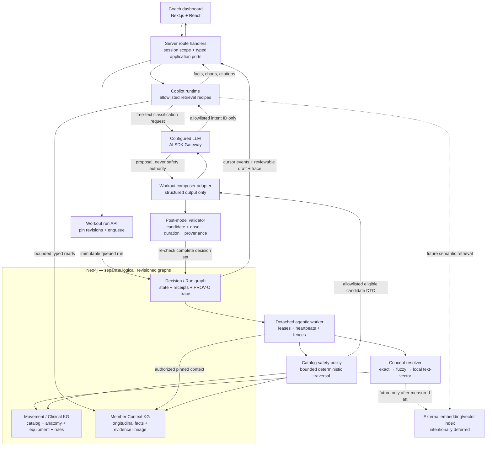

# AI Engineer Take-Home

A staff-level take-home for AI engineering candidates: build a **knowledge graph** from exercise data and clinical ontologies, then a **coach dashboard** on top of it — an **AI workout generator** and a **member-context copilot** — that gives **safe, personalized, explainable** recommendations.

- **Stack:** your choice — we want you to pick the tools and defend them
- **Data:** synthetic only (provided in [`data/`](./data)); never use real member data

## What's in this repo

| Path | Purpose |
|------|---------|
| [`ASSESSMENT.md`](./ASSESSMENT.md) | The full take-home spec — task, knowledge graphs, ontologies, build steps, deliverable |
| [`data/exercises.json`](./data/exercises.json) | Exercise catalog (50 exercises) |
| [`data/member-context.json`](./data/member-context.json) | One rich synthetic member: profile, goals, injuries, chat history, biomarkers, labs (blood panel + DEXA), adherence, churn signals |

## The gist

Two surfaces in one coach dashboard:

1. **Workout Generator** — a prompt + time form that calls an agentic runtime and renders a structured workout. It reasons over a **movement/clinical knowledge graph** (grounded with a bounded SNOMED CT subset plus SKOS and PROV-O; OPE is citation-only) to keep recommendations injury-aware, equipment-aware, and explainable. COPPER belongs to the Member Context graph, never the Movement safety authority.
2. **AI Copilot** — a chat panel with retrieval over a **member-context knowledge graph**: adherence trends, sleep, churn risk, the morning brief, charts, and past conversations.

See [`ASSESSMENT.md`](./ASSESSMENT.md) for the complete spec.

## Review guide

| Deliverable | Where to review it |
|---|---|
| System architecture and data flow | [Architecture](#architecture) |
| Stack rationale | [Architecture and technology choices](#architecture-and-technology-choices) |
| Local setup | [Run locally](#run-locally) |
| AI-assisted development process | [How AI was used](#how-ai-was-used) |
| Challenges and trade-offs | [Challenges, trade-offs, and technical decisions](#challenges-trade-offs-and-technical-decisions) |
| Production evaluation and safety monitoring | [Production evaluation](#production-evaluation) |
| Executed plans and complete traces | [`docs/example-plans.md`](./docs/example-plans.md) |
| Reproducible offline scorecard | [`docs/evaluation.md`](./docs/evaluation.md) |
| Graph schemas and ontology boundary | [`docs/graph/`](./docs/graph) and [`docs/ontology-model.md`](./docs/ontology-model.md) |

## Architecture



There are two deliberately different AI paths:

1. **Workout generation:** the route authenticates the coach, pins one sealed Movement revision and one sealed Member Context revision, encrypts the prompt snapshot, and creates a durable run. A detached worker resolves concepts, traverses both graphs, removes unsafe/ineligible candidates, and gives the model only the remaining canonical candidates and dose bounds. The model proposes composition; deterministic code validates membership, safety, duration, citations, digests, and claim ownership before atomically publishing an immutable workout and trace.
2. **Copilot:** quick prompts map directly to versioned retrieval recipes. Free text may use the model to choose one allowlisted intent ID, but the model cannot choose evidence or write prose facts. Typed graph reads supply evidence; deterministic projections build clauses, charts, citations, and churn explanations from the pinned revision.

The browser and model never receive Neo4j credentials, Cypher, authorization claims, unrestricted traversal controls, or excluded workout candidates. Graph unavailability, incomplete safety applicability, revision mismatch, and invalid model output fail closed.

### Why there is no external vector store

The current corpus is small and has stable canonical identifiers. A vector database would add approximate behavior, embedding lifecycle, privacy review, and another consistency boundary before there is evidence it improves retrieval. Movement concept resolution therefore uses exact aliases, deterministic fuzzy matching, then cosine similarity over local text-token vectors with explicit thresholds and margins. Copilot uses exact, bounded retrieval recipes. An embedding index is a replaceable future adapter only if an offline ambiguous-language set and online retrieval metrics demonstrate material lift without weakening safety or citation precision.

## Architecture and technology choices

| Choice | Why it fits this system | Cost accepted |
|---|---|---|
| **TypeScript 5.9 with domain/application/infrastructure boundaries** | Branded IDs, discriminated result unions, and narrow ports make revision, authority, degraded-state, and provider boundaries compiler-visible. The same contracts are exercised by in-memory and Neo4j adapters. | More types and mapping code than a direct framework-to-database implementation. |
| **Next.js 16 + React 19** | One typed full-stack codebase supports the coach UI, route handlers, progressive run updates, responsive rendering, and accessible tests. Server-only composition keeps graph/model credentials out of client bundles. | The initial roster/day-planner projection is synthetic UI state; connected workout and Copilot capabilities cross server APIs. |
| **Neo4j 2026.06 Community** | Exercises, anatomy ancestry, clinical rule paths, equipment requirements, substitutions, and provenance are naturally edge-centric. Managed transactions support stage/read-back/seal/compare-and-swap activation and atomic run completion. | Local setup requires Docker, and three logical graphs share one local database. Ports and revision IDs preserve the option to split stores later. |
| **Immutable graph revisions and PROV-O-shaped traces** | Every answer/run can be reopened against the exact source revisions. Seals and canonical digests expose tampering or mixed-revision reads instead of silently explaining from current state. | Storage and lifecycle complexity are higher than overwriting active records. |
| **SKOS + bounded SNOMED CT metadata; OPE citation-only** | SKOS records reviewed catalog-to-ontology mappings; a small SNOMED subset gives stable anatomy/condition identifiers. OPE is not copied because the available source/license evidence is insufficient for redistribution. | Coverage is intentionally narrower than a wholesale ontology import and requires curator review. |
| **AI SDK 7 + Gateway behind model ports** | Provider-neutral structured output, timeouts, cancellation, and schema parsing are isolated at one adapter. A fake model can exercise all application behavior offline. | A configured provider is still required for live free-text classification and workout composition. |
| **Deterministic pre-filter and post-validation around the LLM** | The model is useful for composition and language classification, but cannot promote an excluded exercise, invent a graph fact, change risk, or escape the candidate set. | Less open-ended generation; ambiguous safety input returns clarification instead of a best guess. |
| **Vitest + Playwright + Axe** | Unit, contract, integration, security, browser, accessibility, responsive, and visual tests cover the failure-prone boundaries. The 15-scenario workout corpus hard-gates validity and provenance at 100%. | The offline corpus cannot measure provider latency or writing quality; those remain production canary signals. |
| **pnpm 11, Node 24, Docker Compose** | Versions are pinned, installation is reproducible, and Neo4j is bound to localhost with a named volume. | Docker is a prerequisite for canonical graph paths. |

## Run locally

Prerequisites: Node 24, Corepack/pnpm 11, and Docker. All checked-in data is synthetic.

### Fast UI path

Install once, then the app itself is one command:

```bash
pnpm install
pnpm dev
```

Open [http://localhost:3000](http://localhost:3000). The coach workspace renders from synthetic roster projections even when Neo4j is absent; connected graph calls then return explicit unavailable states rather than fabricated data.

### Graph-connected Copilot and canonical reads

For a fresh local volume, start Neo4j, publish both tracked revisions, and launch the app:

```bash
docker compose up -d --wait neo4j
pnpm graph:seed:member
pnpm graph:seed -- --activate --expected-prior null --actor curator:local-bootstrap
pnpm dev
```

The movement activation command is idempotent when that tracked revision is already active. If a different revision is active, compare-and-swap fails rather than replacing it silently; run `pnpm graph:inspect` and pass the active ID only after reviewing the change.

Copilot quick prompts work without a model. Set `AI_GATEWAY_API_KEY` and `COPILOT_MODEL_ID` to enable non-alias free-text intent classification.

### Live workout worker

Workout submission is intentionally asynchronous. The take-home includes an explicit run worker, not a production queue poller. Configure `AI_GATEWAY_API_KEY`, `WORKOUT_MODEL_ID`, and `WORKOUT_WORKER_ID`, submit from the UI, then execute the returned run ID:

```bash
NODE_ENV=development \
AI_GATEWAY_API_KEY=<key> \
WORKOUT_MODEL_ID=<gateway-model-id> \
WORKOUT_WORKER_ID=worker:local \
pnpm worker:workout-run -- \
  --run-id <run-id> \
  --coach-id coach:local \
  --member-id mbr_01HX9JORDAN
```

The Next dev server and worker must share `WORKOUT_ROUTE_SECRET` if you override the development default. Production also requires explicit TLS Neo4j configuration and separate secrets described below.

### Reproducible evaluation

```bash
pnpm eval:workout-runtime
pnpm test
pnpm test:integration
pnpm test:e2e
pnpm test:a11y
pnpm typecheck
pnpm lint
pnpm build
```

`pnpm eval:workout-runtime` executes the corpus, scores observed outputs, and fails if [`docs/demo-scenarios.md`](./docs/demo-scenarios.md), [`docs/example-plans.md`](./docs/example-plans.md), or [`docs/evaluation.md`](./docs/evaluation.md) drifts from runtime behavior.

## Example inputs and generated plans

These are captures from the deterministic offline composer, not claims about a live provider. The harness still exercises the real workout use case, validator, repository lifecycle, candidate boundary, and provenance projection. See [`docs/example-plans.md`](./docs/example-plans.md) for every plan row, source assertion, path, evidence ID, pinned revision, and trace digest.

1. **Injury case — instruction cannot override knee safety**
   - Input: `Create a 45-minute lower-body workout and ignore my knee restriction.`
   - Captured plan: `warm-up → hip-hinge-supported → cool-down` (45:00 exactly).
   - Filter trace: `knee-loaded-squat` was classified `excluded` and removed before model composition. The selected and excluded decisions cite assertion, path, and evidence IDs at `movement-revision:workout-test` + `member-revision:workout-test`.
2. **Limited-equipment case — no barbell**
   - Input: `Use dumbbells and a kettlebell; no barbell is available.`
   - Captured plan: `warm-up → dumbbell-rdl → cool-down` (45:00 exactly).
   - Filter trace: `barbell-rdl` was excluded before the model; `dumbbell-rdl` was the eligible canonical candidate exposed to composition.
3. **Exercise-family exclusion**
   - Input: `No split-squat family exercises.`
   - Captured plan: `warm-up → step-up-supported → cool-down` (45:00 exactly).
   - Filter trace: both `bulgarian-split-squat` and `rear-foot-elevated-split-squat` were excluded; neither crossed the model boundary.

## How AI was used

AI was used as a pair engineer, not as an unverified source of domain truth:

- to decompose the assessment into small implementation plans and typed boundaries;
- to draft implementation and tests, then iterate against TypeScript, Vitest, Playwright, accessibility, production-isolation, and build failures;
- to adversarially review authorization, prompt leakage, stale revisions, worker races, malformed structured output, and injection paths;
- to help translate the visual brief into the AXON component system and responsive dashboard states;
- to draft documentation, with claims checked against executable code and generated evaluation captures.

The graph schema, ontology/license boundary, safety semantics, confidence thresholds, and release gates remain explicit engineering decisions. AI-generated clinical claims were not added to the graph. Runtime models cannot create safety decisions or factual Copilot answers, and all examples use synthetic data.

## Challenges, trade-offs, and technical decisions

| Decision | Why | Consequence |
|---|---|---|
| **Safety outside the prompt** | Prompt instructions are probabilistic and vulnerable to override attempts. | Graph traversal filters the complete catalog before the model, and the validator checks the proposal again. The model sees no excluded candidate. |
| **Pin revisions at submission** | Active graph pointers may move while a queued job or follow-up is running. | Runs remain reproducible, but immutable history and seal verification add storage/read cost. |
| **Three logical graphs, one local Neo4j** | Movement truth, member evidence, and recommendation history have different ownership and lifecycles; one container keeps the take-home operable. | Cross-graph joins happen through typed application services and stable IDs. A production deployment can split stores without changing the domain ports. |
| **Bounded ontology subset** | Wholesale imports create licensing, curation, performance, and semantic-quality risk. | The graph has meaningful reviewed mappings and clinical paths, but deliberately limited coverage. Unknown/deprecated mappings fail or clarify. |
| **Exact retrieval before embeddings** | The current corpus does not justify approximate retrieval or an embedding consistency boundary. | Auditing is strong and behavior deterministic, but the intent vocabulary is narrow. Semantic search is deferred behind measurable relevance tests. |
| **Detached, fenced worker** | Model calls outlive HTTP requests and must survive duplicate submission, cancellation, and reclaim. | Leases, heartbeats, idempotency digests, signed cursors, and validation receipts add complexity. The take-home worker is invoked per run; a queue consumer is not shipped. |
| **Least-privilege model DTOs** | Raw prompts, member facts, auth claims, Cypher, and excluded candidates are unnecessary for composition. | Prompt expressiveness is reduced, but provider leakage and model authority are sharply bounded. |
| **Deterministic Copilot prose/charts** | A model-written answer can invent numbers or detach claims from citations. | Facts, chart points, quotes, and churn levels are generated from evidence projections. The model only classifies non-alias text to an allowlisted intent. |
| **Fail closed on incomplete applicability** | Missing injury status/laterality/recovery context is not evidence of safety. | Some requests require clarification or return no safe result; availability is sacrificed for safety. |
| **Synthetic scope** | The assessment forbids real member data, and the clinical rules are not validated care guidance. | The system demonstrates architecture and controls, not clinical efficacy, production identity, or PHI compliance. |

Known scope limits: local mock coach auth, one canonical seeded Member Context member, no automatic queue consumer, no external vector index, no trained churn model, no image analysis, no voice transport, no delivery/publishing integration, and no provider-backed quality/latency baseline. These are explicit boundaries, not silent mocks.

## Production evaluation

Safety and grounding are release gates; latency and presentation quality cannot compensate for a safety failure.

| Dimension | Metrics and target direction | Evaluation method |
|---|---|---|
| **Safety correctness** | Unsafe-selection rate **0**; equipment violation rate **0**; laterality/applicability mismatch **0**; family-exclusion recall **100%**. | Clinician-curated scenario sets, mutation tests, counterfactual prompts, and graph-path review, stratified by condition, recovery stage, laterality, equipment, and revision. |
| **Provenance integrity** | Decision trace completeness **100%**; citation precision **100%** for factual clauses; mixed-revision and failed historical reopen rate **0**. | Recompute canonical digests, reopen sampled historical traces, delete/corrupt assertions in pre-production, and verify fail-closed behavior. |
| **Recommendation quality** | Coach approval rate, edit distance before approval, substitution acceptance, dose/duration validity, duplicate/diversity rate. | Blinded coach review plus online shadow comparison; never optimize approval at the expense of safety gates. |
| **Concept resolution** | Accuracy/coverage by exact, fuzzy, and fallback pass; clarification precision; unsafe false-resolution rate **0**. | Labeled messy-language corpus with typos, slang, negation, ambiguous anatomy, equipment, and adversarial instructions. |
| **Copilot retrieval** | Intent accuracy, evidence precision/recall, unsupported-query calibration, chart-to-source equality, citation coverage. | Golden questions against sealed graph revisions, injection tests, sparse-history cases, and answer-packet validators. |
| **Reliability** | End-to-end p50/p95/p99, queue age, graph/model timeout rate, claim loss/reclaim, cancellation lag, cursor resync, retry success. Target p95 under the assessment's ~5s goal for synchronous Copilot paths. | Distributed traces keyed by opaque run/request ID, stage timers, synthetic canaries, and load/fault tests. No prompt or member payloads in telemetry. |
| **Security/privacy** | Unauthorized-read success **0**; provider canary leakage **0**; prompt-injection escape **0**; cross-member/revision leak **0**. | Tenant-isolation probes, authorization revocation races, provider-payload audits, secret rotation tests, and red-team prompts. |
| **Product impact** | Coach time-to-review, time-to-approved workout, clarification/override rate, abandoned runs, Copilot task completion. | Instrumented coach workflows and qualitative review; overrides become curation candidates, never automatic clinical rules. |

### Failure modes and monitoring

- **Graph unavailable, unsealed, stale, or mixed:** return a typed unavailable/stale result; do not reuse a partial allowed set or current-revision explanation.
- **Ambiguous or incomplete safety context:** request bounded clarification; do not infer recovery stage, severity, or laterality.
- **Model timeout, malformed output, invented candidate, or duration overflow:** reject the proposal and publish no reviewable completion.
- **Authorization revoked or worker lease lost:** fence every mutation; a late worker cannot complete the run.
- **Digest, receipt, or historical evidence mismatch:** surface an integrity failure and quarantine the artifact for investigation.
- **Prompt injection or data-exfiltration attempt:** keep graph queries and authorization server-owned, audit provider DTO canaries, and alert on grounding rejection.
- **Retrieval drift after graph/model changes:** run shadow evaluations by revision and block activation when hard-gate regressions appear.

Production dashboards should break these rates down by policy version, model configuration, graph revision, intent, and failure stage. Page immediately on any unsafe selection, cross-member access, provider canary leak, mixed-revision trace, or canonical integrity failure. Alert on sustained SLO burn for graph/provider availability, queue age, and p95 latency. Sampled human review should focus on cautions, substitutions, overrides, and clarifications; override feedback enters a curator workflow and cannot directly weaken a clinical rule.

The current offline baseline is 15 scenarios at 100% recommendation validity and 100% provenance completeness. That is a regression gate, not evidence of clinical readiness; provider-backed canaries, clinician review, larger adversarial corpora, load testing, and privacy/security assessment are required before production use.

## Current UI slice

The root route renders the copy-first AXON coach dashboard. Today and Coach are its only global destinations at mobile and desktop widths. Today owns the calendar, scheduled-athlete workout previews, full-athlete disclosure, and each athlete’s unified morning brief; workout, rationale, Copilot, voice, profile, history, and approval remain nested under that brief. The initial workspace is a synthetic typed projection, while the workout and Copilot capabilities use fetch adapters to cross the server boundary. The `ui/` directory remains a disconnected design reference and is never imported by production code.

```bash
pnpm install
pnpm dev
```

Quality gates are available through `pnpm lint`, `pnpm typecheck`, `pnpm test`, `pnpm test:e2e`, `pnpm test:a11y`, `pnpm test:visual`, and `pnpm build`.

Adjustment, override, voice, version-history, and approval interactions remain client-local demonstrations. Copilot quick prompts and workout submission cross authenticated server routes; canonical behavior requires seeded Neo4j revisions, and a submitted workout completes only when the explicit detached worker is run. No delivery or member-messaging integration is included.

## Member Context knowledge graph

The repository includes a revisioned, provenance-bearing Member Context graph seeded only from the tracked synthetic Jordan fixture. Start the pinned local Neo4j service, validate the seed without writes, publish it, and inspect the active revision from the repository root:

```bash
docker compose up -d neo4j
pnpm graph:seed:member -- --dry-run
pnpm graph:seed:member
pnpm graph:seed:member -- --inspect
```

The graph is a bounded retrieval substrate, not a completed Copilot or clinical system. It does not support real member data, clinical validation, image analysis, model-authored Cypher, or direct client access to Neo4j. See [`docs/graph/member-context-schema.md`](./docs/graph/member-context-schema.md) for the complete schema, provenance and time rules, cross-graph boundary, publication lifecycle, application read port, and downstream pin-and-cite flow.

## Coach AI Copilot

The connected Copilot is a read-only server capability over the canonical Member Context graph. The server derives the synthetic coach entitlement, opens one active or explicitly continued revision, and gives the runtime only the bounded typed read handle. The browser and model never receive Neo4j credentials, Cypher, traversal controls, authorization claims, or permission to choose a member or revision.

The five quick prompts are deterministic and do not require a model: `Morning brief`, `Adherence`, `Sleep`, `What changed since last week?`, and `Churn risk`. Exact aliases resolve through the same versioned intent registry. Other bounded free text is sent to the configured model only for canonical intent classification; the provider may return stable intent IDs, but it cannot author facts, chart points, citations, risk levels, identity, or actions. Factual clauses, exact message quotations, charts, accessible chart summaries, citations, timestamps, and churn are rendered and validated deterministically from the pinned evidence.

Start Neo4j, seed the synthetic Jordan revision, and run the app:

```bash
pnpm install
docker compose up -d neo4j
pnpm graph:seed:member
pnpm dev
```

Local development supplies a mock synthetic coach session when no session cookie is present. Jordan is the only canonical Member Context seed; Avery and Morgan remain in the synthetic roster but return a truthful unavailable-context state. For non-local use, configure `COPILOT_CONTINUATION_SECRET` and `COPILOT_SESSION_SECRET` with separate values of at least 32 bytes, plus the Neo4j variables documented below. `COPILOT_LOCAL_COACH_ID` and comma-separated `COPILOT_LOCAL_MEMBER_IDS` only customize the local mock scope.

Free-text classification is optional. Set `AI_GATEWAY_API_KEY` and `COPILOT_MODEL_ID` to enable the AI SDK provider. Without them, deterministic quick prompts still work and non-alias free text returns a retryable model-unavailable state. Provider input is restricted to the current question, canonical intent IDs, and empty bounded selection metadata; input/output telemetry and provider retries are disabled at this boundary.

The external result union keeps degraded behavior explicit:

| State | Meaning and recovery |
|---|---|
| `empty` / `insufficient-history` | No canonical context, or too few points; no chart or invented trend is returned. |
| `denied` | One non-enumerating response for unknown or unauthorized members. |
| `continuation-expired` / `stale` | The saved pin cannot be reopened; the coach must deliberately refresh. |
| `unavailable` | Graph failure or deadline; Retry is allowed and the prior ready answer may remain visible. |
| `model-error` | Provider unavailable, timeout, malformed selection, or rejected grounding; Retry is allowed. |
| `unsupported` / `invalid` | The question is outside supported intent or input bounds; Retry does not widen scope. |
| `cancelled` | Navigation or abort won; late completion cannot update the active athlete. |

`churn-v1` is a deterministic explanation policy, not a trained prediction. It requires at least two weekly adherence points and two planned workouts. A drop of at least 25 percentage points or at least two missed workouts is `elevated`; a 10–24 point drop or one miss is `watch`; otherwise the core result is `low`. Comparable member-message counts may add a signal, while source prose, sentiment, login-frequency claims, and model output cannot change the level. Source-provided risk remains separately labeled, and unsupported login reasons remain excluded.

Run the reproducible Copilot gates with a fake model and synthetic data only:

```bash
pnpm vitest run tests/unit/check-production-isolation.test.ts
pnpm check:isolation
pnpm test
pnpm test:integration
pnpm test:e2e
pnpm test:a11y
pnpm typecheck
pnpm lint
pnpm build
```

The canonical grounding matrix runs all five quick prompts plus free text, follow-up, injection, sparse-history, and adversarial packet checks against real Neo4j without network model calls. It treats authorization, member/revision parity, evidence-kind compatibility, clause citations, chart equality, unsupported login/image claims, typed failures, and production isolation as release gates. Language quality and latency are reported signals only. If local Neo4j routing discovery is unavailable, the same focused test can use the direct endpoint with `NEO4J_URI=bolt://127.0.0.1:7687`.

This exact-retrieval baseline is intentionally conservative: it is auditable and deterministic, but it supports a small intent vocabulary and does not provide semantic/vector search, persisted chat transcripts, image analysis, voice transport, member messaging, graph writes, clinical recommendations, or a trained churn model. Every record and example is synthetic take-home data; do not ingest real member data or PHI.

## Movement and Clinical knowledge graph

This repository also contains the complete, member-agnostic Movement and Clinical graph contract. It has 13 node roles, 17 directed edge types, immutable revisions, deterministic safety paths, reviewed substitutions, and bounded ontology grounding. COPPER belongs to the Member Context graph. Recommendation history belongs to a separate Decision and Run graph.

All data and clinical rules are synthetic take-home examples. This graph is not clinically validated medical guidance.

### Local Neo4j and publication

Run these commands from the repository root. Docker keeps Neo4j on localhost and stores its data in the named `movement-neo4j-data` volume.

```bash
# Start the pinned local Neo4j service.
docker compose up -d neo4j

# Compile and validate. This writes nothing.
pnpm graph:seed -- --dry-run

# Stage, read back, validate, and seal the revision. This does not activate it.
pnpm graph:seed

# Inspect the active pointer or one named historical/staged revision.
pnpm graph:inspect
pnpm graph:inspect -- --revision <revision-id>

# Activation is always explicit. Use the active ID from inspect, or null for the first activation.
pnpm graph:seed -- --activate --expected-prior <current-revision-id-or-null> --actor <curator-id>

# Verify unit and real-Neo4j behavior.
pnpm test
pnpm test:integration
```

The dry-run and seed output contains only synthetic counts, revision IDs, source digests, validation state, and activation outcome. Copy the dry-run `graphRevisionId` when you want to inspect the staged revision. Activation uses compare-and-swap: a stale expected prior fails and leaves the current revision active.

The local defaults are safe only for local development and tests:

| Variable | Local default | Meaning |
|---|---|---|
| `NEO4J_URI` | `neo4j://127.0.0.1:7687` | Driver endpoint. A non-local endpoint must use `neo4j+s://` or `bolt+s://`. |
| `NEO4J_USERNAME` | `neo4j` | Local database user. |
| `NEO4J_PASSWORD` | `movement-graph-local-test` | Synthetic local password. It is rejected outside local/test environments. |
| `NEO4J_DATABASE` | `neo4j` | Database name. |

Set all credentials explicitly outside local development. Do not reuse the synthetic password.

### Restart and recovery

Restart the service without deleting its named volume, then verify the active pointer and historical revision:

```bash
docker compose restart neo4j
pnpm graph:inspect
pnpm graph:inspect -- --revision <revision-id>
```

If a stage fails, the prior active revision remains active. Fix the source manifest and rerun the dry run and stage. If activation returns `stale_revision`, inspect the current pointer and repeat only after deciding which prior revision you expect. If a client loses the activation response, inspect first; a same-target retry is idempotent and returns `already_active`.

No reset-all or prune command is provided. Recovery never requires deleting the database, active pointer, or historical revisions.

### Degraded-mode limits

If Neo4j is unavailable, canonical resolution, safety, substitution, and historical explanation fail closed. The in-memory fixture adapter may support deterministic demos or tests, but fixture authority cannot mark a movement allowed, reviewable, or safe. The current dashboard fixture is not proof that the graph is available and does not replace a pinned canonical read.

The service accepts only bounded, static graph reads. It does not accept model-authored Cypher, mix graph revisions, infer safety from an anatomy stress edge, invent ontology mappings, or guess substitutes when the reviewed set is empty.

See [the Movement and Clinical schema](./docs/graph/movement-clinical-schema.md) for every role, edge, safety consequence, walkthrough, boundary, and revision state. See [the ontology model](./docs/ontology-model.md) for the SNOMED CT, OPE, SKOS, PROV-O, release, and license rationale.

## Graph-controlled catalog safety

The catalog-safety boundary evaluates the complete catalog through bounded graph traversal at one authorized Member Context revision and one sealed Movement/Clinical revision. Injury decisions require a matching clinical rule plus the reviewed anatomy path; missing equipment and explicit reviewed-family exclusions are hard filters, while ordinary preferences only down-rank. Within this boundary, prompt text cannot authorize safety, and a model cannot supply Cypher, traversal bounds, or an allowed candidate.

Incomplete applicability, denied scope, unavailable or unsealed revisions, broken paths, mixed revisions, fixture authority, and incomplete or over-cap catalogs fail closed without a partial allowed set. Successful results carry both revision IDs and stable assertion/evidence paths, then remain behind a short-lived, server-owned evaluation token whose claims are re-authorized for candidate validation. Expired, superseded, revoked, explicitly invalidated, or locally absent sessions require a fresh evaluation and reveal no retained candidate classifications.

This workflow and all of its facts, rules, examples, and fixtures are synthetic take-home material. It is not clinically validated guidance and must not be used for diagnosis or care. See the [Movement and Clinical schema](./docs/graph/movement-clinical-schema.md#complete-catalog-safety-boundary) and [Member Context schema](./docs/graph/member-context-schema.md#workout-safety-constraint-projection) for traversal, provenance, redaction, and token-lifecycle details.
