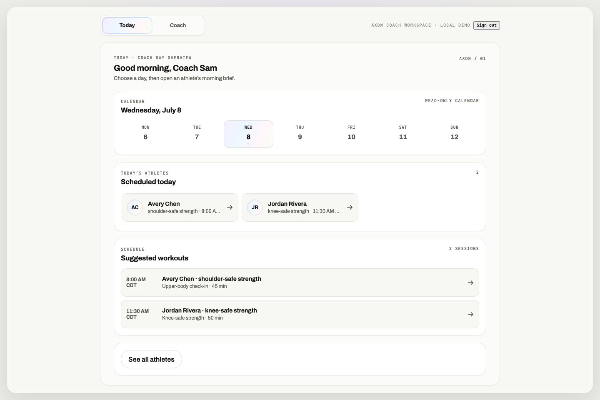
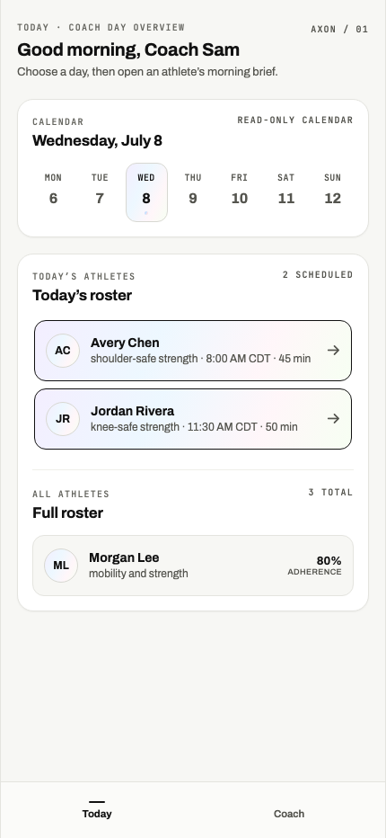

# Connected acceptance evidence

This capture is the grader-facing proof for the connected path. It was generated on 2026-08-07 with `pnpm capture:connected` in deterministic mode, using the signed mock session route, production workout routes, the queue worker, pinned graph revisions, and real Neo4j reads. It does not claim provider quality or clinical validation.

Machine-readable output: [`connected-acceptance-capture.json`](./connected-acceptance-capture.json).

## Reviewer path

From a fresh checkout:

```bash
pnpm install
pnpm demo
```

Open the printed local URL, choose **Continue as demo coach**, select Jordan, submit a 45-minute workout, and answer the typed applicability fields. The worker resumes the same run and renders the completed workout, decision trace, and pinned revisions. The dashboard also exposes the connected adjustment, conversation/media, Copilot, sign-out, and history flows.

To run only the connected acceptance gate:

```bash
pnpm test:connected
pnpm capture:connected
```

The capture command fails if a run is not completed through the production route/worker path, if a clarification has no typed answerable fields, if a pinned revision cannot be reopened, or if a required observed decision is missing.

## Observed results

All four scenarios completed with the same active revisions:

- Movement: `graph:sha256:f02cd7de83eb2abb539098dbdf6c7090435133bdf3c01c2de96f7808f2b6c5a7`
- Member Context: `member-context:sha256:74c7a3241c42a6d0e89d61fd16882676bf4e54fb8e330cb6b37d57b80181bde0`

| Scenario | Connected observation | Evidence check |
|---|---|---|
| Knee baseline | Selected candidates were produced only after the Jordan knee rule path ran; the stored excluded set includes knee-loading/squat/lunge candidates. | The test reads labels from the pinned movement revision and records every decision in the capture. |
| Prompt bypass | The prompt explicitly asks to ignore the knee restriction. | The excluded concept IDs exactly equal the baseline run; the prompt cannot widen the candidate boundary. |
| Deadlift family | No catalog deadlift family crossed the composer boundary. | The persisted constraint snapshot contains the revision-bound zero-match query `deadlifts`; selected decisions contain no deadlift label. |
| No barbell | The completed result contains no selected barbell exercise. | The stored excluded decision set contains barbell-labeled candidates (or a reviewed substitution if a requested movement requires one). |

The JSON capture retains run IDs, both revision IDs, selected/excluded canonical IDs and labels, zero-match queries, substitution lineage, and the source mode. It is intentionally synthetic and contains no member PHI or provider credentials.

The connected Jordan capture records no selected substitution because every reviewed barbell-lunge alternative in this seed is also rejected by Jordan's active knee rule or unavailable equipment. The bounded substitution resolver and provenance lineage are covered by the component and worker tests; the connected gate deliberately reports this no-safe-alternative outcome instead of manufacturing a replacement.

## Screenshot walkthrough

These checked-in browser captures show the responsive AXON surface used for the reviewer flow. They are visual context, not a substitute for the connected JSON evidence.






## Claim boundary

- `pnpm eval:workout-runtime` is the separate component corpus: it proves lifecycle, validator, privacy, and provenance invariants with deterministic in-memory fixtures.
- `pnpm test:connected` proves graph-backed route/worker lifecycle and revision-bound safety behavior against local Neo4j.
- U5 adapter tests cover provider transport parsing, timeout, malformed output, canary containment, and one bounded recomposition. Deterministic agents are not provider quality evidence.
- The system is a synthetic take-home: local mock auth, three independently seeded roster Member Context revisions (the captured workflow exercises Jordan), no image analysis, voice transport, delivery integration, external vector index, or clinical efficacy claim.
