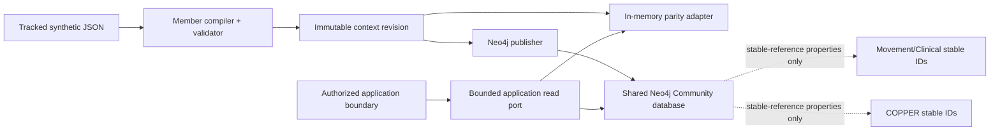
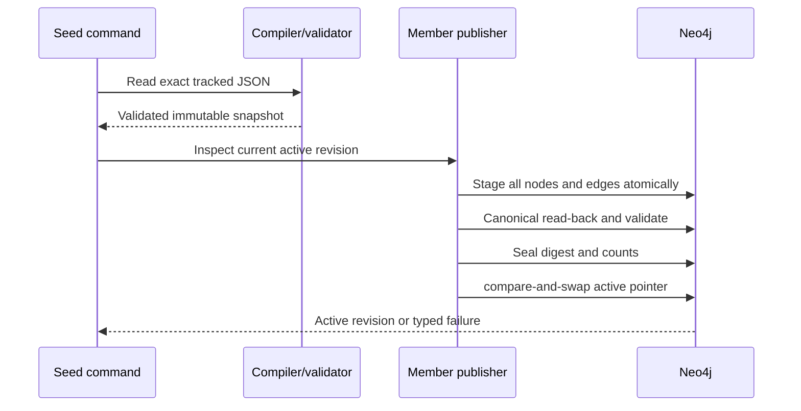

# Member Context knowledge graph

The Member Context graph is the canonical, revisioned retrieval substrate for one fictional member world. Its only seed is the tracked `data/member-context.json`; `data/member-context-avery.json`, `data/member-context-morgan.json`, globs, and directory discovery are deliberately outside this path. The source is synthetic only, the graph is not clinically validated, image contents are not analyzed, and Copilot is not implemented. No real member data or PHI belongs in this pipeline.

## Architecture and graph boundary

Neo4j Community stores Member Context and Movement/Clinical in one standard database under separate labels, namespaces, revision catalogs, Cypher constants, and application ports. Member facts may carry reviewed Movement/Clinical or COPPER IDs as a stable-reference property. They never link to a revision-scoped node in another graph. Movement/Clinical remains safety authority; COPPER is descriptive behavior context, not clinical or recommendation authority. Decision and Run provenance remains a separate downstream concern.



The application mints the trusted coach/member scope. Historical `COACHES` evidence is context, never an authorization grant. A consumer receives a handle pinned to one member, coach, authority, and active or explicit historical revision; it cannot submit Cypher, labels, relationship types, sort expressions, or traversal bounds.

## Node contract

Every revision-scoped assertion has a stable semantic ID, assertion ID, member ID, context revision ID, source locator, source-artifact digest, classification, temporal precision, and synthetic marker. Stable identity and publication nodes carry their role-specific lifecycle properties.

| Kind | Role and source mapping |
|---|---|
| `member` | Stable subject identity from `profile.id`; not revision-scoped. |
| `coach` | Stable historical coach identity from `profile.coach_id`; not entitlement. |
| `member-profile` | Profile assertion from `/profile`. |
| `goal` | One assertion per `/goals/{source-id}` with priority, optional target date, and optional reviewed concept property. |
| `preference` | Session, schedule, dislike, and note assertions from `/preferences`. |
| `equipment-availability` | One available-item assertion per source label, with reviewed Movement/Clinical equipment property when present. |
| `injury-episode` | Source-stated injury episode with region/joint properties and reviewed stable concept properties. It carries no clinical interpretation. |
| `workout-session` | Planned/completed session facts from `/workout_history`. |
| `exercise-mention` | Original workout exercise text. Unmapped mentions remain explicitly unresolved rather than being forced to a catalog concept. |
| `observation` | Atomic adherence, biomarker, weight, sleep, and lab measurement with metric, value, unit, and source order. |
| `lab-panel` | Blood-panel or DEXA grouping; individual values remain `observation` nodes. |
| `conversation` | The coach/member conversation container. |
| `message` | One exact-offset source message with sender role, text, and source order. |
| `media-attachment` | Metadata-only attachment under its message with `assetStatus=metadata-only` and `analysisStatus=not-analyzed`; it is not an asset claim. |
| `coach-brief` | Source-provided brief for its stated date. |
| `coach-task` | One source-provided morning task. |
| `churn-assessment` | Source-provided risk level, distinguishable from a system-derived assessment. |
| `churn-reason` | One source-provided reason and its supported/unsupported basis state. Missing login evidence stays unsupported. |
| `source-artifact` | Digest-addressed tracked JSON artifact and media type. |
| `member-context-revision` | Content-derived immutable revision, schema/compiler versions, validation state, and source digest. |
| `ingestion-activity` | PROV-O-aligned activity that used one artifact and generated one revision; ingestion time never becomes observation time. |
| `publication-attempt` | Durable stage/validation attempt and state. |
| `revision-seal` | Canonical read-back digest and counts for a validated immutable revision. |
| `member-context-catalog` | One per-member pointer to the active sealed revision. |
| `activation-event` | Append-only actor, prior revision, target revision, and activation time. |

## Relationship contract

Relationship assertions are revision-bound, typed, provenance-bearing, synthetic, and endpoint-validated before persistence.

| Kind | From → to | Meaning |
|---|---|---|
| `COACHES` | coach → member | Historical source relationship only. |
| `HAS_PROFILE` | member → member-profile | Member profile assertion. |
| `PURSUES` | member → goal | Member goal assertion. |
| `HAS_PREFERENCE` | member → preference | Member preference assertion. |
| `HAS_EQUIPMENT` | member → equipment-availability | Available equipment assertion. |
| `HAS_INJURY` | member → injury-episode | Source-stated injury assertion. |
| `HAS_WORKOUT` | member → workout-session | Historical workout ownership. |
| `MENTIONS_EXERCISE` | workout-session → exercise-mention | Ordered original exercise text. |
| `HAS_OBSERVATION` | member → observation | Direct member observation. |
| `HAS_PANEL` | member → lab-panel | Lab/scan panel ownership. |
| `CONTAINS_MEASUREMENT` | lab-panel → observation | Panel membership for an atomic measurement. |
| `HAS_CONVERSATION` | member → conversation | Conversation ownership. |
| `CONTAINS_MESSAGE` | conversation → message | Ordered message membership. |
| `SENT_BY` | message → member or coach | Historical sender identity. |
| `HAS_ATTACHMENT` | message → media-attachment | Metadata attachment parentage. |
| `HAS_BRIEF` | member → coach-brief | Brief ownership. |
| `HAS_TASK` | coach-brief → coach-task | Brief task membership. |
| `HAS_ASSESSMENT` | coach-brief → churn-assessment | Source assessment membership. |
| `HAS_REASON` | churn-assessment → churn-reason | Assessment reason membership. |
| `SUPPORTED_BY` | churn item → exact assertion | Available source support, without claiming derivation. |
| `WAS_DERIVED_FROM` | derived churn item → exact assertion | PROV-O derivation; reserved for a method-versioned computed item. |
| `ASSERTS` | member-context-revision → revision-scoped assertion | Complete revision membership and citation boundary. |
| `USED` | ingestion-activity → source-artifact | PROV-O source use. |
| `GENERATED` | ingestion-activity → member-context-revision | PROV-O generation. |
| `SEALED` | revision-seal → member-context-revision | Canonical validation seal. |
| `ACTIVATED` | activation-event → member-context-revision | Append-only activation history. |

## Identity, time, and provenance

Source IDs anchor semantic identity where supplied. Records without IDs use deterministic namespaced identity derived from intrinsic content and parent identity, never Neo4j element IDs or array position. Array order is retained as `sourceOrder` only where order is semantic. The canonical source digest plus schema and compiler versions determines the immutable context revision; exact re-ingestion therefore produces the same IDs and digest.

The `source locator` is a JSON Pointer into the tracked source. Each assertion also records its artifact digest, revision, classification, and synthetic marker. PROV-O alignment is selective: the artifact/activity/revision chain uses `USED` and `GENERATED`; exact derivation uses `WAS_DERIVED_FROM`. Ordinary domain edges retain their own assertion metadata rather than being reified again.

The `temporal precision` union preserves source truth:

- exact offset timestamps remain `exact-timestamp` values;
- calendar dates remain `date` values;
- ordered undated sleep values remain `relative-order` values;
- resting heart rate and HRV without an observation time remain `unknown`.

The compiler never substitutes the brief date, ingestion time, or member-since date for a missing observation time. Units and source values are preserved without clinical interpretation.

Reviewed mappings live in `data/member-context-concept-mappings.json`; synthetic-source identity lives in `data/member-context-synthetic-sources.json`. A reviewed injury or equipment mapping stores a Movement/Clinical stable ID as data. Reviewed behavioral mappings store a COPPER stable ID as data. Neither is a graph join, neither points to a Movement revision assertion, and unresolved exercise text remains valid evidence.

## Publication and recovery



The stage is one managed write transaction. Validation reads canonical persisted content, checks required properties, endpoints, revision membership, provenance, cardinalities, digest, and counts, then seals it. Activation uses compare-and-swap against the expected active revision. A validation error, stale expectation, interrupted stage, or unavailable backend never advances the catalog pointer. Revisions are append-only; there is no broad reset or prune command.

The seed reports only synthetic counts, member/revision IDs, digests, validation counts, and activation outcome. It never prints profile, chat, biomarker, lab, or attachment values.

## Local operation

Install dependencies and start the pinned local Neo4j service:

```bash
pnpm install
docker compose up -d neo4j
```

The shared client reads `NEO4J_URI`, `NEO4J_USERNAME`, `NEO4J_PASSWORD`, and `NEO4J_DATABASE`. Local defaults are `neo4j://127.0.0.1:7687`, `neo4j`, `movement-graph-local-test`, and `neo4j`; non-local operation requires explicit credentials and an encrypted `neo4j+s` or `bolt+s` URI.

Run a deterministic validation without opening a database connection:

```bash
pnpm graph:seed:member -- --dry-run
```

Publish, validate, seal, and activate Jordan; an identical repeat reports `already-active` and creates no duplicate graph records:

```bash
pnpm graph:seed:member
pnpm graph:seed:member
```

For an operator-known first activation or upgrade, bind activation to an explicit expectation with `--expected-active none` or `--expected-active <context-revision-id>`. A stale value fails closed and preserves the current pointer.

Inspect the active revision without publishing:

```bash
pnpm graph:seed:member -- --inspect
```

Run all database-backed Member Context publication, retrieval, and seed checks:

```bash
pnpm test:integration
```

`scripts/seed-member-context.ts` is the only packaged member seed entry. It reads the literal tracked path and does not discover sibling files. It uses the same validator, shared Neo4j client, schema setup, and publisher as the adapters; callers never supply raw Cypher and the command never resets the database.

## Bounded reads and downstream pin-and-cite flow

`src/application/use-cases/retrieve-member-context.ts` authorizes a server-side coach/member claim and opens the `bounded application read port`. The pinned handle exposes only summary, domain/time-window evidence, longitudinal series, conversation, coach brief, related-evidence, and citation lookup. Every operation has a default, hard maximum, timeout, deterministic order, signed cursor contract, and revision/member envelope.

Internal outcomes remain distinct: `ready`, `empty`, `insufficient-history` (the product contract's `insufficient_history` state), `stale`, `denied`, `invalid`, and `unavailable` (the `backend_unavailable` state). External policy may intentionally map unknown and unauthorized members to one non-enumerating response.

A later workout or Copilot consumer follows this pin-and-cite sequence:

1. The server authorizes the current coach/member pair and opens the active revision once.
2. All narrative, chart, workout-context, and follow-up reads use that same handle; they do not silently reopen the active pointer.
3. The consumer keeps returned evidence IDs and requests exact citations through the handle.
4. Any persisted downstream Decision or Run records the member context revision plus contributing assertion/evidence IDs.
5. If the revision becomes stale, the workflow restarts deliberately; it never mixes revisions in one answer or recommendation.

The graph makes grounded retrieval possible but does not generate answers, rank passages, authenticate users, create charts, stream tokens, or deliver workouts. Semantic indexes are deferred: full-text search, vector indexes, embeddings, and retrieval-quality evaluation belong to a later Copilot implementation, after exact bounded behavior has a measurable baseline.

## Workout safety constraint projection

`getWorkoutConstraints` is the authorized Member Context read used by the graph-controlled catalog-safety boundary. It returns the member's available-equipment, injury, and preference source truth at one `memberContextRevisionId`, including assertion/evidence IDs and reviewed stable Movement/Clinical references. It does not expose nodes, Cypher, traversal controls, or a clinical conclusion. Unresolved preferences stay unresolved, unavailable equipment stays unavailable, and source-stated injury fields are not upgraded into applicability by inference.

The safety coordinator combines this pinned projection with one sealed canonical `movementGraphRevisionId`. Complete injury applicability may arrive only as a separately cited run constraint whose concepts and vocabulary re-resolve at that Movement revision. When incomplete applicability, a stale or denied member scope, an unresolved safety-critical reference, or a revision mismatch is present, the workflow must fail closed without an allowed catalog. A successful handoff retains both revision IDs and the contributing stable assertion/evidence IDs, so a reviewer can trace the member source through Movement graph paths to the typed decision.

Raw injury, applicability, and preference values stay inside the authorized coordinator. They are not copied into the agent-facing catalog result, token response, routine log, diagnostic, or typed failure.

## Evaluation session lifecycle

The candidate validator is server-owned. After a complete successful evaluation, orchestration retains the immutable result behind an opaque token minted from a cryptographically secure random source with at least 128 bits of entropy. The record binds the token to the authorized coach/member claims, a server-minted `evaluationSessionId`, the `memberContextRevisionId`, the `movementGraphRevisionId`, and the resolved-constraint digest. Tokens are not derived from request IDs, counters, or prompt values.

Validation receives the expected session ID from trusted orchestration, re-authorizes the presenting coach/member scope, compares every claim and revision binding, and then performs a server-side lookup. Callers cannot submit or modify a retained decision envelope. The store is process-local, so a restart, another instance, or a locally absent token returns `evaluation-unavailable` and requires a fresh dual-revision evaluation.

Sessions expire after 10 minutes. Each coach/member scope permits at most 128 active sessions after expired entries are removed. At capacity, admission rejects the new evaluation instead of evicting a live token. A replacement evaluation for the same run performs supersession of the prior token. Revocation, run completion, and the authorized endpoint perform explicit invalidation. Expiry, supersession, revocation, explicit invalidation, token alteration, or any binding mismatch reveals no retained candidate classifications; recovery always discards old candidates and requests a fresh dual-revision evaluation.

### Diagnostic allowlist

Agent-facing responses, routine logs, diagnostics, typed failures, and security audit events may contain only bounded stable IDs, revision IDs, effect, status and reason codes, and assertion/evidence IDs. They must omit raw injury, applicability, preference, or prompt values. Authorization denial, rejected tokens, supersession or revocation invalidation, explicit invalidation, and fail-closed evaluation emit exactly one redacted security event for the attempted operation.

The typed security-event status codes are `authorization-denied`, `evaluation-fail-closed`, `token-rejected`, `session-superseded`, and `session-invalidated`. These codes describe the boundary outcome; they do not authorize extra diagnostic fields.

All facts, constraints, examples, and fixtures in this workflow remain synthetic. Neither graph nor this session boundary is clinically validated guidance.
