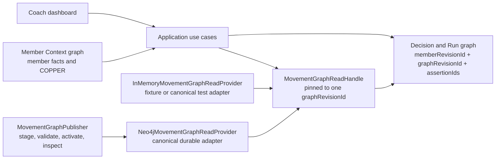
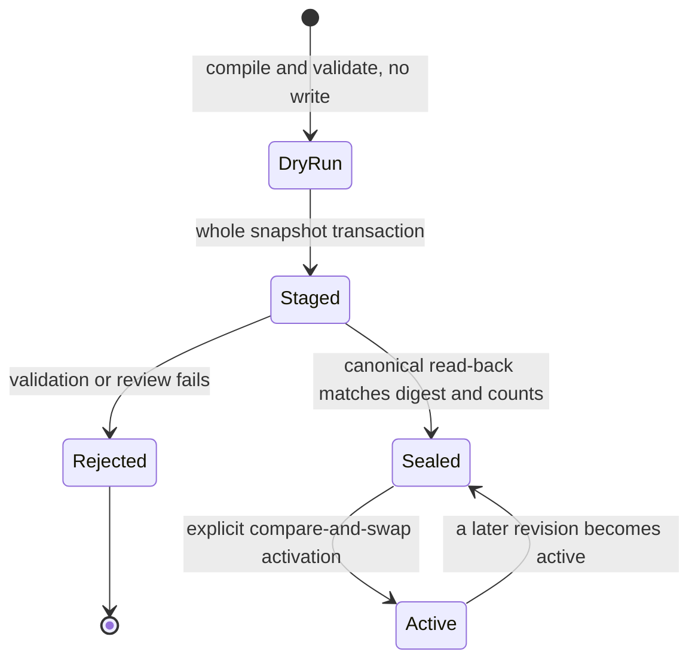

# Movement and Clinical graph contract

This document is the plain-language contract for the Movement and Clinical graph.
It says what each item means, which links are legal, how safety decisions work, and how a reviewer can replay a decision.

> Safety notice: all members, rules, evidence, and examples in this repository are synthetic. This take-home graph is not clinically validated medical guidance. It must not be used for diagnosis or care.

## What this graph owns

The Movement and Clinical graph owns reusable facts about exercises, anatomy, movement, equipment, conditions, clinical rules, ontology mappings, evidence, and graph-build history.

It does not own facts about a person. It does not own a generated workout or a recommendation result.

- The **Movement and Clinical graph** owns stable domain meaning.
- The **Member Context graph** owns a member's injury status, recovery stage, laterality, equipment, goals, preferences, and behavior context. COPPER belongs only in the Member Context graph.
- The **Decision and Run graph** owns generated choices, exclusions, warnings, substitutions, overrides, and their explanation traces.

The Member Context graph and Decision and Run graph may reference stable Movement concept IDs. They must not copy this taxonomy or write into this graph.

## Architecture (Mermaid)



The dashboard does not send Cypher and does not query Neo4j directly. An application use case opens the active revision, or opens a named historical revision. It receives a `MovementGraphReadHandle`. Every read on that handle stays pinned to its `graphRevisionId`, even if a newer revision becomes active during the request.

`InMemoryMovementGraphReadProvider` supports deterministic tests and bounded fixture browsing. Fixture authority cannot produce an allowed or reviewable safety result. `Neo4jMovementGraphReadProvider` reads a sealed, canonical snapshot from Neo4j.

## Identity and provenance

Every stored node has these Required properties:

| Property | Meaning |
|---|---|
| `assertionId` | Stable ID for this exact claim in this exact graph revision. |
| `conceptId` | Stable local ID for the thing. It stays stable when a new graph revision restates the same thing. |
| `graphRevisionId` | Immutable snapshot that contains the claim. Reads must not mix revisions. |
| `kind` | One of the 13 node roles below. |
| `label` | Curated display label. It is not the identity. |
| `source.sourceId` | Stable source artifact ID. |
| `source.sourceRevision` | Exact version or digest of that source. |
| `source.sourceRecordId` | Optional source-row ID when the source has one. |

Every edge also has `assertionId`, `graphRevisionId`, `kind`, `fromConceptId`, `fromKind`, `toConceptId`, `toKind`, `sourceId`, and `sourceRevision`. The stored source fields are under `source`. Edge direction is part of the meaning. Code may use an inverse traversal only where this document permits it.

## The 13 node roles

The common identity and source properties above are required for every role. Role-specific Required properties follow.

| Node role | Plain meaning | Role-specific Required properties |
|---|---|---|
| `exercise` | One selectable catalog exercise or reviewed variation. | `aliases`, `catalogId`, `catalogRevision`, and typed `attributes`: `priorityTier`, `supportsWeight`, `isBilateral`, plus optional `bilateralPairCatalogId`. |
| `muscle` | One muscle or catalog muscle group that an exercise intentionally trains. | `aliases`. External grounding is needed only if the muscle enters a safety-critical path. |
| `joint` | One joint loaded or moved by an exercise. | `aliases`. It may take part in the anatomy hierarchy. |
| `body-region` | A broader anatomy region used in resolution and inherited safety queries. | `aliases`. It may contain narrower anatomy through `part-of`. |
| `movement-pattern` | A functional exercise family, such as squat or vertical push. | `aliases`, `taxonomyId`. It supports search and alternatives; it is not harm by itself. |
| `movement-demand` | A reviewed loading feature, such as deep loaded knee flexion. | `definition`, `scope`, `reviewerEvidenceIds`. The feature is assigned by review, not guessed from a label. |
| `equipment` | A tool or environment that an exercise needs. | `aliases`, `category`. Availability belongs in Member Context. |
| `condition` | A reusable condition type, not a person's diagnosis. | `aliases`. An active-rule condition has reviewed SNOMED CT grounding. |
| `clinical-rule` | A reviewed rule from a condition to one constrained target. | `effect`, `severity`, typed `applicability`, typed `overridePolicy`, `evidenceConceptIds`, `reviewer`, `ruleRevision`. |
| `ontology-concept` | One bounded external OPE or SNOMED CT reference. | `ontology`, `code`, `conceptUri`, `preferredLabel`, `sourceRelease`, `status`. Only reviewed mappings create these nodes. |
| `evidence-source` | A versioned source used by a rule or graph build. | `title`, `owner`, `versionOrAccessDate`, `evidenceRole`, plus optional `uri`. |
| `graph-revision` | One immutable, validated graph snapshot. | `createdAt`, `validationResult`, `sourceDigests`, plus optional `wasRevisionOf`. Activation state is infrastructure state, not mutable node payload. |
| `ingestion-activity` | The build that produced a graph revision. | `softwareVersion`, `startedAt`, `endedAt`, `inputConceptIds`, `outcome`. |

The eight roles that a text resolver may return are `exercise`, `muscle`, `joint`, `body-region`, `movement-pattern`, `movement-demand`, `equipment`, and `condition`. Rules, external concepts, evidence, revisions, and ingestion activities are not user mention results.

## The 17 directed edge types

This table is the Allowed endpoints matrix. “From -> to” is stored direction. The last column is the Safety consequence.

| Edge | Allowed endpoints | Meaning | Extra Required properties | Safety consequence |
|---|---|---|---|---|
| `targets` | `exercise` -> `muscle` | The exercise intentionally trains the muscle. | Common edge properties. | Ranking evidence only. It never proves safety. |
| `stresses` | `exercise` -> `joint` or `body-region` | The exercise places modeled mechanical load on the anatomy. | Common edge properties. | Load evidence only. It has no restrictive effect without a matching rule. |
| `expresses` | `exercise` -> `movement-pattern` | The exercise belongs to a functional movement family. | Common edge properties. | Used for search, family exclusions, and reviewed alternative discovery. |
| `has-demand` | `exercise` -> `movement-demand` | The exercise has a curated movement or loading feature. | Common edge properties. | Lets a rule affect all exercises with the reviewed demand. |
| `requires` | `exercise` -> `equipment` | The equipment is needed for the modeled exercise. | Common edge properties. | Missing equipment is a hard exclusion. |
| `part-of` | `muscle`, `joint`, or `body-region` -> `joint` or `body-region` | The source is narrower anatomy inside the target. | Common edge properties. | Direction is child to parent. Safety can use a bounded inverse search from a rule target to descendants. The hierarchy must be acyclic. |
| `variant-of` | `exercise` -> `exercise` | The source is a narrower reviewed variation of the target. | Common edge properties. | A family exclusion may include explicit reviewed variants. It is not a safety guarantee. |
| `substitution-candidate-for` | `exercise` -> `exercise` | The source may preserve the target's training intent. | `rank`, `preservedIntent`, `curator`, `reviewedAt`. | Every candidate must be checked again for equipment, explicit exclusions, and all active rules. |
| `has-constraint` | `condition` -> `clinical-rule` | The rule can apply when the condition is present. | Common edge properties. | Member status, stage, severity, and laterality are checked outside this graph. |
| `contraindicates` | `clinical-rule` -> `movement-demand`, `movement-pattern`, `joint`, or `body-region` | The target is not allowed when the rule applies. | Common edge properties; the rule effect must be `hard-contraindication`. | Returns a hard exclusion. The rule may describe override eligibility, but only a separate authorized workflow can record an override. |
| `cautions` | `clinical-rule` -> `movement-demand`, `movement-pattern`, `joint`, or `body-region` | The target needs a visible warning or review. | Common edge properties; the rule effect must be `caution`. | Warning. It must not silently become an exclusion or preference. |
| `downranks` | `clinical-rule` -> `movement-demand`, `movement-pattern`, `joint`, or `body-region` | The target is allowed but less desirable. | Common edge properties; the rule effect must be `down-rank`. | Ranking change with a visible trace. |
| `maps-to` | Any resolvable role -> `ontology-concept` | A curator aligned a local concept to an external concept. | `mappingAssertionId`, `relation`, `confidence`, `rationale`, `curator`, `reviewedAt`, `sourceRelease`, `sourceArtifactDigest`. | No safety rule is inferred from a mapping. |
| `supported-by` | `clinical-rule` -> `evidence-source` | The source explains why the project rule exists. | Common edge properties. | Required for a rule. A terminology mapping is not clinical evidence. |
| `in-revision` | Any local role except `graph-revision` and `ingestion-activity` -> `graph-revision` | The node or rule belongs to the immutable snapshot. | Common edge properties. | One decision must use one revision only. |
| `was-generated-by` | `graph-revision` -> `ingestion-activity` | The build activity produced the revision. | Common edge properties. | Records graph-build provenance in a PROV-O-like shape. |
| `used` | `ingestion-activity` -> `evidence-source` | The build consumed the source artifact. | Common edge properties. | Supports rebuild and audit. |

No direct `condition` -> `exercise` edge is legal. No generated “equivalent exercise” edge is legal. An edge with an endpoint outside this matrix makes the revision invalid.

## Safety algorithm

The service starts with member facts from a named Member Context revision. It resolves each fact to stable Movement IDs. It opens one canonical Movement revision. It then reads facts and applies a pure policy.

1. Match `condition` -> `has-constraint` -> `clinical-rule`.
2. Check the rule's condition status, recovery stage, severity band, and laterality policy.
3. Follow the rule effect to a demand, pattern, joint, or body region.
4. Join the target back to exercises through inverse `has-demand`, inverse `expresses`, or inverse `stresses`. For anatomy, first include descendants with bounded inverse `part-of`.
5. Keep all contributing assertion, mapping, evidence, rule, and revision IDs.
6. If several rules apply, precedence is `contraindicates > cautions > downranks`.

`stresses` alone is not harm. A stress link with no applicable rule leaves the exercise allowed. Unknown concepts, missing member inputs, broken paths, a missing revision, a query cap, fixture authority, or an empty safe alternative set must fail closed. The service must not guess.

## Exact walkthroughs

The current curated revision is `graph:sha256:c94ad209883875ba3294388d3db82f4d2bcae2aefd55a11b7d1f52ddccb1217a`. A future build gets a new ID if its canonical source payload changes.

### Knee rule walkthrough

For active, moderate patellofemoral pain in the covered recovery stages:

```text
condition:patellofemoral-pain-syndrome
  --has-constraint [assertion:sha256:fdd0bc32510ab9e06d6920a24b8d770c2fc174a68aca39c8e42d7f2a104ad918]-->
clinical-rule:pfps-deep-loaded-knee-flexion:v1
  --contraindicates [assertion:sha256:4878eca167c7eb8fc5bc2c316564d95377d6b7315fbffc5f1be154535039e410]-->
movement-demand:deep-loaded-knee-flexion
  <--has-demand [assertion:sha256:93c382f74fb7ec6f8d317d7582fb527277e4a7d720ca2941f6b00321e9040945]--
exercise:00b26731-066f-4b69-96e8-3472fc6fbc09 (Barbell Racked Forward Lunge)
```

The result is `excluded`. The rule node, evidence, mapping, and every path assertion stay in the explanation. There is no condition-to-exercise shortcut.

### Anatomy descendant walkthrough

The Barbell Racked Forward Lunge has this reviewed anatomy path:

```text
exercise:00b26731-066f-4b69-96e8-3472fc6fbc09
  --stresses [assertion:sha256:6c1f0a059752d46793838421bde645900618de24406ff15144d391736a72ed97]-->
joint:patellofemoral
  --part-of [assertion:sha256:178df679bb52370e8744eed207dbffd6716f1a6e0c4cb4cec189ffc205ec89b1]-->
joint:knee
```

`part-of` is stored child to parent. A rule that targets `joint:knee` searches the inverse direction, with a depth and result cap, to find `joint:patellofemoral`. The current first-release rules constrain reviewed demands, not the knee node itself. Therefore this anatomy path is explainable load evidence, but it does not create a new restriction by itself.

### Shoulder rule walkthrough

```text
condition:shoulder-pain
  --has-constraint [assertion:sha256:19a5fc18305048fde562b4aad2a03bc8bcd64e42c234501657f3b56aeb715cac]-->
clinical-rule:shoulder-pain-loaded-overhead:v1
  --contraindicates [assertion:sha256:1f516a03efb57bdd017b3e8564e7039cd4a6ea6d485c54a001e5aafebde9eb76]-->
movement-demand:loaded-overhead-shoulder-elevation
  <--has-demand [assertion:sha256:aad407b7bc3fd92dfc72da1618db0b0a2dee1766bedf43f8cd6188aa860ee4e5]--
exercise:03258dbf-bc21-4495-bcae-ca627b3a0f20 (Alternating Dumbbell Overhead Press)
```

When applicability matches, the result is `excluded`. The rule has no override permission.

### Lumbar rule walkthrough

Two different rule meanings are kept separate:

- `clinical-rule:low-back-pain-loaded-lumbar-flexion:v1` contraindicates `movement-demand:loaded-lumbar-flexion`. `exercise:01128a8f-44a4-43ae-a172-b6a32b2e8534` (Med Ball Scoop Toss) has that demand through `assertion:sha256:dd64db535c8b9995f52a8d0178e73195770d79f0f146b389e494b133ead59ca7`. A matching acute or return-to-training context is excluded.
- `clinical-rule:low-back-pain-axial-loading:v1` downranks `movement-demand:axial-spinal-loading`. `exercise:0333b0cc-4b43-45d9-adff-505b349e53d9` (Sandbag Zercher Carry) has that demand through `assertion:sha256:69d94e58d162794883444a98a16b1833ee8e7239f8d2547801cbec06c47a0745`. A matching managed or return-to-training context stays allowed but is ranked lower.

The service does not turn the down-rank into an exclusion. If both effects apply to one candidate, the hard contraindication wins and both paths remain visible.

### Limited-equipment substitution walkthrough

The original is `exercise:00b26731-066f-4b69-96e8-3472fc6fbc09` (Barbell Racked Forward Lunge). The graph has three reviewed candidates.

1. Rank 1 is Dumbbell Crossback Lunge through `assertion:substitution:dumbbell-crossback-for-barbell-forward-lunge:v1`. It fits dumbbell equipment, but it keeps the contraindicated deep-knee demand, so the policy rejects it.
2. Rank 2 is `exercise:0252c3c1-435f-49a2-9f79-5ef53eec3b1b` (Med Ball Split Squat) through `assertion:substitution:med-ball-split-squat-for-barbell-forward-lunge:v1`. With `equipment:medicine-ball` available and no other active exclusion, it is eligible.
3. Rank 3 is Kettlebell Goblet Cyclist Squat through `assertion:substitution:kettlebell-cyclist-squat-for-barbell-forward-lunge:v1`. Equipment fit does not save it; the same knee rule rejects it.

The policy checks required equipment, explicit exclusions, and every applicable rule again. If no candidate passes, it returns `no_safe_alternative`. It never invents a similar exercise.

### Failed activation walkthrough

Assume revision A is active. A curator stages revision B. The publisher writes all of B in one transaction, reads it back in canonical order, compares its digest and counts, validates it, and seals it.

Activation asks for B with `expectedPriorRevisionId=A`. The publisher locks the catalog pointer before it compares values. If the pointer is now C, activation returns `stale_revision`; C stays active and no activation event for B is committed. If B was tampered with after sealing, the digest check fails and B cannot become active. An interrupted or invalid stage never replaces the prior active revision.

Recovery is non-destructive: inspect the active pointer and the named staged revision, fix the source or expected-prior value, then rerun the stage or explicit activation. Historical revisions are retained. No reset-all or prune operation is part of this system.

### Historical explanation walkthrough

A Decision and Run record stores one `memberContextRevisionId`, one `graphRevisionId`, the final exercise ID, and the contributing `assertionIds`, `ruleAssertionIds`, `mappingAssertionIds`, and `evidenceAssertionIds`.

To explain an old choice, call `openRevision(graphRevisionId)`, then look up those exact assertion IDs. Do not use `openActive()`: today's graph could have different labels, rules, or mappings. A missing historical revision or assertion returns a typed failure, not reconstructed prose.

## Revision lifecycle



- **Dry run:** compile all tracked manifests. Check IDs, endpoint types, anatomy cycles, mappings, rule evidence, source reviews, provenance, counts, and digests. Write nothing.
- **Stage:** persist the whole bounded snapshot. A failure leaves no partial revision.
- **Seal:** read the stored snapshot back, put it in canonical order, validate it, and match its digest and cardinalities. A different payload under the same revision ID is an immutable-payload conflict.
- **Activate:** explicitly compare the caller's expected prior revision with the locked active pointer. `null` is valid only for first activation. Same-target retry is `already_active`. A stale caller cannot replace the pointer.
- **Inspect:** read the active pointer or a named revision state without changing it.
- **Recover:** retain the prior active revision. Re-stage a complete valid snapshot or retry activation with the observed pointer. Never delete history to recover.

The publisher port is separate from the read provider. Product code gets read access only. Publication uses static Cypher with values passed as parameters; callers cannot supply labels, relationship types, or query fragments.

## Validation and bounds

A revision is invalid if it has a duplicate stable ID, dangling edge, illegal endpoint, direct condition-to-exercise clinical edge, cross-revision assertion, anatomy cycle, unsupported SKOS relation, missing concept-specific external ID on a reviewed mapping, incomplete clinical rule evidence/review, or a missing provenance link.

The first release caps a snapshot at 512 nodes and 4,096 edges. General graph queries cap results at 100 and depth at 16. Safety and substitution use smaller operation-specific caps. A cap breach returns a typed failure and must fail closed.

## Source files

- `data/movement-concepts.json`: local canonical vocabulary and the 50 exercise records.
- `data/movement-anatomy.json`: reviewed child-to-parent anatomy and supplemental stress links.
- `data/movement-demands.json`: five demand definitions and reviewed assignments.
- `data/clinical-rules.json`: five synthetic, reviewed project-policy rules.
- `data/clinical-evidence.json`: versioned synthetic rule evidence.
- `data/movement-substitutions.json`: three reviewed substitution seeds.
- `data/movement-ontology-mappings.json`: reviewed SNOMED CT mappings and explicit OPE `local-only` reviews.
- `data/movement-source-reviews.json`: release and license decisions.

See [the ontology model](../ontology-model.md) for the mapping and licensing rationale. See the repository [README](../../README.md#movement-and-clinical-knowledge-graph) for operating commands.
