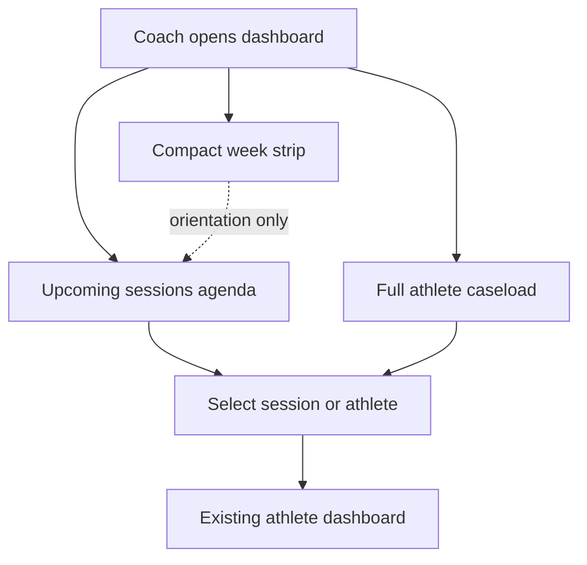
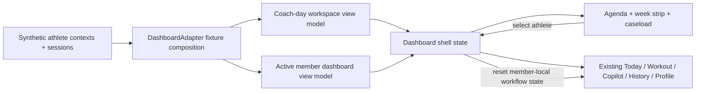

# Coach Day Planner - Plan

## Goal Capsule

- **Objective:** Give coaches a roster-first landing workspace for planning the day from upcoming sessions and a full athlete caseload.
- **Product authority:** The new workspace owns day orientation and athlete selection; the existing athlete dashboard remains the destination for deeper work.
- **Execution profile:** Extend the existing typed fixture adapter and reducer-driven responsive shell with local synthetic roster and session records.
- **Stop conditions:** Do not add schedule mutation, a separate session-prep workflow, cross-athlete risk ranking, authentication, or a backend schedule integration.
- **Tail ownership:** This plan ends with a locally verified fixture-backed UI. Live athlete/session sources and schedule management remain deferred.

---

## Product Contract

### Summary

The dashboard will open to an agenda-led coach workspace with the next upcoming sessions, a compact week strip, and the full athlete caseload. Selecting an athlete opens the existing athlete dashboard.

### Problem Frame

The current dashboard is organized around one selected member, which makes the coach’s first task—figuring out who is next—secondary to member-level work.

Coaches need a fast way to orient to the day, see upcoming sessions, and choose any athlete without losing access to the existing workout, Copilot, history, and profile flows.

### Key Decisions

- **Roster-first, agenda-led home** (session-settled: user-directed — chosen over a member-first or persistent split-view home: it keeps day planning primary while reusing the existing athlete dashboard). Governs R1-R5.
- **Compact week strip plus upcoming agenda** (session-settled: user-directed — chosen over a full weekly or monthly calendar: it provides orientation without making calendar management the product). Governs R1-R3.
- **Full caseload with session context** (session-settled: user-directed — chosen over showing only athletes with upcoming sessions: it preserves athlete discovery while keeping the day’s sessions prominent). Governs R1, R4-R5.
- **Read-only planning** (session-settled: user-directed — chosen over scheduling controls: the first release helps the coach orient and navigate without creating a second calendar workflow). Governs R2-R3, R6.
- **Athlete dashboard as the selection destination** (session-settled: user-directed — chosen over a separate session-prep panel: it keeps one deeper coaching workflow). Governs R3, R5.

### Actors

- A1. **Coach:** Opens the workspace, reviews upcoming sessions, scans the caseload, and selects an athlete for deeper work.

### Requirements

**Coach-day orientation**

- R1. The default dashboard view presents a coach-day workspace with the next upcoming sessions, a compact week strip, and the full athlete caseload.
- R2. Upcoming sessions are presented in chronological order and provide enough athlete and appointment context for the coach to identify the next session.
- R3. The week strip helps the coach orient across the current week, while selecting a session opens the associated athlete dashboard rather than a separate session-prep workflow.

**Roster selection**

- R4. The workspace presents the coach’s full caseload, including athletes who do not have an upcoming session in the visible agenda.
- R5. Selecting an athlete from either the session agenda or the caseload opens that athlete’s existing dashboard context.

**Scope and continuity**

- R6. The workspace is read-only for scheduling: it does not create, edit, cancel, complete, or reschedule sessions.
- R7. Athletes without upcoming sessions and days without upcoming sessions remain understandable and selectable rather than appearing as broken or missing data.
- R8. The new workspace preserves the dashboard’s existing responsive, keyboard, screen-reader, reduced-motion, and human-versus-machine interaction qualities.

### Key Flows

- F1. **Plan the next session**
  - **Trigger:** A1 opens the dashboard.
  - **Steps:** The workspace shows the upcoming agenda and week orientation; A1 selects the next session.
  - **Outcome:** The associated athlete dashboard opens without exposing scheduling controls.
  - **Covers:** R1-R3, R6.
- F2. **Find an athlete outside the immediate agenda**
  - **Trigger:** A1 needs to review an athlete who is not among the next visible sessions.
  - **Steps:** A1 scans the full caseload and selects the athlete.
  - **Outcome:** The selected athlete’s existing dashboard opens.
  - **Covers:** R4-R5.
- F3. **Plan with incomplete schedule coverage**
  - **Trigger:** The coach has no upcoming sessions or an athlete has no upcoming session.
  - **Steps:** A1 views the workspace and chooses an available athlete when needed.
  - **Outcome:** The workspace communicates the lack of session data clearly and retains usable athlete selection.
  - **Covers:** R4, R6-R7.

### Acceptance Examples

- AE1. **Next-session navigation**
  - **Covers R1-R3, R5-R6.**
  - **Given:** The coach has multiple athletes and upcoming sessions.
  - **When:** The coach opens the dashboard and selects the next session.
  - **Then:** The next session is easy to identify and the associated athlete dashboard opens without a scheduling mutation.
- AE2. **Full-caseload access**
  - **Covers R4-R5.**
  - **Given:** An athlete is not in the visible upcoming agenda.
  - **When:** The coach selects that athlete from the caseload.
  - **Then:** The athlete’s existing dashboard opens.
- AE3. **Read-only calendar boundary**
  - **Covers R2-R3, R6.**
  - **Given:** The coach is reviewing the week strip or upcoming agenda.
  - **When:** The coach interacts with a session or date.
  - **Then:** The dashboard supports orientation and navigation only; it does not offer create, edit, cancel, complete, or reschedule actions.
- AE4. **No-session state**
  - **Covers R4, R6-R7.**
  - **Given:** The coach has no upcoming sessions, or an athlete has no scheduled next session.
  - **When:** The coach opens or scans the workspace.
  - **Then:** The absence is explained clearly and the full caseload remains available.
- AE5. **Responsive continuity**
  - **Covers R5, R8.**
  - **Given:** The coach has selected an athlete from the workspace.
  - **When:** The dashboard is used across supported viewport sizes or accessibility settings.
  - **Then:** The selection remains understandable and the athlete dashboard remains operable with the existing interaction contract.

### Success Criteria

- A coach can identify the next upcoming session and open its athlete dashboard from the landing view without first entering a member-specific workflow.
- A coach can reach any athlete in the full caseload, including athletes without a visible upcoming session.
- The first release makes the dashboard a reliable planning and navigation surface without implying that it is a scheduling system.
- The existing athlete dashboard remains the single deeper-work destination after selection.

### Scope Boundaries

**Deferred for later**

- Creating, editing, canceling, completing, or rescheduling sessions.
- A dedicated session-prep panel separate from the athlete dashboard.
- Cross-athlete risk ranking, attention queues, or caseload analytics.
- The source-of-truth and synchronization behavior for session records.

### Dependencies / Assumptions

- Athlete and session records are available to display to the coach, even though the first version does not define how those records are authored or synchronized.
- The existing athlete dashboard remains the supported destination for workout, Copilot, history, profile, and explanation workflows.
- The current repository contains one synthetic member context, so representative multi-athlete and session records are required for validating the roster behavior.

<!-- ce-section: work-relationships -->
### How This Work Fits Together

This plan owns the roster-first coach-day landing workspace. It is a focused extension of the existing coach dashboard, not a replacement for the member-level coaching workflow.

- **Shares:** the existing athlete detail surfaces, responsive interaction contract, and synthetic-data boundary.
- **Enables:** faster entry into the existing workout, Copilot, history, profile, and explanation flows for any athlete.
- **Deferred:** schedule authoring and synchronization can proceed as a later planning area without changing the roster-first product shape.

### Outstanding Questions

**Deferred to Planning**

- The exact session metadata shown in each agenda item.
- The selection, filtering, and ordering mechanics needed for a large caseload.
- The final mobile composition for the agenda, week strip, and full caseload.

### Sources / Research

- `src/app/page.tsx` mounts the current `CoachDashboard` at the root route.
- `src/features/coach-dashboard/dashboard-contract.ts` defines a single selected `member` view model and member-level history, profile, workout, and Copilot data.
- `src/features/coach-dashboard/fixture-adapter.ts` builds one `dashboardFixture` from `data/member-context.json` and the exercise catalog.
- `src/features/coach-dashboard/CoachDashboard.tsx` currently renders a member header, dashboard navigation, and member-specific Today, Workout, Copilot, History, Profile, and detail surfaces.
- `docs/plans/2026-08-05-001-feat-graph-backed-coach-dashboard-plan.md` remains the broader product and safety roadmap.
- `docs/plans/2026-08-05-002-feat-copy-first-axon-ui-plan.md` governs the existing AXON interaction and responsive UI contract.

### Product Shape

---

## Planning Contract

### Product Contract Preservation

Product Contract unchanged.

### Key Technical Decisions

- KTD1. **Extend the existing adapter boundary** (session-settled: user-approved — chosen over a new route or backend integration: the current dashboard already isolates fixture loading behind `DashboardAdapter`, and this milestone remains local and synthetic). Governs R1-R7.
- KTD2. **Separate workspace selection from member workflow state** (session-settled: user-approved — chosen over reusing one mutable member state: switching athletes must not carry draft, publication, Copilot, or detail state across members). Governs R3-R5, R8.
- KTD3. **Use a local multi-athlete fixture set** (session-settled: user-approved — chosen over inventing live schedule behavior: the repository has one synthetic member context and the feature needs deterministic roster, session, empty-state, and browser coverage). Governs R1-R7.
- KTD4. **Add the coach-day screen as a shell state, not a second route** (session-settled: user-approved — chosen over route-level navigation: the existing responsive shell already projects one reducer-driven workflow across mobile and desktop). Governs R1-R5, R8.
- KTD5. **Keep the agenda as the first visual and reading order** — the week strip and full caseload support orientation and discovery without becoming a persistent split-view workflow. Governs R1-R4.

### High-Level Technical Design

The adapter will produce two related projections: a coach-day workspace with athlete summaries and upcoming sessions, and the existing member-level dashboard view model for the active athlete. The shell owns the active workspace and athlete selection. The existing member screens continue to read the active member projection through the current context boundary.

Selection and state boundaries follow this lifecycle:

1. The shell opens in coach-day state with no member-local mutation state exposed.
2. An agenda or caseload control dispatches an athlete selection with a stable athlete identifier.
3. The shell loads the corresponding member projection, resets member-local draft and detail state, and opens the member’s Today view.
4. The member header provides a return-to-roster action without changing the member-level tabs or detail behavior.

### Implementation Constraints

- Preserve the existing `DashboardAdapter` load and capability boundary. Do not import `ui/` reference files into production code.
- Keep `data/member-context.json` as the flagship Jordan fixture so existing member-level derivation tests remain meaningful.
- Make all roster and session ordering deterministic. Do not use the current clock or a live timezone as fixture behavior.
- Use semantic buttons or links for athlete and session selection. Do not make a non-interactive card the only activation target.
- Keep scheduling controls absent. Date interaction may orient or filter the visible agenda, but it must not mutate session records.

### Resolved Planning Choices

- Agenda items will show athlete identity, session date/time, and a short session label. Exact copy can follow the existing AXON micro-label and body-copy conventions.
- The fixture-scale roster will use deterministic list ordering and chronological session ordering. Search and large-caseload filtering remain follow-up work.
- Mobile will stack the agenda, week strip, and caseload. Desktop may place the caseload beside the agenda only if the agenda remains the dominant reading order.

### Sequencing

1. Add the multi-athlete/session contract and deterministic fixture composition.
2. Add workspace and selected-athlete state boundaries while preserving the member workflow reducer behavior.
3. Render the coach-day workspace, return-to-roster affordance, responsive styling, and browser coverage.
4. Run the full verification contract and update only intentional visual snapshots.

### System-Wide Impact

- **Data and adapter:** The fixture adapter becomes the source for both roster-level and active-member projections. No API, authentication, or persistence surface changes.
- **State:** The root entry state changes from member-level Today to coach-day orientation. Member-local draft, publication, Copilot, and detail state must be scoped to the active athlete.
- **Responsive UI:** Mobile and desktop continue to share one state model. The new shell state must not fork the existing detail projections.
- **Test fixtures:** Existing Jordan-focused tests remain valid; new records cover multiple athletes, upcoming sessions, and missing-session states.
- **Production isolation:** The copied AXON design-system boundary remains unchanged and `ui/` stays disconnected from production imports.

### Risks & Dependencies

- **View-model drift:** Adding roster data can overload the existing single-member contract. Mitigate by keeping workspace summaries separate from member detail projections and asserting both in adapter tests.
- **State leakage:** Reusing the current reducer state can expose one athlete’s draft or Copilot pins for another athlete. Mitigate with explicit selection-reset tests before UI work.
- **Async selection race:** Existing adjustment and Copilot completion timers live in the shell and could finish against a newly selected athlete. Mitigate by canceling or scoping pending work when selection changes, then asserting the race in reducer/shell tests.
- **Fixture density:** The new workspace can become crowded at mobile widths. Mitigate with a stacked mobile layout, short labels, and the existing 320px overflow coverage.
- **Calendar ambiguity:** A fixture week strip can imply scheduling authority. Mitigate by using read-only controls and testing the absence of mutation affordances.

### Sources & Research

- `src/features/coach-dashboard/dashboard-contract.ts` provides the current typed adapter, single-member view model, and capability boundary.
- `src/features/coach-dashboard/fixture-adapter.ts` provides the existing pure derivation pattern from canonical synthetic records.
- `src/features/coach-dashboard/state.ts` provides the current reducer, immutable workout-version state, publication freeze, and tab/detail transitions.
- `src/features/coach-dashboard/CoachDashboard.tsx` provides the shared context, responsive projection, member header, focus return, and async load-state patterns.
- `tests/unit/dashboard-fixture-adapter.test.ts` verifies adapter derivation, catalog resolution, alternate-member derivation, and load-state behavior.
- `tests/unit/coach-dashboard-state.test.ts` verifies immutable versions, publication gating, Copilot state, and duplicate-request handling.
- `tests/e2e/coach-dashboard-responsive.spec.ts` verifies state continuity across desktop/mobile projections, 320px overflow, and focus return.
- `tests/e2e/coach-dashboard-mobile.spec.ts` and `tests/e2e/coach-dashboard-accessibility.spec.ts` verify the flagship flow, member detail, asynchronous announcements, Escape behavior, reduced motion, and axe checks.
- `tests/visual/coach-dashboard-desktop.spec.ts` and `tests/visual/coach-dashboard-mobile.spec.ts` provide the current visual regression anchors.
- `package.json` confirms the project uses Next.js 16, React 19, TypeScript, Vitest, and Playwright through the existing scripts.

---

## Implementation Units

### U1. Compose multi-athlete workspace data

- **Goal:** Extend the local adapter seam with a deterministic full caseload, upcoming sessions, and member projections without changing the flagship Jordan derivation contract.
- **Requirements:** R1-R5, R7; A1; F1-F3; AE1, AE2, AE4.
- **Dependencies:** None.
- **Files:** `src/features/coach-dashboard/dashboard-contract.ts`, `src/features/coach-dashboard/fixture-adapter.ts`, `data/member-context.json`, `data/member-context-avery.json`, `data/coach-sessions.json`, `tests/unit/dashboard-fixture-adapter.test.ts`.
- **Approach:**
  1. Apply KTD1 and KTD3 by adding typed workspace records for athlete summaries and sessions, while keeping member-detail fields in the existing member projection.
  2. Add deterministic synthetic records for Jordan, Avery, and at least one athlete without an upcoming session.
  3. Compose sessions in chronological order and expose the full athlete list independently of session presence.
  4. Keep existing `startNewDraft` capability behavior and preserve Jordan’s derived metrics, history, profile, and Copilot data.
- **Patterns to follow:** Pure adapter derivation in `fixture-adapter.ts`; JSON-import typing; existing `DashboardLoadState` and capability contracts.
- **Test scenarios:**
  - Build the workspace from the synthetic sources and assert that all athletes appear, including the athlete without an upcoming session.
  - Assert that upcoming sessions are chronologically ordered and point to the correct athlete IDs and labels.
  - Compose a workspace with no upcoming sessions and assert that the agenda is empty but the full athlete list remains available.
  - Assert that the Jordan member projection retains its current name, metrics, history, and catalog-backed decisions.
  - Load the adapter and assert that the workspace is ready while external draft creation remains unavailable.
- **Verification:** Adapter tests prove workspace composition, ordering, missing-session coverage, and unchanged member-level derivation.

### U2. Isolate roster and member state

- **Goal:** Add coach-day and active-athlete state transitions without allowing member-local workflow state to leak across selections.
- **Requirements:** R3-R5, R8; A1; F1-F2; AE1, AE2, AE5.
- **Dependencies:** U1.
- **Files:** `src/features/coach-dashboard/state.ts`, `src/features/coach-dashboard/CoachDashboard.tsx`, `src/features/coach-dashboard/dashboard-contract.ts`, `tests/unit/coach-dashboard-state.test.ts`.
- **Approach:**
  1. Apply KTD2 and KTD4 by adding a shell state for coach-day versus active-athlete workflow and retaining the current member tabs and detail screens inside the active-athlete state.
  2. Add an athlete-selection transition that records the selected ID, resets member-local draft/publication/Copilot/detail state, and opens the selected athlete’s Today view.
  3. Cancel or scope pending adjustment and Copilot completion timers when athlete selection changes so an old operation cannot mutate the new athlete’s state.
  4. Add a return-to-roster transition that preserves the active selection for context without exposing stale member mutations in the workspace.
  5. Keep async load announcements, focus return, responsive breakpoint handling, and existing member callbacks on the shared shell.
- **Patterns to follow:** `dashboardReducer`, `initialDashboardState`, `selectCurrentVersion`, `selectIsPublished`, `DashboardViewModelContext`, and the existing focus-key restoration logic.
- **Test scenarios:**
  - Start in coach-day state and select an athlete from a session or roster record; assert the active ID and Today destination.
  - Create a member-local adjustment, switch athletes, and assert that the second athlete starts with its own initial workflow state and no stale version or publication event.
  - Start an adjustment or Copilot prompt, switch athletes before completion, and assert that the pending operation is canceled or scoped to the original athlete and cannot update the new athlete.
  - Return to the roster and select a different athlete; assert that detail screens, dialogs, pending prompts, and pins do not carry across.
  - Preserve current reducer behaviors for canceled edits, publication freeze, duplicate Copilot requests, and detail navigation.
  - Assert that the selection state remains stable when the responsive projection changes.
- **Verification:** Reducer tests prove state isolation and existing workflow regression coverage proves the selected-athlete dashboard remains intact.

### U3. Render the coach-day workspace

- **Goal:** Add the agenda-led roster-first screen, responsive presentation, accessible selection controls, and browser-level regression coverage.
- **Requirements:** R1-R8; A1; F1-F3; AE1-AE5.
- **Dependencies:** U1, U2.
- **Files:** `src/features/coach-dashboard/CoachDashboard.tsx`, `src/features/coach-dashboard/dashboard.module.css`, `tests/e2e/coach-dashboard-mobile.spec.ts`, `tests/e2e/coach-dashboard-responsive.spec.ts`, `tests/e2e/coach-dashboard-accessibility.spec.ts`, `tests/visual/coach-dashboard-desktop.spec.ts`, `tests/visual/coach-dashboard-mobile.spec.ts`.
- **Approach:**
  1. Apply KTD4 and KTD5 by rendering the coach-day workspace as the default shell state with the upcoming agenda first, the compact week strip as read-only orientation, and the full caseload as the discovery surface.
  2. Make each session and athlete a semantic control with an accessible name that identifies the target athlete and available session context.
  3. Let date interaction orient the visible agenda only. Do not expose schedule mutation controls or a separate session-prep panel.
  4. Keep the active-athlete projection on the existing Today, Workout, Copilot, History, Profile, and detail components, adding a clear return-to-roster action.
  5. Stack the workspace at mobile widths, preserve the AXON desktop container and information hierarchy, and keep the 320px no-overflow guarantee.
  6. Update visual snapshots only after the functional and accessibility assertions describe the intended new shell.
- **Execution note:** Add browser assertions for the new workspace before changing snapshots so visual diffs remain secondary to behavior proof.
- **Patterns to follow:** `MemberHeader`, `DashboardNavigation`, `TodayScreen`, desktop layout regions in `dashboard.module.css`, `data-testid` usage, accessible `role` queries, and current visual/a11y specs.
- **Test scenarios:**
  - Covers AE1. Open the root dashboard, identify the chronological next session, select it, and assert that the corresponding athlete dashboard opens.
  - Covers AE2. Select an athlete without a visible upcoming session from the full caseload and assert that the existing athlete dashboard opens.
  - Covers AE3. Interact with the week strip and session controls and assert that no create, edit, cancel, complete, or reschedule action appears.
  - Covers AE4. Render the default fixture with an athlete without a visible upcoming session and assert that the empty-session copy is clear while the caseload remains selectable; cover an entirely empty agenda in the adapter tests.
  - Covers AE5. Exercise keyboard selection, focus return, mobile and desktop viewport changes, reduced motion, and axe accessibility checks.
  - Preserve the existing member detail, workout, Copilot, history, publication, and focus-return browser journeys after entering an athlete dashboard.
  - Refresh desktop and mobile visual baselines only for the intentional coach-day shell change.
- **Verification:** Browser, accessibility, responsive, and visual suites prove the new entry flow and the unchanged member-level workflow across supported projections.

---

## Verification Contract

| Gate | Evidence | Applies to |
|---|---|---|
| Type safety | `pnpm typecheck` passes with the expanded adapter and state contracts. | U1-U3 |
| Lint | `pnpm lint` reports no new violations. | U1-U3 |
| Unit behavior | `pnpm test` passes adapter composition and reducer state-isolation tests plus the existing suite. | U1-U2 |
| Browser behavior | `pnpm test:e2e` passes coach-day selection, empty-session, responsive continuity, focus return, and existing member workflow scenarios. | U2-U3 |
| Accessibility | `pnpm test:a11y` passes axe, keyboard, focus, status-announcement, and reduced-motion coverage. | U3 |
| Visual regression | `pnpm test:visual` passes the intended desktop and mobile coach-day baselines. | U3 |
| Production isolation | `pnpm check:isolation` confirms production code remains disconnected from the `ui/` reference archive. | U1-U3 |
| Production build | `pnpm build` completes after the focused checks pass. | U1-U3 |

The authoritative behavior gates are the adapter, reducer, and browser scenarios in the implementation units. A visual snapshot update is valid only when the corresponding functional assertions pass and the changed pixels are limited to the intentional coach-day shell.

---

## Definition of Done

- U1 adds deterministic multi-athlete and session fixtures through the typed adapter boundary without regressing Jordan’s member projection.
- U2 prevents draft, publication, Copilot, dialog, and detail state from leaking between athletes while preserving the current member workflow reducer behavior.
- U3 makes the agenda-led coach-day workspace the default entry state, keeps the week strip and schedule read-only, and provides full-caseload athlete selection into the existing dashboard.
- The coach can identify the next session, reach an athlete outside the visible agenda, and understand no-session states on desktop and mobile.
- The complete Verification Contract passes, including typecheck, lint, unit, browser, accessibility, visual, isolation, and production-build gates.
- Visual baselines contain only intentional coach-day changes, with no unrelated AXON drift.
- No abandoned experiment, duplicate fixture source, temporary route, dead selector, or unreferenced component remains in the change set.
- The Product Contract remains unchanged and all implementation units trace to R/A/F/AE coverage.
