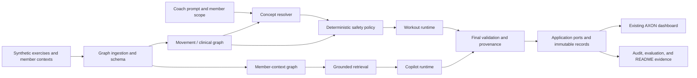
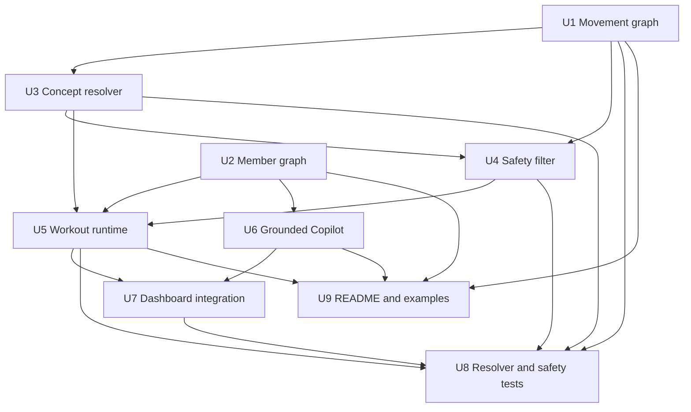

# Graph-Backed Services - Implementation Plan

## Goal Capsule

- **Objective:** Replace the fixture-only workout and Copilot demonstrations with typed, graph-backed services while preserving the existing AXON dashboard and synthetic-data boundary.
- **Product authority:** [`docs/plans/2026-08-05-001-feat-graph-backed-coach-dashboard-plan.md`](2026-08-05-001-feat-graph-backed-coach-dashboard-plan.md) governs product behavior, approval, publication, provenance, and safety policy. [`ASSESSMENT.md`](../../ASSESSMENT.md) governs the take-home requirements and required examples.
- **Scope:** The nine requested workstreams: movement graph, member graph, concept resolver, safety filter, workout runtime, grounded Copilot, dashboard integration, critical tests, and README/documentation.
- **Execution profile:** Implement domain contracts and deterministic policies first, then graph adapters and agent-facing orchestration, then connect the dashboard and prove the critical flows.
- **Stop conditions:** Stop if safety decisions depend only on model text, if a generated plan can become reviewable without deterministic validation, if an agent can approve or publish, if member scope is not enforced server-side, or if production code imports the `ui/` reference archive.

## Product Contract

### Summary

The current dashboard already provides the coach-day shell, typed fixture adapter, member views, decision-path UI, Copilot cards, version history, and local lifecycle demonstrations. This plan adds the missing service layer behind that shell.

The result must generate structured, injury-aware workouts from the movement graph, retrieve member context from the member graph, expose source-backed explanations, and keep the coach as the approval authority.

### Required Behaviors

- **P1. Movement graph:** Represent exercises, muscles, joints or regions, movement patterns, equipment, injuries or conditions, anatomy hierarchy, contraindications, equivalences, ontology mappings, and provenance.
- **P2. Member graph:** Ingest the synthetic member profile, goals, preferences, equipment, injuries, workout history, adherence, biomarkers, labs, conversations, images, coach tasks, and churn signals.
- **P3. Concept resolution:** Resolve free text through exact, fuzzy, and semantic fallback passes with explicit confidence and safe behavior for unresolved safety concepts.
- **P4. Safety filtering:** Use graph traversal for anatomy descendants, contraindications, equipment, explicit exclusions, preferences, and alternatives. Apply a deterministic post-generation safety check.
- **P5. Workout runtime:** Convert prompt and duration into a structured warmup/main/cooldown plan with sets, reps or duration, rest, decisions, and provenance. Keep output as an unapproved draft.
- **P6. Grounded Copilot:** Retrieve member facts for the morning brief, adherence, sleep, week-over-week change, message patterns, and four-week comparisons. Render charts, conversation history, and synthetic image metadata with evidence links.
- **P7. Dashboard integration:** Replace fixture-only reads and timers with service ports without changing the AXON interaction contract or importing `ui/` runtime files.
- **P8. Critical proof:** Test resolver behavior, deterministic safety, final-plan validation, member scoping, approval gating, provenance, and the integrated injury/equipment flows.
- **P9. Documentation:** Explain architecture, graph schema, ontology choices, AI/runtime boundaries, trade-offs, local operation, limitations, and two or three example scenarios.

### Acceptance Examples

- **AE1. Knee injury:** Given a recovering left-knee injury, the graph traverses the knee and modeled descendants, excludes contraindicated exercises, and records the path and source revision.
- **AE2. Limited equipment:** Given dumbbells and a kettlebell but no barbell, barbell-only candidates are removed and graph-linked alternatives are offered when available.
- **AE3. Explicit exclusion:** Given “exclude deadlifts,” mapped deadlift variations do not appear in the generated or adjusted plan.
- **AE4. Ambiguous safety phrase:** Given an unresolved injury or anatomy phrase, generation blocks or requests coach clarification; it never assumes a safe canonical concept.
- **AE5. Grounded Copilot:** Given “what changed since last week?”, the answer separates recent facts, trend, and stable preference, cites source records, and derives any chart from the same context revision.
- **AE6. Approval boundary:** A generated or adjusted plan cannot become reviewable or publishable until deterministic validation passes and an authenticated coach approves the exact immutable version.

### Scope Boundaries

**Included:** local Neo4j-backed canonical mode, deterministic fixture-backed test doubles, typed application ports, synthetic data, coach-scoped reads, focused provenance paths, and the existing AXON UI.

**Deferred:** real member delivery, real production auth, clinical validation, arbitrary graph editing, unrestricted ontology ingestion, and member-facing messaging. The Copilot may recommend or draft a coaching action, but this slice does not send a member message.

### Resolved Defaults

- A unique exact alias resolves at confidence `1.0`.
- Fuzzy or semantic resolution requires confidence `>= 0.90` and a top-candidate margin `>= 0.10`.
- Safety-critical fuzzy or semantic resolution requires confidence `>= 0.95`; otherwise it returns clarification.
- Scores from `0.70` up to the applicable acceptance threshold return clarification. Scores below `0.70`, empty input, or no candidates return unresolved.
- A workout time window is a duration in minutes. The runtime rejects a duration that cannot support the required warmup, main, and cooldown minimums.

## Planning Contract

### Key Technical Decisions

1. **Preserve the current dashboard boundary.** Extend `DashboardAdapter`, `dashboard-contract.ts`, and the reducer-driven shell. Replace fixture implementations behind ports instead of creating a second dashboard.
2. **Use Neo4j behind repositories.** Store the movement graph, member graph, provenance, run state, immutable workout versions, and approval/outbox records in one local/hosted graph deployment, with repository ports keeping Cypher out of domain policies.
3. **Use a bounded ontology subset.** Map OPE concepts for exercise, movement, and equipment; map a small SNOMED CT anatomy/injury subset for knee and related structures; use SKOS for catalog-to-canonical mappings; use COPPER for contextual personalization concepts; use PROV-O-shaped records for recommendation derivation.
4. **Fail closed for unresolved safety concepts.** Low-confidence or unresolved safety concepts block generation or require explicit coach clarification. They cannot be silently converted into a soft preference.
5. **Separate hard exclusions from soft ranking.** Graph-proven contraindications, explicit exclusions, and unavailable required equipment remove candidates. Permitted but less-preferred candidates may be down-ranked. Every decision records the rule and path.
6. **Keep the runtime agentic but bounded.** Use specialized typed stages for resolution, graph retrieval, safety evaluation, composition, member retrieval, and explanation. Agents may read and propose; only server-side policies can validate, version, approve, or publish.
7. **Use one shared context snapshot.** Workout generation, Copilot answers, charts, provenance, and audit events reference the same member-context revision so narrative and visualization cannot drift.
8. **Use deterministic local doubles.** Tests and degraded showcase mode use the same domain contracts with in-memory or fixture repositories. External model and graph providers are adapters, not required for unit correctness.

### High-Level Technical Design

### Dependency Order

### Existing Patterns to Preserve

- `src/features/coach-dashboard/fixture-adapter.ts` remains the projection boundary. Canonical records and derived view models stay separate.
- `src/features/coach-dashboard/dashboard-contract.ts` remains the UI contract. New service results should project into these types or a deliberate successor type, not leak Neo4j or model-provider types into JSX.
- `src/features/coach-dashboard/state.ts` remains the lifecycle state machine. Server-backed versions and async run states must preserve cancellation, stale-member protection, and publication immutability.
- `tests/unit/coach-dashboard-state.test.ts` and `tests/unit/dashboard-fixture-adapter.test.ts` remain regression coverage for the current shell.
- `scripts/check-production-isolation.mjs` remains a build gate preventing `ui/` runtime dependencies.

### Risks and Mitigations

- **Ontology breadth:** Keep the required subset tied to knee, equipment, movement, and provenance scenarios. Do not ingest all source ontologies.
- **Unsafe model output:** Validate every proposed exercise against the graph-derived allowed set after composition.
- **Cross-member leakage:** Derive member scope from the server session and re-authorize every repository, tool, chart, image, and stream request.
- **Provider failure:** Preserve the last valid draft, expose explicit unavailable/insufficient-evidence states, and disable safety-sensitive writes in degraded mode.
- **Fixture drift:** Seed graphs from canonical JSON with stable source IDs and test projections against both Jordan and the added synthetic member fixtures.
- **Plan breadth:** Land work in the dependency order above. Do not connect the UI to a service whose deterministic contract and tests are not complete.

### Sources and Research

- `ASSESSMENT.md` — required graphs, resolver behavior, safety traversal, Copilot surfaces, tests, and README deliverable.
- `docs/plans/2026-08-05-001-feat-graph-backed-coach-dashboard-plan.md` — settled Neo4j, typed-port, approval, streaming, provenance, observability, and degraded-mode decisions.
- `src/features/coach-dashboard/fixture-adapter.ts` — current fixture composition and projection boundary.
- `src/features/coach-dashboard/dashboard-contract.ts` — current typed dashboard view model and Copilot card shape.
- `src/features/coach-dashboard/state.ts` — current reducer lifecycle for member selection, versions, prompts, overrides, and publication.
- `data/exercises.json`, `data/member-context.json`, and `data/member-context-avery.json` — canonical synthetic source fixtures.
- No additional external research was required for this focused plan because the parent plan already records the selected framework, graph, ontology, provenance, streaming, and accessibility sources.

## Implementation Units

### U1. Build the movement and clinical knowledge graph

- **Goal:** Create the canonical exercise/anatomy/equipment graph and ontology mapping layer used by resolution, safety, provenance, and explanation.
- **Requirements:** P1; ASSESSMENT build steps 1 and 4; parent R10-R11, R15-R18.
- **Dependencies:** None.
- **Files:**
  - `src/domain/contracts/movement-graph.ts`
  - `src/domain/contracts/ontology.ts`
  - `data/movement-ontology-mappings.json`
  - `docs/graph/movement-clinical-schema.md`
  - `src/graph/schema/movement-schema.ts`
  - `src/graph/schema/constraints.ts`
  - `src/graph/ingest/exercises.ts`
  - `src/graph/ingest/ontology-subset.ts`
  - `src/graph/repositories/movement-graph.ts`
  - `src/graph/cypher/movement.ts`
  - `scripts/seed-movement-graph.ts`
  - `docs/ontology-model.md`
  - `tests/unit/movement-graph.test.ts`
  - `tests/integration/movement-graph.neo4j.test.ts`
- **Approach:**
  1. Define stable IDs and typed node/edge records for exercises, anatomy, equipment, movement patterns, conditions, ontology concepts, and provenance activities.
  2. Ingest the exercise catalog with `targets`, `stresses`, `requires`, `part-of`, `contraindicated-for`, and `equivalent-to` relationships.
  3. Check in a curated mapping manifest with mapping type, confidence, source identifier, rationale, and revision metadata. Add only the OPE, SNOMED CT, COPPER, SKOS, and PROV-O concepts needed by the acceptance scenarios.
  4. Add uniqueness constraints, source revision metadata, and bounded traversal repository methods.
  5. Make ingestion idempotent and reject incomplete records before activating a dataset revision.
- **Test scenarios:**
  1. Every catalog exercise resolves to stable exercise, muscle, movement, and equipment nodes.
  2. Knee descendants are traversable through `part-of` and return deterministic ordering.
  3. Barbell-only and dumbbell-equivalent exercises expose the expected equipment and equivalence edges.
  4. Re-running ingestion does not duplicate nodes or edges.
  5. Missing required fields, duplicate IDs, unknown relationship targets, and malformed ontology mappings reject the revision.
  6. Traversals enforce depth and result limits and cannot accept model-authored Cypher structure.
- **Verification:** A seeded Neo4j revision passes schema, mapping, descendant, equipment, equivalence, and idempotency checks.

### U2. Build the member-context knowledge graph

- **Goal:** Ingest synthetic member context into a graph that supports scoped retrieval, longitudinal reasoning, source citations, images, and coach tasks.
- **Requirements:** P2; ASSESSMENT build step 2; parent R19-R24 and R31.
- **Dependencies:** U1 for shared source/revision and provenance conventions.
- **Files:**
  - `src/domain/contracts/member-context.ts`
  - `src/graph/schema/member-schema.ts`
  - `src/graph/ingest/member-context.ts`
  - `src/graph/repositories/member-context.ts`
  - `src/graph/cypher/member-context.ts`
  - `scripts/seed-member-graph.ts`
  - `tests/unit/member-context-ingest.test.ts`
  - `tests/integration/member-context.neo4j.test.ts`
- **Approach:**
  1. Preserve source IDs, timestamps, units, source type, synthetic marker, and context revision for every imported fact.
  2. Model profile, goals, preferences, equipment, injuries, history, adherence, biomarkers, labs, chats, image metadata, tasks, and churn signals as scoped member records.
  3. Normalize dates and measurement units at ingestion while retaining original values for source display.
  4. Expose retrieval methods that require coach identity, member ID, allowed domain, and context revision.
  5. Return empty, stale, contradictory, and unavailable-source states as typed results rather than silently dropping facts.
- **Test scenarios:**
  1. Jordan’s complete synthetic context is ingested with stable relationships across workouts, chats, biomarkers, and tasks.
  2. Avery and the no-session synthetic member remain isolated by member ID.
  3. Missing optional image or lab data produces an intentional empty result.
  4. Invalid timestamps, units, duplicate source IDs, and non-synthetic records reject ingestion.
  5. A valid coach cannot retrieve another member’s evidence by guessing source IDs.
  6. Re-ingestion creates a new complete revision without mutating historical snapshots.
- **Verification:** Retrieval returns the same structured facts used by Copilot charts and narrative answers, with source and revision metadata.

### U3. Implement the free-text concept resolver

- **Goal:** Convert coach language into canonical movement, anatomy, equipment, exclusion, preference, and member-context concepts with visible confidence.
- **Requirements:** P3; ASSESSMENT build step 3; parent R12-R13, R25.
- **Dependencies:** U1 and U2.
- **Files:**
  - `src/domain/contracts/concept-resolution.ts`
  - `src/domain/policies/resolution-policy.ts`
  - `src/application/use-cases/resolve-concepts.ts`
  - `src/graph/repositories/concept-index.ts`
  - `src/agents/tools/concept-resolution.ts`
  - `tests/unit/concept-resolver.test.ts`
  - `tests/integration/concept-resolution.neo4j.test.ts`
- **Approach:**
  1. Normalize input and run exact alias lookup first.
  2. Run bounded fuzzy matching only against the requested concept type.
  3. Use semantic/vector fallback only when exact and fuzzy passes do not reach the configured threshold.
  4. Return candidates, confidence, method, canonical IDs, evidence, and clarification text.
  5. Treat unresolved safety-relevant anatomy, injury, or equipment terms as blocking; unresolved soft preferences may request clarification or be ignored with a visible notice.
  6. Keep thresholds in a versioned policy record so evaluation can reproduce decisions: exact `1.0`; fuzzy/semantic `>= 0.90` with margin `>= 0.10`; safety-critical fuzzy/semantic `>= 0.95`; `< 0.70` unresolved.
- **Test scenarios:**
  1. “knee,” “left knee,” “kettlebell,” “bad lower back,” and deadlift variants resolve to canonical concepts with expected types.
  2. Exact aliases outrank fuzzy and semantic candidates with deterministic tie ordering.
  3. Ambiguous phrases return clarification rather than an invented concept.
  4. Unknown safety terms block generation; unknown non-safety terms degrade with a visible notice.
  5. Empty input, mixed-language punctuation, repeated terms, and oversized input are handled safely.
  6. Resolution results include the policy revision and source evidence required for provenance.
- **Verification:** Resolver fixtures cover all required examples and produce stable results across repeated runs and provider-disabled test mode.

### U4. Implement deterministic safety and equipment filtering

- **Goal:** Compute the authoritative allowed, excluded, down-ranked, and alternative exercise sets independently of the model.
- **Requirements:** P4; ASSESSMENT build step 4; parent R14-R17.
- **Dependencies:** U1 and U3.
- **Files:**
  - `src/domain/contracts/constraint-decision.ts`
  - `src/domain/policies/safety-filter.ts`
  - `src/domain/policies/workout-validation.ts`
  - `src/application/use-cases/evaluate-workout-constraints.ts`
  - `src/graph/repositories/constraint-paths.ts`
  - `src/agents/tools/safety-evaluation.ts`
  - `tests/unit/safety-filter.test.ts`
  - `tests/integration/safety-evaluation.neo4j.test.ts`
- **Approach:**
  1. Resolve injury, anatomy, equipment, exclusions, and preferences into canonical constraints.
  2. Traverse anatomy descendants and contraindication paths to compute hard exclusions. Traversals are cycle-safe, depth-bounded, and stable-ordered.
  3. Remove exercises requiring unavailable equipment or explicitly excluded exercise families.
  4. Down-rank only candidates that remain permitted but are less aligned with preference or goal signals.
  5. Find alternatives through typed equivalence and constraint re-evaluation, never by name similarity alone.
  6. Validate the complete generated plan against the allowed set before a version can become reviewable.
  7. Return `ConstraintDecision` records with decision type, severity, graph path, source revision, alternatives, and override eligibility.
- **Test scenarios:**
  1. Left-knee constraints exclude exercises stressing the knee or modeled descendants.
  2. No-barbell equipment removes barbell-only candidates and returns equipment-valid alternatives.
  3. “Exclude deadlifts” removes mapped variations, not only the exact string.
  4. Permitted preference mismatches are down-ranked and remain explainable.
  5. Unresolved injury, unavailable graph, invalid candidate, or empty safe set fails closed and prevents a reviewable plan.
  6. A model proposal containing a prohibited exercise is rejected by final validation.
  7. An eligible override requires a coach reason and retains the warning on the new version.
- **Verification:** Deterministic policy tests pass with 100% correctness for injury, equipment, and explicit-exclusion scenarios.

### U5. Implement the agentic workout-generation runtime

- **Goal:** Orchestrate concept resolution, graph retrieval, safety evaluation, workout composition, and explanation into a validated draft.
- **Requirements:** P5; ASSESSMENT build steps 3-5; parent R1-R9 and R25-R30.
- **Dependencies:** U1, U2, U3, and U4.
- **Files:**
  - `src/domain/contracts/workout.ts`
  - `src/domain/contracts/run.ts`
  - `src/application/use-cases/generate-workout.ts`
  - `src/application/use-cases/adjust-workout.ts`
  - `src/application/ports/workout-runtime.ts`
  - `src/agents/coach-runtime.ts`
  - `src/agents/tools/graph-retrieval.ts`
  - `src/agents/tools/workout-composition.ts`
  - `src/agents/tools/explanation.ts`
  - `src/app/api/workouts/generate/route.ts`
  - `src/app/api/workouts/[workoutId]/adjust/route.ts`
  - `tests/unit/workout-runtime.test.ts`
  - `tests/integration/workout-generation.test.ts`
- **Approach:**
  1. Accept member ID, coach ID, prompt, duration in minutes, and optional adjustment intent.
  2. Create a member-context snapshot and run the typed specialist stages in a bounded workflow.
  3. Ask the model only to compose from the graph-derived candidate set and structured dose constraints.
  4. Validate schema, duration budget, warmup/main/cooldown presence, exercise uniqueness, and deterministic safety before persisting a draft.
  5. Persist immutable version, parent version, input digest, context revision, constraint decisions, and provenance paths.
  6. Keep approval and publication outside the agent tool registry; use the existing state lifecycle for coach review.
  7. Stream progress only as uncommitted status/evidence events; never present partial content as final.
- **Test scenarios:**
  1. A valid prompt and duration produce a structured draft with all sections, dose, rest, source-backed reasons, and no publication event.
  2. Injury, equipment, and exclusion adjustments create a new version and rerun constraints.
  3. Duration below the minimum safe section budget returns a validation error with no version.
  4. Model timeout, malformed output, graph timeout, and unresolved concept preserve the last valid draft and expose retry/clarification state.
  5. Duplicate request digest returns the same run/version outcome without duplicate versions.
  6. A stale member context or expected version rejects the mutation without partial writes.
  7. A generated plan containing a hard exclusion never reaches `ready` without an eligible override.
- **Verification:** The runtime generates and adjusts the required injury, limited-equipment, and explicit-exclusion examples while preserving approval gating and provenance.

### U6. Implement grounded Copilot retrieval and evidence surfaces

- **Goal:** Replace fixture Copilot cards with member-scoped retrieval and structured answers that power quick prompts, charts, history, images, and follow-ups.
- **Requirements:** P6; ASSESSMENT build steps 2, 6, and 7; parent R19-R24 and R28-R30.
- **Dependencies:** U2 and U5 for shared context snapshots and daily-workout linkage.
- **Files:**
  - `src/domain/contracts/copilot.ts`
  - `src/domain/contracts/member-evidence.ts`
  - `src/application/use-cases/retrieve-member-context.ts`
  - `src/application/use-cases/answer-copilot-question.ts`
  - `src/application/ports/copilot-runtime.ts`
  - `src/agents/tools/member-retrieval.ts`
  - `src/features/coach-dashboard/copilot-adapter.ts`
  - `src/app/api/copilot/route.ts`
  - `src/features/coach-dashboard/components/CopilotPanel.tsx`
  - `src/features/coach-dashboard/components/ChartSummary.tsx`
  - `src/features/member/ConversationHistory.tsx`
  - `src/features/member/ImageEvidence.tsx`
  - `public/synthetic/home-setup.svg`
  - `tests/unit/copilot-retrieval.test.ts`
  - `tests/integration/copilot-grounding.test.ts`
  - `tests/e2e/copilot-grounding.spec.ts`
- **Approach:**
  1. Use one retrieval contract for quick prompts and free-text follow-ups.
  2. Return structured answer sections for recent state, trend, stable preference, action, source references, chart series, and context revision. Every response, chart, citation, message, and image reference must share the same member and context revision.
  3. Cite source timestamps for chats, workouts, biomarker observations, labs, images, and churn signals.
  4. Keep image support metadata-first; display synthetic placeholders and captions unless a separate approved image-analysis capability exists. Do not claim visual analysis.
  5. Return explicit loading, no-data, insufficient-history, retrieval-error, and unsupported-question states.
  6. Scope every retrieval and follow-up to the authenticated coach and active member outside the model prompt.
- **Test scenarios:**
  1. Morning brief joins yesterday’s workout, adherence risk, pending task, and today’s draft from one revision.
  2. Adherence, sleep, week-over-week, message-pattern, and four-week prompts return the correct chart and source list.
  3. “What changed since last week?” separates recent facts, historical trend, and stable preference.
  4. Missing data produces an evidence-limited answer and no fabricated chart.
  5. Conversation and image references open the correct source timestamp and return to the answer.
  6. Follow-up questions retain member scope and reject foreign source IDs.
  7. Prompt injection in chat or image captions cannot widen retrieval or alter tool authorization.
- **Verification:** Copilot prose and charts are derived from the same structured snapshot and all required quick prompts work against seeded data.

### U7. Connect the existing dashboard to real services

- **Goal:** Preserve the current AXON dashboard behavior while replacing fixture-only reads, local timers, and hardcoded decisions with server-backed contracts.
- **Requirements:** P7; ASSESSMENT build step 7; parent R4-R9, R17-R18, R20, R32, and R36.
- **Dependencies:** U5 and U6; U8 tests may be added alongside this unit.
- **Files:**
  - `src/features/coach-dashboard/fixture-adapter.ts`
  - `src/features/coach-dashboard/dashboard-contract.ts`
  - `src/features/coach-dashboard/state.ts`
  - `src/features/coach-dashboard/CoachDashboard.tsx`
  - `src/features/coach-dashboard/dashboard.module.css`
  - `src/application/ports/dashboard-services.ts`
  - `src/app/api/members/[memberId]/route.ts`
  - `src/app/api/workouts/[workoutId]/route.ts`
  - `src/app/api/workouts/[workoutId]/approve-publish/route.ts`
  - `src/app/api/decision-paths/[decisionId]/route.ts`
  - `tests/e2e/coach-dashboard-real-services.spec.ts`
- **Approach:**
  1. Keep fixture mode as an explicit read-only adapter for tests and degraded showcase mode.
  2. Add a canonical service adapter that projects graph/application records into the existing dashboard contract.
  3. Replace local prompt completion and publication demonstrations with run IDs, server statuses, immutable version reads, and approval mutations.
  4. Preserve member-switch isolation, focus management, responsive layouts, and human-versus-machine semantics.
  5. Show loading, clarification, no-safe-result, provider-error, degraded-read-only, and reconnect states without exposing partial unsafe content.
  6. Ensure the server re-authorizes coach/member scope for every route and event stream.
- **Test scenarios:**
  1. The existing coach-day roster opens a real member projection and retains the selected member across responsive layouts.
  2. Generate, adjust, inspect provenance, approve, and publish use the same immutable version visible in History.
  3. Returning to the roster resets member-local run and detail state.
  4. A stale delayed response cannot overwrite a newly selected member.
  5. Graph/provider failure keeps the last valid read visible, disables writes, and communicates degraded mode.
  6. Keyboard, reduced-motion, forced-color, 320-pixel reflow, and screen-reader status behavior remain intact.
- **Verification:** Real-service and fixture-mode adapters satisfy the same typed dashboard contract and the full coach-day browser flow passes without `ui/` production imports.

### U8. Add resolver, safety, and critical integration tests

- **Goal:** Make the required deterministic guarantees executable and prevent UI polish from masking service regressions.
- **Requirements:** P8; ASSESSMENT build step 8; parent R13-R18 and R29-R31.
- **Dependencies:** U1-U7 as the corresponding behavior becomes available.
- **Files:**
  - `tests/unit/concept-resolver.test.ts`
  - `tests/unit/safety-filter.test.ts`
  - `tests/unit/workout-validation.test.ts`
  - `tests/unit/provenance.test.ts`
  - `tests/integration/graph-safety-workflow.test.ts`
  - `tests/integration/member-scope.test.ts`
  - `tests/integration/approval-gating.test.ts`
  - `tests/e2e/coach-dashboard-critical-flow.spec.ts`
  - `tests/fixtures/graph-scenarios.ts`
  - `package.json`
  - `vitest.config.mts`
  - `playwright.config.ts`
- **Approach:**
  1. Keep pure resolver, safety, validation, and provenance tests deterministic and provider-independent.
  2. Add Neo4j integration tests for descendant traversal, equipment alternatives, and source revisions.
  3. Add application integration tests for member authorization, final-plan validation, immutable versions, and approval gating.
  4. Add browser coverage for injury, equipment, exclusion, clarification, Copilot grounding, and publication flows.
  5. Add scripts for integration and evaluation gates only when their fixtures and setup are deterministic.
- **Test scenarios:**
  1. The test corpus covers knee, lower-back, equipment, deadlift, ambiguous concept, no-safe-result, and malformed-model cases.
  2. Every hard safety scenario is fail-closed unless a recorded override is present.
  3. Provenance is incomplete when any source, path, revision, or decision ID is missing and the test fails.
  4. Cross-member reads and foreign event streams are denied.
  5. Approval cannot publish an unvalidated, stale, or non-current version.
  6. Retry and duplicate requests do not create duplicate versions or publication events.
- **Verification:** `pnpm test` and the added integration/browser gates prove the deterministic core independently of live model behavior.

### U9. Complete README and implementation evidence

- **Goal:** Make the repository runnable and reviewable as a staff-level take-home submission.
- **Requirements:** P9; ASSESSMENT build step 9 and Deliverable; parent R27, R30, R34-R35.
- **Dependencies:** U1-U8.
- **Files:**
  - `README.md`
  - `docs/architecture.md`
  - `docs/ontology-model.md`
  - `docs/demo-scenarios.md`
  - `docs/evaluation.md`
  - `.env.example`
  - `compose.yaml`
  - `scripts/seed.ts`
  - `scripts/reset-demo.ts`
  - `tests/integration/documentation-contract.test.ts`
- **Approach:**
  1. Replace the current UI-slice disclaimer with an accurate canonical/degraded-mode explanation.
  2. Add a Mermaid architecture diagram covering dashboard, application ports, runtime, graph stores, model/vector adapters, safety policy, and provenance.
  3. Document technology choices, ontology subset, graph schema, ingestion, resolver thresholds, safety precedence, agent boundaries, and synthetic-data policy.
  4. Document AI usage, challenges, trade-offs, production evaluation, failure modes, security assumptions, and limitations.
  5. Include reproducible injury and limited-equipment inputs with structured outputs, exclusions, substitutions, graph paths, and provenance traces.
  6. Document one-command local setup, environment variables, seeded data, provider-disabled mode, and hosted limitations.
- **Test scenarios:**
  1. Every README command and referenced file exists in the repository.
  2. Example outputs match the deterministic fixtures and current provenance IDs.
  3. Architecture and ontology docs agree with the shipped contracts and schema.
  4. README states clearly that all data is synthetic and that production clinical validation is out of scope.
- **Verification:** A reviewer can clone the repository, start the local stack, run the injury and equipment examples, inspect traces, and understand the trade-offs without undocumented steps.

## Verification Contract

| Gate | Command | Done signal |
|---|---|---|
| Static quality | `pnpm lint && pnpm typecheck` | No lint or TypeScript errors. |
| Unit behavior | `pnpm test` | Resolver, safety, validation, provenance, runtime, Copilot, and existing UI tests pass. |
| Graph integration | `pnpm test:integration` | Neo4j schema, ingestion, traversal, revision, and repository authorization tests pass. |
| Browser flows | `pnpm test:e2e` | Injury, limited-equipment, Copilot, approval, provenance, responsive, and degraded-mode journeys pass. |
| Accessibility | `pnpm test:a11y` | Automated checks and documented keyboard, reflow, reduced-motion, and non-color-only checks pass. |
| Visual regression | `pnpm test:visual` | AXON snapshots are reviewed after real-service states are introduced. |
| Evaluation | `pnpm eval` | Deterministic safety and provenance gates pass; resolution, retrieval, recommendation, and latency metrics are recorded. |
| Isolation and build | `pnpm build` | Production build passes and `ui/` remains disconnected. |
| Local operation | `docker compose up --build` | Neo4j is ready, synthetic data is seeded, and the dashboard starts in canonical mode. |

Deterministic safety, final-plan validation, provenance completeness, member authorization, approval gating, and synthetic-data checks are release blockers. Model quality and retrieval metrics are reported separately unless the parent Product Contract promotes them to hard gates.

## Definition of Done

- All nine requested workstreams are implemented behind typed boundaries and mapped to the existing dashboard.
- Movement and member graphs ingest only synthetic source data and retain stable source IDs and revisions.
- Concept resolution exposes confidence and fails closed for unresolved safety concepts.
- Safety filtering performs anatomy, contraindication, equipment, explicit-exclusion, preference, and alternative reasoning through graph traversal.
- Final workout validation runs after model composition and before a draft becomes reviewable.
- Agent stages can propose and explain but cannot override, approve, publish, or widen member scope.
- Copilot answers and charts derive from the same member-context snapshot and expose source references.
- The dashboard works in canonical, provider-disabled test, and visibly read-only degraded modes.
- Resolver, safety, final validation, provenance, authorization, approval, and critical browser flows are covered by tests.
- README and supporting docs contain the architecture diagram, ontology rationale, technology trade-offs, AI usage, production evaluation strategy, and injury/equipment examples.
- `pnpm lint`, `pnpm typecheck`, `pnpm test`, integration tests, end-to-end tests, accessibility tests, visual tests, evaluation gates, and `pnpm build` pass.
- Abandoned fixture-only service paths, dead adapters, unused dependencies, and experiment-only code are removed or clearly isolated from production.

## Deferred Implementation Notes

- Exact Cypher query text and final graph indexes should be confirmed against the pinned Neo4j container during implementation.
- The final model provider and vector implementation remain adapter choices; deterministic tests must not depend on provider availability.
- Exact visual composition for error, clarification, and degraded states can follow the existing AXON patterns after the service contracts are stable.
- If the graph-backed workflow proves too large for one hosted deployment, repository ports allow workflow state to move to a relational store without changing domain policies or UI contracts.
