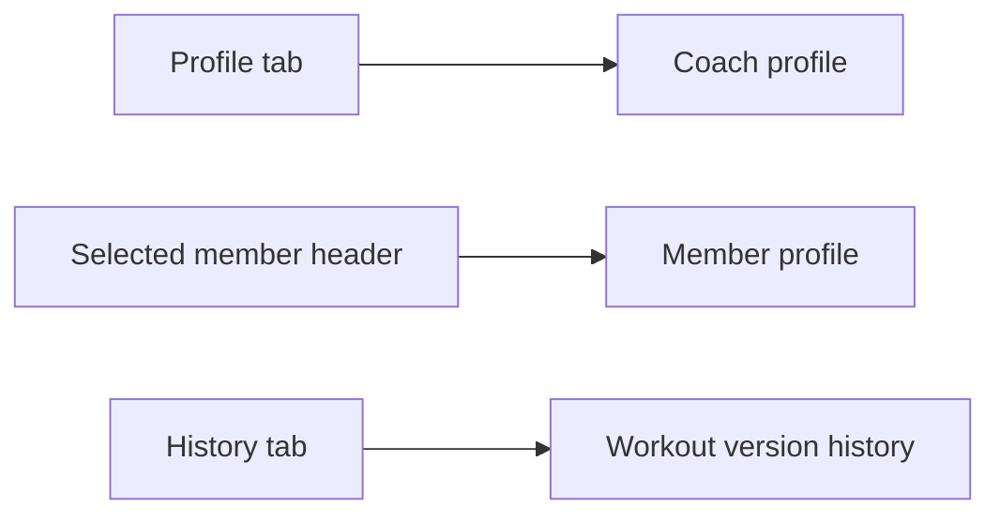
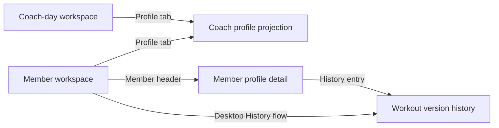

# Coach Profile Tab - Plan

## Goal Capsule

- Objective: Make the dashboard's `Profile` tab show the coach's profile on desktop and mobile, with a concrete named coach identity.
- Product authority: The `Profile` tab belongs to the coach workspace; a selected member's profile belongs to the member header; workout version history belongs to `History`.
- Execution profile: Extend the existing reducer-driven responsive shell and fixture adapter without introducing a new data source or navigation system.
- Stop conditions: Do not add coach editing, persistence, multi-coach switching, analytics, availability management, or authentication changes.
- Tail ownership: This plan ends with a fixture-backed read-only coach profile. Durable coach profile data and permissions remain future work.
- Open blockers: None.

## Product Contract

### Summary

The dashboard will present a read-only coach profile from the `Profile` tab, using the existing named coach identity “Coach Sam” and a clear `COACH PROFILE` label. The selected member profile and workout version history remain available through their existing contextual entry points.

### Problem Frame

The current `Profile` tab renders member-specific identity, injury, goals, preferences, equipment, and workout history even though the surrounding workspace is coach-owned. The data model already separates a coach identity from the selected member, so the current tab label and content do not describe the same person.

### Key Decisions

- KTD1. Make `Profile` coach-owned. The tab should answer “who is using this coach workspace?” rather than duplicate the selected member record.
- KTD2. Keep member profile contextual. The selected member header remains the entry point for member-specific profile details, preserving the member workflow without competing with the coach tab.
- KTD3. Keep workout version history separate. The `History` surface remains the source for workout versions and publication events instead of becoming part of the coach profile.

### Product Shape

The three profile and history entry points have distinct ownership:

### Requirements

**Coach profile surface**

- R1. Selecting `Profile` on desktop or mobile shows a coach profile surface labeled `COACH PROFILE`, not a member profile.
- R2. The coach profile shows a named coach identity, using “Coach Sam” as the default demo name, with avatar or initials and a concise role or workspace label.
- R3. The `Profile` tab is available from the coach-day workspace without selecting an athlete first and does not implicitly select an athlete.
- R4. The coach profile remains coach-owned even when an athlete is active; the selected athlete's data must not appear as the profile hero identity.

**Contextual member and history surfaces**

- R5. The selected member header continues to open a member profile with the current member identity and member-specific profile content.
- R6. The `History` tab continues to show workout version history, including the existing version timeline and publication-event meaning.

**Navigation clarity**

- R7. Coach and member profile surfaces use distinct visible labels and accessible names so a user can tell whose profile is open.
- R8. The behavior and ownership distinction is consistent across desktop and mobile projections of the dashboard.

### Key Flows

- F1. **Coach profile from coach day**
  - **Trigger:** The coach opens the dashboard without an active athlete.
  - **Steps:** The coach selects `Profile`; the dashboard opens the coach profile and shows the named coach identity.
  - **Outcome:** The coach can inspect the workspace identity without first choosing an athlete.
  - **Covered by:** R1-R4, R7-R8.
- F2. **Member profile from member context**
  - **Trigger:** The coach selects an athlete and uses the member header profile action.
  - **Steps:** The dashboard opens the member profile with member-specific identity and details.
  - **Outcome:** The member profile remains available without changing the meaning of the `Profile` tab.
  - **Covered by:** R5, R7-R8.
- F3. **Workout history remains independent**
  - **Trigger:** The coach opens `History`.
  - **Steps:** The dashboard shows the existing workout version timeline and publication-event context.
  - **Outcome:** Version history remains distinct from both coach and member profile identity.
  - **Covered by:** R6.

### Acceptance Examples

- AE1. **No active athlete:** Given the coach-day workspace has no selected athlete, when the coach selects `Profile`, then the tab is enabled and the visible surface identifies the coach as “Coach Sam” under `COACH PROFILE` without showing member injury, goals, or equipment data.
- AE2. **Active athlete:** Given an athlete is selected, when the coach selects the `Profile` tab, then the coach profile still appears; when the coach uses the selected member header action, then the member profile appears under a distinct `MEMBER PROFILE` label.
- AE3. **History:** Given workout versions or a publication event exist, when the coach selects `History`, then the existing version timeline and publication meaning remain visible and are not replaced by coach-profile content.
- AE4. **Responsive parity:** Given the dashboard is viewed at supported desktop and mobile widths, when the coach uses either profile entry point, then the ownership labels and content distinction remain the same.

### Scope Boundaries

- In scope: Coach-owned `Profile` tab behavior, a named read-only coach identity, coach-day availability, distinct member-profile access, and preservation of the existing workout history surface.
- Deferred for later: Editing or persisting coach details, switching between multiple coaches, coach-level analytics, availability management, and authentication or authorization changes.

### Dependencies and Assumptions

- The existing workspace already supplies a coach identity and can use “Coach Sam” as the demo value.
- The coach profile is read-only for this correction; no profile mutation flow is required.
- Existing member-specific profile content and version-history semantics are preserved unless a later plan explicitly changes them.

### Sources / Research

- `src/features/coach-dashboard/CoachDashboard.tsx` currently wires the `Profile` tab and `ProfileScreen` to member content, while `MemberHeader` and `HistoryScreen` provide separate contextual surfaces.
- `src/features/coach-dashboard/dashboard-contract.ts` models `coach` separately from the selected member and member `profile`.
- `src/features/coach-dashboard/fixture-adapter.ts` already provides the coach name “Coach Sam.”
- `docs/plans/2026-08-05-002-feat-copy-first-axon-ui-plan.md` establishes the existing Profile and History surface contract.
- `ui/Coach Dashboard v2.dc.html` is the reference artifact that labels the current profile surface `MEMBER PROFILE`.

Product Contract preservation: unchanged.

---

## Planning Contract

<!-- ce-section: work-relationships -->
### How This Work Fits Together

This is a focused follow-up to the existing coach-dashboard shell, not a replacement for its member workflow:

- **Extends:** the roster-first coach-day workspace and the shared reducer-driven desktop/mobile projections established by the earlier dashboard plans.
- **Preserves:** the selected member header, member profile detail, workout version History, fixture adapter, and accessibility/snapshot harnesses.
- **Does not depend on:** graph-backed services, durable profile persistence, or a new authentication/permissions model.

### Key Technical Decisions

- KTD4. **Keep the reducer as the workspace authority.** Special-case `Profile` selection so the coach-day workspace can show the coach profile without selecting an athlete, while member-workspace tabs retain their current state behavior. Governs R1, R3-R4, R8.
- KTD5. **Use separate coach and member profile projections.** Keep the existing member profile as a detail projection reached from `MemberHeader`, and render a separate coach profile for the `Profile` tab instead of adding a second navigation system. Governs R1, R4-R5, R7.
- KTD6. **Reuse the existing coach workspace view model.** Derive the coach profile from the existing coach identity and workspace aggregates rather than adding new fixture records, contract fields, or persistence. Governs R2.
- KTD7. **Preserve member-context History access.** Keep the existing member profile History entry point and desktop History flow; do not add version-history content to the coach profile. Governs R6, R8.

### High-Level Technical Design

The implementation keeps one reducer and distinguishes the two meanings of “Profile” at the projection boundary:

- The reducer keeps `workspace: coach-day` when `Profile` is selected before an athlete is active.
- The coach-day shell renders the coach profile projection when its tab is `Profile`; otherwise it renders the roster workspace.
- The member shell renders the same coach profile projection for the `Profile` tab, while the member header continues to open the member profile detail projection.
- The member profile retains its existing History link so mobile users can reach member-scoped version history without adding a global history state.

### Sequencing

1. Update workspace-aware tab selection and shell routing.
2. Split the coach profile tab projection from the member profile detail and reuse existing AXON styles.
3. Extend unit, browser, accessibility, and visual coverage, then review the intended snapshots.

### Risks and Mitigations

- **Risk:** The existing `Profile` tab and member profile detail share the same visible label and component, so a partial change could show the wrong person. **Mitigation:** Keep tab rendering and member-header detail rendering as separate named projections and assert both paths in browser tests.
- **Risk:** Enabling Profile on coach day could accidentally select a member or reset member-local state. **Mitigation:** Cover no-athlete and active-athlete reducer transitions separately and preserve the existing `select-athlete` and `return-to-roster` behavior.
- **Risk:** Replacing the member profile tab could strand mobile History access. **Mitigation:** Preserve the member-header-to-member-profile-to-History path and verify the existing version timeline after a member is selected.

### Sources & Research

- `src/features/coach-dashboard/CoachDashboard.tsx` owns tab projections, coach-day rendering, the member header action, current member profile content, and History rendering.
- `src/features/coach-dashboard/state.ts` owns `DashboardTab`, `DashboardScreen`, workspace transitions, member selection resets, and detail-screen return behavior.
- `src/features/coach-dashboard/dashboard-contract.ts` already exposes `CoachContext`, the member view model, and the coach workspace without requiring new fields for this change.
- `src/features/coach-dashboard/fixture-adapter.ts` already provides “Coach Sam,” workspace athletes, sessions, and the existing member profile/history data.
- `tests/unit/coach-dashboard-state.test.ts` covers reducer transitions and member-local state isolation.
- `tests/e2e/coach-dashboard-mobile.spec.ts`, `tests/e2e/coach-dashboard-responsive.spec.ts`, and `tests/e2e/coach-dashboard-accessibility.spec.ts` provide the existing navigation, responsive, focus, and accessibility patterns.
- `tests/visual/coach-dashboard-desktop.spec.ts` and `tests/visual/coach-dashboard-mobile.spec.ts` provide the existing snapshot harness.
- `docs/plans/2026-08-05-002-feat-copy-first-axon-ui-plan.md` and `docs/plans/2026-08-05-003-feat-coach-day-planner-plan.md` establish the shared reducer, responsive projection, synthetic-data boundary, and roster-first workspace patterns.
- No `docs/solutions/` directory exists, so no repository learning was applicable.

## Implementation Units

### U1. Preserve workspace-aware Profile navigation

- **Goal:** Make `Profile` reachable from coach day without an active athlete while preserving member selection, roster return, and detail-screen behavior.
- **Requirements:** R1, R3-R4, R8; F1; AE1-AE2.
- **Dependencies:** None.
- **Files:**
  - `src/features/coach-dashboard/state.ts`
  - `src/features/coach-dashboard/CoachDashboard.tsx`
  - `tests/unit/coach-dashboard-state.test.ts`
- **Approach:**
  1. Update the reducer's `Profile` tab transition so coach-day selection does not force the member workspace or require `activeMemberId`.
  2. Enable the Profile tab in both coach-day navigation variants while keeping Today, Copilot, Workout, Voice, and History member-scoped as they are today.
  3. Route tab-level Profile rendering to the coach profile projection and keep the member header action on the member profile detail path.
  4. Update coach-day guidance copy so it no longer says that an athlete must be selected to open Profile.
- **Patterns to follow:** `createInitialDashboardState`, `dashboardReducer`, `DashboardNavigation`, `MemberHeader`, and the existing `return-to-roster` reset behavior.
- **Test scenarios:**
  1. Starting from the initial coach-day state, selecting Profile keeps `workspace` as `coach-day`, leaves `activeMemberId` null, and sets the Profile tab without opening a detail screen.
  2. Starting from a selected member, selecting the Profile tab keeps the member context available for the coach profile and does not reset versions, pins, or member-local state.
  3. Opening Profile through the selected member header still opens the member profile detail screen rather than the tab-level coach profile.
  4. Returning to Roster after visiting the coach profile preserves the existing roster workspace reset semantics.
- **Verification:** The reducer and shell expose a direct coach-profile path with no implicit athlete selection, and the existing member navigation transitions remain intact.

### U2. Render distinct coach and member profile projections

- **Goal:** Show the named coach identity from the Profile tab while retaining the current member profile content and History entry point.
- **Requirements:** R1-R2, R4-R7; F2-F3; AE2-AE4.
- **Dependencies:** U1.
- **Files:**
  - `src/features/coach-dashboard/CoachDashboard.tsx`
  - `src/features/coach-dashboard/dashboard.module.css`
- **Approach:**
  1. Rename the current detail-only `ProfileScreen` implementation to `MemberProfileScreen`; keep its member identity, `MEMBER PROFILE` label, injury, goals, preferences, equipment, recent workout history, decision path action, and History link together.
  2. Add a separate `CoachProfileScreen` projection for the tab-level Profile path. It consumes the existing coach workspace data, presents “Coach Sam” with avatar or initials, and includes the concise label `Coach workspace` plus available roster context.
  3. Keep member-only injury, goals, equipment, and workout history out of the coach profile hero and body.
  4. Reuse `.profileHero`, `.card`, `.micro`, `.sectionLabel`, and the existing AXON responsive layout conventions; add only the small styling needed for coach-specific summary content.
  5. Give the two projections distinct visible kickers and semantic region names so assistive technology and browser assertions can identify coach versus member profile.
- **Patterns to follow:** `CoachDayWorkspace`, `ScreenHeader`, `MemberHeader`, the existing profile card composition, and the current fixture-backed view-model boundary.
- **Test scenarios:**
  1. The coach profile renders the existing coach name, the `COACH PROFILE` label, coach/workspace context, and no selected member injury, goals, equipment, or recent workout content.
  2. The member profile detail renders the selected member name under `MEMBER PROFILE` and retains its existing member-specific sections and decision-path action.
  3. The member profile History entry still opens the existing version timeline and publication-event context.
  4. The coach and member projections remain usable at the existing mobile and desktop layout widths without introducing horizontal overflow.
- **Verification:** The tab-level and detail-level profiles are visually and semantically distinct, use the existing fixture data boundary, and do not duplicate or mutate member/history data.

### U3. Prove responsive, accessibility, and visual behavior

- **Goal:** Add regression coverage for the new profile ownership boundary without weakening the existing dashboard flows.
- **Requirements:** R1, R5-R8; F1-F3; AE1-AE4.
- **Dependencies:** U1, U2.
- **Files:**
  - `tests/e2e/coach-dashboard-mobile.spec.ts`
  - `tests/e2e/coach-dashboard-responsive.spec.ts`
  - `tests/e2e/coach-dashboard-accessibility.spec.ts`
  - `tests/visual/coach-dashboard-desktop.spec.ts`
  - `tests/visual/coach-dashboard-mobile.spec.ts`
  - `tests/visual/coach-dashboard-desktop.spec.ts-snapshots/`
  - `tests/visual/coach-dashboard-mobile.spec.ts-snapshots/`
- **Approach:**
  1. Extend the existing Playwright journeys instead of adding a second test harness.
  2. Cover Profile from the initial coach-day state at mobile and desktop widths.
  3. Cover the active-member path where the Profile tab shows the coach profile and the member header opens the member profile.
  4. Keep the existing History and version assertions, including the post-adjustment version path.
  5. Add or update focused visual snapshots for the coach profile at the existing flagship widths, and review only the intended copy/layout changes.
- **Patterns to follow:** Role-based Playwright locators, `data-testid`/`data-focus-key` usage, axe checks, viewport changes in `coach-dashboard-responsive.spec.ts`, and the existing `toHaveScreenshot` snapshots.
- **Test scenarios:**
  1. Covers AE1. At the initial mobile coach-day state, Profile is enabled; selecting it shows Coach Sam under `COACH PROFILE` and no member profile content.
  2. Covers AE1 and AE4. At the initial desktop state, Profile is available in the desktop navigation and shows the same coach identity and ownership label.
  3. Covers AE2. After selecting Jordan Rivera, Profile still shows the coach profile, while the member header opens Jordan Rivera's member profile under `MEMBER PROFILE`.
  4. Covers AE3. From the selected member context, History remains reachable and still shows the existing version timeline and publication meaning after a workout adjustment.
  5. Covers AE4. The profile paths remain usable at 320 CSS pixels and across the mobile-to-desktop viewport transition without horizontal overflow or lost focus.
  6. Keyboard users can reach Profile from coach day, and axe reports no violations on the coach profile and member profile paths.
  7. Desktop and mobile visual snapshots capture the intended coach-profile composition and reviewed navigation copy.
- **Verification:** Focused unit, browser, accessibility, and visual tests cover both profile ownership paths, existing History behavior, responsive parity, and semantic labels.

---

## Verification Contract

| Gate | Command | Applies to | Done signal |
|---|---|---|---|
| Type safety | `pnpm typecheck` | U1-U2 | Reducer, view-model usage, and screen props compile without errors. |
| Lint | `pnpm lint` | U1-U2 | The changed dashboard and style code meet repository lint rules. |
| Unit behavior | `pnpm test` | U1 | State transitions preserve coach-day access, member context, and existing reset behavior. |
| Browser flows | `pnpm test:e2e` | U1-U3 | Coach profile, member profile, History, responsive, and focus flows pass. |
| Accessibility | `pnpm test:a11y` | U2-U3 | Keyboard and axe assertions pass for the updated surfaces. |
| Visual regression | `pnpm test:visual` | U2-U3 | Only the intended profile/navigation snapshot changes are accepted. |
| Production build | `pnpm build` | U1-U3 | Isolation check and Next.js production build pass with no new runtime dependency. |

## Definition of Done

- The implementation-ready Product Contract remains the source of truth for the coach-owned Profile tab, contextual member profile, and separate History behavior.
- Profile is available from the coach-day workspace without an active athlete on both desktop and mobile.
- The Profile tab shows Coach Sam with a distinct `COACH PROFILE` label and no member-specific profile content.
- The selected member header still opens the member profile with its existing content and History entry point.
- History still exposes the existing workout version timeline and publication-event meaning.
- The same reducer and fixture-backed data boundary drive both responsive projections without a new navigation system, contract field, dependency, or persistence layer.
- U1, U2, and U3 test scenarios are implemented, and all Verification Contract gates pass.
- Intentional visual snapshot updates are reviewed, and abandoned duplicate profile paths or styling experiments are removed.
