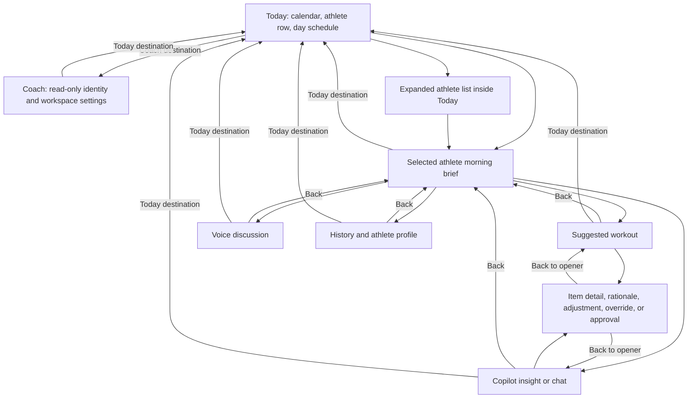
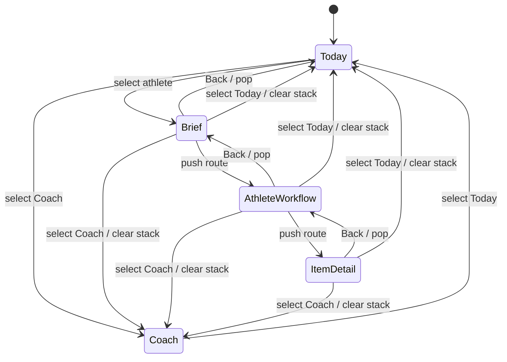

# Mobile Coach Navigation - Plan

## Goal Capsule

- **Objective:** Reorganize the coach dashboard around a mobile-first day-to-athlete flow with no disabled starting destinations and no misplaced athlete profile entry.
- **Product authority:** The Product Contract owns destination hierarchy, screen ownership, and navigation behavior. Existing recommendation, Copilot, history, profile, explanation, adjustment, override, and approval behavior remains authoritative within the new hierarchy.
- **Implementation authority:** The Planning Contract owns the destination state model, nested route stack, responsive projection, and session-local athlete workflow retention.
- **Execution profile:** Change the existing reducer-driven dashboard, fixture adapter, responsive shell, and dashboard test suites. Do not introduce a second router or a new data service.
- **Stop conditions:** Do not add a global Athletes destination, scheduling mutations, editable coach settings, new recommendation logic, new Copilot behavior, or production imports from `ui/`.
- **Tail ownership:** The executor owns implementation, focused and full verification, reviewed visual snapshots, and removal of superseded peer-tab code. Durable settings and URL deep links remain follow-up work.
- **Open blockers:** None.

---

## Product Contract

### Summary

The implementation will replace the peer-tab dashboard shell with Today and Coach as the only global destinations. Today will own the selected day, athlete access, and schedule; each athlete will open one morning brief with nested access to the existing workflows and source-backed explanations.

### Problem Frame

The current dashboard presents navigation destinations before their required athlete context exists.
On mobile, Today, Copilot, and Profile are disabled until an athlete is selected, while athlete work is divided across peer tabs and parent-mapped detail screens.
The selected athlete's profile is also promoted through the top member header, even though it is supporting context rather than the coach's primary destination.
These choices make the first screen look interactive while withholding most actions, and they separate the morning brief from the workout, Copilot evidence, voice discussion, and recommendation rationale needed to work that brief.

### Key Decisions

- **Use only Today and Coach as global destinations.** (session-settled: user-directed — chosen over a separate Athletes destination: athletes belong in the top row within Today.) Governs R1-R4.
- **Make the athlete morning brief the entry to athlete work.** (session-settled: user-directed — chosen over peer Workout, Copilot, Voice, History, and Profile tabs: the coach works these as one athlete-specific morning context.) Governs R8-R12.
- **Preserve every current athlete workflow as a nested destination.** (session-settled: user-directed — chosen over removing secondary screens: the navigation rethink changes ownership without dropping existing capability.) Governs R10-R12.
- **Keep the Coach destination minimal.** (session-settled: user-directed — chosen over adding coach tools and caseload management: the view only needs coach identity and settings.) Governs R4.
- **Treat Today as the global reset.** (session-settled: user-directed — chosen over returning to the active athlete's brief: the bottom destination must always restore the coach-day overview.) Governs R13-R14.

### Navigation Model



### Requirements

**Global navigation**

- R1. The persistent bottom navigation contains exactly two global destinations: Today and Coach.
- R2. Both global destinations are actionable from the initial screen and from every full-screen workflow; neither depends on an active athlete.
- R3. Athlete access lives inside Today through the top athlete row and an optional expanded roster, with no separate Athletes or Roster destination.
- R4. Coach contains a read-only coach identity and workspace-settings summary only; it does not contain athlete profile information, the athlete roster, or additional coach tools.

**Coach-day overview**

- R5. Today is the initial destination and places the selected date or compact calendar at the top of the screen.
- R6. Today presents that day's athletes in a compact top row and the day's schedule as the primary content beneath it.
- R7. Each scheduled athlete entry includes a compact preview of the suggested workout, and the expanded athlete list remains an action within Today rather than a navigation destination.
- R8. Selecting an athlete from either Today surface opens that athlete's morning brief while preserving the selected day and the coach's place for a later return.
- R9. Changing the selected day refreshes the athlete row and day schedule without offering appointment creation, editing, cancellation, completion, or rescheduling.

**Athlete morning brief and nested work**

- R10. The athlete morning brief brings together the suggested workout, morning tasks and signals, Copilot data, and a voice option on one scrollable surface.
- R11. Workout, Copilot, Voice, History, athlete Profile, Insight Detail, Decision Path, Adjustment, Override, and Approval remain reachable as nested athlete or item screens rather than global destinations.
- R12. Every brief item that promises supporting detail opens an appropriate detail screen, and every workout recommendation exposes why it was suggested through its source-backed decision path.

**Return behavior and responsive projection**

- R13. Normal back navigation returns from an item detail to its parent workflow and from an athlete workflow to the athlete morning brief.
- R14. Activating Today from any nested screen returns directly to the coach-day overview instead of the active athlete's brief.
- R15. Activating Coach from any screen opens the read-only coach identity and workspace-settings summary without losing the selected day needed when the coach returns to Today.
- R16. Mobile is the canonical interaction model; wider layouts may use additional space but must preserve the same two global destinations and nested athlete ownership.
- R17. The bottom navigation communicates the active global destination, supports keyboard and assistive-technology navigation, and does not imply that nested athlete screens are additional global tabs.

### Key Flows

- F1. Start the coach day
  - **Trigger:** The coach opens the dashboard with no active athlete.
  - **Actor:** Coach
  - **Steps:** Today opens with the calendar, the day's athlete row, and the day schedule. The Coach destination is immediately available. No athlete-specific destination appears disabled.
  - **Outcome:** The coach can orient to the day and choose an athlete without first resolving a navigation error state.
  - **Covers:** R1-R7.

- F2. Open an athlete morning brief
  - **Trigger:** The coach selects an athlete from the top row, schedule, or expanded athlete list inside Today.
  - **Actor:** Coach
  - **Steps:** The dashboard opens the selected athlete's morning brief. The coach can scan the workout preview, morning tasks, Copilot signals, voice option, history, and profile entry from one surface.
  - **Outcome:** The coach has one starting point for the athlete's morning work.
  - **Covers:** R3, R7-R8, R10-R11.

- F3. Inspect and act on a recommendation
  - **Trigger:** The coach opens the suggested workout or another actionable brief item.
  - **Actor:** Coach
  - **Steps:** The chosen workflow opens as a nested screen. The coach can open the relevant rationale or insight detail, return to the parent workflow, and use the existing adjustment, override, or approval action when eligible.
  - **Outcome:** The coach can understand and act on a recommendation without losing the athlete context.
  - **Covers:** R11-R13.

- F4. Leave athlete work
  - **Trigger:** The coach activates Today or Coach while inside an athlete workflow or item detail.
  - **Actor:** Coach
  - **Steps:** Today returns directly to the coach-day overview. Coach opens the read-only identity and workspace-settings summary. Returning to Today restores the selected day.
  - **Outcome:** Global navigation is predictable regardless of nesting depth.
  - **Covers:** R14-R15.

### Acceptance Examples

- AE1. Initial mobile state
  - **Covers R1-R7.**
  - **Given:** The coach opens the dashboard with no selected athlete.
  - **When:** The initial screen renders.
  - **Then:** Today is active, Coach is actionable, no bottom destination is disabled, and the selected date, today's athlete row, and the day schedule are visible.

- AE2. Full roster without a destination
  - **Covers R3, R7-R8.**
  - **Given:** More athletes exist than fit in the compact Today row.
  - **When:** The coach chooses to see all athletes.
  - **Then:** The roster expands or opens from within Today, the bottom navigation still contains only Today and Coach, and choosing an athlete opens that athlete's morning brief.

- AE8. Change the selected day
  - **Covers R9.**
  - **Given:** The coach is viewing Today.
  - **When:** The coach selects a different date in the compact calendar.
  - **Then:** The athlete row and schedule refresh for that date, and no appointment creation, editing, cancellation, completion, or rescheduling control appears.

- AE3. Unified athlete brief
  - **Covers R8, R10-R12.**
  - **Given:** The coach selects an athlete scheduled for the chosen day.
  - **When:** The morning brief opens.
  - **Then:** The suggested workout, morning signals, Copilot data, voice option, history entry, and athlete profile entry are available without switching global tabs.

- AE4. Explain a workout recommendation
  - **Covers R11-R13.**
  - **Given:** The coach opens a suggested workout from the morning brief.
  - **When:** The coach opens an exercise or the workout's explanation.
  - **Then:** The source-backed rationale and relevant decision path are shown, Back returns to the workout, and a second Back returns to the athlete brief.

- AE5. Today is a hard reset
  - **Covers R14.**
  - **Given:** The coach is inside Voice, Copilot, History, athlete Profile, or a workout detail.
  - **When:** The coach activates Today in the bottom navigation.
  - **Then:** The coach-day overview opens directly with the previously selected day rather than returning to the athlete brief.

- AE6. Coach destination ownership
  - **Covers R4, R15.**
  - **Given:** The coach activates Coach from any screen.
  - **When:** The Coach view opens.
  - **Then:** It shows read-only coach identity and workspace settings and does not show the active athlete's profile, the athlete roster, or athlete-specific tools.

- AE7. Wider-screen consistency
  - **Covers R16-R17.**
  - **Given:** The same workflow is viewed at a wider breakpoint.
  - **When:** The layout uses the additional space.
  - **Then:** Today and Coach remain the only global destinations, and athlete-specific screens remain nested under the morning brief.

### Scope Boundaries

- Reorganize the existing dashboard navigation, screen ownership, and morning-brief composition.
- Preserve the existing athlete-specific workflows and the data already shown within them.
- Do not add an Athletes or Roster tab, hidden secondary global navigation, or disabled preselection tabs.
- Do not add calendar or appointment management actions.
- Do not add new coach-level tools, new recommendation behavior, new Copilot capabilities, or new data sources as part of this work.

### Dependencies and Assumptions

- The existing coach-day workspace remains the source for the selected date, scheduled athletes, athlete summaries, and member projections.
- Current athlete-specific behavior is preserved unless this Product Contract changes its entry, exit, or placement.
- The selected date is durable across nested athlete work and the Coach destination for the duration of the local dashboard session.
- The rationale surface continues to use the same source-backed decision paths that explain selections, exclusions, substitutions, overrides, and Copilot claims.

### Sources and Research

- `ASSESSMENT.md` defines a coach-facing dashboard with a workout generator, member-context Copilot, morning brief, voice-adjacent coaching workflow, and auditable recommendation provenance.
- `docs/plans/2026-08-05-003-feat-coach-day-planner-plan.md` established the coach-day workspace and athlete selection as the entry to deeper member work.
- `docs/plans/2026-08-06-001-feat-coach-profile-tab-plan.md` separates the coach Profile destination from the selected athlete's profile.
- `src/features/coach-dashboard/CoachDashboard.tsx` contains the current desktop and mobile navigation, disabled initial mobile tabs, coach-day workspace, athlete header, Today, Workout, Copilot, Voice, History, Profile, and detail screens.
- `src/features/coach-dashboard/state.ts` defines the current global tabs, nested screens, dialogs, coach-day/member workspaces, and return behavior.
- `tests/e2e/coach-dashboard-mobile.spec.ts`, `tests/e2e/coach-dashboard-responsive.spec.ts`, and `tests/e2e/coach-dashboard-accessibility.spec.ts` record the current mobile, responsive, and accessibility expectations that planning must revise without losing coverage.

Product Contract preservation: clarified without scope change; R-IDs are unchanged, and the navigation diagram, acceptance trace, and read-only Coach wording now match the settled requirements.

---

## Planning Contract

<!-- ce-section: work-relationships -->
### How This Work Fits Together

This plan replaces the dashboard's navigation hierarchy while preserving its athlete capabilities:

- **Extends:** the coach-day workspace, fixture-backed member projections, reducer-controlled workflow state, decision-path evidence, focus restoration, and existing responsive test harness.
- **Replaces:** the `Roster`, `Today`, `Workout`, `Copilot`, `Voice`, `History`, and `Profile` peer-tab model and its mobile parent-tab mappings.
- **Subsumes:** `docs/plans/2026-08-06-001-feat-coach-profile-tab-plan.md`. Coach identity becomes the `Coach` destination, while athlete Profile moves into the morning brief.
- **Preserves:** adjustment, override, approval, publication, prompt, pin, voice, history, athlete profile, insight, and decision-path behavior.
- **Does not depend on:** a new router, a settings backend, a scheduling service, recommendation changes, or content from the disconnected `ui/` reference directory.

### Key Technical Decisions

- KTD1. **Separate global destinations from athlete routes.** Replace `DashboardTab` and `DashboardWorkspace` ownership with a two-value `DashboardDestination` (`today | coach`) and an explicit nested athlete route stack. The stack contains the morning brief and the nested Workout, Copilot, Voice, History, athlete Profile, Insight, workout rationale, Decision Path, and Approval screens. Dialogs remain modal state outside the stack. (session-settled: user-approved — chosen over adapting the existing peer-tab and single-parent model: the confirmed hierarchy has two global destinations and can require more than one Back step.) Governs R1-R4, R10-R17.

- KTD2. **Make the selected day shell-owned and timezone-correct.** Store `selectedDate` beside the global destination so athlete selection, Coach, and responsive reflow cannot reset it. Group sessions into coach-local dates using `workspace.timezone` rather than slicing the source timestamp. Governs R5-R9, R14-R16.

- KTD3. **Retain workflow state per athlete for the local dashboard session.** Separate navigation state from a member-keyed workflow-state record. Selecting an athlete initializes or restores that athlete's versions, pins, prompt feed, publication events, and draft state. Today and Coach clear the route stack but do not discard completed athlete work. Pending async completions remain keyed by athlete and cannot update a different athlete. (session-settled: user-approved — chosen over recreating member state on every athlete or destination transition: leaving athlete work must not silently erase completed local changes.) Governs R8, R11, R13-R15.

- KTD4. **Use one semantic destination list at every width.** `DashboardNavigation` renders only Today and Coach. Mobile keeps the fixed bottom bar and safe-area behavior. Wider layouts may project the same pair into the existing wide navigation region, but `isDesktop` controls layout only and never destination ownership. (session-settled: user-approved — chosen over retaining desktop-only peer tabs: responsive layouts must share one information architecture.) Governs R1-R4, R14-R17.

- KTD5. **Derive Today previews from existing workspace data.** Add the suggested workout title to `CoachAthleteSummary` in `buildCoachWorkspace`; continue to use scheduled session duration and status from `CoachSession`. Derive the compact athlete row by unique scheduled athlete ID, ordered by earliest session for the selected day. Athletes with no selected-day session remain available through the expanded all-athletes list. Governs R3, R5-R9.

- KTD6. **Reframe the existing Today screen as the athlete morning brief.** Keep the brief's workout hero, morning tasks, signals, Copilot cards, and metrics. Add visible entries for Voice, History, and athlete Profile. Remove athlete Profile as the top member-header action; the athlete header becomes identity and context only. Governs R8-R11.

- KTD7. **Compose workout explanation from existing evidence.** Add an explicit `Why this workout?` route or entry that assembles the current workout items' `why`, `provenance`, and available `decisionId` links. It must lead into the existing source-backed decision paths and must not synthesize a new rationale or introduce a recommendation source. (session-settled: user-approved — chosen over adding a new explanation service: the existing evidence already owns the recommendation rationale.) Governs R11-R13.

- KTD8. **Keep Coach read-only and workspace-owned.** Render Coach without `DashboardViewModelContext` or an active athlete. Show the existing coach identity plus workspace timezone as the available settings summary. Do not add editing, persistence, roster data, or athlete content. (session-settled: user-approved — chosen over editable coach settings: this navigation change must not create a new settings capability.) Governs R2, R4, R15.

- KTD9. **Treat route focus as stack state, not one overlay toggle.** Capture a stable focus key when pushing a route and restore the equivalent trigger when popping it. Today and Coach move focus to the new destination heading. Dialog focus trap, Escape handling, reduced motion, live announcements, and inert modal behavior stay intact. Governs R2, R13-R17.

### High-Level Technical Design

The dashboard shell owns global location, date, and active athlete. Athlete workflow data remains member-keyed and survives route changes.



The state boundaries are:

```text
DashboardState
├── destination: today | coach
├── selectedDate: YYYY-MM-DD
├── todayView: { allAthletesExpanded: boolean }
├── activeMemberId: string | null
├── routeStack: AthleteRoute[]
├── athleteStates: Record<memberId, AthleteWorkflowState>
├── dialog: adjustment | override | null
└── announcement: string
```

- `destination` owns `aria-current` and the global screen.
- `routeStack` is meaningful only while `destination` is Today and an athlete is active.
- The first athlete route is the morning brief. Each nested action pushes one route. Back pops one route. Popping the one-entry brief stack also clears `activeMemberId`, preserves `selectedDate`, `todayView`, and `athleteStates`, and shows the Today overview.
- Selecting Today clears `activeMemberId` and `routeStack`, preserves `selectedDate` and `athleteStates`, and shows the day overview.
- Selecting Coach clears `activeMemberId` and `routeStack`, preserves `selectedDate` and `athleteStates`, and renders workspace-owned coach data.
- Selecting an athlete from Today sets `activeMemberId`, restores or creates that member's workflow state, and starts a fresh route stack at the brief.
- Dialogs do not expose the global navigation as an escape from unfinished modal input. The coach dismisses or completes the dialog before using a destination.

### Today Projection

Today uses one data pipeline for all widths:

1. Build timezone-correct `sessionsByDate` from `workspace.sessions`.
2. Render the compact week/calendar control first.
3. Derive scheduled athletes for `selectedDate`, deduplicate them, and order them by first session.
4. Render the compact athlete row with workout title, session time, and duration.
5. Render every selected-day session in chronological order; an athlete with multiple sessions appears once in the row and multiple times in the schedule.
6. Keep the full caseload behind an expandable `See all athletes` control inside Today.
7. On an empty day, show an empty scheduled-athlete state and empty agenda while leaving `See all athletes` immediately available.

The all-athletes expansion is shell-owned Today view state for the selected date and survives an athlete-to-Today Back transition. Selecting the Today destination is the stronger reset: it returns to the overview and may collapse transient expansion state while preserving the date.

### Athlete Route Ownership

| Route | Parent | Existing owner to reuse | Exit behavior |
|---|---|---|---|
| Morning brief | Today | `TodayScreen` composition | Back returns to Today. |
| Workout | Morning brief | `WorkoutScreen` | Back returns to brief. |
| Workout rationale | Workout | Workout items, provenance, decision paths | Back returns to Workout. |
| Copilot | Morning brief | `CopilotScreen` | Back returns to brief. |
| Voice | Morning brief or Copilot | `VoiceModeScreen` | Back returns to the route that opened it. |
| History | Morning brief or athlete Profile | `HistoryScreen` | Back returns to the route that opened it. |
| Athlete Profile | Morning brief | Current `ProfileScreen` renamed for athlete ownership | Back returns to brief. |
| Insight | Brief or Copilot | `InsightScreen` | Back returns to the route that opened it. |
| Decision Path | Workout, rationale, or Profile | `DecisionPathScreen` | Back returns to the route that opened it. |
| Approval | Workout | `ApproveScreen` | Back returns to Workout. |
| Adjustment / Override | Workout | `DashboardDialog` | Modal dismissal returns focus to its Workout trigger. |

### Sequencing

1. Establish reducer invariants and characterization tests for the new destination, date, route-stack, and member-state boundaries.
2. Extend the workspace projection with workout preview data and timezone-correct date helpers.
3. Replace the shell navigation and build the Today and Coach projections.
4. Reframe the athlete brief and connect all nested routes without changing workflow semantics.
5. Complete accessibility, responsive, visual, and full regression verification; remove obsolete tab maps and branches.

Execution note: Start behavior-bearing units with failing reducer or browser tests. Preserve the current dirty working-tree changes and inspect the diff before editing every shared target file.

### Risks and Mitigations

- **State loss during global navigation:** The current reducer rebuilds initial state on athlete and roster transitions. Keep member workflow state separate from route state and test destination transitions after adjustment, pinning, and publication.
- **Incorrect Back parent:** The current single `returnScreen` stores only one parent. Use route pushes and pops, and cover a two-level Workout → Decision Path → Workout → Brief journey.
- **Date reset or timezone drift:** The current date is component-local and timestamps are grouped by sliced source dates. Store the date in reducer state and use the workspace timezone for date keys.
- **Responsive hierarchy drift:** The current desktop and mobile branches render different tab models. Route both layouts from the same destination and stack selectors; use media state only for placement and density.
- **Stale asynchronous updates:** Prompt and adjustment timers can finish after an athlete switch. Preserve athlete-ID guards, cancel pending timers on global transitions, and reject completions whose member no longer matches.
- **Focus loss on nested pop:** The current overlay Boolean cannot distinguish one nested depth from another. Store or derive a stable focus key per pushed route and assert focus after each pop.
- **Misleading Coach settings:** Only name and timezone exist. Label the view as read-only workspace information and do not render controls that imply persistence.
- **Visual snapshot churn:** The initial screen and both navigation projections change substantially. Run behavior tests first, then review and update only the intended flagship snapshots.

### Research That Shapes the Plan

- `src/features/coach-dashboard/state.ts` rebuilds state on `select-athlete` and `return-to-roster`, and its single `returnScreen` cannot represent arbitrary nesting.
- `src/features/coach-dashboard/CoachDashboard.tsx` owns the disabled starting tabs, separate desktop/mobile hierarchies, component-local selected date, clickable athlete profile header, focus restoration, and all screen projections.
- `src/features/coach-dashboard/dashboard-contract.ts` and `src/features/coach-dashboard/fixture-adapter.ts` already expose workout titles, coach identity, workspace timezone, sessions, and member projections. No new source is required.
- `tests/unit/coach-dashboard-state.test.ts` and `tests/unit/dashboard-fixture-adapter.test.ts` are the focused seams for reducer and derived workspace behavior.
- `tests/e2e/coach-dashboard-mobile.spec.ts`, `tests/e2e/coach-dashboard-responsive.spec.ts`, `tests/e2e/coach-dashboard-accessibility.spec.ts`, and `tests/e2e/coach-dashboard-voice.spec.ts` cover the affected navigation, reflow, focus, and voice flows.
- `tests/visual/coach-dashboard-mobile.spec.ts` and `tests/visual/coach-dashboard-desktop.spec.ts` own the flagship snapshots.
- No `docs/solutions/` or `CONCEPTS.md` learning corpus exists. The current working tree is the implementation authority.

---

## Implementation Units

### U1. Replace peer tabs with destination, date, route-stack, and athlete-state invariants

- **Goal:** Give the reducer one navigation model that can express Today, Coach, the athlete brief, arbitrary nested Back behavior, and member-local workflow retention.
- **Requirements:** R1-R2, R8, R11, R13-R17; F2-F4; AE4-AE7.
- **Dependencies:** None.
- **Files:**
  - `src/features/coach-dashboard/state.ts`
  - `src/features/coach-dashboard/CoachDashboard.tsx`
  - `tests/unit/coach-dashboard-state.test.ts`
- **Approach:**
  1. Replace `DashboardTab`, `DashboardWorkspace`, `screen`, and `returnScreen` with the destination and route-stack model from KTD1.
  2. Move `selectedDate` into reducer state with an initialization input from `workspace.coachDayDate`.
  3. Store the Today all-athletes disclosure state beside `selectedDate` so final-stack Back can restore it after the overview unmounts.
  4. Split the current workflow fields into member-keyed athlete state as defined by KTD3. Keep selectors for current version and publication scoped to the active member.
  5. Add actions for destination selection, date selection, athlete selection, route push, route pop, and modal operations. Make Today and Coach clear athlete routes while preserving the selected date and completed member state.
  6. Translate publication's current `tab: today, screen: workout` transition into the Workout route without changing version or publication semantics.
  7. Preserve member-ID validation for prompt and adjustment completions. Reject stale completions after member or destination changes.
  8. Remove old parent-tab mapping types only after all callers use the new state model.
- **Test scenarios:**
  1. Initial state is Today with no active athlete, the workspace default date, and an empty route stack.
  2. Coach is reachable without an athlete; Coach → Today restores the selected date.
  3. Selecting an athlete starts at the brief; Workout → Decision Path produces three stack levels and two Back actions return through Workout to Brief.
  4. Back from the one-entry brief stack clears the active athlete and restores Today with the selected date, member state, and all-athletes disclosure state intact.
  5. Selecting Today from every representative nested depth clears the athlete route and returns to the overview while preserving the date.
  6. Selecting Coach from a nested depth clears the athlete route and preserves the date.
  7. Adjusting, pinning, or publishing for one athlete survives Today, Coach, and a later return to that athlete.
  8. Switching athletes initializes or restores isolated workflow state and prevents stale async completion from changing the new athlete.
  9. Publishing keeps the active athlete in the Workout route and retains the current publication-event meaning.
- **Verification:** `pnpm test -- tests/unit/coach-dashboard-state.test.ts` passes with the new navigation and workflow-state invariants.

### U2. Derive Today workout previews and coach-local dates

- **Goal:** Give Today all read-only data needed for its compact athlete row and schedule without introducing a new data source.
- **Requirements:** R3, R5-R9; F1-F2; AE1-AE3, AE8.
- **Dependencies:** U1.
- **Files:**
  - `src/features/coach-dashboard/dashboard-contract.ts`
  - `src/features/coach-dashboard/fixture-adapter.ts`
  - `src/features/coach-dashboard/CoachDashboard.tsx`
  - `tests/unit/dashboard-fixture-adapter.test.ts`
- **Approach:**
  1. Add a suggested-workout preview field to `CoachAthleteSummary`, derived from each member projection's existing `workoutTitle`.
  2. Keep session time, duration, and multiplicity in `CoachSession`; do not duplicate appointment data into athlete summaries.
  3. Add or centralize a date-key helper that formats each session instant into `workspace.timezone`.
  4. Derive the selected-day athlete row from visible sessions. Deduplicate by athlete ID and sort by first session time.
  5. Keep the complete `workspace.athletes` collection independent from sessions so an empty day can still expose all athletes.
- **Test scenarios:**
  1. Every workspace athlete summary exposes the existing suggested workout title.
  2. An athlete with multiple selected-day sessions appears once in the compact row while both sessions remain in the agenda.
  3. Sessions whose source offsets cross a coach-local date boundary appear on the correct `America/Chicago` day.
  4. Empty agenda data preserves the full athlete collection and its workout previews.
  5. Session sorting remains chronological by instant.
- **Verification:** `pnpm test -- tests/unit/dashboard-fixture-adapter.test.ts` passes, including workout preview and timezone-boundary cases.

### U3. Build the Today overview, Coach view, and two-destination shell

- **Goal:** Make the initial dashboard an actionable coach-day overview with exactly two global destinations at every supported width.
- **Requirements:** R1-R9, R14-R17; F1, F4; AE1-AE2, AE5-AE8.
- **Dependencies:** U1-U2.
- **Files:**
  - `src/features/coach-dashboard/CoachDashboard.tsx`
  - `src/features/coach-dashboard/dashboard.module.css`
  - `tests/e2e/coach-dashboard-mobile.spec.ts`
  - `tests/e2e/coach-dashboard-responsive.spec.ts`
  - `tests/e2e/coach-dashboard-accessibility.spec.ts`
- **Approach:**
  1. Replace desktop and mobile tab arrays, parent maps, disabled-tab handling, and peer-tab render branches with one Today/Coach destination list.
  2. Keep the fixed mobile bottom navigation, safe-area padding, `aria-current`, keyboard activation, and focus-visible styles. Project the same pair into the wider layout without adding destinations.
  3. Recompose `CoachDayWorkspace` in this order: calendar, compact scheduled-athlete row, selected-day schedule with workout previews, and expandable all-athletes list.
  4. Use the selected date and derived collections from U1-U2. Preserve the empty-day state and omit scheduling mutation controls.
  5. Add a workspace-owned `CoachScreen` that renders coach identity and read-only timezone/settings information only.
  6. Clear pending operation timers when a global transition invalidates their active route, while retaining reducer member guards.
  7. Keep Today active throughout the overview, brief, and nested athlete work. Set Coach active only on `CoachScreen`.
- **Test scenarios:**
  1. Initial mobile render has exactly two enabled destination buttons, with Today active and Coach actionable.
  2. Calendar appears before athlete row and schedule; choosing a date refreshes both collections.
  3. Schedule entries show athlete, time, duration, and suggested-workout preview.
  4. `See all athletes` exposes unscheduled athletes inside Today and selects them without adding a destination.
  5. An empty date shows no scheduled-athlete items, an empty agenda, and an actionable full-athlete list.
  6. Coach shows coach identity and timezone but no athlete identity, roster, injury, workout, Copilot, or history content.
  7. The selected date survives Today → Coach → Today and Today → athlete → Today journeys.
  8. At 320, 430, and 1440 CSS pixels, navigation remains usable with no horizontal overflow and no reintroduced peer tabs.
- **Verification:** Focused mobile, responsive, and accessibility Playwright specs pass for Today and Coach.

### U4. Reframe the athlete brief and connect every nested workflow

- **Goal:** Make the selected athlete's morning brief the single entry point for all existing athlete work and explanation.
- **Requirements:** R8, R10-R15, R17; F2-F4; AE3-AE6.
- **Dependencies:** U1, U3.
- **Files:**
  - `src/features/coach-dashboard/CoachDashboard.tsx`
  - `src/features/coach-dashboard/dashboard.module.css`
  - `tests/unit/coach-dashboard-state.test.ts`
  - `tests/e2e/coach-dashboard-mobile.spec.ts`
  - `tests/e2e/coach-dashboard-voice.spec.ts`
  - `tests/e2e/coach-dashboard-responsive.spec.ts`
- **Approach:**
  1. Rename or reframe `TodayScreen` as the athlete morning brief while keeping its workout hero, morning tasks, pinned Copilot insights, risk, and metrics.
  2. Add visible brief entries for Workout, Copilot, Voice, History, athlete Profile, and supporting Insight details.
  3. Replace the clickable athlete-profile `MemberHeader` with non-global athlete identity context. Move profile and history access into the brief.
  4. Route all existing screens through stack pushes. Voice and History return to whichever athlete route opened them; item details and decision paths return to their exact parent.
  5. Add `Why this workout?` from KTD7. Show the existing item rationale and provenance, and link decision-backed items to `DecisionPathScreen`.
  6. Keep adjustment and override as dialogs over Workout and Approval as a nested screen. Preserve publication, version timeline, prompt feed, pins, and eligibility rules.
  7. Use per-route focus keys so Back restores the triggering brief or parent-workflow control.
- **Test scenarios:**
  1. Selecting an athlete from the row, schedule, or expanded list opens the same unified brief.
  2. Workout, Copilot, Voice, History, and athlete Profile are reachable without changing the two-button global navigation.
  3. Voice opened from the brief returns to the brief; Voice opened from Copilot returns to Copilot.
  4. A workout item opens its source-backed decision path; Back returns to Workout and a second Back returns to the brief.
  5. `Why this workout?` shows current rationale and provenance without new generated claims.
  6. Adjustment, override, approval, publication, prompt, pin, history, and profile flows preserve their existing behavior.
  7. Today hard-resets from Voice, Copilot, History, athlete Profile, Workout, and a detail screen while preserving the selected day and completed member state.
  8. Coach opens from the same nested screens and contains no athlete content.
- **Verification:** Focused reducer, mobile, voice, and responsive specs pass for the unified brief and representative nested depths.

### U5. Complete accessibility, responsive, visual, and regression coverage

- **Goal:** Prove that the new hierarchy is usable across input modes and widths and that no existing athlete capability was lost.
- **Requirements:** R1-R17; F1-F4; AE1-AE8.
- **Dependencies:** U1-U4.
- **Files:**
  - `tests/e2e/coach-dashboard-mobile.spec.ts`
  - `tests/e2e/coach-dashboard-responsive.spec.ts`
  - `tests/e2e/coach-dashboard-accessibility.spec.ts`
  - `tests/e2e/coach-dashboard-voice.spec.ts`
  - `tests/visual/coach-dashboard-mobile.spec.ts`
  - `tests/visual/coach-dashboard-desktop.spec.ts`
  - `tests/visual/coach-dashboard-mobile.spec.ts-snapshots/`
  - `tests/visual/coach-dashboard-desktop.spec.ts-snapshots/`
  - `README.md`
- **Approach:**
  1. Replace assertions for four mobile or seven desktop tabs with exactly two actionable global destinations.
  2. Add keyboard coverage for date selection, compact athlete selection, all-athlete expansion, nested Back, Today reset, and Coach.
  3. Assert `aria-current="page"` ownership on Today throughout athlete work and on Coach only within Coach.
  4. Verify focus restoration for brief → workflow → detail and dialog dismissal. Retain live announcements, chart summaries, reduced-motion behavior, and dialog focus trap coverage.
  5. Exercise resize transitions with an open brief and nested workflow to prove that layout changes do not reset destination, date, route, athlete, or workflow state.
  6. Run Axe on Today, the athlete brief, a nested workflow, and Coach.
  7. Update mobile and desktop flagship snapshots only after behavior and accessibility tests pass; inspect each changed image.
  8. Update README navigation language if it still describes Roster or peer athlete tabs.
- **Test scenarios:**
  1. A keyboard-only coach can open Today dates, both athlete surfaces, all nested workflows, and Coach.
  2. Nested Back restores focus to the control that opened the route; Today and Coach focus their destination headings.
  3. Both global destinations remain enabled in initial, brief, detail, and Coach states.
  4. Mobile and desktop render the same ownership model, and 320-pixel layout has no horizontal overflow.
  5. Axe reports no detectable violations on the four representative surfaces.
  6. Visual diffs show only the intended Today, Coach, brief, and two-destination navigation changes.
  7. Full unit, browser, accessibility, visual, isolation, and production-build suites pass.
- **Verification:** All gates in the Verification Contract pass, reviewed snapshots are committed with their owning spec changes, and no obsolete peer-tab path remains.

---

## Verification Contract

| Gate | Command | Applies to | Done signal |
|---|---|---|---|
| Reducer and workspace unit tests | `pnpm test -- tests/unit/coach-dashboard-state.test.ts tests/unit/dashboard-fixture-adapter.test.ts` | U1-U2, U4 | Destination, date, route-stack, per-athlete state, preview, and timezone cases pass. |
| Focused browser flows | `pnpm test:e2e -- tests/e2e/coach-dashboard-mobile.spec.ts tests/e2e/coach-dashboard-responsive.spec.ts tests/e2e/coach-dashboard-accessibility.spec.ts tests/e2e/coach-dashboard-voice.spec.ts` | U3-U5 | Today, Coach, brief, Back, hard reset, resize, keyboard, and voice flows pass. |
| Accessibility | `pnpm test:a11y` | U3-U5 | Axe, keyboard, focus, live-region, reduced-motion, and dialog expectations pass. |
| Visual regression | `pnpm test:visual` | U3-U5 | Mobile and desktop snapshots pass after intentional diffs are reviewed. |
| Lint | `pnpm lint` | U1-U5 | Changed source and tests meet repository lint rules. |
| Type safety | `pnpm typecheck` | U1-U5 | Navigation unions, route payloads, view models, and component props compile without errors. |
| Full unit suite | `pnpm test` | U1-U5 | All Vitest tests pass. |
| Full browser suite | `pnpm test:e2e` | U1-U5 | All Playwright behavior, accessibility, and visual tests pass. |
| Production isolation and build | `pnpm build` | U1-U5 | `check:isolation` passes and Next.js produces a production build. |

No `release:validate` script exists in this repository. The production build is the final repository gate.

Behavioral browser evaluation after automated gates:

- At 430 × 932, verify calendar-first Today, compact athlete row, readable workout previews, expandable all-athletes access, unified brief, fixed two-button bottom navigation, and safe-area clearance.
- At 320 CSS pixels, verify no horizontal overflow, clipped actions, or unreachable bottom navigation.
- At 1440 × 960, verify the same two destinations and nested ownership with wider spacing only.
- Walk Today → athlete brief → Workout → Decision Path → Back → Back, then select Today from Voice and Coach from athlete Profile.
- Confirm that each changed visual snapshot matches the intended hierarchy before accepting it.

---

## Definition of Done

### Global Completion Criteria

- Today and Coach are the only global destinations in source, desktop, mobile, tests, and documentation.
- Both destinations are actionable on initial render and every full-screen athlete route.
- Today begins with the selected date, scheduled-athlete row, schedule workout previews, and an in-place all-athletes expansion.
- Selecting any athlete opens the unified morning brief and every existing athlete workflow remains reachable below it.
- Back pops one nested level; Today and Coach clear the athlete route directly while preserving the selected date.
- Completed workflow state is isolated and retained per athlete for the dashboard session; stale async work cannot cross athlete boundaries.
- Coach is workspace-owned, read-only, and free of roster and athlete content.
- Workout explanations use existing rationale, provenance, and decision paths without adding new recommendation claims.
- Mobile, 320-pixel, and wide layouts share one information architecture and pass accessibility checks.
- Focus restoration, live announcements, reduced motion, modal focus handling, and active-destination semantics are preserved.
- All Verification Contract gates pass and visual diffs receive explicit review.
- Obsolete tab arrays, disabled-tab branches, mobile parent maps, single-parent return state, and navigation code made obsolete by this plan are removed from the final diff.
- Unrelated experimental or untracked files, including `ui/`, are not deleted.
- User-owned changes already present in the dirty working tree remain intact outside the intended navigation work.

### Per-Unit Completion Criteria

- **U1:** Reducer tests prove the destination, selected-date, stack, member-state, publication, and stale-completion invariants.
- **U2:** Workspace adapter tests prove existing-data workout previews, chronological sessions, coach-local date grouping, and empty-day caseload access.
- **U3:** Today and Coach render through the two-destination shell at mobile and wide widths with no disabled initial action.
- **U4:** The morning brief owns every athlete workflow, multi-level Back works, and the source-backed workout explanation is reachable.
- **U5:** Focused and full suites pass, snapshots are reviewed, README language is current, and the final diff contains no superseded navigation path.
