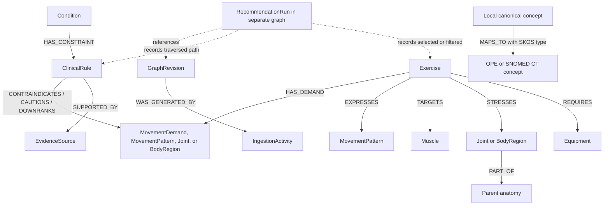
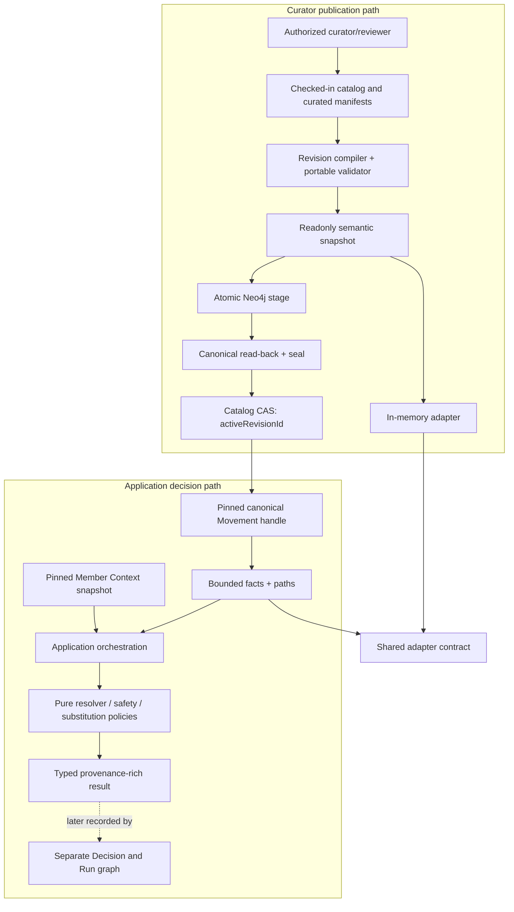

# Movement and Clinical Knowledge Graph - Plan

## Goal Capsule

- **Objective:** Define the authoritative target Movement and Clinical knowledge graph that replaces the repository's minimal in-memory model and supports deterministic safety, concept resolution, substitutions, and explanations.
- **Product authority:** This Product Contract governs Movement and Clinical graph meaning. [`ASSESSMENT.md`](../../ASSESSMENT.md) remains the source brief, and [`2026-08-05-001-feat-graph-backed-coach-dashboard-plan.md`](2026-08-05-001-feat-graph-backed-coach-dashboard-plan.md) remains authoritative for the wider product. Where this contract conflicts with the Movement graph portion of [`2026-08-05-004-feat-graph-backed-services-plan.md`](2026-08-05-004-feat-graph-backed-services-plan.md), this contract wins.
- **Execution profile:** Deep, code-backed plan executed in seven ordered units. Each unit uses a failing-test-first cycle and leaves an independently reviewable result.
- **Stop conditions:** Stop and return to planning if a required ontology artifact cannot be used under recorded license terms, a safety rule lacks its required clinical-review record, or implementation would require changing R1-R30, F1-F4, or AE1-AE8. Neo4j or an ontology source being temporarily unavailable is a handled failure, not permission to weaken safety.
- **Tail ownership:** A standalone executor owns implementation, focused and full verification, documentation, and cleanup of abandoned attempts. Commit, push, PR, and deployment remain outside this plan unless the invoking workflow explicitly owns them.
- **Open blockers:** None. The Planning Contract resolves the concrete ontology subset, clinical-policy evidence role, storage enforcement, revision lifecycle, and migration shape.

---

## Product Contract

### Summary

The product will use a member-agnostic Movement and Clinical knowledge graph with canonical exercise, anatomy, movement, equipment, condition, clinical-rule, ontology, and evidence concepts.
Safety will follow source-backed rule paths, while member-specific facts and recommendation history remain in separate graphs that reference stable domain identifiers.

### Problem Frame

The current repository proves basic graph ingestion and traversal, but it stores clinical risk as direct condition-to-exercise edges.
Those edges do not explain which movement or load made an exercise unsafe, and every new exercise would require copied clinical assertions.

The current ontology manifest contains five mappings, including a COPPER mapping, and uses ontology or browser root URLs rather than stable concept identifiers.
That is enough for a demonstration fixture but not enough for auditable ontology grounding.

The assessment requires the graph to perform real work.
It must support deterministic injury and equipment reasoning, preserve anatomy hierarchy, map free text to canonical concepts, find valid alternatives, and expose the path behind each decision.

### Key Decisions

- **Define the target replacement.** (session-settled: user-directed — chosen over documenting the current graph or adding only small gaps: the assessment needs a complete and defensible safety model.) Governs R1-R3.
- **Keep the domain graph member-agnostic.** (session-settled: user-directed — chosen over a shared personalization layer or one combined graph: reusable domain meaning must not change with one member's state.) Governs R2, R23-R24.
- **Represent clinical meaning with first-class rules.** (session-settled: user-directed — chosen over direct warning edges or reifying every assertion: rule paths explain the reason and let new exercises inherit safety behavior.) Governs R11-R16.
- **Ground the safety-critical subset.** (session-settled: user-directed — chosen over mapping every catalog term or mapping only the demo: false external mappings are worse than explicit local concepts.) Governs R17-R21.
- **Reserve COPPER for the Member Context graph.** (session-settled: user-directed — chosen over using COPPER in this graph: its goals, barriers, context, and coping plans are personalization concepts rather than safety authority.) Governs R21, R23.
- **Store recommendation provenance in a separate Decision and Run graph.** (session-settled: user-directed — chosen over storing traces in the Member or Movement graph: a run must reference both graphs without mixing their lifecycles.) Governs R24-R26.
- **Make mappings reviewable records.** (session-settled: user-approved — chosen over embedded labels and generic website links: each mapping needs a stable target, SKOS relation, confidence, rationale, and source release.) Governs R18-R20.

<!-- ce-section: work-relationships -->
### How This Work Fits Together

This plan owns the Movement and Clinical domain graph only.
The broader breakdown is current context, not a committed roadmap.

- **Member Context graph**
  - Depends on this graph for stable condition, anatomy, equipment, goal-adjacent movement, and exercise references.
  - Owns member injuries, laterality, recovery state, available equipment, goals, preferences, and COPPER-aligned behavior concepts.
- **Concept resolver**
  - Depends on this graph's canonical labels, aliases, ontology mappings, and stable identifiers.
- **Deterministic safety service**
  - Depends on this graph's anatomy hierarchy, clinical rules, movement demands, equipment requirements, and active revision.
- **Workout runtime and Decision and Run graph**
  - Depend on this graph for candidate exercises and rule paths.
  - Own member-specific decisions, generated workouts, overrides, and PROV-O recommendation traces.

### Actors

- A1. **Domain curator:** Reviews canonical terms, external mappings, aliases, and graph revision quality.
- A2. **Clinical-rule reviewer:** Approves the meaning, effect, scope, and evidence of each clinical rule without claiming clinical validation for the take-home.
- A3. **Resolver and safety services:** Read one active graph revision and return bounded canonical concepts, allowed candidates, exclusions, warnings, and alternatives.
- A4. **Decision recorder:** Stores member-specific recommendation provenance outside this graph while referencing its stable node, rule, and revision identifiers.

### Conceptual Model

The solid relationships are part of the Movement and Clinical graph.
The dotted relationships show the separate Decision and Run graph interface.

### Node Schema

R4 owns the target node vocabulary below.

| Node type | Meaning | Required identity or semantics |
|---|---|---|
| `Exercise` | One selectable catalog exercise or reviewed exercise variation. | Stable catalog identifier, canonical label, aliases, catalog revision, and non-member exercise attributes. |
| `Muscle` | A muscle or catalog muscle group that an exercise intentionally trains. | Canonical local identifier and normalized label; external grounding is required only when it enters the safety-critical subset. |
| `Joint` | A joint loaded or moved by an exercise, such as the knee joint. | Canonical local identifier; participates in anatomy hierarchy and clinical-rule paths. |
| `BodyRegion` | A broader anatomical region used for resolution and inherited safety reasoning, such as the lumbar region. | Canonical local identifier; may contain joints, muscles, or narrower regions through `PART_OF`. |
| `MovementPattern` | The catalog's functional movement classification, such as squat, hinge, carry, or vertical push. | Stable taxonomy identifier; describes exercise family and search intent, not clinical risk by itself. |
| `MovementDemand` | A reviewed movement or loading characteristic that can make a clinical rule applicable, such as deep loaded knee flexion or plyometric impact. | Stable local identifier, precise definition, allowed measurement or categorical scope, and reviewer evidence. |
| `Equipment` | A tool or environment required to perform an exercise as modeled. | Canonical local identifier, aliases, and equipment category; availability remains member-specific. |
| `Condition` | A member-agnostic injury, disorder, or clinical condition type. | Canonical local identifier and SNOMED CT mapping when used by an active clinical rule. |
| `ClinicalRule` | A source-backed rule connecting a condition to a contraindicated, cautionary, or down-ranked movement, demand, or anatomical load. | Stable rule identifier, effect, severity, applicability statement, override policy, evidence reference, reviewer, and revision. |
| `OntologyConcept` | One external OPE or SNOMED CT concept used to ground a local concept. | Ontology name, stable code and concept URI, preferred label, source release, and status. |
| `EvidenceSource` | A versioned source artifact supporting a clinical rule or graph build. | Stable source identifier, title, publisher or owner, version or access date, URI when available, and evidence role. |
| `GraphRevision` | One immutable, validated Movement and Clinical graph snapshot eligible for activation. | Revision identifier, creation time, validation result, source digests, and activation state. |
| `IngestionActivity` | The PROV-O-style activity that built a graph revision from catalog, ontology, mapping, and rule sources. | Activity identifier, software version, start and end time, inputs, and outcome. |

### Edge Schema

R5 owns the target edge vocabulary below.

| Edge type | Direction | Meaning | Safety semantics |
|---|---|---|---|
| `TARGETS` | `Exercise -> Muscle` | The exercise intentionally trains the muscle. | Ranking evidence only; it never proves safety. |
| `STRESSES` | `Exercise -> Joint or BodyRegion` | The exercise places modeled mechanical demand on the anatomy. | Load evidence only; it becomes restrictive only through a matching clinical rule. |
| `EXPRESSES` | `Exercise -> MovementPattern` | The exercise is an instance of the functional movement pattern. | Supports search, family exclusions, and substitution discovery. |
| `HAS_DEMAND` | `Exercise -> MovementDemand` | The exercise has the reviewed movement or loading characteristic. | Joins exercises to clinical rules without copied condition-to-exercise edges. |
| `REQUIRES` | `Exercise -> Equipment` | The equipment must be available for the exercise as modeled. | Missing required equipment creates a hard exclusion. |
| `PART_OF` | `Muscle, Joint, or BodyRegion -> Joint or BodyRegion` | The source is anatomically narrower than the target. | Child-to-parent direction is fixed; safety may traverse the inverse to include descendants. |
| `VARIANT_OF` | `Exercise -> Exercise` | The source is a narrower catalog variation of the target exercise. | Explicit family exclusions may include reviewed variants. |
| `SUBSTITUTION_CANDIDATE_FOR` | `Exercise -> Exercise` | The source may serve the same training intent as the target. | It is never a safety guarantee; every candidate must pass the active constraints again. |
| `HAS_CONSTRAINT` | `Condition -> ClinicalRule` | The rule may apply when the condition is present in member context. | The member's actual status, laterality, and recovery stage are evaluated outside this graph. |
| `CONTRAINDICATES` | `ClinicalRule -> MovementDemand, MovementPattern, Joint, or BodyRegion` | The rule identifies a target that must be excluded when the rule applies. | Hard exclusion unless the rule's explicit project override policy permits a coach override. |
| `CAUTIONS` | `ClinicalRule -> MovementDemand, MovementPattern, Joint, or BodyRegion` | The rule identifies a target that requires a visible warning or review. | Does not silently become a hard exclusion or a soft preference. |
| `DOWNRANKS` | `ClinicalRule -> MovementDemand, MovementPattern, Joint, or BodyRegion` | The rule identifies a permitted but less desirable target. | Changes ranking only and remains visible in the decision trace. |
| `MAPS_TO` | `Local canonical concept -> OntologyConcept` | The local concept aligns to an external concept using one SKOS mapping relation. | Carries match type, confidence, rationale, curator, review date, and source release; no safety rule is inferred from the mapping alone. |
| `SUPPORTED_BY` | `ClinicalRule -> EvidenceSource` | The source supports why the clinical rule exists. | SNOMED CT terminology membership alone is not clinical evidence. |
| `IN_REVISION` | `Local node or ClinicalRule -> GraphRevision` | The node or rule belongs to the immutable graph snapshot. | Services may not mix nodes or rules from different revisions in one decision. |
| `WAS_GENERATED_BY` | `GraphRevision -> IngestionActivity` | The revision was produced by the ingestion activity. | Mirrors the PROV-O generation relation for graph-build provenance. |
| `USED` | `IngestionActivity -> EvidenceSource` | The ingestion activity consumed the source artifact. | Supports rebuild and audit of the active graph revision. |

### Requirements

**Authority and lifecycle**

- R1. The target schema replaces the current direct condition-to-exercise model as the authoritative Movement and Clinical graph contract.
- R2. The graph contains only reusable domain concepts, static domain evidence, and graph-build provenance; it contains no member facts or member-specific recommendation results.
- R3. Every node, clinical rule, mapping, and active graph snapshot has a stable identifier and revision-aware lifecycle.
- R4. The graph exposes exactly the domain roles defined in the Node Schema, while planning may choose storage labels that preserve those roles.
- R5. The graph exposes the directed meanings defined in the Edge Schema, and no inverse meaning may be inferred without an explicit traversal rule.
- R6. A new graph revision becomes active only after schema, reference, mapping, hierarchy, rule, and provenance validation succeeds as one complete snapshot.

**Catalog and anatomy model**

- R7. All 50 provided exercises and the catalog's 19 muscle groups, 9 joints, 36 movement patterns, and 32 equipment types exist as stable local canonical concepts even when they do not have external mappings.
- R8. Exercise attributes that affect reasoning remain typed domain data and do not depend on labels, free-text parsing, or model inference at traversal time.
- R9. `PART_OF` forms an acyclic child-to-parent anatomy hierarchy that supports bounded descendant traversal for joint and region safety queries.
- R10. Exercise alternatives are discovered through reviewed pattern, target, variant, demand, and substitution relationships, then rechecked against every active hard constraint.

**Clinical safety semantics**

- R11. Every clinical safety decision follows `Condition -> ClinicalRule -> constrained target -> Exercise` or the equivalent anatomy-descendant path.
- R12. Direct `Condition -> Exercise` clinical edges are not authoritative in an active target revision.
- R13. `STRESSES` records mechanical load and cannot exclude an exercise unless a matching active clinical rule supplies the safety effect.
- R14. Each clinical rule declares one effect from hard contraindication, caution, or down-rank and cannot change effect through query interpretation.
- R15. Clinical rules remain laterality-neutral and member-agnostic; the safety service combines them with member-specific laterality, status, and recovery state.
- R16. An unresolved safety concept, missing required mapping, broken rule path, unavailable active revision, or empty safe candidate set produces a typed fail-closed result rather than a guessed safe answer.

**Ontology grounding**

- R17. OPE supplies external reference concepts for exercises, movements, muscles, and equipment where a reviewed match exists, but it is not a clinical safety authority.
- R18. SNOMED CT supplies stable anatomy and condition concepts for active safety paths, but terminology membership alone does not create a contraindication.
- R19. Each `MAPS_TO` relationship uses one of `skos:exactMatch`, `skos:closeMatch`, `skos:broadMatch`, or `skos:narrowMatch` according to reviewed semantic fit rather than string similarity alone.
- R20. Every condition and anatomy concept declared by the first-release safety-critical grounding manifest has a reviewed external mapping with a concept-specific identifier. Exercise, equipment, pattern, demand, substitution, and other catalog concepts may remain explicitly `local-only` when no exact OPE class has been verified; that status must remain visible on resolver and explanation paths rather than being hidden by an invented mapping.
- R21. COPPER concepts and full OPE or SNOMED CT ontology imports are excluded from this graph revision.
- R22. External ontology release, licensing, deprecation, and replacement information remains inspectable so a mapping can be re-reviewed without changing the local concept identifier.

**Graph boundaries and provenance**

- R23. The Member Context graph references canonical domain identifiers for injuries, anatomy, available equipment, and related facts without copying the domain taxonomy.
- R24. Each recommendation run is recorded outside this graph and references one member-context revision and one Movement and Clinical graph revision.
- R25. Each selection, exclusion, warning, down-rank, and substitution records the stable exercise, rule, mapping, evidence, path, and graph revision identifiers needed to explain the result.
- R26. PROV-O shapes graph-build activities and recommendation-run traces, while SKOS shapes cross-scheme mappings; neither vocabulary replaces the application's domain semantics.

**Documentation and quality**

- R27. The shipped schema documentation defines every node and edge type, direction, meaning, required properties, allowed endpoints, and safety consequence in plain language.
- R28. The shipped documentation includes one injury path, one anatomy-descendant path, one limited-equipment substitution path, and the boundary among the domain, member, and Decision and Run graphs.
- R29. Automated checks reject duplicate stable identifiers, dangling edges, invalid endpoint types, anatomy cycles, unsupported mapping relations, missing concept-specific ontology identifiers, and incomplete clinical-rule evidence.
- R30. All data and examples remain synthetic, and documentation states that the graph is a take-home safety model rather than clinically validated medical guidance.

### Key Flows

- F1. **Publish a graph revision**
  - **Trigger:** A1 prepares a new catalog, mapping, anatomy, or clinical-rule revision.
  - **Actors:** A1, A2.
  - **Steps:** The revision loads into an inactive snapshot; validators check schema, references, hierarchy, mappings, rules, and provenance; activation occurs only after the full snapshot passes.
  - **Outcome:** A3 can read one immutable active revision, or the prior valid revision remains active.
  - **Covers:** R3, R6, R17-R22, R29.
- F2. **Apply an injury constraint**
  - **Trigger:** A3 receives a member condition and anatomy reference from the Member Context graph.
  - **Actors:** A2, A3, A4.
  - **Steps:** A3 resolves the canonical condition and anatomy; traverses matching clinical rules; joins demand targets through inverse `HAS_DEMAND`, pattern targets through inverse `EXPRESSES`, and anatomy targets through inverse `STRESSES` plus bounded inverse `PART_OF`; then classifies candidates by the rule's fixed effect.
  - **Outcome:** A4 records a deterministic path for each excluded, cautioned, or down-ranked exercise.
  - **Covers:** R9, R11-R16, R23-R25.
- F3. **Find an equipment-valid substitute**
  - **Trigger:** An otherwise suitable exercise requires unavailable equipment or is explicitly excluded.
  - **Actors:** A3, A4.
  - **Steps:** A3 finds reviewed alternatives through pattern, target, variant, demand, and substitution relationships; rechecks every candidate against equipment and active clinical rules.
  - **Outcome:** A4 records a valid alternative or a typed no-alternative result without treating similarity as safety.
  - **Covers:** R7-R10, R16, R23-R25.
- F4. **Explain a recommendation decision**
  - **Trigger:** A coach or system surface requests why an exercise was selected or filtered.
  - **Actors:** A3, A4.
  - **Steps:** A4 reads the stored run trace; resolves stable references against the exact domain revision; returns the member fact, clinical rule, traversal path, evidence, mapping, and result.
  - **Outcome:** The explanation matches the deterministic decision and does not reconstruct a reason from model prose.
  - **Covers:** R24-R28.

### Acceptance Examples

- AE1. **Knee safety through a first-class rule**
  - **Covers R11-R16, R24-R25.**
  - **Given:** A member fact resolves to patellofemoral pain and the knee joint in the active domain revision.
  - **When:** The safety service evaluates an exercise with a reviewed deep loaded knee-flexion demand that a hard clinical rule contraindicates.
  - **Then:** The exercise is excluded through the rule path, and no direct condition-to-exercise edge is required.
- AE2. **Anatomy descendant traversal**
  - **Covers R9, R11, R18-R20.**
  - **Given:** A safety rule applies to the knee and a loaded structure is modeled as a descendant of the knee region.
  - **When:** The service evaluates an exercise that stresses the descendant.
  - **Then:** Bounded inverse traversal of `PART_OF` includes that structure and preserves the full path in the decision record.
- AE3. **Load is not automatically harm**
  - **Covers R13-R14.**
  - **Given:** An exercise `STRESSES` the knee but no applicable active clinical rule constrains its demand or anatomy.
  - **When:** The safety service evaluates the exercise.
  - **Then:** The stress edge alone does not exclude, caution, or down-rank it.
- AE4. **Limited-equipment substitution**
  - **Covers R10, R16, R23-R25.**
  - **Given:** The member has dumbbells and a kettlebell but no barbell.
  - **When:** A barbell-only exercise is considered.
  - **Then:** It is excluded by `REQUIRES`, and any proposed alternative must pass equipment and clinical rules before selection.
- AE5. **Required mapping is missing**
  - **Covers R6, R16, R20, R29.**
  - **Given:** A condition or anatomy concept participates in a required safety path but lacks a reviewed concept-specific external mapping.
  - **When:** A graph revision is validated.
  - **Then:** The revision cannot become active, while the prior valid revision remains available.
- AE6. **Non-critical local concept remains usable**
  - **Covers R7, R20.**
  - **Given:** A local muscle or movement concept does not participate in a required safety, substitution, resolver, or visible explanation path.
  - **When:** The graph revision is validated.
  - **Then:** The concept may remain explicitly unmapped without blocking activation.
- AE7. **Stable grounded mapping**
  - **Covers R17-R22.**
  - **Given:** A local knee concept maps to a reviewed SNOMED CT concept.
  - **When:** A reviewer inspects the mapping.
  - **Then:** The record exposes the stable code, concept URI, preferred label, release, SKOS match type, confidence, rationale, and review metadata rather than only a terminology browser root.
- AE8. **Graph boundary remains clean**
  - **Covers R2, R23-R26.**
  - **Given:** A recommendation uses a member's left-knee injury and available dumbbells.
  - **When:** The run is recorded.
  - **Then:** Member facts remain in the Member Context graph, stable domain concepts remain in this graph, and the Decision and Run graph references both revisions.

### Success Criteria

- The graph represents every provided catalog term as a stable local concept and activates no revision with schema or reference errors.
- Every required injury, equipment, substitution, resolver, and explanation scenario produces a bounded deterministic path with stable identifiers and source revisions.
- No active target revision depends on direct condition-to-exercise clinical edges or generic ontology root URLs.
- A reviewer can distinguish catalog facts, anatomy hierarchy, external terminology mappings, clinical rules, and member-specific decisions without reading implementation code.
- The documented injury and limited-equipment examples produce the same decision and explanation on repeated runs against the same graph and member revisions.

### Scope Boundaries

**Included**

- The canonical local domain vocabulary for the complete provided exercise taxonomy.
- The reviewed movement-demand vocabulary needed for deterministic clinical rules.
- Safety-critical SNOMED CT mappings, plus OPE mappings only where a reviewed class IRI is verified, expressed through SKOS.
- Static clinical-rule evidence, graph revision provenance, and the interface required by separate recommendation traces.
- Target schema documentation and deterministic validation behavior.

**Excluded**

- Member profiles, injury instances, laterality, recovery observations, goals, preferences, equipment availability, and longitudinal history.
- COPPER concepts, which belong in the Member Context graph when behavior-change planning enters scope.
- Full OWL ingestion, unrestricted ontology browsing, or mirroring complete OPE or SNOMED CT releases.
- Clinical validation, diagnosis, treatment advice, or claims that the synthetic rules are medical guidance.
- Member-specific recommendation, override, approval, and publication records, which belong in the Decision and Run graph or surrounding product lifecycle.

### Dependencies and Assumptions

- The provided exercise catalog remains the authority for the local 50-exercise taxonomy, while ontology sources provide grounding rather than replacing catalog identity.
- OPE is treated as an alpha external reference whose concepts require local review before use.
- SNOMED CT concepts are accessed through the NCI EVS path named in the assessment, and planning must preserve the source release and applicable licensing terms.
- Clinical rules are curated project policy for synthetic scenarios and require an explicit evidence role; terminology mappings do not manufacture clinical evidence.
- The existing wider product decisions for fail-closed safety, typed service boundaries, coach-visible warnings, and deterministic post-generation validation remain in force.

### Outstanding Questions

**Deferred to Planning**

Resolved by KTD3-KTD10 and the first-release grounding manifest below; these questions remain here as traceability to the brainstorm.

- Which exact OPE and SNOMED CT identifiers form the first safety-critical subset after source verification?
- Which reviewed `MovementDemand` concepts are sufficient for the knee, lumbar, shoulder, equipment, and substitution paths required by the catalog?
- How will the selected graph store enforce endpoint types, immutable revisions, bounded traversals, and idempotent activation while preserving this contract?

### Sources and Research

- [`ASSESSMENT.md`](../../ASSESSMENT.md) defines the required graph roles, catalog coverage, ontology sources, traversal-based safety, and provenance behavior.
- [`src/domain/contracts/movement-graph.ts`](../../src/domain/contracts/movement-graph.ts) defines the current seven node kinds and eight edge kinds that this target replaces.
- [`src/graph/ingest/exercises.ts`](../../src/graph/ingest/exercises.ts) shows the current direct condition-to-exercise clinical edges and minimal anatomy subset.
- [`data/movement-ontology-mappings.json`](../../data/movement-ontology-mappings.json) contains the current five generic-root mapping fixtures, including the COPPER record this contract removes from the domain graph.
- [`tests/unit/movement-graph.test.ts`](../../tests/unit/movement-graph.test.ts) and [`tests/unit/concept-resolver.test.ts`](../../tests/unit/concept-resolver.test.ts) show the current deterministic proof surface that later planning must preserve and deepen.
- [Ontology of Physical Exercises](https://bioportal.bioontology.org/ontologies/OPE) describes exercises through functional movements, musculoskeletal structures, equipment, outcomes, and ailments; the published entry marks it as alpha.
- [COPPER Ontology](https://bioportal.bioontology.org/ontologies/COPPER) describes personalized activity context, barriers, and coping plans and supports its placement in the Member Context graph.
- [NCI Enterprise Vocabulary Services](https://evs.nci.nih.gov/tools) provides the SNOMED CT terminology browser and REST path named by the assessment.
- [SKOS Reference](https://www.w3.org/TR/skos-reference/) defines the exact, close, broad, and narrow cross-scheme mapping relations used by `MAPS_TO`.
- [PROV-O](https://www.w3.org/TR/prov-o/) defines the Entity, Activity, Agent, generation, usage, and derivation vocabulary used for graph-build and recommendation provenance.

---

## Planning Contract

Product Contract preserved: the decisions below operationalize the settled member-agnostic graph, first-class clinical rules, safety-critical grounding subset, COPPER boundary, separate Decision and Run provenance, and reviewable mappings. R20 is narrowed only to encode the confirmed rule that unverified OPE concepts stay explicitly local instead of receiving invented mappings; all other R/F/AE meaning is unchanged.

### Key Technical Decisions

- KTD1. **Cut over atomically to the target contract.** Migrate the graph contract, resolver contract, ingestion, repository, and tests together because the current Movement graph has no live UI or application-runtime consumer. Do not keep a permanent compatibility model. A checked-in legacy-ID map supports the bounded cutover, after which the old `anatomy`, `contraindicated-for`, `equivalent-to`, and `follows` vocabulary is removed. Governs R1, R4-R5, R12, R21, R29; F1; AE8.
- KTD2. **Separate stable identity from revision assertions.** Replace the generic mutable `MovementNode.metadata` bag with readonly discriminated node types for all 13 Product Contract roles. Each local concept keeps one stable string ID, while every node and edge assertion carries its own stable assertion ID, source, and graph revision. Neo4j-generated IDs are never domain identifiers. Governs R3-R5, R7-R9, R22, R25, R29.
- KTD3. **Compile once; keep adapters semantically thin.** One revision-aware compiler and validator consumes the checked-in manifests and produces a deeply readonly snapshot. The in-memory and Neo4j adapters retrieve the same bounded canonical facts, paths, failures, and ordering through one shared async read-port contract; they do not independently implement clinical applicability, effect precedence, or substitution ranking. Those semantics live once in pure domain policies. The in-memory adapter is a deterministic development/test twin, not a second source of truth. Governs R3, R6-R10, R29; F1-F3.
- KTD4. **Keep revisions immutable and publication state separate.** A content-derived `GraphRevision` never changes. Infrastructure-only `PublicationAttempt` records own staging, validation, rejection, and abandonment; a persisted revision becomes activation-eligible only after a seal records canonical read-back digest and cardinalities matching the compiler output. A uniqueness-constrained singleton graph catalog stores one scalar `activeRevisionId`; activation locks that record and compare-and-swaps against the expected prior revision. Rollback is the same operation toward an already sealed revision and records a new append-only activation event. The Product Contract's activation state is a projection of the catalog/history, not mutable snapshot data. Governs R3, R6, R22; F1; AE5.
- KTD5. **Pin every read to one revision and authority.** Opening the active graph returns an async logical capability carrying `graphRevisionId` and `authority: canonical | fixture`; it is not a long-lived database session. Every query opens its own managed session and binds the captured revision. A newly activated revision affects only later requests. Historical explanations explicitly open their recorded revision. Fixture authority supports visibly non-authoritative browsing only and is rejected for safety-sensitive or reviewable results. Governs R6, R16, R24-R25; F2-F4.
- KTD6. **Make strictness portable across Neo4j editions.** Use Neo4j Community `2026.06` and JavaScript driver `6.x` as the local canonical store. Composite uniqueness/key constraints, existence/type constraints where supported, and static parameterized Cypher enforce the database-safe subset. The compiler and post-write validator always enforce the complete node/edge endpoint matrix, acyclic anatomy, revision membership, cardinality, and allowlists; Enterprise graph types may strengthen this later but are not required for safety. Governs R4-R6, R9, R29; F1.
- KTD7. **Check in the first grounding slice; never look up ontology concepts at request time.** The first release pins NCI EVS `SNOMEDCT_US 2025_09_01` for the condition/anatomy mapping candidates listed below; all eight must be terminology-approved before activation. Specific OPE exercise, equipment, pattern, and demand concepts remain explicitly `local-only` until a curator verifies a real class IRI; no label-derived OPE IRIs or broad root substitutions are allowed. Ontology outages can block a new curation build but cannot change runtime safety on an active revision. Governs R17-R22, R29-R30; F1; AE5-AE7.
- KTD8. **Represent clinical applicability as data, not prose.** Each `ClinicalRule` has one fixed effect, a typed predicate over supported member inputs, a typed override policy, and one or more evidence records. Supported predicate fields are condition status, recovery stage, severity band, and laterality policy; explanatory prose cannot make a rule executable. Missing required input returns a typed fail-closed result. Project-policy evidence is permitted for these synthetic take-home rules but must be labeled as such and must not claim clinical validation. Governs R11-R16, R18, R30; F2; AE1-AE3.
- KTD9. **Use one explicit traversal and precedence model.** Demand rules traverse inverse `HAS_DEMAND`; pattern rules traverse inverse `EXPRESSES`; anatomy rules traverse inverse `STRESSES` over the target plus bounded descendants reached through inverse `PART_OF`. Only rules attached to resolved member conditions apply. When paths disagree, `CONTRAINDICATES` outranks `CAUTIONS`, which outranks `DOWNRANKS`; every contributing path remains inspectable. If laterality cannot prove the loaded side avoids the affected side, use the conservative applicable result. Governs R9-R16, R25; F2; AE1-AE3.
- KTD10. **Make substitutions reviewed seeds, not inferred equivalence.** Explicit `SUBSTITUTION_CANDIDATE_FOR` edges define the authoritative candidate set and record preserved intent, curator, and source. Pattern, target, variant, and demand overlap may rank that set but cannot create a substitution edge. Every candidate is re-evaluated against equipment, explicit exclusions, and all applicable clinical rules; stable ID is the final tie-breaker. Governs R10, R16, R25; F3; AE4.
- KTD11. **Separate read authority from graph administration.** Runtime services receive bounded, revision-pinned read methods. They cannot submit Cypher, choose arbitrary current revisions, activate graphs, approve mappings, or record overrides. A separate publisher port stages, validates, activates, and inspects revisions; activation of changed clinical rules requires a recorded clinical-review approval. Governs R2-R3, R6, R15-R16, R23-R26; F1-F4.
- KTD12. **Preserve assertion-level provenance without cross-graph coupling.** Node and edge assertions record source and revision. `GraphRevision` corresponds to a PROV Entity/Bundle, `IngestionActivity` to a PROV Activity, source manifests to PROV Entities, and later revisions may record `wasRevisionOf`. Member Context stores stable domain concept IDs rather than direct relationships to revision-scoped nodes. Decision and Run records store both revision IDs plus the exact node, edge, rule, mapping, and evidence assertion IDs used; the Movement graph never reads or writes member/run data. Governs R3, R22-R28; F1, F4; AE7-AE8.

### High-Level Technical Design

The compiler is the semantic gate. It expands catalog records and curated manifests into typed nodes and assertions, validates the complete graph, and freezes the result. The SHA-256 revision ID is derived from the schema/compiler version plus an ordered set of effective source-artifact digests. It excludes the revision ID itself, revision-derived assertion IDs, build times, activation state, and publication-attempt IDs; assertion IDs are derived only after the revision ID. Persistence adapters may optimize storage, but they may not reinterpret graph meaning.

The read port is use-case-shaped rather than a generic traversal surface. It exposes canonical resolution candidates, bounded anatomy paths, clinical-rule facts/paths, reviewed substitution facts, and assertion lookup for explanations. Every async result carries `graphRevisionId`, authority, and deterministic ordering. Application orchestration combines a pinned Member Context snapshot with this handle, then passes typed data into pure policies. The publisher port is the only path to staging and activation.

### Contract and Storage Shape

| Concern | Domain/compiler enforcement | Neo4j enforcement | Required proof |
|---|---|---|---|
| Stable identity | Non-empty namespaced string IDs; reviewed concept registry; no label-derived identity | Composite key/uniqueness on revision, kind, and stable ID; assertion ID uniqueness within revision | Rename does not change identity; duplicate IDs fail |
| Endpoint types | Complete allowlisted matrix for all 17 edge types | Bound-endpoint writes plus post-write validation; optional Enterprise graph type only as defense in depth | Every invalid source/target pair fails before activation |
| Revision isolation | Every node and edge assertion belongs to exactly one revision | Every query binds `graphRevisionId`; no cross-revision relationship creation | Mixed-revision fixture fails; reads never mix versions |
| Anatomy hierarchy | Child-to-parent `PART_OF`, acyclic, bounded depth/result limits | Static bounded traversal over the pinned revision | Cycles, cap overflow, and wrong direction fail closed |
| Clinical rules | One typed effect, typed applicability, evidence, review, and target | Required properties plus allowlisted target writes | Missing evidence/input and effect-edge mismatch fail |
| Mappings | Allowed SKOS relation, concept code/IRI/release, review metadata, explicit status | Mapping assertion uniqueness and required properties | Generic roots, dangling targets, inactive concepts, and unsupported relations fail |
| Activation | Content-derived immutable revision; validated state required | Singleton active pointer changed in one managed transaction with expected-prior check | Retry, race, interruption, and failed validation preserve one active revision |

### First-Release Curated Data Slice

The complete 50-exercise catalog and its 19 muscle groups, 9 joints, 36 movement patterns, and 32 equipment types remain local canonical concepts. The initial reviewed `MovementDemand` vocabulary is deliberately small:

| Stable ID | Meaning | Required acceptance path |
|---|---|---|
| `movement-demand:deep-loaded-knee-flexion` | Loaded knee flexion beyond the curated depth band | Patellofemoral/knee hard-rule example |
| `movement-demand:plyometric-impact-landing` | Repeated impact or landing demand | Knee caution/down-rank and stress-without-rule contrast |
| `movement-demand:loaded-overhead-shoulder-elevation` | Loaded overhead shoulder elevation or pressing | Synthetic Avery shoulder example |
| `movement-demand:loaded-lumbar-flexion` | Lumbar flexion under external load | Low-back rule example |
| `movement-demand:axial-spinal-loading` | External load transmitted along the spine | Lumbar substitution/ranking example |

The proposed checked-in SNOMED subset uses concept IDs as strings and stores the NCI EVS observed release `2025_09_01`, stable `http://snomed.info/id/{code}` URI, NCI detail URL, active status, review date, reviewer, confidence, rationale, and source-artifact digest. The rows are pinned candidates until the U2 terminology review approves each mapping; only then may the manifest and Definition of Done call them verified.

| Local concept | SNOMED CT concept | Preferred label | SKOS relation |
|---|---:|---|---|
| `condition:shoulder-pain` | `45326000` | Pain of shoulder region | `closeMatch` |
| `condition:knee-pain` | `1003722009` | Pain of knee region | `closeMatch` |
| `condition:patellofemoral-pain-syndrome` | `430725003` | Patellofemoral stress syndrome | `closeMatch` pending clinical terminology review |
| `condition:low-back-pain` | `279039007` | Low back pain | `exactMatch` when the local definition remains nonspecific |
| `joint:shoulder` | `31398001` | Joint structure of shoulder region | `closeMatch` |
| `joint:knee` | `49076000` | Knee joint structure | `exactMatch` |
| `joint:patellofemoral` | `129160003` | Structure of patellofemoral joint | `exactMatch` |
| `body-region:lumbar-back` | `52612000` | Structure of lumbar region of back | `exactMatch` with the same local scope |

OPE `0.0.1` remains a declared reference source, but only the verified ontology and class records are stored. The specific barbell, dumbbell, kettlebell, squat, hinge, overhead-press, and movement-demand concepts are `local-only` in the first release because exact OPE class IRIs were not verifiable without guessing. This is an intentional fulfillment of the safety-critical-subset decision: weak mappings do not satisfy coverage.

### Failure and Recovery Semantics

- For this bounded first release, one managed transaction writes the complete revision payload. Failure before commit leaves no revision data; failure after commit but before sealing leaves a complete inactive stage that no reader or activation query can select. Publication state belongs to append-only operational records, not `GraphRevision`.
- Sealing canonically reads the stored payload back and verifies its digest, cardinalities, endpoint/reference checks, and source/license evidence against the compiler output. Staging an existing revision ID is an exact-match no-op or an `immutable_payload_conflict`; it never overwrites immutable properties.
- First activation compare-and-swaps from `null`. Concurrent different-target activation yields one success and one `stale_revision`; same-target retries after an ambiguous commit return `already_active`. Managed callbacks create no timestamps, random IDs, files, logs, or network effects.
- A request captures its revision before concept resolution. Activation during the request does not change its resolver, rule, substitution, or explanation reads.
- Missing active revision, broken assertion, traversal timeout/cap, anatomy cycle, missing required mapping, incomplete rule applicability, or empty safe candidate set produces a typed fail-closed result.
- Production never automatically falls back to fixtures. An explicitly configured fixture-only handle may support visibly read-only catalog/resolver browsing, but safety evaluation, substitution approval, recommendation reviewability, and publication return `graph_unavailable` or another typed fail-closed result.
- OPE or NCI EVS loss leaves the active graph unchanged. A new build cannot silently reuse a stale or replaced mapping without review.
- Active, validated inactive, historical, rejected, and abandoned revisions/stages are not destructively pruned by this plan. Safe deletion is deferred until a separate design can prove Decision and Run references, read leases, backup, and restore.

### Sequencing and Migration

1. Define the target readonly contracts, stable-ID rules, and bounded read/publisher ports.
2. Check in the local concept registry, grounding manifest, demands, rules, evidence, substitutions, and legacy-ID map.
3. Build the compiler/validator and in-memory adapter; prove the graph semantics without a database.
4. Add Neo4j infrastructure, schema, persistence, revision activation, and shared adapter tests.
5. Move concept resolution and rule/substitution reads to the revision-bound port.
6. Seed and activate the validated target graph; remove old direct clinical/equivalence generation and the import-time default graph.
7. Document the schema, ontology choices, operating commands, and end-to-end example paths.

### System-Wide Impact

- **Application ports:** `GraphRepositories.movement` becomes a revision-bound read provider; graph administration is a separate dependency and is never exposed through agent tools.
- **Resolver:** The public `anatomy` query filter remains as a compatibility input category but searches `Joint` and `BodyRegion`; `anatomy` is no longer a stored node kind. Resolver searches exclude rules, revisions, activities, evidence, and external concepts.
- **Safety and agents:** The graph returns typed paths and classifications. Agents may compose from an already allowed set but cannot execute Cypher, activate a graph, approve a mapping/rule, or grant an override.
- **Decision and Run graph:** This plan defines only the stable reference contract. It does not implement member-specific decision storage.
- **Catalog migration:** All 18 non-null `bilateral_pair_id` values reference exercises absent from this extract. Preserve those values as typed external catalog references; create `VARIANT_OF` assertions only when both endpoints exist and a curator approves the relation.
- **Operations:** The repository gains a local Neo4j service, idempotent seed command, dedicated integration-test configuration, and active-revision inspection. No browser workflow changes in this plan.

### Risks and Dependencies

- **Ontology licensing and staleness:** OPE exposes no clear license metadata and is an alpha 2013 ontology. NCI EVS currently reports `SNOMEDCT_US 2025_09_01`, while NLM lists a newer US distribution. Mitigation: commit only reviewed mapping metadata, record the governing source artifact and terms, hash it, and block new activation when the declared release or license cannot be verified.
- **Synthetic clinical meaning:** The starter rules demonstrate deterministic graph behavior but are not medical guidance. Mitigation: require evidence role, clinical-review record, visible disclaimer, and prohibit claims of validation.
- **Neo4j edition differences:** Community cannot enforce all endpoint semantics in the store. Mitigation: make compiler and post-write validation release gates and use shared adapter contract tests.
- **Partial or divergent persistence:** Retry or concurrent publication could otherwise create a half-written or silently overwritten revision. Mitigation: write the bounded snapshot atomically, treat matching immutable payload as a no-op, reject divergent payload under the same key, seal only after canonical read-back matches source digest and cardinalities, and leave the active pointer unchanged on every conflict.
- **Active-pointer loss or ambiguity:** Concurrent activation, response loss after commit, or a mutable per-revision `active` flag could produce multiple apparent actives. Mitigation: keep one uniqueness-constrained catalog scalar, lock it during CAS, define `already_active` retry behavior, and record append-only activation events.
- **Traversal growth:** Anatomy and substitution cycles can create expensive reads. Mitigation: reject anatomy cycles and self substitutions, cap traversal depth/result size, bind one revision, and return a typed cap failure.
- **Historical retention:** Revision deletion can break explanations, and the separate Decision and Run store is not implemented here. Mitigation: do not implement pruning in this plan; inspection distinguishes retained sealed revisions from rejected/abandoned stages.
- **Authority confusion in degraded mode:** Silent fixture fallback could appear to authorize a safety result. Mitigation: put authority on the read handle, prohibit automatic fallback, and verify that fixture authority cannot produce a reviewable safety/substitution/publication outcome.

### Research That Shapes Implementation

- [Neo4j managed transactions](https://neo4j.com/docs/javascript-manual/current/transactions/) establish `executeRead`/`executeWrite`, retry behavior, and the need for idempotent callbacks.
- [Neo4j constraints](https://neo4j.com/docs/cypher-manual/current/schema/constraints/) cover keys, uniqueness, existence, and type checks; [graph types](https://neo4j.com/docs/cypher-manual/current/schema/graph-types/) are an optional Enterprise-only endpoint guard, not a portable safety dependency.
- [Neo4j `MERGE`](https://neo4j.com/docs/cypher-manual/current/clauses/merge/) does not replace uniqueness constraints under concurrency.
- [NCI EVS REST API](https://api-evsrest.nci.nih.gov/swagger-ui/index.html) supplies the concept-specific SNOMED CT records named by the assessment; mappings pin its returned terminology version.
- [SNOMED CT URI Standard](https://docs.snomed.org/snomed-ct-specifications/snomed-ct-uri-standard/2-snomed-ct-uri-space) defines stable code-system, edition, version, and concept URI forms; SCTIDs remain strings.
- [SNOMED CT licensing guidance](https://docs.snomed.org/snomed-ct-practical-guides/vendor-introduction-to-snomed-ct/7-licensing) requires the implementation to record applicable terms rather than assuming redistribution rights.
- [OPE in BioPortal](https://bioportal.bioontology.org/ontologies/OPE) is version `0.0.1`, alpha, and lacks definitions for its 634 classes; therefore it is a curator input rather than a safety authority.
- [SKOS Reference](https://www.w3.org/TR/skos-reference/) makes `exactMatch` stronger than `closeMatch` and intentionally non-equivalent to `owl:sameAs`; mapping chains never create clinical rules.
- [PROV-O](https://www.w3.org/TR/prov-o/) and [PROV Links](https://www.w3.org/TR/prov-links/) shape immutable revision, generation, usage, and revision provenance.

---

## Implementation Units

### U1. Replace the domain and port contracts

- **Goal:** Define the immutable target vocabulary, assertion model, revision handles, and least-privilege access seams before changing ingestion.
- **Requirements:** R1-R5, R8, R14-R16, R23-R26; KTD1-KTD2, KTD5, KTD11-KTD12.
- **Dependencies:** None.
- **Files:** Modify `src/domain/contracts/movement-graph.ts`, `src/domain/contracts/ontology.ts`, `src/domain/contracts/concept-resolution.ts`, and `src/application/ports/graph-repositories.ts`. Add `src/domain/contracts/movement-clinical-queries.ts`, `src/domain/contracts/movement-graph-publication.ts`, and `tests/unit/movement-graph-contract.test.ts`.
- **Interfaces:** Produce readonly discriminated node/assertion unions; `MovementGraphReadHandle` carrying `graphRevisionId`; `MovementGraphReadProvider.openActive()` / `openRevision(revisionId)`; and separate `MovementGraphPublisher.stage()`, `validate()`, `activate(expectedPriorRevisionId)`, and `inspect()` operations. Preserve resolver input category `anatomy` as a filter over `joint | body-region`.
- **Approach:**
  - [ ] Write contract tests that enumerate all 13 node roles and 17 edge meanings, reject mutable/generic metadata, and ensure resolvable kinds exclude provenance and external-concept roles.
  - [ ] Run `pnpm exec vitest run tests/unit/movement-graph-contract.test.ts` and confirm the new contract tests fail against the old generic model.
  - [ ] Implement the readonly contracts, stable assertion identity, typed result/failure unions, revision-bound read provider, and separate publisher port.
  - [ ] Update compile-time resolver and aggregate-port references without retaining aliases for removed stored kinds or edges.
  - [ ] Re-run the focused contract test and `pnpm typecheck`; both must pass before U2.
- **Test Scenarios:** Stable IDs remain strings; an `anatomy` mention can target joint/body-region candidates; a resolver cannot return a rule/evidence/revision node; callers cannot obtain a mutable snapshot or graph-admin method from the read port.
- **Verification:** `pnpm exec vitest run tests/unit/movement-graph-contract.test.ts && pnpm typecheck`.

### U2. Curate the local vocabulary, safety slice, and ontology grounding

- **Goal:** Replace label-derived identity and generic ontology roots with reviewed, versioned manifests covering the full local catalog and the first deterministic safety paths.
- **Requirements:** R7-R10, R17-R22, R27-R30; KTD7-KTD8, KTD10, KTD12.
- **Dependencies:** U1.
- **Files:** Add `data/movement-concepts.json`, `data/movement-anatomy.json`, `data/movement-demands.json`, `data/clinical-rules.json`, `data/clinical-evidence.json`, `data/movement-substitutions.json`, and `data/movement-legacy-ids.json`. Replace `data/movement-ontology-mappings.json`. Add `tests/unit/movement-curation.test.ts`.
- **Interfaces:** Each manifest record has a stable ID, schema version, source/review fields, and explicit mapping status. Mapping records carry local ID, external ontology/code/IRI/preferred label/release/status, SKOS relation, confidence, rationale, curator, review date, and artifact digest. Rule records carry effect, typed applicability, typed override policy, target assertion, evidence IDs, and clinical-review approval.
- **Approach:**
  - [ ] Write manifest tests for exact catalog cardinalities, unique stable IDs, aliases, non-dangling references, the five MovementDemand records, rule evidence, reviewed substitutions, and the eight verified SNOMED mappings.
  - [ ] Run `pnpm exec vitest run tests/unit/movement-curation.test.ts` and confirm it fails because the reviewed manifests do not yet exist.
  - [ ] Check in the local concept registry and preserve every catalog field, including `side`, `bilateral_pair_id`, `is_reps`, `is_duration`, and `estimated_rep_duration`.
  - [ ] Add anatomy, demand assignments, synthetic clinical rules/evidence, and reviewed substitution records sufficient for AE1-AE4; ensure at least one exercise stresses the patellofemoral descendant and at least one unsafe top substitute is rejected by another rule.
  - [ ] Replace generic ontology fixtures with the verified SNOMED subset, mark specific OPE concepts `local-only`, remove COPPER, and add the source-release/license-review record.
  - [ ] Add the bounded legacy-ID map and explicitly preserve unresolved external bilateral-pair references without emitting graph edges.
  - [ ] Re-run the focused test and inspect the fixture diff for real identifiers, synthetic-only content, and no generic ontology/browser root mappings.
- **Test Scenarios:** All 50/19/9/36/32 catalog roles resolve to stable local IDs; all SNOMED codes are strings; required clinical concepts have concept-specific mappings; unverified OPE concepts are explicitly local-only; COPPER is absent; every rule has evidence and review; no substitution self-edge or unreviewed cycle exists.
- **Verification:** `pnpm exec vitest run tests/unit/movement-curation.test.ts`.

### U3. Build the revision compiler, strict validator, and in-memory adapter

- **Goal:** Turn the manifests into one deterministic immutable snapshot and prove the target semantics without requiring Neo4j.
- **Requirements:** R3-R16, R22, R29; F1-F3; AE1-AE6; KTD2-KTD5, KTD8-KTD10, KTD12.
- **Dependencies:** U1-U2.
- **Files:** Add `src/graph/ingest/movement-clinical.ts`, `src/graph/validation/movement-graph.ts`, `src/graph/revisions/movement-graph.ts`, `src/graph/schema/movement-schema.ts`, `tests/unit/movement-graph-validation.test.ts`, and `tests/unit/movement-graph-repository-contract.test.ts`. Modify `src/graph/ingest/exercises.ts`, `src/graph/repositories/movement-graph.ts`, and `tests/unit/movement-graph.test.ts`.
- **Interfaces:** Produce `compileMovementGraph(sources)` returning a readonly snapshot or typed validation report; a shared adapter contract; and bounded async read methods for concept candidates, anatomy paths, clinical-rule facts/paths, reviewed substitution facts, and assertion lookup. Every method returns deterministic stable ordering plus `graphRevisionId` and authority; policy outcomes are outside the adapter contract.
- **Approach:**
  - [ ] Write failing validator tests for duplicate IDs, dangling assertions, invalid endpoints, direct condition-to-exercise edges, unsupported SKOS relations, missing mapping fields, rule/effect mismatch, missing evidence/review, anatomy cycles, cross-revision assertions, and traversal caps.
  - [ ] Write the shared repository contract for revision pinning, fact/path preservation, typed adapter errors, authority, traversal bounds, and stable ordering.
  - [ ] Run the two focused test files and confirm failures against the current builder/repository.
  - [ ] Implement canonical source normalization, non-circular SHA-256 revision derivation from schema/compiler version plus ordered source digests, deterministic assertion-ID derivation, the full endpoint matrix, complete validation, and deep freezing.
  - [ ] Replace the old builder with manifest-driven compilation; remove direct contraindication and shared-label equivalence generation.
  - [ ] Rebuild the in-memory indexes for both edge directions and implement bounded, revision-pinned path methods plus typed fail-closed outcomes.
  - [ ] Remove the import-time `defaultMovementGraph`; require a composition root to open an active or explicit revision.
  - [ ] Run focused compiler/repository tests, the migrated Movement tests, and `pnpm typecheck`.
- **Test Scenarios:** Invalid snapshots cannot be constructed; identical inputs compiled at different times or retry attempts yield the same revision ID and ordering; a failed build cannot replace an existing handle; knee-descendant traversal records the full fact path; fixture and canonical adapters expose the same facts but different authority; returned snapshots cannot be mutated. Rule precedence and substitution outcomes are proven once in U5's pure-policy tests.
- **Verification:** `pnpm exec vitest run tests/unit/movement-graph-validation.test.ts tests/unit/movement-graph-repository-contract.test.ts tests/unit/movement-graph.test.ts && pnpm typecheck`.

### U4. Add Neo4j persistence and atomic revision activation

- **Goal:** Persist the validated graph as immutable revision-scoped data and expose the same read behavior as the in-memory adapter.
- **Requirements:** R3-R6, R9-R16, R22, R29; F1-F3; AE1-AE7; KTD3-KTD6, KTD9, KTD11-KTD12.
- **Dependencies:** U3.
- **Files:** Modify `package.json`, `pnpm-lock.yaml`, and `vitest.config.mts`. Add `compose.yaml`, `vitest.integration.config.mts`, `src/graph/neo4j/client.ts`, `src/graph/neo4j/movement-schema.ts`, `src/graph/cypher/movement.ts`, `src/graph/repositories/neo4j-movement-graph.ts`, `src/graph/publication/neo4j-movement-publisher.ts`, `tests/integration/movement-graph.neo4j.test.ts`, and `tests/integration/movement-graph-activation.neo4j.test.ts`.
- **Interfaces:** Add the Neo4j adapter factories for `MovementGraphReadProvider` and `MovementGraphPublisher`, plus infrastructure-only publication-attempt, revision-seal, and activation-event records. Cypher modules export only static query constants/functions with parameter values; callers cannot provide labels, relationship types, or query fragments.
- **Approach:**
  - [ ] Add the Neo4j 6.x driver, pinned local Community service, integration-test script, and environment validation; keep credentials in environment variables and synthetic local defaults only.
  - [ ] Write failing real-Neo4j tests for shared adapter behavior, constraints, atomic whole-snapshot staging, canonical read-back/sealing, immutable-payload conflict, first activation, concurrent activation, expected-prior conflicts, retry after ambiguous commit, interrupted/invalid stage recovery, restart durability, and historical reads.
  - [ ] Run `pnpm exec vitest run --config vitest.integration.config.mts` against the local service and confirm failures before the adapter exists.
  - [ ] Create composite constraints/indexes and implement one managed transaction that writes the bounded first-release snapshot with already-bound endpoints and stable IDs; a future need for batching must return to planning rather than weakening atomicity.
  - [ ] Implement canonical read-back, digest/cardinality comparison, immutable seal, and exact-match/no-op versus divergent-payload conflict behavior.
  - [ ] Implement the small catalog-locking `executeWrite()` compare-and-swap for `activeRevisionId`, including `null` first activation, `already_active`, stale conflict, rollback event, and retry-safe idempotency; keep external I/O and nondeterministic values outside callbacks.
  - [ ] Implement bounded static async reads that open/close managed sessions per operation and normalize values into the domain contract without leaking driver types.
  - [ ] Run the shared contract against both adapters, activation/recovery tests, and `pnpm typecheck`.
- **Test Scenarios:** Failure during node/assertion writes leaves no partial revision; failure after commit leaves a complete inactive unsealed stage; tampered read-back cannot seal; concurrent same-revision publication yields one exact payload; changed payload under the same identity fails; two different activation targets from A produce one success and one stale conflict; same-target retry after ambiguous commit returns `already_active`; A-to-B-to-A rollback preserves A byte-for-byte; restart preserves catalog pointer, seals, and historical reads; no query crosses revisions or accepts model-authored Cypher structure.
- **Verification:** `pnpm exec vitest run --config vitest.integration.config.mts && pnpm typecheck`.

### U5. Move resolver, safety-path, and substitution reads onto the pinned contract

- **Goal:** Make current and near-term graph consumers use bounded target semantics rather than generic snapshots or removed edge kinds.
- **Requirements:** R8-R16, R20, R23-R25; F2-F4; AE1-AE8; KTD5, KTD8-KTD11.
- **Dependencies:** U3. U5 can proceed against the in-memory adapter while U4 builds Neo4j; U6 joins both completed tracks.
- **Files:** Modify `src/domain/policies/concept-resolution.ts`, `src/application/ports/graph-repositories.ts`, `tests/unit/concept-resolver.test.ts`, and `tests/unit/movement-graph.test.ts`. Add `src/domain/contracts/movement-safety.ts`, `src/domain/policies/movement-safety.ts`, `src/domain/policies/movement-substitution.ts`, `src/application/use-cases/resolve-movement-concepts.ts`, `src/application/use-cases/evaluate-movement-safety.ts`, `src/application/use-cases/find-movement-substitutes.ts`, `tests/unit/movement-safety.test.ts`, and `tests/unit/movement-substitution.test.ts`.
- **Interfaces:** Application use cases consume the async `MovementGraphReadHandle`, retrieve typed facts/paths, and pass plain data to pure resolver, safety, and substitution policies. Safety returns `excluded | caution | downranked | allowed | fail_closed` with contributing assertion paths; substitution returns ordered reviewed candidates or `no_safe_alternative`. No domain policy imports a repository, Neo4j/Cypher type, or member persistence type, and no member state is persisted in this graph.
- **Approach:**
  - [ ] Write failing tests for revision-bound resolution, exact-alias ambiguity, non-resolvable kinds, deprecated mappings, oversized input, typed applicability failure, rule precedence, anatomy-descendant direction, conservative laterality, unsafe substitutes, and empty alternatives.
  - [ ] Run the three focused test files and confirm the new revision and safety semantics fail against the current resolver.
  - [ ] Split the currently repository-coupled resolver into application retrieval plus a pure scoring/decision policy while preserving explicit confidence thresholds and deterministic ordering.
  - [ ] Implement application orchestration for bounded graph reads and a pure deterministic clinical-rule evaluator with typed applicability, fixed effect precedence, and complete contributing paths.
  - [ ] Implement reviewed substitution retrieval plus pure ranking/re-evaluation against required equipment, explicit exclusions, and all applicable clinical rules.
  - [ ] Add final candidate-set validation so a prohibited or unknown exercise can never become a reviewable result through a model or caller suggestion.
  - [ ] Run focused tests, all unit tests, and `pnpm typecheck`.
- **Test Scenarios:** Revision B may activate during an A-bound evaluation without changing the result; missing recovery data yields `insufficient_member_context`; stress without a rule stays allowed; all three effects preserve their paths while strongest wins; a candidate sharing the contraindicated demand is rejected; unknown or model-invented exercise IDs fail closed; canonical results carry revision/assertion IDs; fixture authority returns a non-authoritative browsing marker and cannot produce an allowed/reviewable result.
- **Verification:** `pnpm exec vitest run tests/unit/concept-resolver.test.ts tests/unit/movement-safety.test.ts tests/unit/movement-substitution.test.ts && pnpm test && pnpm typecheck`.

### U6. Seed, activate, and remove the minimal graph path

- **Goal:** Provide one idempotent command that validates and publishes the target revision, then remove the legacy graph model once parity is proven.
- **Requirements:** R1, R3, R6-R7, R12, R21-R22, R29-R30; F1; AE5-AE8; KTD1, KTD4, KTD7, KTD11.
- **Dependencies:** U4-U5.
- **Files:** Add `scripts/seed-movement-graph.ts` and `tests/integration/movement-graph-seed.neo4j.test.ts`. Modify `package.json` to add `graph:seed`, `graph:inspect`, and `test:integration`; modify or remove legacy-only code in `src/graph/ingest/exercises.ts`, `src/graph/repositories/movement-graph.ts`, `src/domain/contracts/movement-graph.ts`, and their tests after the target path is green.
- **Interfaces:** The seed command supports dry-run validation, staged publish, expected-prior activation, and active-revision inspection. It prints only synthetic counts, revision IDs, source digests, validation status, and activation outcome.
- **Approach:**
  - [ ] Write failing seed tests for dry-run/no-write, repeated idempotent seed, concurrent same-revision seed, immutable-payload conflict, stale expected-prior conflict, already-active retry, invalid mapping/license rejection, and interrupted activation recovery.
  - [ ] Implement the seed and inspect commands over the publisher port; require explicit activation and never reset a broad database namespace.
  - [ ] Run a dry build twice and confirm identical revision IDs and no persisted changes.
  - [ ] Stage and activate the validated target revision in the local Neo4j service, then rerun and confirm idempotence.
  - [ ] Prove resolver parity for supported legacy inputs, switch composition to the active read provider, and remove the old direct clinical/equivalence generation, COPPER mapping, generic traversal methods, and import-time default graph.
  - [ ] Run unit and integration suites and inspect the active graph for zero forbidden edge kinds, one catalog record, one scalar active revision, retained sealed history, and inspectable rejected/abandoned attempts; add no prune or reset-all command.
- **Test Scenarios:** Known old IDs map during cutover; unknown/ambiguous legacy IDs fail; no direct condition-to-exercise or generated equivalence assertion exists; COPPER is absent; a failed seed leaves the prior revision active; repeated or concurrent successful seed does not duplicate data; an existing ID with changed immutable payload is quarantined; no execution path deletes a historical revision.
- **Verification:** `pnpm graph:seed -- --dry-run && pnpm test && pnpm test:integration && pnpm typecheck`.

### U7. Publish the schema, ontology rationale, and operating guide

- **Goal:** Make the graph defensible without reading code and make its build/recovery path reproducible for reviewers.
- **Requirements:** R17-R30; F1-F4; AE1-AE8; KTD4-KTD12.
- **Dependencies:** U6.
- **Files:** Add `docs/graph/movement-clinical-schema.md` and `docs/ontology-model.md`. Modify `README.md`. Add `tests/unit/movement-graph-docs.test.ts` if no existing documentation-contract test seam is present.
- **Interfaces:** Documentation defines the 13 node roles, 17 edge types, property requirements, endpoint matrix, safety consequences, revision lifecycle, ontology mapping record, graph boundaries, and local run/seed/recovery commands.
- **Approach:**
  - [ ] Write a documentation-contract check that asserts every node/edge identifier and required acceptance example appears in the schema document.
  - [ ] Document the exact schema and a Mermaid architecture diagram covering dashboard/application reads, pinned graph handles, the two adapters, Member Context references, and separate Decision and Run provenance.
  - [ ] Document the OPE/SNOMED selection, explicit local-only concepts, SKOS relation policy, PROV-O alignment, release/license review, and synthetic-clinical disclaimer.
  - [ ] Add complete walkthroughs for the knee rule, anatomy descendant, shoulder rule, lumbar rule, limited-equipment substitution, failed activation, and historical explanation path.
  - [ ] Update the README with one-command local Neo4j startup, seed/inspect/test commands, environment variables, degraded-mode limits, and the intentional absence of member/decision data in this graph.
  - [ ] Run the documentation contract, markdown-link checks if present, and the full Verification Contract.
- **Test Scenarios:** A reviewer can trace each documented decision to stable node/edge/assertion/revision IDs; copied commands work from a clean checkout; docs never claim clinical validation; docs clearly place COPPER in the Member Context graph and recommendation history in the Decision and Run graph.
- **Verification:** `pnpm exec vitest run tests/unit/movement-graph-docs.test.ts && pnpm lint && pnpm typecheck && pnpm test && pnpm test:integration && pnpm build`.

---

## Verification Contract

### Test-First Rule

Each unit begins with the named focused test or contract check and demonstrates the expected failure before implementation. The unit is not complete until its focused command passes. Database behavior is proven against a real local Neo4j instance, not only mocked driver calls.

### Required Commands

| Gate | Command | Expected result |
|---|---|---|
| Target contracts | `pnpm exec vitest run tests/unit/movement-graph-contract.test.ts` | All target node/edge/access contract tests pass |
| Curated manifests | `pnpm exec vitest run tests/unit/movement-curation.test.ts` | Catalog counts, mappings, rules, evidence, and substitutions pass |
| Compiler and in-memory adapter | `pnpm exec vitest run tests/unit/movement-graph-validation.test.ts tests/unit/movement-graph-repository-contract.test.ts tests/unit/movement-graph.test.ts` | All invariant, traversal, immutability, and deterministic-order tests pass |
| Resolver and safety reads | `pnpm exec vitest run tests/unit/concept-resolver.test.ts tests/unit/movement-safety.test.ts tests/unit/movement-substitution.test.ts` | Resolution, fail-closed safety, precedence, and substitution tests pass |
| Neo4j and activation | `pnpm exec vitest run --config vitest.integration.config.mts` | Shared adapter, activation, recovery, and seed tests pass on real Neo4j |
| Seed dry run | `pnpm graph:seed -- --dry-run` | Prints one deterministic valid revision and performs no writes |
| Unit regression | `pnpm test` | Entire unit suite passes |
| Static quality | `pnpm typecheck && pnpm lint` | No TypeScript or lint errors |
| Production build | `pnpm build` | Next.js production build succeeds |

`release:validate` does not exist in this repository and is not required by this plan. Browser, accessibility, and visual tests are unchanged because this plan adds no user interface. If implementation changes a UI composition root despite the scope boundary, stop and re-plan that expansion rather than silently adding browser work.

### Release Gates

- 100% of deterministic safety, revision, provenance, and adapter-parity scenarios must pass; no partial pass threshold applies to safety behavior.
- The active revision contains the exact catalog cardinalities and no forbidden direct clinical edge, generated equivalence edge, COPPER concept, dangling mapping, mixed-revision assertion, or unreviewed clinical rule.
- Repeated compilation and seeding produce the same revision ID for the same sources and do not duplicate data.
- Failure injection before commit proves no partial snapshot exists; failure after commit proves only a complete inactive unsealed stage exists. Tampered read-back, source bytes, mapping/license fields, or immutable properties cannot seal or activate.
- First activation, concurrent different-target activation, concurrent same-revision publication, ambiguous-commit retry, A-to-B-to-A rollback, and database restart preserve one catalog pointer, deterministic identities, append-only events, and byte-stable sealed revisions.
- Invalid/stale/interrupted publication preserves the prior active revision, and ontology unavailability cannot alter runtime results.
- All outputs used by resolver, safety, substitution, and explanation paths carry the graph revision and contributing stable assertion IDs.
- No model-authored Cypher, graph administration, clinical override, or mapping/rule approval surface is available to runtime agents.
- Production Neo4j failure never silently opens fixture authority; fixture-only mode is visibly non-authoritative and cannot produce safety-sensitive or reviewable outcomes.
- No graph-revision pruning command ships in this plan.

### Required Manual Review

- A domain curator reviews the complete local concept registry, aliases, five MovementDemand definitions, and reviewed substitution intent.
- A clinical-rule reviewer records approval for each synthetic rule's effect, applicability, override policy, and evidence role.
- A terminology reviewer verifies all eight SNOMED records against the pinned NCI EVS release and records the OPE/SNOMED license artifact used.
- A cold reviewer follows the README to start Neo4j, dry-run the graph, activate it, inspect the active revision, and replay one documented path.
- A cold reviewer restarts Neo4j and confirms the same active revision, seal digest, and historical path remain readable.

---

## Definition of Done

### Global Completion

- The artifact remains faithful to every R-ID, F-ID, and AE-ID in the Product Contract; any required semantic change returns to planning first.
- The target graph is the only authoritative Movement/Clinical model: 13 node roles, 17 directed edge meanings, complete local catalog coverage, first-class clinical rules, verified safety-critical mappings, and assertion-level provenance.
- One compiler/validator feeds readonly in-memory and Neo4j adapters that pass the same behavioral contract.
- Neo4j stores atomically written immutable revision-scoped content, seals only canonical read-back matches, exposes one uniqueness-constrained catalog pointer, supports idempotent publication/activation, and preserves prior/historical revisions through failures and restarts.
- Resolver, rule-path, and substitution reads are bounded, deterministic, revision-pinned, and fail closed on incomplete safety state.
- Schema, ontology, architecture, local operation, recovery, graph boundaries, and synthetic clinical limitations are documented and reproducible.
- Every command in the Verification Contract passes, all required manual reviews are recorded, and no launch-blocking question remains.
- Abandoned experiments, obsolete edge generators, unused compatibility types, dead Cypher, temporary fixtures, and debug output are removed from the final diff; unrelated user changes remain untouched.

### Per-Unit Completion

- **U1:** Target contracts compile; all roles/edges/results are readonly and typed; read and publisher authority are separate.
- **U2:** Reviewed manifests cover the full catalog and starter safety slice; exact SNOMED records and explicit OPE local-only statuses are inspectable; no dangling or forbidden record remains.
- **U3:** The compiler emits one deterministic immutable validated snapshot; the in-memory adapter passes the shared contract and preserves full bounded paths.
- **U4:** The Neo4j adapter passes shared and real-database tests; atomic staging, canonical sealing, immutable conflicts, first/concurrent activation, ambiguous retries, rollback, restart recovery, and historical reads are proven.
- **U5:** Application use cases consume one pinned handle; pure resolver, safety, and substitution policies return typed outcomes with assertion paths and reject unsafe, invented, or non-authoritative candidates.
- **U6:** Dry-run, seed, activation, inspection, cutover, and repeat/concurrent execution work; all old direct clinical/equivalence/COPPER paths are removed and no destructive prune path ships.
- **U7:** Schema and ontology docs define every role and edge, explain required paths and boundaries, and provide working local operating instructions.

### Traceability

| Product behavior | Implementation units |
|---|---|
| Authority, lifecycle, and atomic publication (R1-R6, F1, AE5) | U1, U3, U4, U6 |
| Catalog, anatomy, and substitutions (R7-R10, F3, AE2, AE4, AE6) | U2, U3, U5, U6 |
| Clinical safety semantics (R11-R16, F2, AE1-AE3) | U1, U2, U3, U5 |
| Ontology grounding (R17-R22, AE5-AE7) | U2, U3, U6, U7 |
| Boundaries and provenance (R23-R26, F4, AE8) | U1, U3, U5, U7 |
| Documentation and quality (R27-R30) | U2, U3, U4, U6, U7 |
