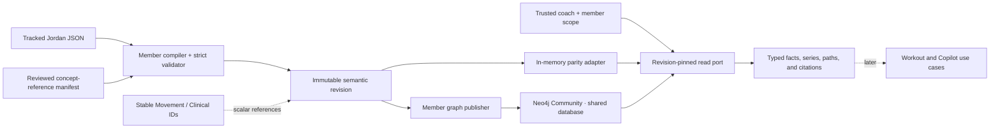
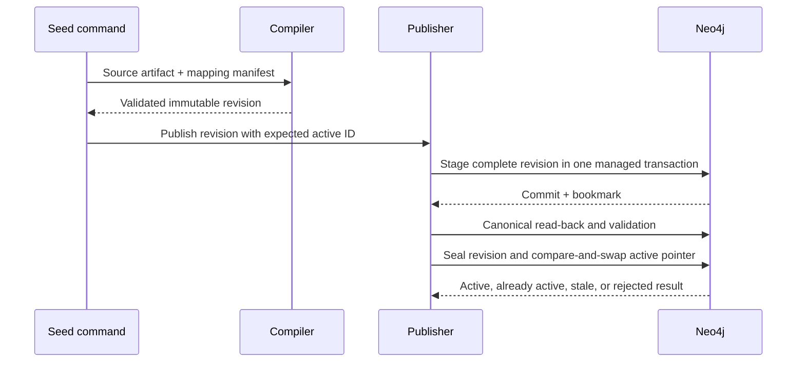

# Member Context Knowledge Graph - Plan

## Goal Capsule

- **Objective:** Replace the current aggregate member snapshot with a revisioned Member Context knowledge graph that ingests Jordan Rivera's complete synthetic record and provides safe, provenance-rich retrieval for later workout and Copilot workflows.
- **Product authority:** `ASSESSMENT.md` governs required member domains and synthetic-data scope. `docs/plans/2026-08-06-002-feat-movement-clinical-kg-plan.md` governs shared Neo4j lifecycle conventions and the cross-graph identity boundary.
- **Execution profile:** Establish typed graph semantics first, prove deterministic compilation and retrieval in memory, then add Neo4j persistence, atomic activation, and documentation.
- **Stop conditions:** Stop if ingestion invents dates or clinical meaning, accepts non-synthetic member data, mutates an existing revision, exposes unbounded or caller-authored Cypher, or permits one member's context to appear in another member scope.
- **Tail ownership:** The final unit owns the Jordan seed path, schema documentation, reproducible verification, and removal of the lossy snapshot-only path after adapter parity is proven.

---

## Product Contract

### Summary

Build the Member Context graph around the complete synthetic Jordan fixture, with atomic longitudinal facts, stable cross-graph references, immutable revisions, and evidence-first reads. The graph becomes the shared member-context source for later personalization and Copilot retrieval without implementing those consumers in this plan.

### Problem Frame

`src/graph/ingest/member-context.ts` currently converts the source document into one `MemberContextSnapshot` plus coarse evidence blobs. Biomarkers and lab panels lose measurement-level retrieval, array positions leak into evidence identity, missing times are replaced with unrelated dates, and the repository cannot perform bounded graph queries or distinguish all failure states.

The assessment requires a knowledge graph that represents the member's complete world and supports grounded retrieval. Later agents must be able to query one authorized, pinned context revision and cite exact evidence without fabricating chronology, inference, or cross-member data.

### Actors

- A1. **Coach:** Opens one member context through a trusted application scope and later uses the returned evidence to make coaching decisions.
- A2. **Member:** The subject of the synthetic profile, history, observations, conversations, and assessments.
- A3. **Context consumer:** A later workout or Copilot use case that can call bounded read primitives but cannot choose authorization scope or submit Cypher.
- A4. **Graph publisher:** Validates, stages, seals, activates, and inspects immutable member-context revisions.

### Key Decisions

- **Use the complete member-world scope from the assessment.** Profile, goals, preferences, equipment, injuries, workout and adherence history, biomarkers, blood and DEXA labs, coach-member messages and image metadata, coach tasks, and churn signals all belong in the graph. Governs R1-R5.
- **Keep the two knowledge graphs separate.** Member facts retain member-specific state and stable Movement/Clinical concept identifiers without copying that taxonomy or linking to revision-scoped Movement assertions. Governs R10-R11.
- **Make the graph a retrieval substrate, not a Copilot implementation.** This plan creates the shared context and evidence contract; answer generation, tools, charts, vector search, and chat UI remain later work. Governs R12-R16 and the scope boundaries.

### Requirements

**Source coverage and semantic fidelity**

- R1. The canonical seed imports only the tracked synthetic source `data/member-context.json` and rejects input that cannot prove the repository's synthetic-fixture contract.
- R2. The graph represents profile, goals, preferences, available equipment, injuries, workouts and exercise mentions, adherence, biomarkers, lab panels and measurements, messages, image metadata, coach briefs and tasks, churn assessments, and churn reasons as addressable graph records.
- R3. Measurements and longitudinal entries preserve their metric, value, unit, source order, source locator, and available effective time at the smallest useful source granularity.
- R4. Exact timestamps, date-only values, relative ordered series, and unknown effective times remain distinct; ingestion does not infer missing dates, birth dates, or observation times.
- R5. Observations, source statements, and source-provided or system-derived assessments remain distinguishable, and a derived item links to its exact basis assertions and method revision when those inputs exist.
- R6. Message attachments preserve metadata and their parent-message relationship without claiming an asset exists or that image contents were analyzed.
- R7. Historical workout exercise text remains valid evidence when no deterministic Movement concept mapping exists, and the record exposes that unresolved state.

**Identity, revisions, and provenance**

- R8. Stable IDs use source IDs where present and deterministic namespaced identity where absent; reordering source arrays does not change semantic IDs.
- R9. Each canonical source payload produces one content-derived immutable context revision from the source digest plus schema and compiler versions.
- R10. Every revision-scoped node and relationship retains an assertion ID, source locator, source-artifact digest, context revision, classification, temporal precision, and synthetic marker sufficient for citation and audit.
- R11. Injury, anatomy, equipment, goal, and behavior-context records may store reviewed stable Movement/Clinical or COPPER identifiers, but never direct links to revision-scoped nodes in the other graph.
- R12. Exact re-ingestion is idempotent, conflicting content under an existing immutable identity fails, and a failed publication leaves the prior active revision unchanged.
- R13. Historical revisions remain retrievable by explicit revision ID and are never mixed with the active revision in one result.

**Retrieval and trust boundary**

- R14. Every read is anchored to a server-authorized coach and member scope plus one active or explicit historical context revision; historical `COACHES` evidence never grants current access.
- R15. The read contract provides bounded primitives for summary, domain and time-window evidence, longitudinal series, conversations with attachments, coach brief, related evidence, and exact citation lookup with deterministic ordering.
- R16. Read results preserve distinct internal states for ready, empty, insufficient history, stale revision, denied, invalid, and backend unavailable; external application policy may map unknown and unauthorized members to the same non-enumerating response.
- R17. Query structure, labels, relationship types, sort keys, and traversal bounds are fixed or allowlisted; free text is parameterized data and no model or client can submit Cypher fragments.
- R18. Every projection and citation returned from one handle carries the same member ID, context revision, authority, and evidence identifiers.
- R19. Retrieval and diagnostics minimize sensitive values even for synthetic data; raw chat, biomarker, and lab values do not enter routine query logs or error payloads.

**Storage, parity, and communication**

- R20. Neo4j Community is the canonical persisted graph and the in-memory adapter is a contract-faithful deterministic test double, not a production fallback.
- R21. TypeScript compilation and post-write validation enforce required properties, endpoint types, revision membership, provenance, and cardinalities that Neo4j Community constraints cannot enforce.
- R22. Repository documentation defines every node and relationship type, identity and time semantics, cross-graph references, ingestion and activation flow, retrieval boundary, and trade-offs.

### Key Flows

- F1. Seed and activate Jordan
  - **Trigger:** A4 receives the tracked synthetic member source.
  - **Actors:** A2, A4
  - **Steps:** The compiler validates and canonicalizes the source, produces an immutable revision, persists it atomically, verifies canonical read-back, seals it, and advances Jordan's active revision pointer.
  - **Covered by:** R1-R13, R20-R21.
- F2. Retrieve pinned member context
  - **Trigger:** A1 or A3 requests a supported context view for Jordan through trusted application scope.
  - **Actors:** A1, A2, A3
  - **Steps:** The repository authorizes scope, pins one revision, executes a bounded read, and returns ordered facts with citations or a typed non-ready state.
  - **Covered by:** R14-R19.
- F3. Trace a source or assessment claim
  - **Trigger:** A1 or A3 asks for the evidence behind a member fact, trend, task, or churn reason.
  - **Actors:** A1, A3
  - **Steps:** The graph returns the revision-scoped source assertion and any available basis edges; unsupported source-provided claims remain visibly unsupported rather than receiving invented evidence.
  - **Covered by:** R3-R5, R10, R13-R18.

### Acceptance Examples

- AE1. Complete Jordan ingestion
  - **Covers:** R1-R13.
  - **Given:** The tracked `data/member-context.json` fixture.
  - **When:** The Member Context compiler and publisher run.
  - **Then:** Every source domain and nested record is represented exactly once or by a documented parent-child decomposition, and the complete revision becomes active.
- AE2. Longitudinal retrieval without invented time
  - **Covers:** R3-R5, R14-R18.
  - **Given:** Jordan's dated adherence and weight series, exact-offset messages, undated HR and HRV values, and ordered seven-value sleep series.
  - **When:** A3 retrieves current state and trends.
  - **Then:** Dated values sort by their real dates, exact timestamps preserve offsets, and undated or relative observations remain explicitly unknown or relative.
- AE3. Auditable churn context
  - **Covers:** R5, R10, R15-R18.
  - **Given:** Jordan's source-provided elevated churn assessment and its three reasons.
  - **When:** A1 inspects the risk evidence.
  - **Then:** Available adherence and message evidence is linkable, while the unsupported login-frequency reason remains a source assertion and is not presented as independently derived.
- AE4. Member isolation
  - **Covers:** R14-R19.
  - **Given:** A request with the wrong coach scope, a guessed evidence ID, or an unavailable revision.
  - **When:** Any snapshot, series, conversation, related-evidence, or citation read runs.
  - **Then:** No Jordan facts are returned, internal failure semantics remain typed, and the application boundary does not reveal whether another member exists.
- AE5. Idempotent revision publication
  - **Covers:** R8-R13, R20-R21.
  - **Given:** The same source twice, then a source with one changed observation, then an injected publication failure.
  - **When:** A4 publishes each input.
  - **Then:** The identical source adds nothing, the changed source creates a new immutable revision, and the failed publication leaves the prior revision active.

### Success Criteria

- Every required Jordan source path is represented, cited, and retrievable at one pinned context revision.
- Exact repeat ingestion produces no duplicate semantic records, assertions, relationships, revisions, or activities.
- All adapter-conformance scenarios return equivalent ordered projections and typed failures from the in-memory and Neo4j implementations.
- Cross-scope, arbitrary-query, prompt-injection, non-synthetic, malformed-source, and failed-publication scenarios fail without exposing member data or changing the active revision.
- The schema and operating documentation let a reviewer trace a Copilot-ready fact from source JSON to graph record and back without relying on application code.

### Scope Boundaries

**In scope**

- The tracked Jordan fixture, graph schema, reviewed concept-reference manifest, compiler and validator, immutable revision lifecycle, in-memory parity adapter, Neo4j persistence, bounded read contract, seed path, tests, and graph documentation.
- Small reviewed COPPER mappings only where Jordan's goals, preferences, adherence, or behavior context genuinely match; unmapped concepts remain explicit local concepts.
- Application-level coach/member scope as a repository input and policy boundary; real authentication is not part of this plan.

#### Deferred to Follow-Up Work

- Copilot tools, retrieval ranking, prompts, generated answers, quick prompts, charts, follow-up state, streaming, and retrieval-quality evaluation.
- Workout generation, concept resolution, deterministic safety, recommendation provenance, and Decision and Run records.
- Full-text and vector indexes, embeddings, semantic search, and unrestricted graph visualization.
- Durable member-context mutation, conflict resolution across multiple upstream sources, retention/deletion automation, and real clinical-data deployment controls.
- Additional member seed files; untracked `data/member-context-avery.json` and `data/member-context-morgan.json` are not adopted by this plan.

**Outside this product's identity**

- Real member data or protected health information.
- Clinical interpretation of lab values, injury notes, biomarkers, or DEXA results.
- Image understanding, inferred attachment content, or claims that a metadata-only attachment is a retrievable asset.
- Direct client, model, or agent access to Neo4j or arbitrary Cypher.

### Dependencies and Assumptions

- `docs/plans/2026-08-06-002-feat-movement-clinical-kg-plan.md` is the authority for Neo4j `2026.06`, JavaScript driver `6.x`, the shared client/test harness, immutable graph publication conventions, and stable cross-graph concept IDs.
- U1-U3 can proceed against pure contracts and the in-memory adapter. U4-U5 depend on the shared Neo4j client, Compose service, and integration-test configuration from that plan's U4, or on those shared files landing in an equivalent prerequisite change.
- The source fixture's `_note` is the current synthetic marker. The compiler will validate it against a narrow allowlist or a checked-in source manifest rather than setting `synthetic: true` unconditionally.
- Jordan's historical exercise strings are not exact catalog identifiers. Missing canonical mappings do not invalidate otherwise valid history.

### Sources and Research

- `ASSESSMENT.md` defines the Member Context graph domains, synthetic-only rule, Copilot retrieval purpose, and documentation expectations.
- `data/member-context.json` is the only tracked member source in this plan.
- `src/domain/contracts/member-context.ts`, `src/graph/ingest/member-context.ts`, `src/graph/repositories/member-context.ts`, and `tests/unit/member-context-graph.test.ts` show the current aggregate snapshot, coarse evidence, index-derived identities, and limited repository behavior that this plan replaces.
- `docs/plans/2026-08-05-004-feat-graph-backed-services-plan.md` defines the downstream need for one shared member-context revision across narrative, charts, and workouts.
- `docs/plans/2026-08-06-002-feat-movement-clinical-kg-plan.md` defines the compatible graph lifecycle and cross-graph boundary.
- [Neo4j JavaScript transactions](https://neo4j.com/docs/javascript-manual/current/transactions/), [constraints](https://neo4j.com/docs/cypher-manual/current/schema/constraints/), and [bookmarks](https://neo4j.com/docs/javascript-manual/current/bookmarks/) shape retry-safe atomic publication, Community validation, and causal read-back.
- [Neo4j Community database administration](https://neo4j.com/docs/operations-manual/current/database-administration/) establishes the single-standard-database constraint, so the two KGs share one database while remaining separated by labels, revision keys, and repository ports.
- [PROV-O](https://www.w3.org/TR/prov-o/) supports selective source-artifact, ingestion-activity, revision, and derivation lineage without requiring every ordinary relationship to be reified.
- [FHIR R5 Observation](https://fhir.hl7.org/fhir/observation-definitions.html) supports preserving optional and differently precise effective times rather than manufacturing timestamps.
- [Neo4j semantic index documentation](https://neo4j.com/docs/cypher-manual/current/indexes/semantic-indexes/) supports deferring full-text and vector retrieval from this bounded exact-read slice.

---

## Planning Contract

### Key Technical Decisions

- KTD1. **Replace the snapshot-only model with revision-scoped graph records.** Keep `Member` and `Coach` as stable identity nodes. Represent profile, goals, preferences, equipment availability, injuries, workouts, exercise mentions, observations, panels, messages, attachments, briefs, tasks, churn assessments, and churn reasons as typed records owned by one `MemberContextRevision`. Governs R2-R7, R9-R10.
- KTD2. **Use domain nodes for meaning and shared assertion metadata for audit.** Each revision-scoped record carries one stable semantic ID and one assertion ID. Relationships carry stable assertion IDs and revision membership where their existence is evidence. Avoid a generic property bag and avoid reifying every relationship solely for provenance. Governs R2-R3, R8-R10.
- KTD3. **Derive immutable revisions from canonical content.** Hash canonical source JSON into a `SourceArtifact`, then derive the context revision from that digest plus schema and compiler versions. Source IDs anchor identity; source records without IDs use deterministic namespaced identity from intrinsic content and parent identity rather than array index. Neo4j `elementId` is never a domain reference. Governs R8-R13.
- KTD4. **Model provenance selectively with PROV-O semantics.** `IngestionActivity` uses one `SourceArtifact` and generates one `MemberContextRevision`. Source-provided assessments are labeled as such; future computed assessments must carry a method version and `WAS_DERIVED_FROM` links to the exact revision-scoped source records carrying the cited assertion IDs. This slice permits record assertions, not relationship assertions, as derivation targets. Governs R5, R9-R10, R12-R13.
- KTD5. **Preserve temporal precision as source truth.** Use exact offset timestamps, dates, relative ordered series, or unknown effective time according to the source. Store ingestion time only on the ingestion activity. Never copy it into observed or recorded time fields. Governs R3-R5.
- KTD6. **Reference, do not join, the Movement graph.** A checked-in manifest maps Jordan's equipment and injury terms to reviewed stable domain IDs. Member records store those IDs as scalar references and preserve unresolved original text; they never target Movement revision assertions. COPPER mappings remain descriptive behavior-context mappings and cannot become safety authority. Governs R7, R11.
- KTD7. **Expose one async, revision-pinned primitive read port.** The handle provides allowlisted summary, evidence, series, conversation, brief, related-evidence, and citation operations. Each operation has an owned default limit, hard maximum, bounded time interval or traversal depth where applicable, timeout, cursor contract, and deterministic tie-breaker. It returns typed projections and failures, not raw graph nodes, generic traversal, or Cypher. Later agent tools wrap these primitives and cannot select trusted scope. Governs R14-R18.
- KTD8. **Use one Neo4j Community database with logical graph separation.** Community supports one standard database, so both KGs use distinct labels, stable namespaces, revision keys, query constants, and repository/publisher ports inside that database. The in-memory adapter implements the same contract for deterministic tests only. Governs R20-R21.
- KTD9. **Split enforcement between constraints and the compiler.** Named uniqueness constraints protect stable composite keys before `MERGE`. The compiler and canonical post-write validator enforce required fields, types, endpoint matrices, reference integrity, provenance, and cardinalities unavailable in Community constraints. Governs R8-R13, R20-R21.
- KTD10. **Publish one member revision atomically and activate after causal read-back.** Compile outside the managed transaction. The transaction callback performs deterministic database effects only, because `executeWrite` may retry. Append-only publication attempts and seals describe staging outcomes; a per-member catalog holds the only mutable active-revision pointer; append-only activation events preserve pointer history. Stage, read back, seal, and compare-and-swap through one causally chained session or explicit bookmarks. Governs R9-R13, R20-R21.
- KTD11. **Treat text and health-adjacent values as untrusted and sensitive.** Static parameterized Cypher keeps messages, notes, captions, and labels inert. Bolt stays server-side; server authorization creates the trusted scope before every query; the historical `COACHES` edge is evidence, not an entitlement. Logs and errors omit raw chat, biomarker, and lab values. Governs R14-R19.
- KTD12. **Defer semantic indexes.** The bounded Jordan corpus uses exact indexes and deterministic projections. Full-text and vector search add approximate or eventually consistent behavior that is unnecessary for this ingestion slice and belongs with later retrieval evaluation. Governs R15, R20.
- KTD13. **Seed Jordan explicitly.** The seed command addresses `data/member-context.json` directly and never globs sibling member files. Additional scenarios use checked-in minimal synthetic test builders, not the current untracked Avery or Morgan fixtures. Governs R1, R12, R20.

### High-Level Technical Design

The compiler is the semantic authority. Both storage adapters consume its deeply immutable output and must return the same contract-level projections. The application port owns authorization and query bounds; downstream code never sees driver records or storage-specific types.

Managed retries cannot create timestamps, IDs, network calls, logs, or other external effects inside the transaction callback. An incomplete or unsealed stage is invisible to active reads.

### Graph Contract

| Node role | Meaning | Required identity and semantics |
|---|---|---|
| `Member`, `Coach` | Stable subjects and authorized relationship endpoints. | Source ID; no mutable longitudinal facts on the identity node. |
| `MemberProfile` | Revision-scoped profile statement. | Member + context revision; source fields stay distinct from later observations. |
| `Goal`, `Preference` | Member intent and stable preference statements. | Source ID when present; otherwise deterministic child identity and optional reviewed COPPER mapping. |
| `EquipmentAvailability`, `InjuryEpisode` | Current source-provided context with stable domain references. | Original label plus reviewed stable concept IDs, laterality/status where supplied, and unresolved state when not mapped. |
| `WorkoutSession`, `ExerciseMention` | Planned/completed workout record and ordered source exercise text. | Intrinsic session identity; child mention identity; nullable RPE and unresolved canonical reference are valid. |
| `Observation`, `LabPanel` | Atomic adherence, biomarker, weight, blood, and DEXA measurements with panel grouping where applicable. | Metric, value, unit, temporal precision, source order, and source locator. |
| `Conversation`, `Message`, `MediaAttachment` | Coach-member thread, ordered utterances, and metadata-only attachments. | Participant/source identity, exact offset timestamp when present, parent-child linkage, untrusted-content classification. |
| `CoachBrief`, `CoachTask`, `ChurnAssessment`, `ChurnReason` | Source-generated briefing and risk assertions. | Generated-for date, source-provided classification, and basis link or explicit unsupported-source status. |
| `SourceArtifact`, `MemberContextRevision`, `IngestionActivity` | Immutable source and graph-build lineage. | Source digest, schema/compiler version, validation result, and generation/use relations. |
| `PublicationAttempt`, `RevisionSeal`, `MemberContextCatalog`, `ActivationEvent` | Operational publication state kept outside immutable revision content. | Append-only attempt/seal/event identity; one uniqueness-protected catalog per member contains the mutable active revision ID. |

| Relationship | From → To | Meaning |
|---|---|---|
| `COACHES` | `Coach → Member` | Historical source assertion for the selected revision; never an authorization grant. |
| `HAS_PROFILE`, `PURSUES`, `HAS_PREFERENCE`, `HAS_EQUIPMENT`, `HAS_INJURY` | `Member → context record` | Revision-scoped member facts. |
| `HAS_WORKOUT`, `MENTIONS_EXERCISE` | `Member → WorkoutSession → ExerciseMention` | Workout history and ordered original exercise text. |
| `HAS_OBSERVATION`, `HAS_PANEL`, `CONTAINS_MEASUREMENT` | `Member/LabPanel → observation record` | Atomic longitudinal and lab evidence. |
| `HAS_CONVERSATION`, `CONTAINS_MESSAGE`, `SENT_BY`, `HAS_ATTACHMENT` | Conversation/message participants and content | Preserves chronology, attribution, and image metadata linkage. |
| `HAS_BRIEF`, `HAS_TASK`, `HAS_ASSESSMENT`, `HAS_REASON` | `Member/CoachBrief/ChurnAssessment → briefing records` | Preserves source-provided task and churn structure. |
| `SUPPORTED_BY`, `WAS_DERIVED_FROM` | Assessment or reason → revision-scoped source record carrying the cited assertion ID | Records available basis without inventing missing evidence or targeting a property as though it were a node. |
| `ASSERTS` | `MemberContextRevision → revision-scoped record` | Makes revision membership explicit and bounded. |
| `USED`, `GENERATED` | `IngestionActivity → SourceArtifact/MemberContextRevision` | PROV-O-aligned build lineage. |
| `SEALED`, `ACTIVATED` | Publication lifecycle record → revision | Proves canonical validation and records active-pointer history without mutating revision content. |

Cross-graph concept identifiers are properties on applicable member records, not relationships to Movement nodes. Recommendation decisions and run provenance remain outside this graph.

### Sequencing

1. Define the target node, relationship, assertion, query, and publication contracts.
2. Compile and validate Jordan into a deeply immutable revision; prove identity, temporal, provenance, and mapping semantics with the in-memory adapter.
3. Add bounded application retrieval and adapter-conformance scenarios.
4. Persist, validate, seal, and activate the revision in Neo4j after shared graph infrastructure exists.
5. Seed Jordan explicitly and publish the schema and operating guide.

### System-Wide Impact

- **Future Copilot and charts:** They must consume the revision-pinned port so narrative, trends, and citations cannot drift across revisions.
- **Workout personalization:** It may combine one member handle with one Movement handle, but neither graph imports the other's revision-scoped records.
- **Security:** Neo4j Community is not the member authorization boundary. Trusted server context supplies scope, and Bolt is unavailable to browsers and models.
- **Operations:** Both KGs share one standard Neo4j database, so labels, constraints, query constants, and activation catalogs must avoid namespace collisions.
- **Developer experience:** Unit tests remain database-free; only adapter and publication proofs require the pinned Neo4j integration environment.

### Risks and Mitigations

- **False chronology:** Missing biomarker dates could be inferred from the brief date. Preserve temporal precision and assert absence in tests.
- **False derivation:** A churn reason references login data that the fixture does not contain. Mark it source-provided and unsupported rather than synthesizing login evidence.
- **Unstable citations:** Array-index identities change after insertion or reordering. Use source/intrinsic identities and verify reorder stability.
- **Cross-member leakage:** A guessed member, evidence, or revision ID could bypass a coarse filter. Anchor every query to trusted scope and run conformance tests for each read primitive.
- **Partial activation:** A retry or process interruption could expose incomplete data. Keep complete writes atomic and make only sealed revisions eligible for compare-and-swap activation.
- **Community constraint gaps:** Missing properties can bypass composite uniqueness. Validate before write and compare canonical read-back against the compiler output.
- **Cross-plan collision:** Movement work may create the shared Neo4j files first. Treat them as prerequisites and extend their contracts rather than creating a second client, Compose service, or catalog.
- **Dirty fixture drift:** Existing tests import an untracked member file. Replace that dependency with a tracked minimal test builder and do not adopt unrelated user data.

---

## Implementation Units

### U1. Define the Member Context graph and port contracts

- **Goal:** Establish the typed graph, assertion, revision, query, publication, and cross-graph reference contracts before changing ingestion.
- **Requirements:** R2-R11, R14-R18, R20-R22; F1-F3; AE1-AE4.
- **Dependencies:** The stable ID and lifecycle decisions in `docs/plans/2026-08-06-002-feat-movement-clinical-kg-plan.md`.
- **Files:** Modify `src/domain/contracts/member-context.ts` and `src/application/ports/graph-repositories.ts`. Add `src/domain/contracts/member-context-queries.ts`, `src/domain/contracts/member-context-publication.ts`, `src/graph/schema/member-context-schema.ts`, and `tests/unit/member-context-contract.test.ts`.
- **Approach:**
  1. Introduce readonly discriminated node and relationship records plus assertion metadata governed by KTD1-KTD5 while keeping the existing aggregate compatibility contract exported and building until U4 proves adapter parity; U5 owns its removal.
  2. Define async pinned read handles and separate publisher authority per KTD7 and KTD10.
  3. Define stable Movement/Clinical and COPPER reference values without importing storage types per KTD6.
- **Patterns to follow:** Mirror the type/port/revision separation planned for the Movement graph. Preserve the existing dependency direction from `src/application/ports/graph-repositories.ts` into domain contracts.
- **Test scenarios:**
  1. Every node and relationship kind in the Graph Contract has a unique stable type and an allowlisted endpoint pair.
  2. Every revision-scoped record requires assertion, source, revision, temporal-precision, and synthetic metadata appropriate to its kind.
  3. The read port exposes only bounded typed operations and cannot represent raw Cypher, arbitrary relationship types, or caller-selected authorization scope.
  4. Ready, empty, insufficient-history, stale, denied, invalid, and unavailable results remain distinct in the internal contract.
  5. A domain concept reference accepts a stable reviewed ID or an explicit unresolved state and cannot carry a Movement revision node identifier.
- **Verification:** Type-level and contract tests prove the complete schema is representable without importing Neo4j or UI types.

### U2. Compile and validate the complete Jordan graph

- **Goal:** Turn the tracked Jordan document into one deeply immutable, provenance-complete semantic revision and a contract-faithful in-memory graph.
- **Requirements:** R1-R13, R20-R21; F1, F3; AE1-AE3, AE5.
- **Dependencies:** U1.
- **Files:** Modify `src/graph/ingest/member-context.ts`, `src/graph/repositories/member-context.ts`, and `tests/unit/member-context-graph.test.ts`. Add `data/member-context-concept-mappings.json`, `src/graph/validation/member-context.ts`, `src/graph/revisions/member-context.ts`, `src/graph/publication/in-memory-member-context-publisher.ts`, `tests/fixtures/member-context-builder.ts`, `tests/unit/member-context-validation.test.ts`, and `tests/unit/member-context-repository-contract.test.ts`.
- **Approach:**
  1. Parse and validate the whole source before creating graph records; enforce the synthetic marker, dates/timezones, units, authors, attachment types, duplicates, and reference integrity.
  2. Generate stable identities, atomic observations, parent-child records, assertion metadata, source digest, and revision ID under KTD1-KTD5 and KTD13.
  3. Apply only reviewed stable concept mappings under KTD6; preserve unmapped workout text and source assertions.
  4. Freeze the compiled revision and implement the publisher lifecycle in memory so exact no-op, immutable conflict, seal, compare-and-swap activation, and historical behavior are proven before database work.
- **Execution note:** Replace the current lossy behavior with characterization coverage for Jordan's existing accepted fields, then tighten identity, timing, and provenance scenarios while retaining the aggregate compatibility path until U5 removes it after U4 parity.
- **Patterns to follow:** Reuse the deterministic canonical-JSON hashing pattern from `src/graph/ingest/member-context.ts`, but move source, schema, compiler, and assertion identity into explicit contracts.
- **Test scenarios:**
  1. Covers AE1. Jordan's profile, three goals, preference record, five equipment entries, injury, four workouts and ordered exercise mentions, four adherence observations and source trend, HR and HRV values, seven-item relative sleep series, three dated weights, blood and DEXA panels with atomic measurements, four messages, image metadata, two tasks, churn assessment, and three reasons compile exactly once with expected relationships.
  2. A null goal target date and null workout RPE remain valid and retain source locators.
  3. Exact-offset messages, date-only facts, relative sleep values, and unknown-time HR/HRV values retain distinct temporal precision; no value inherits import or brief time.
  4. Reordering an explicitly unordered collection such as equipment preserves semantic IDs, parent-child identity, and canonical graph content. Reordering ordered messages, tasks, workouts, exercise mentions, or observation series preserves intrinsic semantic IDs but changes source-order metadata, ordered relationships, canonical content, source digest, and context revision where order is meaningful.
  5. Duplicate source IDs, duplicate semantic identities, invalid dates/timezones, unsupported units/authors/attachments, dangling relationships, and missing or false synthetic markers reject the full revision.
  6. An unresolved historical exercise mention remains queryable with original text and explicit unresolved status.
  7. The login-frequency churn reason remains a source-provided unsupported assertion; no login event is generated.
  8. Recompiling identical input produces the same source digest and revision; changing one observation produces a new revision while the original stays immutable.
  9. The in-memory adapter returns typed denial and unavailable states instead of collapsing them into an empty evidence array.
  10. Historical `COACHES` evidence cannot authorize a read when the trusted current scope does not grant that coach access.
- **Verification:** The compiled Jordan graph passes schema cardinality, source-coverage, identity, temporal, provenance, mapping, immutability, and in-memory repository contract checks.

### U3. Add revision-pinned longitudinal retrieval

- **Goal:** Expose the graph facts needed by later morning-brief, adherence, sleep, change, conversation, lab, and citation workflows through one bounded application contract.
- **Requirements:** R3-R7, R10, R13-R19, R20; F2-F3; AE2-AE4.
- **Dependencies:** U1-U2.
- **Files:** Modify `src/application/ports/graph-repositories.ts` and `src/graph/repositories/member-context.ts`. Add `src/application/use-cases/retrieve-member-context.ts` and `tests/unit/member-context-queries.test.ts`.
- **Approach:**
  1. Open a handle from trusted coach/member scope and active or explicit historical revision.
  2. Implement allowlisted summary, domain/time-window evidence, metric series, conversation, brief, related-evidence, and citation projections per KTD7.
  3. Apply contract-owned default and maximum limits, time or depth bounds, timeouts, deterministic time/precision/source/ID ordering, cursor behavior, and typed insufficiency semantics.
  4. Keep untrusted message, note, caption, and label text inert under KTD11.
- **Patterns to follow:** Preserve the application-port boundary and typed result style in `src/application/ports/graph-repositories.ts`; do not route canonical graph data through `src/features/coach-dashboard/fixture-adapter.ts`.
- **Test scenarios:**
  1. Covers AE2. Adherence returns four dated weeks, weight returns three dated observations, messages preserve exact timestamp order, and undated sleep/HR/HRV remains explicitly non-dateable.
  2. A four-week comparison over fewer available weeks returns `insufficient-history` with available cited evidence rather than inventing or padding data.
  3. Blood-panel and DEXA retrieval returns atomic values, units, panel date, source locators, and one pinned revision.
  4. Conversation retrieval returns four attributed messages and the image metadata beneath its source message without claiming an asset URL.
  5. Covers AE3. Brief and churn retrieval distinguishes source-provided tasks and reasons from evidence-linked or unsupported claims.
  6. Covers AE4. Wrong coach scope, guessed member/evidence IDs, historical revision mismatch, and source-ID probing return no facts across every read primitive.
  7. Chat text containing Cypher-like syntax or prompt-injection instructions remains inert returned evidence and cannot alter query selection, limits, or scope.
  8. Pagination and equal-time results are deterministic through the final assertion-ID tie-breaker.
- **Verification:** One in-memory conformance suite proves every later Copilot context shape can be reconstructed from bounded, cited facts at exactly one revision.

### U4. Persist and activate Member Context revisions in Neo4j

- **Goal:** Implement the canonical Neo4j adapter and publisher with Community-compatible constraints, retry-safe atomic writes, causal validation, and adapter parity.
- **Requirements:** R8-R21; F1-F3; AE1-AE5.
- **Dependencies:** U2-U3 and the shared Neo4j client, Compose service, and integration-test harness from the Movement graph plan's U4.
- **Files:** Add `src/graph/neo4j/member-context-schema.ts`, `src/graph/cypher/member-context.ts`, `src/graph/repositories/neo4j-member-context.ts`, `src/graph/publication/neo4j-member-context-publisher.ts`, `tests/integration/member-context.neo4j.test.ts`, and `tests/integration/member-context-activation.neo4j.test.ts`.
- **Approach:**
  1. Create named uniqueness constraints and exact/revision/time lookup indexes without duplicating constraint-owned indexes.
  2. Persist compiler output through static parameterized Cypher in one managed write transaction per bounded member revision.
  3. Canonically read back and validate the staged payload before sealing it and compare-and-swapping Jordan's active revision per KTD9-KTD10.
  4. Implement the shared read contract with trusted scope anchoring, explicit limits, timeouts, deterministic ordering, and no fixture fallback.
- **Execution note:** Prove the pure compiler and shared adapter contract first; use the real database only for ACID, constraint, lock, bookmark, and query-plan behavior that mocks cannot establish.
- **Patterns to follow:** Extend `src/graph/neo4j/client.ts` and the publication lifecycle established by the Movement graph. Use driver `6.x` `executeRead` and `executeWrite`; do not use removed transaction helpers or Neo4j element IDs as durable references.
- **Test scenarios:**
  1. Schema creation is idempotent, names do not collide with Movement constraints, and compiler validation rejects missing required properties that Community constraints cannot enforce.
  2. Covers AE1. The canonical adapter returns the same Jordan projections, relationships, source locators, and ordering as the in-memory conformance suite.
  3. Covers AE5. Re-publishing the same revision adds no nodes or relationships; a changed fact creates a historical revision; a same-identity/different-payload conflict fails.
  4. An injected mid-write failure rolls back all revision data, and a failure after staging but before sealing leaves the prior active revision readable.
  5. Concurrent publishers cannot create duplicate stable identities or activate two different targets; stale expected-active values return a typed conflict.
  6. Stage, read-back, seal, and activation remain causally ordered through one session or explicit bookmarks.
  7. Every Neo4j read passes the U3 cross-scope, revision-mismatch, limit, timeout, deterministic-order, malicious-text, and typed-failure scenarios.
  8. Raw chat, lab, and biomarker values are absent from routine query logs and thrown error messages.
- **Verification:** The pinned Neo4j instance proves complete atomic publication, rollback, activation, historical reads, authorization, bounded queries, and in-memory parity.

### U5. Seed Jordan and publish the graph contract

- **Goal:** Make the complete synthetic member graph reproducible and explain its semantics, trade-offs, and downstream boundary to reviewers.
- **Requirements:** R1, R11-R13, R19-R22; F1-F3; AE1-AE5.
- **Dependencies:** U4 and the Movement graph plan's U7 documentation artifact, `docs/graph/movement-clinical-schema.md`.
- **Files:** Add `scripts/seed-member-context.ts`, `docs/graph/member-context-schema.md`, `tests/integration/member-context-seed.neo4j.test.ts`, and `tests/unit/member-context-docs.test.ts`. Modify `package.json`, `README.md`, `src/domain/contracts/member-context.ts`, `src/application/ports/graph-repositories.ts`, `src/graph/ingest/member-context.ts`, `src/graph/repositories/member-context.ts`, and `tests/unit/member-context-graph.test.ts`.
- **Approach:**
  1. Add an explicit member seed entry that reads only `data/member-context.json`, publishes with expected-active semantics, and reports revision metadata without raw sensitive values.
  2. Document the Graph Contract, source-to-node mapping, identity rules, time semantics, PROV-O alignment, COPPER and Movement reference boundary, publication sequence, query port, failure states, and semantic-index deferral.
  3. Document how later workout and Copilot consumers pin one member revision and cite evidence without bypassing the application port.
  4. After U4 proves in-memory and Neo4j adapter parity, migrate any remaining aggregate snapshot consumers and remove the lossy snapshot-only contract, ingestion, repository behavior, and legacy-only tests.
- **Execution note:** This is primarily packaging and documentation; prefer clean-checkout seed/runtime smoke evidence plus documentation-contract tests over additional domain-unit coverage.
- **Patterns to follow:** Match the schema and operating-guide structure created by `docs/graph/movement-clinical-schema.md`; keep `README.md` consistent with the assessment's synthetic-only and architecture requirements.
- **Test scenarios:**
  1. The seed command imports the tracked Jordan path and does not discover or ingest sibling `member-context-*` files.
  2. A clean database seed activates one validated revision; a repeat seed is an idempotent no-op; a validation failure preserves the active revision.
  3. The documentation names every graph node and relationship role, shows the two diagrams and cross-graph boundary, and matches the shipped contract identifiers.
  4. Every documented command and referenced file exists, and no document claims clinical validation, image analysis, real member data support, or a completed Copilot.
- **Verification:** A reviewer can seed Jordan, inspect the active revision, execute bounded evidence and longitudinal reads, trace results to JSON paths, and understand every deliberate non-goal from the documented workflow.

---

## Verification Contract

| Gate | Command | Applies to | Done signal |
|---|---|---|---|
| Static quality | `pnpm lint && pnpm typecheck` | U1-U5 | Contracts, compiler, adapters, scripts, and docs tests have no lint or type errors. |
| Unit behavior | `pnpm test` | U1-U3, U5 | Schema, source coverage, validation, identity, temporal precision, provenance, retrieval, isolation, and docs contracts pass. |
| Neo4j integration | `pnpm vitest --config vitest.integration.config.mts tests/integration/member-context*.test.ts` | U4-U5 | Schema, ACID publication, causal activation, adapter parity, authorization, history, and seed tests pass against the pinned server. |
| Deterministic seed | `pnpm graph:seed:member` | U5 | Jordan's validated revision becomes active or reports an exact no-op without ingesting sibling files. |
| Production isolation | `pnpm check:isolation` | U1-U5 | Production code remains independent of prototype runtime and test-only fixture builders. |
| Application build | `pnpm build` | U1-U5 | The current dashboard still builds while graph contracts remain behind application ports. |

Adapter parity, cross-member isolation, source coverage, no-fabricated-time checks, immutable revision activation, and non-synthetic rejection are release blockers. Later Copilot relevance and latency evaluation are outside this plan.

---

## Definition of Done

- The tracked Jordan document compiles into the documented Member Context node and relationship model with every required source domain represented and cited.
- Stable semantic and assertion identities survive source reordering, exact re-ingestion is idempotent, changed content creates a new immutable revision, and failures never replace the prior active revision.
- Temporal precision, units, source values, source locators, and synthetic markers remain truthful; no missing date, login event, image content, clinical interpretation, or canonical exercise mapping is invented.
- Injury and equipment records use reviewed stable Movement/Clinical references, behavior-context mappings are limited to justified COPPER concepts, and neither graph links directly to the other's revision-scoped records.
- The in-memory and Neo4j adapters pass the same bounded, deterministic, revision-pinned retrieval contract and preserve typed failure behavior.
- Every read is anchored to trusted coach/member scope, malicious text remains inert, result sizes and traversals are bounded, and logs/errors do not expose raw sensitive values.
- Jordan can be seeded explicitly into the pinned Neo4j Community database and inspected through documented read operations from a clean checkout.
- `docs/graph/member-context-schema.md` and `README.md` explain the schema, provenance, ingestion, activation, cross-graph relationship, retrieval boundary, trade-offs, and deferred Copilot work.
- All Verification Contract gates pass after the shared Neo4j prerequisite is present.
- Abandoned aggregate-only, duplicate-client, generic-Cypher, and experiment-only paths introduced during implementation are removed; unrelated user changes and untracked member fixtures remain untouched.
