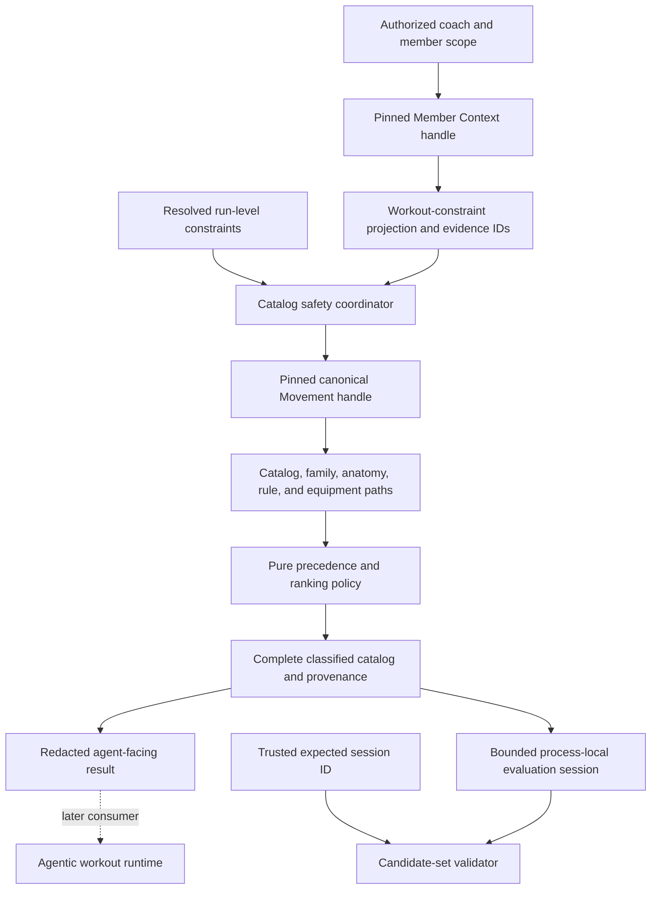
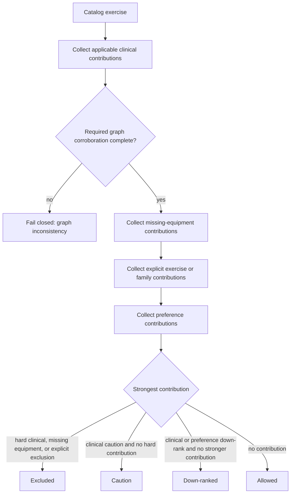

# Graph-Traversed Catalog Safety - Plan

## Goal Capsule

- **Objective:** Evaluate the exercise catalog through deterministic graph traversal so injury, equipment, explicit-exclusion, and preference constraints produce safe, ranked, and auditable candidates.
- **Product authority:** `ASSESSMENT_STE100.md` defines the graph-controlled recommendation requirement. `docs/plans/2026-08-05-004-feat-graph-backed-services-plan.md` defines the broader service boundary. The Movement/Clinical and Member Context plans govern their graph contracts.
- **Execution profile:** Extend the revision-pinned read ports, expose one authorized member-constraint projection, compose a pure catalog policy, and prove adapter parity plus cross-graph behavior.
- **Stop conditions:** Stop if prompt prose can authorize safety, if a fixture graph can return an allowed result, if a run mixes graph revisions, if `stresses` alone creates a clinical exclusion, or if a model can supply raw Cypher or traversal bounds.
- **Tail ownership:** This plan ends at a reusable catalog-safety application boundary, including its bounded same-process evaluation-session validator. Workout composition, run-state orchestration, Decision/Run persistence, UI integration, approval, publication, and PR handling are outside this artifact.

---

## Product Contract

### Summary

The product will turn canonical member constraints and explicit coach exclusions into a deterministic evaluation of every catalog exercise.
The decision service will walk typed graph edges, preserve hard-safety and soft-personalization semantics, and return the exact paths needed to replay each result.
Prompt text may be resolved before the call, but it cannot become a safety rule inside the call.

### Problem Frame

The repository can resolve concepts, evaluate one exercise against clinical rules, and recheck reviewed substitution candidates.
It cannot yet evaluate the complete catalog against one authorized member snapshot.
The generic Member Context projection also hides the injury, equipment, and preference fields needed by a safety consumer.

Without a cross-graph coordinator, a later workout runtime would have to reconstruct safety from prompt prose, issue unbounded per-exercise queries, or read raw graph records.
Those options break the assessment's determinism and provenance requirements.

### Key Decisions

- **Make graph traversal the safety authority.** (session-settled: user-directed — chosen over a prompt-only safety instruction: each filter or down-rank must be deterministic and auditable.) Governs R2, R4-R12.
- **Keep explicit exclusions hard and ordinary preferences soft.** (session-settled: user-approved — chosen over treating every dislike as a safety rule: preference must not masquerade as clinical authority.) Governs R7-R8.

### Actors

- A1. **Coach:** Supplies the trusted member scope and any explicit run-level exclusions or current symptom context.
- A2. **Catalog safety service:** Pins both graphs, traverses constraints, applies precedence, and returns typed decisions.
- A3. **Workout runtime:** Consumes the allowed and ranked set and may ask for clarification, but cannot widen it.
- A4. **Reviewer:** Replays a decision against the recorded graph revisions and assertion paths.

### Requirements

**Authority and inputs**

- R1. Every evaluation uses one server-authorized Member Context revision and one sealed canonical Movement/Clinical revision.
- R2. The policy accepts structured canonical constraints or resolver-certified zero-match exclusions only. Every run-level constraint carries server-verifiable provenance and re-resolves its concept references and applicability values against reviewed vocabulary at the pinned Movement/Clinical revision. Every zero-match certificate includes the server-owned resolver identity, exact revision, canonical queried concept, resolver/search-policy version, search bounds, empty-result attestation, and evidence ID. Missing or unresolvable fields fail closed; free-text prompt sentences, model-authored rules, and caller-authored Cypher are not policy inputs.
- R3. Member equipment, injury, and preference facts retain their source assertion IDs and reviewed stable concept references; unresolved available equipment is treated as unavailable, while incomplete injury applicability returns clarification or a fail-closed result.

**Graph traversal and precedence**

- R4. An injury contribution requires both a reviewed condition-rule target match and a bounded inverse `part-of` match from the affected joint or region to the exercise's modeled `stresses` anatomy. Anatomy without an applicable rule creates no injury effect; an applicable rule-target match whose required anatomy corroboration is absent is a graph-consistency failure and cannot return an allowed catalog.
- R5. Clinical effects keep their fixed graph meaning: hard contraindication excludes, caution remains reviewable, and down-rank remains eligible but lower ranked.
- R6. An exercise with any `requires` target outside the complete available-equipment set is hard excluded.
- R7. An explicit exclusion removes the resolved exercise and reviewed family members reached through bounded `variant-of` or `expresses` paths; a resolver-certified empty catalog search records an audited zero-match without changing classifications only when its R2 certificate matches the pinned Movement revision, while an ambiguous, mismatched, or expired resolution requires clarification or re-resolution.
- R8. A reviewed or resolved preference may down-rank matching exercises through the same typed catalog paths, but it cannot exclude an otherwise permitted exercise or weaken a clinical or equipment result.
- R9. Hard exclusions win over caution and down-rank, while all contributing paths remain in the trace.

**Output, failure, and downstream use**

- R10. One successful evaluation classifies the complete bounded catalog into excluded, caution, down-ranked, and allowed groups with deterministic stable-ID ordering inside equal ranks.
- R11. Every decision records the member-context revision, Movement/Clinical revision, member or run evidence IDs, exercise and edge assertion IDs, clinical rule, mapping and evidence IDs when applicable, and a machine-readable reason.
- R12. Non-canonical authority, an unavailable, missing, or unsealed requested revision, invalid bounds, broken paths, incomplete safety-critical context, and a catalog above `CATALOG_SAFETY_MAX_EXERCISES = 100` fail closed without returning a partial allowed set; a sealed revision pinned while valid remains authoritative for its in-flight evaluation after the active pointer advances.
- R13. The application boundary exposes catalog evaluation, same-process candidate-set validation, and authorized evaluation-session invalidation. The token is minted from a cryptographically secure random source with at least 128 bits of entropy, never derived from request identifiers or counters, and bound to coach/member claims, an evaluation-session ID, both graph revisions, and a digest of resolved run constraints. Validation receives an independently trusted expected session ID, re-authorizes the presenting caller and claims, compares every binding, and uses a per-coach/member store with a 128-active-entry cap, 10-minute expiration, supersession invalidation, and explicit invalidation. Expired entries are removed first; if all 128 entries remain active, a new evaluation is rejected with typed capacity failure rather than evicting a live session.
- R14. All source facts, rules, examples, and test fixtures remain synthetic and are not presented as clinically validated guidance.
- R15. Candidate loaded laterality comes only from typed exercise attributes; missing or non-specific laterality remains `unknown` and follows the existing conservative rule policy instead of being inferred from an exercise label.
- R16. Agent-facing evaluation and validation payloads, routine logs, diagnostics, and typed failures omit raw injury, applicability, preference, and prompt values; they may contain bounded stable IDs, revision IDs, effect/status/reason codes, and assertion IDs only.
- R17. Denied authorization, rejected tokens, revocation or supersession invalidation, and fail-closed evaluations emit one security audit event containing only the R16 allowlist plus the event status code.

### Key Flows

- F1. **Build a pinned constraint snapshot**
  - **Trigger:** A1 requests catalog evaluation for an authorized member and optional resolved run-level constraints.
  - **Actors:** A1, A2.
  - **Steps:** A2 authorizes the coach/member pair, pins one Member Context revision, reads the bounded workout-constraint projection, pins one canonical Movement/Clinical revision, and validates every safety-critical reference.
  - **Outcome:** A2 has one immutable evaluation input or a typed non-ready result.
  - **Covered by:** R1-R3, R12.
- F2. **Evaluate and rank the catalog**
  - **Trigger:** F1 returns a complete constraint snapshot.
  - **Actors:** A2.
  - **Steps:** A2 traverses catalog facts, anatomy descendants, clinical rules, equipment requirements, exclusion families, and preference paths before applying the fixed precedence policy.
  - **Outcome:** Every catalog exercise has one typed result plus all contributing paths.
  - **Covered by:** R4-R12.
- F3. **Validate a downstream candidate set**
  - **Trigger:** A3 proposes a set of exercises from the evaluated catalog.
  - **Actors:** A2, A3, A4.
  - **Steps:** A2 checks the proposed IDs against the same pinned result and returns accepted decisions or violations; A4 can replay each violation from its references.
  - **Outcome:** A3 cannot pass an excluded, unknown, or differently revised exercise to reviewable workout state.
  - **Covered by:** R10-R13.

### Acceptance Examples

- AE1. **Knee descendant path**
  - **Covers:** R4-R5, R9-R12.
  - **Given:** A reviewed active knee condition, `joint:knee`, and an exercise that stresses `joint:patellofemoral` through child-to-parent `part-of`.
  - **When:** A2 evaluates the catalog.
  - **Then:** The applicable clinical effect is returned with the condition, rule, anatomy, stress, and exercise assertions; the result does not come from prompt prose.
- AE2. **Limited equipment**
  - **Covers:** R3, R6, R10-R12.
  - **Given:** Dumbbells and a kettlebell are available, but a candidate requires a barbell.
  - **When:** A2 evaluates the catalog.
  - **Then:** The barbell candidate is excluded through its `requires` edge while equipment-valid candidates remain eligible.
- AE3. **Explicit split-squat-family exclusion**
  - **Covers:** R2, R7, R9-R11.
  - **Given:** A1 supplies a resolved canonical split-squat-family exclusion for a reviewed family that exists in the seeded catalog.
  - **When:** A2 walks reviewed family relationships.
  - **Then:** The family and its reviewed variants are excluded without string matching unrelated lunge or squat exercises.
- AE4. **Preference is not safety**
  - **Covers:** R8-R11.
  - **Given:** A member dislikes a resolved movement family that is otherwise safe and available.
  - **When:** A2 evaluates the catalog.
  - **Then:** Matching exercises are down-ranked with preference evidence and remain eligible.
- AE5. **Fail-closed boundary**
  - **Covers:** R1-R3, R12-R13.
  - **Given:** The canonical graph is unavailable, an explicit exclusion is unresolved, injury applicability is incomplete, or the requested revision is missing or unsealed.
  - **When:** A2 evaluates or validates candidates.
  - **Then:** The service returns a typed non-ready result and no partial allowed list.
- AE6. **Deadlift zero-match**
  - **Covers:** R2, R7, R10-R11.
  - **Given:** The server-owned resolver certifies that the assessment's deadlift exclusion has no matching exercise or family at the exact pinned 50-exercise Movement revision and records its identity, canonical query, resolver/search-policy version, bounds, empty-result attestation, and evidence ID.
  - **When:** A2 evaluates the catalog.
  - **Then:** The result records the revision-bound zero-match evidence, changes no exercise classification, and never turns the original sentence into a safety rule; a certificate from another revision is rejected for re-resolution.

### Success Criteria

- The 50-exercise catalog receives exactly one deterministic classification per evaluation.
- Knee, equipment, explicit-exclusion, and preference fixtures produce the required precedence and complete replay references.
- In-memory and Neo4j adapters return equivalent ordered facts for every new read primitive.
- Candidate-set validation rejects every excluded, unknown, differently revised, superseded-session, and cross-run exercise ID.

### Scope Boundaries

**In scope**

- Bounded catalog, family, anatomy, clinical-rule, equipment, and preference traversal.
- An authorized Member Context workout-constraint projection.
- A pure decision policy, application coordinator, candidate-set validation, adapter parity tests, and safety documentation.

#### Deferred to Follow-Up Work

- Free-text extraction and concept-resolution orchestration for coach prompts.
- Agentic workout composition, dose and duration logic, workout-run orchestration, Decision and Run persistence, UI rendering, coach overrides, approval, and publication; the safety boundary only owns its short-lived same-process evaluation session and validator.
- Broad new clinical rules, clinical validation, or ontology expansion beyond reviewed references needed by the seeded scenarios.

**Outside this product's identity**

- Model-authored safety rules, raw client or agent access to Neo4j, and a preference that overrides a safety result.
- Real member data, PHI, diagnosis, treatment advice, or claims of clinical validation.

### Dependencies and Assumptions

- `docs/plans/2026-08-06-002-feat-movement-clinical-kg-plan.md` and `docs/graph/movement-clinical-schema.md` own graph authority, revision, rule, anatomy, and edge semantics.
- `docs/plans/2026-08-06-004-feat-member-context-kg-plan.md` and `docs/graph/member-context-schema.md` own authorization, member revision, stable-reference, and citation semantics.
- Run-level exclusions and symptom updates arrive as server-verifiable resolved constraints from the later runtime; this service re-resolves their concepts and applicability vocabulary at the pinned Movement/Clinical revision and does not parse prompt text.
- Stored member injury facts carry raw applicability vocabulary only. Every allowed-result injury scenario, including AE1, supplies complete applicability through a separately cited, server-verifiable run constraint; the same request without it is non-ready.
- The assessment's deadlift instruction has no matching exercise in the current 50-exercise catalog. The later server-owned resolver must certify that zero-match with its identity, the exact Movement revision, canonical query, resolver/search-policy version, bounds, empty-result attestation, and evidence ID; this service records it while proving family traversal with cataloged split-squat variants.
- Stored member facts that cannot supply a complete clinical applicability context remain visible but cannot produce an allowed safety result by inference.
- Evaluation retention and validation are process-local and in-memory in this bounded release. A restart, second instance, or absent local token returns typed `evaluation-unavailable`; a shared or persisted store for multi-instance deployment is follow-up work.
- Movement/Clinical revisions are immutable once sealed and can be replaced or rolled back through the active pointer, but the upstream graph contract has no for-cause seal-withdrawal operation. If withdrawal is introduced later, it must invalidate sessions pinned to that revision.

### Sources and Research

- `src/application/use-cases/evaluate-movement-safety.ts` provides the existing bounded rule and inverse-anatomy traversal to extend.
- `src/application/use-cases/find-movement-substitutes.ts` provides equipment, explicit-exclusion, safety recheck, and stable-order policy patterns.
- `src/graph/repositories/movement-graph.ts` and `src/graph/repositories/neo4j-movement-graph.ts` provide in-memory/Neo4j parity and pinned-seal patterns.
- `src/application/use-cases/retrieve-member-context.ts` and `src/graph/repositories/member-context.ts` provide server authorization, revision pinning, bounded projection, and typed failure patterns.
- No `docs/solutions/` corpus exists in this repository, so there are no institutional learning documents to carry forward.

---

## Planning Contract

### Key Technical Decisions

- KTD1. **Add bounded purpose-built reads instead of exposing graph records.** Extend the Movement handle with complete catalog facts and bounded family paths. Extend the Member Context handle with one workout-constraint projection. Preserve static query shapes and adapter parity. Governs R1-R4, R6-R8, R10-R13.
- KTD2. **Separate traversal from precedence.** Application use cases gather assertion-bearing facts from pinned handles. A pure domain policy classifies and orders candidates so policy tests do not need Neo4j or a model. Governs R4-R12.
- KTD3. **Represent every influence as a typed contribution.** Clinical, equipment, explicit-exclusion, and preference contributions use distinct reason and effect unions. The final decision selects the strongest effect but retains every contribution. Governs R5-R11.
- KTD4. **Use reviewed family edges for family exclusions.** Add curated `variant-of` relationships for required fixture families instead of deriving family membership from labels. Use `expresses` only when the resolved exclusion or preference names that exact movement pattern. Governs R7-R8, R11.
- KTD5. **Keep member source truth separate from run context.** The Member projection returns raw source vocabulary and reviewed stable references. The coordinator accepts complete transient applicability fields only as separately cited, server-verifiable run constraints that re-resolve against reviewed vocabulary at the pinned Movement/Clinical revision; it does not infer recovery stage or severity from notes. Governs R2-R4, R11-R12.
- KTD6. **Make the catalog result the agent-facing primitive and keep validation server-owned.** The later agentic runtime can retrieve an allowed/ranked set, while orchestration retains a CSPRNG-minted opaque token with at least 128 bits of entropy, bound to claims, evaluation-session ID, both revisions, and a resolved-constraint digest. Each validation receives a trusted expected session ID, re-authorizes the presenting caller and scope, and compares all bindings. Per coach/member, the process-local store expires entries after 10 minutes, rejects new evaluations when 128 unexpired entries remain active, invalidates prior same-run evaluations when a replacement is minted, and exposes authorized explicit invalidation for completion or revocation. Expiry, restart, absence, or capacity failure returns typed `evaluation-unavailable`/capacity non-ready output; the caller must request a fresh dual-revision evaluation and discard every candidate derived from the prior session. Stateless re-derivation is rejected because transient run constraints are deliberately not durably addressable in this feature. The agent cannot call lower-level graph traversals, submit an evaluation envelope, or convert a down-rank into an exclusion. Governs R10-R13, R16-R17.

### High-Level Technical Design

The coordinator owns cross-graph pinning and typed failure translation.
The pure policy cannot open repositories, resolve text, or mutate graph state.

All matching contributions are recorded before precedence selects the displayed classification.

### Sequencing

1. Extend graph read contracts and curated family data before adding the coordinator.
2. Add the Member Context projection before composing cross-graph inputs.
3. Implement the pure policy before the application coordinator and candidate validator.
4. Finish with adapter parity, cross-graph integration, and documentation checks.

### System-Wide Impact

- The Movement read contract gains complete-catalog and family traversal operations used by safety and later runtime work.
- The Member Context read contract gains a health-adjacent projection behind the existing authorization wrapper; every operation still re-authorizes.
- The later runtime receives action and context parity through a bounded primitive rather than direct graph access.
- Decision and Run persistence remains a downstream consumer and must store both revision IDs plus returned contribution references.

### Risks and Mitigations

- **Incomplete member applicability vocabulary:** Raw `recovering` or `mild` values do not automatically match rule vocabulary. Require reviewed or run-supplied structured applicability and fail closed otherwise.
- **Over-broad family exclusions:** A broad movement pattern can remove exercises the coach did not mean. Use explicit reviewed `variant-of` paths for named exercise families and require clarification for ambiguous resolution.
- **Per-exercise query amplification:** Fifty independent graph round trips would waste the bounded snapshot. Add one complete-catalog fact query on the already indexed pinned handle, then evaluate in memory.
- **Partial result leakage:** A cap or broken path during the loop could leave an apparently usable subset. Accumulate no public allowed set until every catalog exercise evaluates successfully.
- **Preference authority drift:** Shared result shapes can blur down-rank and exclusion. Keep effect unions separate and test that preference contributions never produce an excluded status.
- **Retained health-adjacent results:** Validation tokens can extend authorization, retain full evaluation envelopes, or be swapped between same-member evaluations. Bind them to claims, evaluation-session ID, revisions, and constraint digest; require a trusted expected session ID, re-authorize every use, and enforce the lifecycle in KTD6.

---

## Implementation Units

### U1. Extend bounded Movement catalog and family reads

- **Goal:** Supply complete assertion-bearing catalog facts and reviewed family paths from one pinned Movement revision.
- **Requirements:** R1, R4, R6-R8, R10-R12; KTD1, KTD4.
- **Dependencies:** None.
- **Files:**
  - `src/domain/contracts/catalog-safety.ts`
  - `src/domain/contracts/movement-clinical-queries.ts`
  - `src/domain/contracts/movement-graph.ts`
  - `src/graph/repositories/movement-graph.ts`
  - `src/graph/repositories/neo4j-movement-graph.ts`
  - `src/graph/ingest/movement-clinical.ts`
  - `src/graph/validation/movement-graph.ts`
  - `data/movement-variants.json`
  - `tests/unit/movement-graph-repository-contract.test.ts`
  - `tests/unit/movement-curation.test.ts`
  - `tests/integration/movement-graph.neo4j.test.ts`
- **Approach:**
  1. Export `CATALOG_SAFETY_MAX_EXERCISES = 100` from `src/domain/contracts/catalog-safety.ts`, then add a complete-catalog facts query that enforces that constant and returns exercise attributes including `isBilateral`, plus `targets`, `stresses`, `expresses`, `has-demand`, `requires`, and relevant family assertion references in stable-ID order.
  2. Add a bounded family-path query for exact exercise, inverse `variant-of`, and exact `expresses` membership without accepting caller query syntax.
  3. Curate only the reviewed variant families needed by explicit-exclusion scenarios and validate endpoints, cycles, depth, and stable IDs during ingestion.
  4. Implement both reads once in the in-memory index and delegate the sealed Neo4j handle through the existing parity pattern.
- **Execution note:** Extend repository contract tests first so both adapters must return identical facts before the coordinator depends on them.
- **Patterns to follow:** `getExerciseConstraintFacts`, `getAnatomyPaths`, and `getSubstitutionCandidates` in `src/graph/repositories/movement-graph.ts`; sealed delegation in `src/graph/repositories/neo4j-movement-graph.ts`.
- **Test scenarios:**
  1. The complete-catalog query returns all 50 exercises once with deterministic IDs, relations, and assertion references.
  2. A split-squat-family root returns only reviewed variants and never an unrelated lunge or squat exercise.
  3. An exact movement-pattern query returns only exercises connected by `expresses` assertions.
  4. Invalid bounds, a missing family concept, a cycle, or a 101-exercise result over `CATALOG_SAFETY_MAX_EXERCISES` returns a typed failure.
  5. In-memory and Neo4j handles return byte-equivalent ordered results at the same revision.
- **Verification:** Both adapters expose the same bounded catalog and family facts, and graph validation rejects unsafe family topology.

### U2. Expose an authorized Member Context workout-constraint projection

- **Goal:** Return equipment, injury, and preference source truth needed by safety without exposing raw nodes or widening member scope.
- **Requirements:** R1-R3, R8, R11-R12, R16; KTD1, KTD5.
- **Dependencies:** None.
- **Files:**
  - `src/domain/contracts/member-context-queries.ts`
  - `src/graph/repositories/member-context.ts`
  - `src/graph/repositories/neo4j-member-context.ts`
  - `src/application/use-cases/retrieve-member-context.ts`
  - `tests/unit/member-context-contract.test.ts`
  - `tests/unit/member-context-authorization.test.ts`
  - `tests/unit/member-context-queries.test.ts`
  - `tests/integration/member-context.neo4j.test.ts`
- **Approach:**
  1. Add one bounded `getWorkoutConstraints` projection containing available-equipment references, injury condition and anatomy references, raw applicability vocabulary, preference text or reviewed references, and source evidence IDs.
  2. Preserve unresolved references and classification instead of manufacturing stable IDs or clinical applicability.
  3. Route the operation through the existing fresh-authorization wrapper and return the same member, revision, authority, and evidence envelope as other reads.
  4. Implement equivalent deterministic projection ordering in both storage adapters.
  5. Keep raw injury applicability, preference text, and prompt-originated values inside the authorized return object only; typed failures and routine diagnostics emit the R16 allowlist instead.
- **Execution note:** Add authorization and projection-shape tests before wiring the safety coordinator.
- **Patterns to follow:** `getCoachBrief` for one purpose-built bounded projection and `wrapWithFreshAuthorization` for per-operation scope checks.
- **Test scenarios:**
  1. An authorized Jordan read returns the reviewed knee, condition, and equipment references plus preference source text at one context revision.
  2. Unresolved dislike references remain visible and do not become clinical or exclusion facts.
  3. A fabricated scope, revoked grant, foreign member, stale revision, invalid bound, or backend failure returns no constraint values.
  4. In-memory and Neo4j projections have identical ordering, evidence IDs, and typed non-ready states.
  5. Captured errors and routine logs for denied, invalid, and backend-failure paths contain no raw injury, applicability, preference, or prompt values.
- **Verification:** A consumer can construct safety input without raw graph access, and every read remains member-scoped and revision-pinned.

### U3. Implement the pure catalog constraint policy

- **Goal:** Classify complete catalog facts with fixed clinical, equipment, exclusion, and preference precedence.
- **Requirements:** R4-R12, R14-R16; KTD2-KTD5.
- **Dependencies:** U1.
- **Files:**
  - `src/domain/contracts/catalog-safety.ts`
  - `src/domain/policies/catalog-safety.ts`
  - `src/domain/policies/movement-safety.ts`
  - `tests/unit/catalog-safety.test.ts`
  - `tests/unit/movement-safety.test.ts`
- **Approach:**
  1. Define separate typed contributions for clinical rule, anatomy, equipment, explicit exclusion, and preference paths.
  2. Extend the existing safety input with the affected anatomy reference; demand and pattern rules contribute only when both their target relation and the bounded affected-anatomy-to-stress closure match, and anatomy-target rules retain both rule and member-anatomy paths. If an otherwise applicable demand/pattern rule has its target match but required anatomy corroboration is absent, return a graph-consistency failure rather than treating the exercise as allowed.
  3. Derive `bilateral` only when the existing typed `isBilateral` attribute is true; treat false, missing, or otherwise non-specific catalog data as `unknown` in this release, and reuse the conservative laterality policy without inferring a side from labels.
  4. Apply R9 after collecting every contribution, then sort equal-status candidates by preference rank and stable exercise ID.
  5. Reject duplicate exercises, missing catalog members, mixed revisions, partial evaluations, and non-canonical authority before returning success.
- **Execution note:** Implement the precedence matrix test-first because later integration should only gather facts and translate failures.
- **Patterns to follow:** `decideMovementSafety` and `rankMovementSubstitutes` for pure policy, fixed effect priority, deduplicated assertion IDs, and stable tie-breaking.
- **Test scenarios:**
  1. Covers AE1. A knee rule plus patellofemoral descendant stress produces the configured effect and includes the `part-of` path.
  2. A stress path with no matching clinical rule remains allowed unless another hard constraint applies.
  3. A matching demand or pattern with no affected-anatomy stress match returns a graph-consistency failure and no catalog classifications; it cannot silently suppress an otherwise applicable hard rule.
  4. A matching affected-anatomy stress path with no rule-target relation does not contribute the injury rule.
  5. Covers AE2. One missing required equipment target hard excludes the exercise and records the `requires` edge.
  6. Covers AE3. Exact and reviewed split-squat-family exclusions are hard, while unrelated lunge and squat exercises remain eligible.
  7. Covers AE4. A preference match down-ranks but never excludes, clears a caution, or weakens a hard result.
  8. When clinical hard, missing equipment, and preference all match, the result is excluded and retains all three contributions.
  9. A bilateral attribute loads both sides; an exercise without specific laterality remains unknown and takes the conservative rule branch.
  10. Mixed revisions, non-canonical authority, a duplicate or omitted catalog exercise, or an over-cap input returns fail closed with no allowed subset.
  11. Policy contribution, reason, effect, and failure unions contain stable IDs, revisions, status/reason codes, and assertion IDs but no raw injury, applicability, preference, or prompt values.
- **Verification:** The pure policy proves the complete precedence matrix independently of repositories, Neo4j, and a model.

### U4. Compose the cross-graph catalog safety boundary

- **Goal:** Authorize, pin, traverse, classify, and validate candidate sets through one application service for the later workout runtime.
- **Requirements:** R1-R17; F1-F3; KTD1-KTD6.
- **Dependencies:** U1-U3.
- **Files:**
  - `src/application/ports/graph-repositories.ts`
  - `src/application/ports/catalog-safety-sessions.ts`
  - `src/application/ports/security-audit.ts`
  - `src/application/use-cases/evaluate-catalog-safety.ts`
  - `src/application/use-cases/validate-workout-candidates.ts`
  - `src/application/use-cases/invalidate-catalog-safety-session.ts`
  - `src/application/use-cases/evaluate-movement-safety.ts`
  - `tests/unit/catalog-safety-use-case.test.ts`
  - `tests/integration/graph-safety-workflow.test.ts`
- **Approach:**
  1. Reuse the server-authorized Member Context boundary, open both revisions once, and keep their handles for the full evaluation.
  2. Merge reviewed member references with resolved run constraints while retaining distinct source IDs, verifying the run-constraint provenance, and re-resolving every concept and applicability value against reviewed vocabulary at the pinned Movement/Clinical revision; reject incomplete or fabricated safety-critical applicability.
  3. Fetch the bounded catalog and graph paths, evaluate every exercise, and publish a result only after the full catalog succeeds.
  4. Retain the immutable successful result behind a token minted by an injectable CSPRNG-backed token source with at least 128 bits of entropy and bound to the authorized coach/member claims, a server-minted evaluation-session ID, both graph revisions, and the resolved-constraint digest. On every validation, accept the expected session ID only from trusted orchestration, re-authorize the presenting caller and claims, compare every binding, then perform a server-side pure lookup rather than accepting a caller-supplied envelope or rerunning against a newer active revision.
  5. Per coach/member scope, remove expired entries after 10 minutes, reject a new evaluation when 128 unexpired entries remain active, invalidate a prior same-run token when a replacement evaluation is minted, and expose an authorized `invalidateCatalogSafetySession` operation for run completion or revocation.
  6. Return typed clarification, denied, stale, unavailable, invalid, and fail-closed results without collapsing them into model prose; agent-facing results, validation responses, and routine diagnostics follow R16's redacted allowlist.
  7. Emit one R17 audit event for each denial, rejected token, security invalidation, and fail-closed evaluation without persisting raw constraint values.
- **Execution note:** Start with an integration test for the cross-graph request/result contract, then keep orchestration thin around the tested policy.
- **Patterns to follow:** `createRetrieveMemberContext` for trusted scope, `evaluateMovementSafetyFactsWithHandle` for handle reuse, and `findMovementSubstitutes` for per-candidate rechecks.
- **Test scenarios:**
  1. Covers AE1-AE4. One authorized request produces complete catalog groups and both revision IDs for knee, equipment, exclusion, and preference constraints.
  2. Covers AE5. A revoked grant, unavailable graph, missing or unsealed explicit revision, ambiguous hard exclusion, or incomplete injury context returns no allowed candidates.
  3. Covers AE6. A resolver-certified deadlift zero-match with resolver identity, exact pinned revision, canonical query, policy version, bounds, empty-result attestation, and evidence ID is recorded without changing catalog classifications; an incomplete certificate or one from revision A is rejected for re-resolution when revision B introduces the queried exercise or family.
  4. A Movement active revision change during an opened evaluation does not mix facts into the pinned run.
  5. A Member Context active revision change does not alter an explicitly pinned historical evaluation.
  6. Candidate validation rejects excluded, unknown, duplicate, and different-revision exercise IDs and accepts only IDs from the exact retained result envelope.
  7. A fabricated or altered token is denied and cannot validate any candidate IDs.
  8. Two concurrent evaluations for the same coach/member but different run constraints reject a token swap because the trusted expected session ID and constraint digest do not match.
  9. The AE1 request without a separately cited applicability constraint is non-ready, and a caller-supplied value that cannot re-resolve at the pinned revision cannot upgrade it to allowed or caution.
  10. Tokens are minted through the CSPRNG source, carry at least 128 bits of entropy, are non-sequential, and are not derived from request IDs or inputs.
  11. Minting a symptom-updated replacement evaluation for the same run invalidates the prior token, which then reveals no candidate classification.
  12. Revoking the coach/member grant after token minting causes the next validation to deny access, invalidate the token, and reveal no candidate facts.
  13. Expired, locally absent, explicitly invalidated, and run-completed tokens return `evaluation-unavailable` and reveal no retained result or candidate classification; the caller requests a fresh dual-revision evaluation and discards every old candidate. The 129th active evaluation in one coach/member scope is rejected without evicting a live token or affecting another scope.
  14. Agent-facing results, validation responses, typed failures, and captured routine logs contain stable IDs, revision IDs, status/reason codes, and assertion IDs but omit raw injury, applicability, preference, and prompt values.
  15. Denial, rejected-token, supersession/revocation invalidation, and fail-closed paths each emit exactly one redacted audit event.
  16. A fixture Movement provider may support deterministic tests but cannot produce an allowed or reviewable canonical result.
- **Verification:** The service satisfies F1-F3 and can be consumed as a bounded primitive without exposing graph query controls.

### U5. Publish the safety contract and documentation

- **Goal:** Make the implemented graph-controlled safety boundary understandable and auditable to the workout-runtime implementer and reviewer.
- **Requirements:** R10-R17; KTD6.
- **Dependencies:** U1-U4.
- **Files:**
  - `tests/integration/graph-safety-workflow.test.ts`
  - `tests/unit/movement-graph-docs.test.ts`
  - `tests/unit/member-context-docs.test.ts`
  - `docs/graph/movement-clinical-schema.md`
  - `docs/graph/member-context-schema.md`
  - `README.md`
- **Approach:**
  1. Document the cross-graph boundary, effect precedence, family traversal, incomplete-applicability behavior, and dual-revision provenance envelope.
  2. Add one walkthrough for each acceptance example using synthetic inputs and stable path semantics rather than hard-coded model prose.
  3. Extend documentation contract tests so the shipped docs and typed outcomes stay aligned.
  4. Keep the safety notice and graph-authority failure posture visible in the README.
  5. Document token claim binding, re-authorization, process-local retention, expiration, capacity admission failure, replacement/run-completion invalidation, fresh-evaluation recovery, and the routine diagnostic allowlist without exposing retained health-adjacent values.
- **Patterns to follow:** Existing schema walkthroughs, typed failure descriptions, and documentation contract tests.
- **Test scenarios:**
  1. Every documented decision status and path kind exists in the domain contract.
  2. The knee walkthrough names condition-rule and `part-of` evidence and does not claim that `stresses` alone is unsafe.
  3. The equipment, exclusion, and preference walkthroughs match their hard or soft effect semantics.
  4. README and graph docs state that the workflow is synthetic, graph-controlled, fail-closed, and not clinically validated.
- **Verification:** A reviewer can trace each required catalog decision from member evidence or separately cited run-constraint evidence through graph edges to the typed result without reading prompt instructions.
- **Parity note:** Adapter parity is proved by U1 scenario 5, U2 scenario 4, and the U1/U2/U4 graph-adapter verification gate rather than duplicated in this documentation unit.

---

## Verification Contract

| Gate | Command | Units | Done signal |
|---|---|---|---|
| Static quality | `pnpm lint && pnpm typecheck` | U1-U5 | No lint or TypeScript errors. |
| Domain and application behavior | `pnpm test` | U1-U5 | Catalog completeness, precedence, authorization, fail-closed, and documentation scenarios pass. |
| Graph adapter parity | `pnpm test:integration` | U1, U2, U4 | Neo4j and in-memory reads plus the cross-graph workflow return equivalent ordered facts and typed failures. |
| Production isolation | `pnpm check:isolation` | U4-U5 | Runtime code has no import from the disconnected `ui/` reference archive. |
| Build | `pnpm build` | U1-U5 | The production TypeScript/Next.js build succeeds after isolation checks. |

The injury, equipment, explicit-exclusion, preference-authority, complete-catalog, dual-revision, candidate-validation, token-lifecycle, redaction, audit, and fail-closed scenarios are release blockers for this feature.

---

## Definition of Done

- The complete catalog is evaluated through bounded graph facts at one sealed Movement/Clinical revision.
- Member equipment, injury, and preference inputs come from one authorized Member Context revision or from separately cited resolved run constraints.
- Injury decisions include the applicable condition rule and bounded anatomy evidence; prompt prose and `stresses` alone cannot create safety authority, and missing required corroboration fails closed rather than returning allowed.
- Missing equipment and explicit exclusions are hard filters; ordinary preferences are soft ranking signals.
- Every successful result classifies all 50 exercises once and carries both revisions plus replayable evidence and assertion IDs.
- Every non-canonical, incomplete, broken, over-cap, unavailable, or missing/unsealed requested-revision state returns no partial allowed set; an already pinned sealed revision remains valid for its in-flight evaluation.
- Candidate-set validation prevents a later agentic runtime from widening or mixing the evaluated catalog, re-authorizes the presenting caller and claim scope on each use, and reveals nothing after token expiry, local absence, supersession, revocation, or run completion; active-capacity overflow rejects the new evaluation without evicting a live one.
- Agent-facing payloads, routine diagnostics, and typed failures follow the bounded redaction allowlist and do not expose raw health-adjacent or prompt values; security-sensitive denial and invalidation paths emit exactly one redacted audit event.
- In-memory and Neo4j adapters satisfy the same new Movement and Member Context contracts.
- All U1-U5 test scenarios and Verification Contract gates pass.
- Documentation describes the synthetic, fail-closed, non-clinically-validated boundary and all required traversal examples.
- Abandoned query shapes, duplicate policy paths, temporary fixtures, and unused experiment code are removed before completion.
