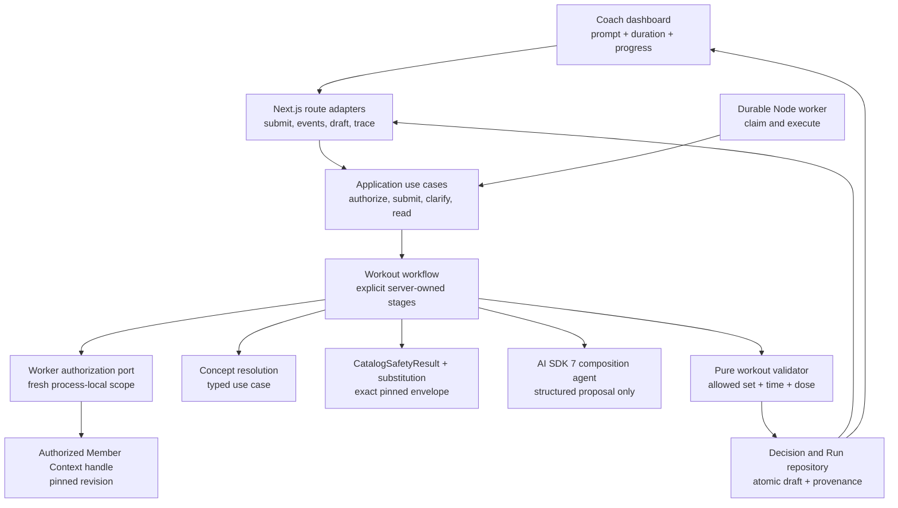
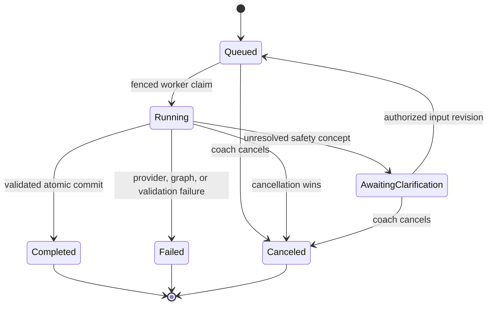
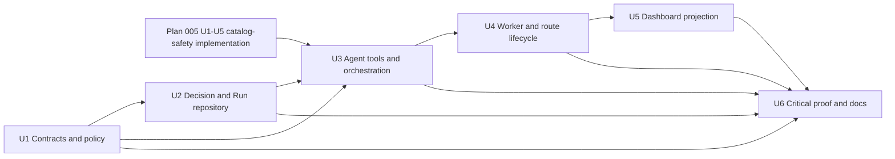

# Agentic Workout Generation Runtime - Plan

## Goal Capsule

- **Objective:** Turn an authorized coach's workout prompt and duration into one validated, structured draft plus a reproducible provenance trace.
- **Product authority:** `ASSESSMENT.md` defines the workout shape, graph-controlled safety, and trace requirements. `docs/plans/2026-08-05-001-feat-graph-backed-coach-dashboard-plan.md` defines the runtime, agent, authorization, streaming, and approval boundaries. The current Movement/Clinical and Member Context contracts define the graph read boundaries.
- **Execution profile:** Define immutable workout and run contracts first. Add deterministic composition policy and durable Decision and Run storage next. Add bounded agent orchestration, worker execution, route adapters, and dashboard projection in dependency order.
- **Stop conditions:** Stop if model text decides exercise eligibility, a fixture-authority graph result becomes reviewable, graph revisions are mixed within one run, provenance can be regenerated from current state instead of stored source IDs, or the agent can approve or publish a workout.
- **Tail ownership:** This plan ends at a reviewable draft and trace. Coach override, approval, publication, and member delivery remain separate workflows.

---

## Product Contract

### Summary

The workout generator must accept a prompt and time window, use the existing graph-backed services, and return a warm-up, main workout, and cool-down with dose and rest guidance. The runtime may use a model to interpret intent and compose from eligible candidates. It must not use model text as the source of safety.

Each successful draft must include a short trace that explains why each exercise was selected, which graph and member facts were used, and which candidates were removed or down-ranked. The stored trace must reproduce the decision against the exact Member Context and Movement/Clinical revisions used by the run.

### Problem Frame

The repository already has typed concept resolution, canonical Movement/Clinical queries, deterministic movement safety, reviewed substitutions, revision-pinned Member Context retrieval, and a fixture-backed workout UI. It has no production workout contract, run lifecycle, durable recommendation provenance, agent orchestration, worker, or generation route. A direct model call would bypass the graph authority that the assessment is designed to demonstrate.

### Actors

- A1. **Coach:** Submits a prompt and duration, receives progress, and reviews the resulting draft and trace.
- A2. **Workout runtime:** Owns orchestration, validation, idempotency, and the transition from an untrusted proposal to a reviewable draft.
- A3. **Workout composition agent:** Interprets intent and proposes a structured workout from bounded, typed inputs. It cannot approve, publish, widen member scope, or decide safety.
- A4. **Decision recorder:** Persists the run, immutable draft, selected and rejected decisions, and exact evidence identifiers.

### Requirements

**Request and authority**

- R1. The runtime accepts a server-authorized coach/member scope, a non-empty prompt, and a duration in minutes.
- R2. One run pins one canonical Movement/Clinical revision and one authorized Member Context revision before it reads candidates or asks a model to compose.
- R3. The runtime resolves prompt mentions and member injury, equipment, exclusion, and preference facts through the existing typed application use cases.
- R4. Unresolved safety-critical concepts, unavailable canonical graph state, insufficient member safety context, or a breached query bound fail closed and produce no reviewable draft.

**Agentic composition**

- R5. The composer receives only canonical typed intent, eligible candidate data, dose bounds, reason/status codes, and stable IDs prepared by server-owned stages. It receives no raw prompt, injury, applicability, preference, evidence text, authorization data, or hidden exclusion.
- R6. Exercise eligibility, hard exclusions, cautions, down-ranking, and substitutions come from graph-backed deterministic results and cannot be overridden by the prompt or model.
- R7. The model returns a structured proposal with warm-up, main, and cool-down sections; each item includes a canonical exercise ID, dose, rest, and a concise rationale. Server policy computes planned work, rest, and transition seconds for deterministic time validation.
- R8. A pure policy validates schema, candidate membership, duplicate use, section coverage, duration budget, dose bounds, and all final safety decisions after model composition.
- R9. Only a proposal that passes final deterministic validation becomes an immutable reviewable draft. A partial or malformed proposal remains run evidence and never becomes workout content.

**Provenance and lifecycle**

- R10. Every run records separate idempotency and request digests, actor/member ownership, a protected prompt snapshot, duration, model configuration identifier, policy revision, graph revision IDs, start/end times, and terminal state.
- R11. Every selected, excluded, down-ranked, cautioned, and substituted exercise records the decision kind, canonical concept IDs, source assertion IDs, contributing path IDs, and human-readable explanation projection.
- R12. A workout draft is stored as a PROV-O-aligned Entity generated by the run Activity and derived from the exact member, graph, policy, candidate, and model-proposal Entities used by that run.
- R13. Historical trace reads use stored revision and assertion IDs. They never reopen the active graph to reconstruct an old decision.
- R14. Idempotency is unique by authorized coach, member, action, and idempotency key. The same key and request digest replays the existing run, the same key with a different digest conflicts, and a new key may create a new run for identical input.
- R15. Runs persist queued, running, awaiting-clarification, failed, canceled, and completed states with allowed transitions. Clarification appends an immutable input revision and requeues the same run. Failed, canceled, and completed are terminal; retry creates a linked new run, and cancellation wins only when it linearizes before completion.

**Delivery and integration**

- R16. The submission route returns a run identifier and exposes only bounded, privacy-safe progress events; unvalidated workout content is never streamed as final content.
- R17. Initial event reads and reconnects re-authorize coach, member, and run ownership. The final event points clients to an authoritative draft read.
- R18. The dashboard adapter projects the immutable draft, exclusions, and decision paths into the existing workout sections and rationale surfaces without exposing Neo4j or AI SDK types.
- R19. Unit and integration tests run without a live model by using deterministic composer, graph, clock, and ID adapters.
- R20. The runtime emits correlation identifiers and outcome metadata without logging prompts, member evidence text, provider payloads, or safety rationales by default.
- R21. A run stores a durable authorization-reference identifier bound to coach, member, and run, never a session cookie, raw grant, or process-local Member Context scope. Claim, protected stages, replay, and completion re-authorize it and fail closed on expiry or revocation.
- R22. A durable resolved-constraint snapshot records canonical constraints, applicability, zero-match certificate fields, resolver/search-policy versions, evidence IDs, both pinned revisions, and a digest before catalog evaluation. Process-local safety tokens are never persisted.
- R23. Worker claims use expiring leases, heartbeats, monotonically increasing fencing generations, and atomic reclaim. Every checkpoint, event append, failure, cancellation, and completion verifies the current fence.
- R24. The validation receipt binds the run, claim generation, request digest, revision/seal digests, resolved-constraint digest, safety-envelope digest, complete decision-set digest, model-proposal digest, workout payload digest, provenance digest, and policy/schema versions.
- R25. Raw prompt and provider artifacts are sensitive records with separate authorization and retention. Ordinary run, draft, trace, event, log, error, and model payload projections expose only allowlisted typed fields.
- R26. Event cursors are opaque, run-bound, schema-versioned, and allocated from one atomic per-run sequence. Pruned history returns a typed resync-required result, and historical trace integrity failures never fall back to current graph data.
- R27. The server computes deterministic item and section time from planned work, rest, and transitions and validates the total against the requested duration policy.

### Key Flows

- F1. **Generate a reviewable workout**
  - **Trigger:** A1 submits a prompt and duration for the active member.
  - **Actors:** A1-A4.
  - **Steps:** The application authorizes scope, pins both graph revisions, resolves intent and member constraints, computes the eligible candidate set, obtains a structured proposal, validates the complete proposal, persists the draft and trace, and completes the run.
  - **Outcome:** The dashboard reads one immutable draft and its trace by run/version ID.
  - **Covered by:** R1-R27.
- F2. **Request clarification**
  - **Trigger:** A safety-critical phrase cannot resolve at the required confidence.
  - **Actors:** A1-A3.
  - **Steps:** The runtime persists the resolution evidence and clarification candidates, records `awaiting-clarification`, and stops before composition. An authorized answer appends a new input revision and requeues the run.
  - **Outcome:** A1 receives a bounded clarification state and no workout draft until the revised input passes the full workflow.
  - **Covered by:** R3-R4, R15-R17, R21-R26.
- F3. **Recover or reconnect**
  - **Trigger:** The client disconnects, a duplicate submit arrives, or a worker is restarted.
  - **Actors:** A1, A2, A4.
  - **Steps:** The application re-authorizes the run, replays ordered durable events, and either resumes the claimed stage or returns the terminal result.
  - **Outcome:** One input produces at most one immutable draft.
  - **Covered by:** R10, R14-R17, R21-R26.
- F4. **Inspect a historical decision**
  - **Trigger:** A1 opens the reason for a selected or excluded exercise.
  - **Actors:** A1, A4.
  - **Steps:** The application authorizes the draft, opens stored revisions, resolves stored assertion IDs, and projects the recorded path.
  - **Outcome:** The trace remains stable after active graph revisions change.
  - **Covered by:** R10-R13, R18, R21, R25-R26.

### Acceptance Examples

- AE1. **Knee-aware generation:** Given an authorized member with a knee injury plus separately cited, server-verifiable current applicability for the rule vocabulary and a 45-minute lower-body request, the runtime excludes prohibited knee-loading candidates, returns a complete draft, and traces each exclusion to stored rule and anatomy assertion IDs. Stored `recovering` or `mild` text alone requires clarification.
- AE2. **Limited equipment:** Given dumbbells and a kettlebell but no barbell, the runtime removes barbell-only candidates, revalidates reviewed substitutions, and records equipment and substitution assertion IDs for the selected alternatives.
- AE3. **Deadlift zero-match:** Given the current catalog and a prompt that excludes deadlifts, the revision-bound resolver certificate records the empty search without changing classifications. The trace retains resolver identity, exact revision, canonical query, policy version, bounds, empty-result attestation, and evidence ID.
- AE4. **Prompt attempts to bypass safety:** Given a prompt that asks the agent to ignore the knee restriction, the same deterministic exclusions apply and the prompt is stored only as an input Entity.
- AE5. **Malformed proposal:** Given a model proposal with an unknown exercise or an over-budget section, validation fails, the run records a typed failure, and no reviewable draft is created.
- AE6. **Historical reproducibility:** Given a completed run followed by new active graph revisions, the trace still resolves the original member revision, Movement/Clinical revision, decisions, and assertions.
- AE7. **Duplicate and reconnect:** Given a repeated submission and an event-stream reconnect, the client observes one run, monotonic deduplicated events, and one final draft.
- AE8. **Cataloged family exclusion:** Given an exclusion for a cataloged split-squat family, all resolved reviewed variants are absent from the final draft and present in the trace as explicit exclusions.

### Success Criteria

- All safety-sensitive acceptance examples produce deterministic results without a live model.
- Every final exercise and every removed candidate has a complete decision record with stable revision and assertion references.
- No invalid, canceled, partial, non-canonical, or unvalidated run creates a reviewable workout draft.
- The generated draft and trace project into the existing dashboard contract without importing graph or model-provider types into React components.
- The local injury, equipment, and explicit-exclusion examples complete within the assessment's approximate five-second interactive target when providers are available; correctness remains the release gate.

### Scope Boundaries

**Included**

- Initial workout generation from prompt plus duration.
- Typed server-owned workflow stages over existing resolver, Member Context, safety, and substitution use cases, plus one bounded composition adapter.
- Durable run, workout draft, decision, event, and provenance records in a separate Decision and Run namespace.
- Submission, event replay, final draft, and trace read adapters.
- Dashboard projection and focused browser coverage for the generated draft.

**Deferred to Follow-Up Work**

- Natural-language adjustment, coach override, approval, publication, and member delivery workflows. The immutable version and provenance contracts must support them without implementing them here.
- General graph visualization, a broad evaluation platform, provider failover, and distributed queues.
- Production authentication, clinical validation, and real member data.

**Outside this product's identity**

- Model-authored Cypher, model-decided safety, direct client access to Neo4j, or automatic approval/publication.

### Sources

- `ASSESSMENT.md` defines the required form, structured workout, graph authority, and trace content.
- `docs/plans/2026-08-05-001-feat-graph-backed-coach-dashboard-plan.md` supplies the settled Node/Next.js, AI SDK 7, worker, streaming, authorization, and agent authority decisions.
- `docs/plans/2026-08-05-004-feat-graph-backed-services-plan.md` identifies the workout-runtime dependency order and existing dashboard projection seam.
- `docs/plans/2026-08-06-005-feat-graph-traversed-catalog-safety-plan.md` defines the batch catalog-safety and exact-envelope validation contracts consumed by this runtime.
- `docs/graph/movement-clinical-schema.md` defines canonical authority, pinned reads, safety result provenance, and the separate Decision and Run graph boundary.
- `docs/graph/member-context-schema.md` defines authorized revision-pinned Member Context reads and downstream pin-and-cite behavior.

---

## Planning Contract

### Product Contract Preservation

Product Contract created from the focused assessment workstream. It narrows delivery to initial generation and its provenance trace; adjustment, override, approval, and publication remain follow-up workflows.

### Assumptions

- The confirmed scope consumes the revision-bound `CatalogSafetyResult` from `src/application/use-cases/evaluate-catalog-safety.ts` and the validator in `src/application/use-cases/validate-workout-candidates.ts`. It does not duplicate graph traversal or per-exercise safety policy.
- The first release uses the existing 30-60 minute, five-minute-increment dashboard range. Duration allocation remains a versioned domain policy so a later UI can widen the range.
- The canonical deployment uses one Neo4j database with separate Movement/Clinical, Member Context, and Decision and Run labels, revision catalogs, repository ports, and retention rules.
- AI SDK 7 is added as an outer adapter dependency. The model provider and model ID remain runtime configuration behind the same application port.
- The runtime is durable even for the take-home. A Route Handler submits work, and a separately invokable Node worker owns model execution and final persistence.
- Plan 005 U1-U5 must land before U3 begins. Its process-local evaluation sessions remain authoritative and are re-created after expiry or restart from a durable resolved-constraint snapshot.

### Key Technical Decisions

- KTD1. **Use an explicit workflow around a bounded composition agent.** Server-owned stages perform authorization, revision pinning, context reads, resolution, safety, candidate preparation, validation, and persistence. AI SDK 7 structured output is used only for proposal composition. This follows the SDK's structured-workflow guidance for reliable control flow and keeps an open-ended tool loop away from safety gates. Governs R1-R9, R15.
- KTD2. **Expose typed stage ports and inject scope outside the model.** The orchestrator invokes bounded resolver, member-context, catalog-safety, substitution, and composition stages. The model sees their immutable projections but cannot choose identities, revisions, query structure, approval, or publication. This keeps action and context parity on the shared run record without making authorization model-controllable. Governs R2-R6, R17, R20.
- KTD3. **Validate the complete proposal with pure domain policy.** The allowed candidate set and every final safety result are authoritative. The validator also enforces the versioned duration allocation, dose bounds, required sections, and uniqueness before persistence. Model retries may repair shape but cannot change the allowed set. Governs R6-R9, R19.
- KTD4. **Model provenance as stored run and decision records with a PROV-O projection.** A run is a PROV Activity. Prompt, graph revisions, policy revision, candidate set, model proposal, and member evidence are Entities it used. The immutable workout is a generated Entity. Per-exercise Decision records retain application-specific meaning and project `used`, `wasGeneratedBy`, and `wasDerivedFrom` links without replacing typed domain edges. Governs R10-R13.
- KTD5. **Commit a completed draft and its provenance atomically.** The repository transaction verifies the claimed run, pinned revisions, terminal precedence, input digest, validation receipt, and complete decision records. It then creates one immutable workout version and the terminal event. Governs R9-R15.
- KTD6. **Separate submission, execution, and replay.** Next.js Route Handlers validate and authorize requests, the worker claims durable runs, and a no-cache SSE route replays monotonic bounded events. Final content is fetched through an authoritative read instead of trusted from the stream. Governs R14-R17.
- KTD7. **Keep SDK and database types at the outer edge.** Domain contracts and policies contain no Next.js, AI SDK, provider, or Neo4j driver types. The workout runtime, composer, run store, clock, IDs, and event sink are injected ports with deterministic test adapters. Governs R18-R20.
- KTD8. **Project one canonical record into workout and rationale UI surfaces.** The dashboard adapter maps draft sections, decisions, and provenance paths into the existing `DashboardWorkoutItem`, exclusions, versions, and decision-path structures. It does not recompute reasons from fixture text. Governs R11, R13, R18.
- KTD9. **Pin revisions during run creation and use one bounded catalog-safety snapshot.** The submission boundary opens the authorized current Member Context and canonical Movement/Clinical revisions, includes them in the run digest, and persists them before queueing. The worker reopens those named revisions and consumes the `CatalogSafetyResult` from `evaluate-catalog-safety.ts`. Final validation calls `validate-workout-candidates.ts` against that exact evaluation envelope instead of issuing active-revision or per-item fan-out. Governs R2-R6, R10, R14, R20.
- KTD10. **Re-authorize durable work through a grant-reference port.** Submission stores only a stable authorization reference bound to coach, member, and run. A worker authorizer mints a fresh process-local Member Context scope at claim and every protected stage. Expiry or revocation invalidates the safety session and ends the attempt without a reviewable draft. Governs R2-R5, R17, R21, R25.
- KTD11. **Use leased, fenced execution with durable stage checkpoints.** Claims carry an expiry, heartbeat, and monotonically increasing generation. Resolved input, resolved-constraint digest, proposal digest, and terminal outcome are durable checkpoints; process-local catalog candidates and validation tokens are not. Every mutation verifies the current fence, and a stale worker cannot append or commit. Governs R14-R15, R23-R24.
- KTD12. **Re-evaluate after safety-session loss.** The worker recreates a fresh plan-005 evaluation at the same pinned revisions from the durable resolved-constraint snapshot. It discards the prior candidate brief, proposal, token, and receipt. Final candidate validation and atomic completion occur in the same worker process before the token is invalidated. Governs R2-R6, R9, R22-R24.
- KTD13. **Separate replay, clarification, and retry identities.** One idempotency key identifies one request attempt and conflicts on changed payload. Clarification revises and requeues that attempt with a new effective-input digest. A failed attempt stays terminal; retry creates a new run with `retryOfRunId` and a new key. Governs R14-R15.
- KTD14. **Supersede the parent plan's multi-agent generation topology for this slice.** Initial workout generation uses server-owned stages and one composer port with no model-callable graph, member, safety, authorization, or mutation tools. The parent plan's worker, event, observability, and human-only mutation boundaries remain authoritative. Governs R5-R9, R18-R20.
- KTD15. **Bind validation and replay to canonical digests.** The validation receipt carries every binding in R24, and atomic completion recomputes them from the records being written. Event cursors bind run, exclusive next sequence, and stream schema; trace reads verify revision seals, assertion membership, trace schema, and canonical trace digest before projecting any content. Governs R9-R13, R16-R17, R24, R26.

### High-Level Technical Design

#### Component topology



#### Generation sequence

```mermaid
sequenceDiagram
  participant C as Coach client
  participant R as Route Handler
  participant S as Run store
  participant W as Worker
  participant G as Graph services
  participant A as Composition agent
  participant V as Validator

  C->>R: submit prompt and duration
  R->>S: pin revisions, store grant ref, create-or-find run
  R-->>C: run ID
  W->>S: acquire fenced leased claim
  W->>G: reauthorize; reopen pinned revisions; resolve constraints
  G-->>W: constraint snapshot and exact safety envelope
  W->>A: compose from bounded candidate set
  A-->>W: structured proposal
  W->>V: validate full proposal against evidence
  alt valid and not canceled
    V-->>W: validation receipt
    W->>S: reauthorize; recompute receipt; atomic draft, trace, event
    S-->>C: completion event points to final read
  else clarification, invalid, or canceled
    W->>S: terminal state and bounded reason
    S-->>C: no reviewable draft
  end
```

#### Durable run state



#### Caller and authority matrix

| Caller | Allowed actions | Context | Forbidden actions |
|---|---|---|---|
| Coach route | Submit, answer clarification, cancel, read run/draft/trace | Server session plus re-authorized member/run scope | Execute graph stages, validate candidates, approve, publish |
| Worker | Claim, renew lease, invoke server-owned stages, checkpoint, complete/fail | Durable grant reference, pinned revisions, current fence | Change identity/revisions, bypass safety, approve, publish |
| Composition model | Propose dose and order from the redacted eligible-candidate DTO | Stable IDs, typed intent, bounds, reason/status codes | Graph/member queries, hidden exclusions, raw health text, mutations |
| Coach-only follow-up | Future override, approval, publication | Exact immutable workout version and trace | Automatic model invocation without human confirmation |

### Output Structure

```text
src/
  agents/workout/
    runtime.ts
    tools.ts
    schemas.ts
  application/ports/
    workout-composer.ts
    workout-run-repository.ts
    worker-authorization.ts
  application/use-cases/
    submit-workout-run.ts
    execute-workout-run.ts
    retrieve-workout-run.ts
    answer-workout-clarification.ts
    retry-workout-run.ts
  domain/contracts/
    workout.ts
    workout-run.ts
    workout-provenance.ts
  domain/policies/
    workout-composition.ts
  graph/
    repositories/workout-runs.ts
    repositories/neo4j-workout-runs.ts
    schema/workout-run-schema.ts
  workers/
    workout-run-worker.ts
  app/api/workout-runs/
    route.ts
    [runId]/route.ts
    [runId]/events/route.ts
    [runId]/clarification/route.ts
    [runId]/retry/route.ts
tests/
  fixtures/workout-runtime-builder.ts
  unit/workout-composition.test.ts
  unit/workout-provenance.test.ts
  unit/workout-runtime.test.ts
  integration/workout-run-repository.neo4j.test.ts
  integration/workout-generation.test.ts
  e2e/workout-generation.spec.ts
```

### Sequencing and Dependencies



### System-Wide Impact

- **Data lifecycle:** Decision and Run records add a third graph namespace with its own immutable payload, retention, and authorization rules. They reference but do not copy Movement or Member Context facts.
- **Authorization:** A durable grant reference lets each process mint a fresh opaque Member Context scope after re-authorization. Cookies, raw grants, and process-local scopes never enter run records, model DTOs, events, or telemetry.
- **Agent access:** The UI and worker share one durable run workspace and one redacted context projection. Action asymmetry is intentional: the model proposes only, while route and future coach-only workflows own human actions.
- **Observability:** Run, tool call, graph revision, constraint decision, validation, and draft IDs correlate spans. Sensitive text remains excluded from default telemetry and stream errors.
- **Performance:** Revision pinning and catalog safety produce one bounded snapshot before the provider call. Independent graph reads may use capped concurrency, but the final candidate order is stable. One provider call composes the prepared candidate set, and capped retries share the same run/input digest.

### Risks and Mitigations

- **Agent bypasses graph authority:** Give the model no broad catalog search or mutation tool. Recheck every proposed exercise against the prepared candidate set and final safety service result.
- **Trace and workout drift:** Persist the draft, validation receipt, decisions, and provenance in one transaction. Trace reads use stored IDs and revisions.
- **Duplicate or late execution:** Claim runs with compare-and-swap semantics, make the revision-bound input digest unique within authorized scope, and check cancellation before commit.
- **Revision drift between submit and worker claim:** Pin both graph revisions in the run creation transaction. The worker opens those named revisions and fails closed if either is unavailable.
- **Safety token expires or disappears after restart:** Re-authorize, rebuild the evaluation from the durable resolved-constraint snapshot at the pinned revisions, and discard all derived candidates and proposals from the lost session.
- **Worker crashes or a lease expires:** Reclaim with a higher fence and reject every append or commit from the stale worker. Checkpoint transitions and their events are atomic.
- **Graph-query fan-out misses the latency target:** Consume a bounded catalog evaluation from the safety layer, cap any compatibility fallback concurrency, record query counts and duration, and keep a deterministic provider-free benchmark fixture.
- **Provider output or timeout failure:** Keep the last valid dashboard state, store a bounded typed failure, allow idempotent retry, and never stream partial workout content as authoritative.
- **Cross-member disclosure:** Re-authorize every route and replay, use no shared caching, validate event IDs against the run, and sanitize errors.
- **Sensitive prompt or provider artifacts leak:** Apply the plan-005 allowlist at provider serialization and ordinary reads, store sensitive artifacts under separate authorization/retention, and render model rationale as untrusted text.
- **Cursor or historical trace corruption:** Allocate event sequence numbers atomically, return resync-required after pruning, verify revision seals and assertion membership, and never reconstruct from active state.
- **Over-broad runtime scope:** Keep adjustment, approval, publication, general evaluation infrastructure, and distributed queueing in follow-up work.

### Sources and Research

- `src/application/use-cases/resolve-movement-concepts.ts` provides typed mention resolution. `src/domain/contracts/catalog-safety.ts`, `src/application/use-cases/evaluate-catalog-safety.ts`, and `src/application/use-cases/validate-workout-candidates.ts` provide the planned revision-bound batch decision and exact-envelope validation boundary.
- `src/application/use-cases/retrieve-member-context.ts` provides the opaque authorized scope and per-query re-authorization pattern.
- `src/application/ports/graph-repositories.ts` demonstrates inward-facing provider composition.
- `src/features/coach-dashboard/fixture-adapter.ts`, `src/features/coach-dashboard/dashboard-contract.ts`, and `src/features/coach-dashboard/state.ts` define the current projection and immutable-version UI vocabulary.
- [AI SDK 7 agent documentation](https://ai-sdk.dev/docs/agents/overview) distinguishes flexible tool loops from explicit structured workflows and supports structured agent output.
- [AI SDK 7 streaming data documentation](https://ai-sdk.dev/docs/ai-sdk-ui/streaming-data) supports typed custom data parts over SSE; durable run state remains application-owned.
- [Next.js Route Handler documentation](https://nextjs.org/docs/app/getting-started/route-handlers) confirms App Router request/response route adapters and uncached mutation behavior.
- [W3C PROV-O](https://www.w3.org/TR/prov-o/) defines Entity, Activity, Agent, `used`, `wasGeneratedBy`, and `wasDerivedFrom`; typed application decisions remain the domain authority.
- No applicable `docs/solutions/` learnings exist in this repository.

---

## Implementation Units

### U1. Define workout, run, provenance, and composition contracts

- **Goal:** Establish provider-independent immutable records and pure rules for a structured reviewable workout.
- **Requirements:** R1-R15, R19-R27; F1-F4; KTD3-KTD4, KTD7, KTD11-KTD15.
- **Dependencies:** None.
- **Files:**
  - `src/domain/contracts/workout.ts`
  - `src/domain/contracts/workout-run.ts`
  - `src/domain/contracts/workout-provenance.ts`
  - `src/domain/policies/workout-composition.ts`
  - `src/application/ports/workout-composer.ts`
  - `src/application/ports/workout-run-repository.ts`
  - `tests/fixtures/workout-runtime-builder.ts`
  - `tests/unit/workout-composition.test.ts`
  - `tests/unit/workout-provenance.test.ts`
- **Approach:**
  1. Define branded IDs, immutable input revisions, run states, claim generation/fence records, `ResolvedConstraintSnapshot`, immutable workout versions, section/item dose records, candidate decisions, digest-bound validation receipts, provenance links, and typed failures.
  2. Define a versioned duration policy for the existing 30-60 minute range. The server computes planned work seconds, rest seconds, transition seconds, section totals, and permitted tolerances without relying on model arithmetic.
  3. Define a pure validator that accepts only canonical candidates with complete decision evidence. It rejects duplicates, unknown IDs, unsafe results, missing sections, invalid dose, and budget overflow.
  4. Define the composer and repository ports without AI SDK or Neo4j types.
- **Execution note:** Implement the domain policy test-first because every later boundary trusts its validation receipt.
- **Patterns to follow:** Discriminated result unions in `src/domain/contracts/movement-safety.ts`; pure decision functions in `src/domain/policies/movement-safety.ts`; explicit bounds in `src/application/use-cases/evaluate-movement-safety.ts`.
- **Test scenarios:**
  1. A 30-, 45-, and 60-minute candidate proposal allocates all required sections and stays within the duration policy.
  2. Covers AE5. An unknown exercise, duplicate exercise, missing section, invalid dose, missing rest, or budget overflow returns a typed invalid result and no validation receipt.
  3. A candidate with `excluded`, `fail_closed`, missing canonical authority, or a mismatched graph revision cannot pass validation.
  4. `caution` and `downranked` candidates retain their decision paths and visible warnings when policy permits selection.
  5. A complete selection and exclusion set yields a provenance bundle in which every decision cites the pinned graph and member revisions.
  6. Serialization and rehydration preserve IDs, order, dose, decision kinds, and input digest exactly.
  7. A receipt with any changed run ID, claim generation, input/snapshot/envelope/decision/proposal/workout/provenance digest, revision seal, or policy/schema version cannot authorize completion.
  8. The same ordered inputs always produce identical item and section timing totals, including transitions and tolerance checks.
- **Verification:** Domain tests prove deterministic composition and provenance completeness without a graph, model, clock, or network.

### U2. Add the durable Decision and Run repository

- **Goal:** Persist run lifecycle, events, immutable drafts, decisions, and PROV-O-aligned links with atomic completion.
- **Requirements:** R9-R17, R19-R27; F2-F4; KTD4-KTD6, KTD10-KTD13, KTD15.
- **Dependencies:** U1.
- **Files:**
  - `src/graph/schema/workout-run-schema.ts`
  - `src/graph/repositories/workout-runs.ts`
  - `src/graph/repositories/neo4j-workout-runs.ts`
  - `src/graph/cypher/workout-runs.ts`
  - `src/graph/neo4j/workout-run-schema.ts`
  - `docs/graph/workout-run-schema.md`
  - `tests/unit/workout-run-repository-contract.test.ts`
  - `tests/integration/workout-run-repository.neo4j.test.ts`
- **Approach:**
  1. Add separate run, input, event, proposal, validation, workout-version, exercise-decision, and provenance-link roles under a Decision and Run namespace.
  2. Enforce idempotency uniqueness on `(coachId, memberId, action, idempotencyKey)` and store its canonical request digest. Same-key/same-digest calls replay; same-key/changed-digest calls conflict; a new key may intentionally create another run for identical input.
  3. Implement create-or-find, leased claim, heartbeat, fenced checkpoint/event append, clarification-input revision and requeue, linked retry creation, fail, cancel, atomic-complete, and authorized-read operations behind the repository port. Failed runs stay terminal; retry creates a distinct `retryOfRunId` run.
  4. Make every mutation verify the current claim generation/fence. Atomic completion also reauthorizes, verifies cancellation precedence, recomputes the pinned revision/seal and snapshot/envelope/decision/proposal/workout/provenance digests, and writes the draft plus terminal event in one transaction.
  5. Document retention and historical trace resolution without adding relationships into the Movement/Clinical or Member Context namespaces.
- **Patterns to follow:** Revision identity and compare-and-swap activation in `src/graph/revisions/movement-graph.ts`; repository/provider separation in `src/graph/repositories/movement-graph.ts`; static parameterized Cypher in `src/graph/cypher/movement.ts`.
- **Test scenarios:**
  1. First submit creates a queued run; the same authorized digest returns it; another member receives a distinct result and cannot read the first run.
  2. Two workers race to claim one run and only one receives execution ownership.
  3. Event IDs increase monotonically, replay after a cursor returns only later events, and forged or foreign cursors fail without evidence disclosure.
  4. Covers AE7. Duplicate completion attempts create one workout version and one terminal event.
  5. Cancellation before completion prevents a late worker from committing a draft.
  6. A missing decision, revision mismatch, invalid receipt, changed payload digest, or partial provenance bundle rejects the whole completion transaction.
  7. Covers AE6. A historical trace opens stored revisions and assertion IDs after active graph pointers change.
  8. Same key/same digest replays, same key/changed digest conflicts, and a new key with the same request creates a distinct run.
  9. A reclaimed lease increments the fence; the stale worker cannot checkpoint, append, fail, or complete afterward.
  10. Clarification appends one immutable input revision and requeues the same run; retry of a failed run creates one linked run and never mutates the failure.
  11. Event cursors are opaque, run-bound, exclusive-next-sequence, and schema-versioned. Malformed, foreign, or ahead-of-high-water cursors disclose nothing; a pruned cursor returns typed `resync_required` with an authoritative snapshot link.
  12. Trace verification fails on a changed seal, assertion membership, canonical digest, schema version, or projection version and never falls back to active graph state.
- **Verification:** In-memory contract tests and Neo4j integration tests pass the same lifecycle, authorization, idempotency, and historical-reproducibility scenarios.

### U3. Implement bounded workout-agent tools and orchestration

- **Goal:** Execute the server-owned generation stages and use the agent only to compose from authoritative typed inputs.
- **Requirements:** R1-R15, R19-R27; F1-F2; AE1-AE5, AE8; KTD1-KTD5, KTD7, KTD9-KTD15.
- **Dependencies:** U1-U2, the existing graph-backed resolver and Member Context services, and implementation of U1-U5 from `docs/plans/2026-08-06-005-feat-graph-traversed-catalog-safety-plan.md`.
- **Files:**
  - `src/application/use-cases/execute-workout-run.ts`
  - `src/agents/workout/runtime.ts`
  - `src/agents/workout/tools.ts`
  - `src/agents/workout/schemas.ts`
  - `src/agents/workout/ai-sdk-composer.ts`
  - `src/application/ports/workout-composer.ts`
  - `package.json`
  - `tests/unit/workout-runtime.test.ts`
  - `tests/unit/workout-agent-policy.test.ts`
  - `tests/integration/workout-generation.test.ts`
- **Approach:**
  1. Reauthorize the durable worker grant reference at claim and at every protected stage, then reopen the Member Context and Movement/Clinical revisions pinned by run creation. A missing, expired, or revoked grant fails closed without exposing run existence or member evidence.
  2. Read bounded injury, equipment, goals, and preferences; resolve prompt/member mentions once; and persist a `ResolvedConstraintSnapshot` containing resolver/search-policy version, canonical constraints, separately server-verified applicability, zero-match certificates, evidence IDs, both pinned revisions, and a canonical digest.
  3. Request one `CatalogSafetyResult`, then construct the composer DTO from stable eligible IDs, canonical typed intent, dose bounds, reason/status codes, and revision/digest references only. Raw prompt, injury/applicability/preference text, evidence payloads, auth material, and hidden exclusions never cross the provider boundary.
  4. Give AI SDK 7 one structured-output composition capability over the prepared candidate set. This slice supersedes the parent plan's multi-agent generation topology: there are no model-callable graph, member, safety, approval, publication, identity, revision-selection, or query tools.
  5. Validate the final proposal through `validate-workout-candidates.ts` against the exact catalog evaluation envelope, then create the fully bound receipt. Candidate validation and completion run under the same current fence. A shape-repair retry may correct syntax only and cannot add candidates.
  6. If plan 005's process-local evaluation token is missing or expired, discard all derived candidates, proposal, and receipt; reauthorize; rerun the complete evaluation from the stored constraint snapshot at the same pinned revisions; and only then compose again. Never reparse the raw prompt with a newer resolver.
  7. Persist clarification, failure, cancellation, or the atomic completed draft through U2. Checkpoint after constraint resolution, catalog evaluation, proposal, and validation so a reclaimed worker can resume or safely recompute without trusting partial output.
- **Patterns to follow:** `createRetrieveMemberContext` for authorization and revision pinning; `src/domain/contracts/catalog-safety.ts` for the authoritative batch result; `evaluate-catalog-safety.ts` and `validate-workout-candidates.ts` for exact-envelope fail-closed validation; KTD1-KTD3 and KTD9.
- **Test scenarios:**
  1. Covers AE1. A knee-aware 45-minute request returns a structured draft with no excluded candidate and complete rule/anatomy paths only when separately cited server-verifiable applicability is present; otherwise it awaits clarification before composition.
  2. Covers AE2. A no-barbell request selects only available-equipment candidates and traces rejected and accepted substitution paths.
  3. Covers AE3. Because the current catalog has no deadlift candidate, a deadlift exclusion produces a revision-bound zero-match certificate and leaves classifications unchanged.
  4. Covers AE4. Prompt injection that asks to ignore safety cannot change tool scope, candidate eligibility, or validation.
  5. Covers F2. An ambiguous safety mention persists clarification candidates and makes no composer call.
  6. Model timeout, malformed structured output, unknown candidate ID, graph timeout, fixture authority, and empty safe set each produce the expected typed non-reviewable terminal state.
  7. A deterministic fake composer receives no raw authorization token, Neo4j query, full member record, or hidden excluded candidate.
  8. All selected rationales cite evidence actually present in the immutable composition brief; fabricated citation IDs fail validation.
  9. A valid candidate from another catalog evaluation, revision pair, or run-constraint digest fails exact-envelope validation even when the exercise ID is otherwise eligible.
  10. Covers AE8. Excluding a cataloged split-squat family removes every resolved family member before composition and records the affected decisions.
  11. Provider serialization and all log, error, trace, event, and ordinary-read projections pass canary tests for raw prompt, health/applicability/preference/evidence text, auth material, and hidden exclusions.
  12. Crashes after constraint resolution, catalog evaluation, proposal, and validation either resume from a verified fenced checkpoint or discard and recompute the dependent artifacts; no stale worker can complete.
- **Verification:** Provider-independent integration fixtures prove the injury, equipment, exclusion, clarification, malformed-output, and injection cases end in the correct durable state.

### U4. Add submission, worker, replay, and authoritative read adapters

- **Goal:** Connect the form to durable execution and reconnectable progress without placing execution ownership in a request handler.
- **Requirements:** R1-R2, R10, R14-R17, R19-R26; F1-F3; KTD5-KTD7, KTD10-KTD13, KTD15.
- **Dependencies:** U2-U3.
- **Files:**
  - `src/application/use-cases/submit-workout-run.ts`
  - `src/application/use-cases/claim-workout-run.ts`
  - `src/application/use-cases/retrieve-workout-run.ts`
  - `src/application/use-cases/cancel-workout-run.ts`
  - `src/application/use-cases/answer-workout-clarification.ts`
  - `src/application/use-cases/retry-workout-run.ts`
  - `src/application/ports/worker-authorization.ts`
  - `src/workers/workout-run-worker.ts`
  - `src/app/api/workout-runs/route.ts`
  - `src/app/api/workout-runs/[runId]/route.ts`
  - `src/app/api/workout-runs/[runId]/events/route.ts`
  - `src/app/api/workout-runs/[runId]/clarification/route.ts`
  - `src/app/api/workout-runs/[runId]/retry/route.ts`
  - `tests/unit/workout-run-routes.test.ts`
  - `tests/integration/workout-run-stream.test.ts`
- **Approach:**
  1. Add a same-origin, server-session-authorized submit route that validates prompt and duration, pins both current revisions, stores a stable worker-grant reference bound to coach/member/run, computes the revision-bound canonical request digest, and returns a run resource. Never persist the cookie, raw grant, or process-local scope.
  2. Add a separately invokable Node worker that acquires a leased fenced claim, heartbeats it, reauthorizes through the grant-reference port at claim and each protected stage, passes cancellation/timeouts to U3, and allows safe reclaim after process interruption.
  3. Add authorized no-cache event replay with opaque run-bound, exclusive-next-sequence, schema-versioned cursors and bounded privacy-safe event projections. Authorize before cursor parsing; return `resync_required` plus an authoritative snapshot link when retained history no longer covers the cursor.
  4. Add authoritative run/draft/trace reads. The completion event contains identifiers and status, not the canonical workout payload.
  5. Add same-origin clarification and retry routes. Clarification appends an immutable input revision and requeues the current run; retry creates a distinct run linked to a terminal failure.
  6. Map internal failures to stable client states without returning prompts, provider errors, evidence text, or existence details for foreign resources.
- **Patterns to follow:** Next.js App Router Route Handlers; the authorization boundary in `src/application/use-cases/retrieve-member-context.ts`; durable-run decisions in `docs/plans/2026-08-05-001-feat-graph-backed-coach-dashboard-plan.md`.
- **Test scenarios:**
  1. A valid authorized submit returns one run ID; invalid duration, empty prompt, foreign member, and invalid origin create no run.
  2. Disconnecting does not cancel a run; reconnect with the last event ID replays only missing events and ends with an authoritative read link.
  3. Covers AE7. Repeated submit, duplicate worker claim, process restart, and repeated final read do not create duplicate drafts.
  4. Explicit cancellation produces a terminal state and suppresses a late model result.
  5. Foreign run IDs, forged event cursors, stale authorization, and shared-cache attempts disclose no run or member evidence.
  6. Stream output contains only allowlisted status, progress, counts, and identifiers; canary prompt and evidence strings never appear.
  7. A graph revision that changes after submission does not alter the claimed run; deletion or unavailability of either pinned revision fails closed before composition.
  8. Authorization revoked after submit or during execution prevents the next protected stage and completion; ordinary reads and replay remain non-disclosing.
  9. An expired claim is reclaimed with a higher fence, and the old worker cannot append, checkpoint, fail, or complete.
  10. If completion linearizes before cancellation, cancellation returns `already_completed`; otherwise cancellation invalidates the fence and completion cannot commit.
  11. Clarification requeues one immutable input revision without overwriting the original; a retry of a failed run creates one linked run under new idempotency authority.
  12. Malformed, foreign, ahead-of-high-water, and pruned cursors produce the defined non-disclosing error or resync behavior.
- **Verification:** Route and stream integration tests prove authorization, same-origin mutation, idempotency, reconnect, cancellation, sanitization, and authoritative final reads.

### U5. Project generated workouts and traces into the dashboard

- **Goal:** Replace the fixture-only generation completion path with the canonical runtime while preserving the existing coach workflow and accessible rationale views.
- **Requirements:** R16-R18, R20; F1, F3-F4; KTD8.
- **Dependencies:** U4.
- **Files:**
  - `src/features/coach-dashboard/dashboard-contract.ts`
  - `src/features/coach-dashboard/runtime-adapter.ts`
  - `src/features/coach-dashboard/state.ts`
  - `src/features/coach-dashboard/CoachDashboard.tsx`
  - `src/features/coach-dashboard/dashboard.module.css`
  - `tests/unit/dashboard-runtime-adapter.test.ts`
  - `tests/unit/coach-dashboard-state.test.ts`
  - `tests/e2e/workout-generation.spec.ts`
  - `tests/e2e/coach-dashboard-accessibility.spec.ts`
- **Approach:**
  1. Add run and canonical workout projections to the dashboard adapter boundary. Keep fixture mode explicit and read-only.
  2. Submit prompt/duration through U4, attach to progress by run ID, ignore stale-member completions, and fetch the final immutable draft before rendering it.
  3. Project workout sections, item dose, selections, exclusions, warnings, substitutions, and decision paths from the stored draft and trace.
  4. Preserve focus, status announcements, member-switch isolation, responsive behavior, and the distinction between machine proposal and coach-authored decisions.
  5. Render clarification, no-safe-result, provider failure, canceled, disconnected, and retry states without exposing partial unsafe content.
- **Patterns to follow:** `DashboardAdapter` and `buildDashboardFixture` projection separation; per-member workflow state and stale-response guards in `src/features/coach-dashboard/state.ts`; existing workout rationale regions in `CoachDashboard.tsx`.
- **Test scenarios:**
  1. A submitted prompt and duration show concise progress, then replace it with the authoritative immutable workout and trace.
  2. The three sections, dose, rest, reasons, exclusions, and decision paths match the stored canonical record.
  3. Switching members during generation prevents the old member's events or result from replacing the active view.
  4. Reconnect and duplicate completion events do not duplicate versions or announcements.
  5. Clarification, no-safe-result, failed, canceled, and disconnected states preserve the last valid workout and expose appropriate next action.
  6. Keyboard and screen-reader users can submit, hear status changes, inspect each selected/excluded decision path, and return focus to the invoking control.
  7. Mobile and desktop layouts preserve the existing nested workout and rationale navigation.
- **Verification:** Unit and browser tests prove the runtime projection satisfies the existing dashboard contract across success, reconnect, failure, member-switch, and accessibility states.

### U6. Add critical runtime proof, evaluation fixtures, and documentation

- **Goal:** Make graph authority, provenance completeness, lifecycle safety, and the assessment examples executable and reviewable.
- **Requirements:** R1-R27; AE1-AE8.
- **Dependencies:** U1-U5.
- **Files:**
  - `tests/fixtures/workout-generation-scenarios.ts`
  - `tests/unit/workout-composition.test.ts`
  - `tests/unit/workout-provenance.test.ts`
  - `tests/unit/workout-agent-policy.test.ts`
  - `tests/integration/workout-generation.test.ts`
  - `tests/integration/workout-run-repository.neo4j.test.ts`
  - `tests/integration/workout-run-stream.test.ts`
  - `tests/e2e/workout-generation.spec.ts`
  - `docs/graph/workout-run-schema.md`
  - `docs/demo-scenarios.md`
  - `docs/evaluation.md`
  - `README.md`
  - `package.json`
- **Approach:**
  1. Build deterministic Jordan injury/applicability, limited-equipment, deadlift zero-match, cataloged split-squat exclusion, ambiguous-safety, malformed-proposal, duplicate-run, worker-crash/reclaim, authorization-revocation, cancellation, cursor-pruning, receipt-tamper, provider-canary, and historical-trace fixtures.
  2. Add a provenance completeness scorer and a recommendation validity scorer. Safety correctness, candidate membership, and trace completeness are hard gates; model style and latency are reported separately.
  3. Document the Decision and Run schema, PROV-O projection, agent tool boundary, lifecycle, provider configuration, degraded behavior, and synthetic-data rules.
  4. Add the required example input/output traces to the README or demo document from deterministic fixtures, not hand-written copies that can drift.
  5. Add only the package scripts needed to run unit, integration, browser, and focused evaluation gates with the current pnpm toolchain.
- **Patterns to follow:** Existing graph schema documentation under `docs/graph/`; repository scripts in `package.json`; deterministic graph fixtures and integration separation under `tests/unit/` and `tests/integration/`.
- **Test scenarios:**
  1. Covers AE1-AE4 and AE8. Required injury/applicability, equipment, zero-match exclusion, cataloged-family exclusion, and prompt-bypass fixtures produce the expected canonical decisions and trace paths.
  2. Covers AE5. Every invalid or malformed proposal fails before draft persistence.
  3. Covers AE6. Historical traces remain identical after active revision changes.
  4. Covers AE7. Duplicate, reconnect, worker-restart, and cancellation fixtures yield one correct terminal outcome.
  5. A provenance score fails when any selected/excluded decision lacks a run, revision, assertion, source, or derivation link.
  6. Documentation contract tests verify that example IDs and outputs match generated fixtures and that all data is labeled synthetic.
  7. Security fixtures prove worker reauthorization, provider DTO allowlisting, non-disclosing reads/cursors, and sensitive-artifact separation at every projection boundary.
  8. Transactional-integrity fixtures prove lease fencing, cancellation/completion precedence, digest-bound receipt rejection, restart-safe safety reevaluation, and atomic event/provenance completion.
- **Verification:** The focused evaluation gate reports 100% deterministic safety validity and provenance completeness for the required corpus, and all documented examples are reproducible from checked-in fixtures.

---

## Verification Contract

| Gate | Command | Applies to | Done signal |
|---|---|---|---|
| Static quality | `pnpm lint && pnpm typecheck` | U1-U6 | No lint or TypeScript errors. |
| Unit behavior | `pnpm test` | U1, U3-U6 | Composition, provenance, agent policy, routes, adapters, and existing graph/dashboard regressions pass without a live provider. |
| Graph integration | `pnpm test:integration` | U2-U4, U6 | Decision/Run lifecycle, atomic completion, authorization, generation, replay, and historical trace tests pass against pinned Neo4j. |
| Security boundary | New `pnpm test:workout-runtime:security` script | U3-U4, U6 | Grant revocation, provider/read/log/error/event canaries, foreign resources, and cursor attacks fail closed without sensitive disclosure. |
| Transactional integrity | New `pnpm test:workout-runtime:integrity` script | U1-U4, U6 | Lease fencing, crash recovery, safety-token loss, receipt tampering, idempotency conflicts, and cancel/complete races preserve exactly one valid terminal outcome. |
| Browser flow | `pnpm test:e2e` | U5-U6 | Injury, equipment, exclusion, clarification, reconnect, and decision-path journeys pass. |
| Accessibility | `pnpm test:a11y` | U5 | Submission, status, failure, and trace interactions pass automated and documented keyboard checks. |
| Visual regression | `pnpm test:visual` | U5 | Existing AXON views remain intentional after runtime states are added. |
| Production isolation | `pnpm build` | U3-U6 | Build succeeds; server-only graph/model code stays out of client bundles and `ui/` remains disconnected. |
| Focused evaluation | New `pnpm eval:workout-runtime` script | U6 | Required fixtures achieve 100% deterministic safety validity and provenance completeness; latency and model-style scores are reported separately. |

Safety validity, canonical authority, final-plan validation, authorization, idempotency, cancellation precedence, and provenance completeness are release blockers. Provider availability, model style, and approximate five-second latency remain observable quality metrics unless later promoted to hard gates.

---

## Definition of Done

- The form submits an authorized prompt and duration to a durable runtime and receives a run ID.
- One run pins one canonical Movement/Clinical revision and one authorized Member Context revision.
- One run retains only a stable worker-grant reference; every protected worker stage and replay/read reauthorizes, and expiry or revocation fails closed.
- Prompt resolution produces a durable revision-bound `ResolvedConstraintSnapshot`; loss of plan 005's process-local safety session discards dependent artifacts and reruns the entire evaluation at the same pinned revisions.
- The agent composes only from typed eligible candidates and cannot call approval, publication, arbitrary graph, or identity tools.
- The provider receives only the redacted allowlisted composer DTO; raw prompt, health/applicability/preference/evidence text, auth material, and hidden exclusions stay outside provider, ordinary-read, event, log, and error projections.
- The final workout contains warm-up, main, and cool-down sections with valid dose and rest within the duration policy.
- Server-computed work, rest, transition, and section totals deterministically satisfy the requested duration tolerance.
- Deterministic post-composition validation is required before a reviewable immutable draft is stored.
- Validation receipts bind the current claim fence and all input, revision, safety-envelope, decision, proposal, workout, provenance, policy, and schema digests; completion recomputes them atomically.
- Every selection, exclusion, caution, down-rank, and substitution has a stored decision and reproducible revision/assertion path.
- The run, draft, and trace have a complete PROV-O-aligned projection without replacing application-specific edge meanings.
- Duplicate requests, worker races, reconnects, cancellations, and late results cannot create duplicate or invalid drafts.
- Leased claims, heartbeats, and fencing prevent reclaimed stale workers from mutating a run; cancel/complete precedence is linearized.
- Clarification appends an immutable input revision and requeues the run; failed runs remain terminal and retries create linked runs.
- All run, event, draft, and trace reads enforce server-derived coach/member/resource authorization.
- The dashboard renders authoritative workout and rationale projections and preserves member isolation, accessibility, and responsive behavior.
- Required injury/applicability, limited-equipment, zero-match and cataloged-family exclusions, malformed-proposal, restart, privacy, receipt-tamper, and historical-trace fixtures pass deterministic tests.
- Documentation explains the runtime boundary, Decision and Run schema, agent tools, provenance, failure modes, provider configuration, synthetic-data scope, and reproducible examples.
- All Verification Contract gates pass, and abandoned adapters, dead prompt experiments, unused dependencies, and partial runtime paths are removed.

---

## Deferred Implementation Notes

- Confirm the exact AI SDK 7 package version and provider adapter package at implementation time, then pin both in `package.json`; domain and application contracts must not change with provider choice.
- Confirm final Neo4j indexes and transaction query shapes against the pinned local container while preserving the repository contract and static-Cypher rule.
- Tune worker lease, provider timeout, event retention, and safe retry counts from deterministic fault tests and the approximate five-second interaction target.
- Keep natural-language adjustment on the same immutable version, run, validation, and provenance contracts when that follow-up plan is implemented.
