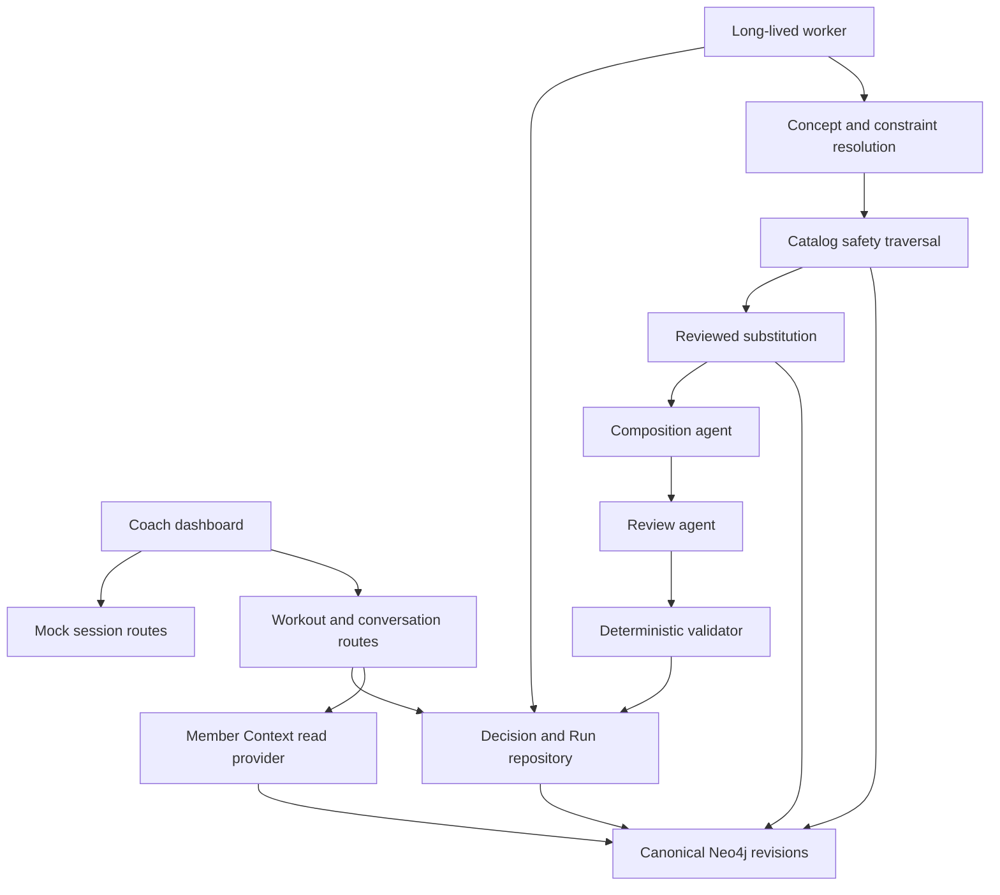
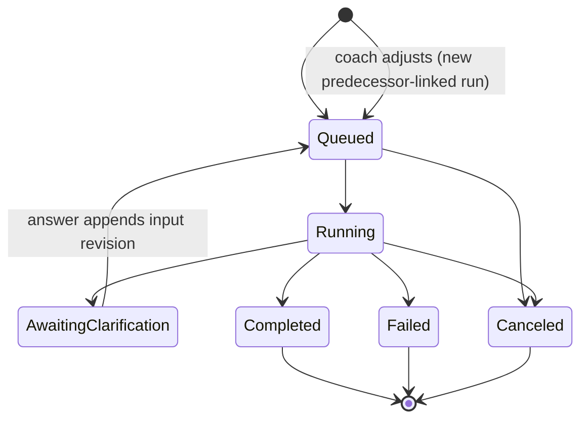
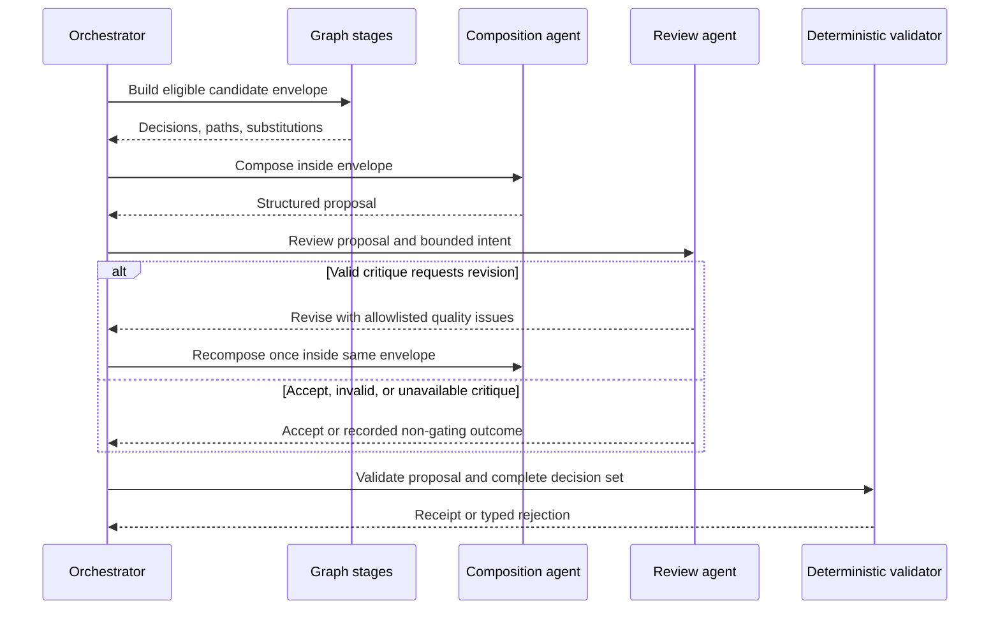
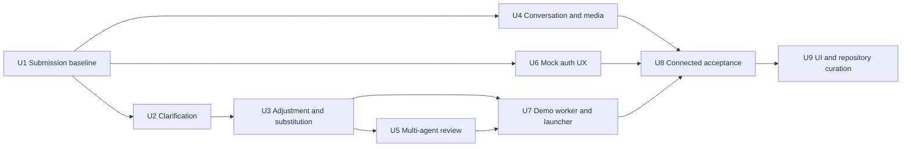

# Grader-Ready Connected Experience - Plan

## Goal Capsule

- **Objective:** Make every grader-visible requirement work through one connected, reproducible coach workflow using the provided Jordan member and canonical Neo4j revisions.
- **Product authority:** The original assignment in `ASSESSMENT.md` defines required behavior. The spec review from 2026-08-07 defines the gaps this plan closes. Existing graph, safety, authorization, and provenance contracts remain authoritative.
- **Execution profile:** Restore a clean submission baseline first. Complete clarification and graph-backed revision flows next. Add conversations, bounded multi-agent review, explicit mock auth, connected demo orchestration, and production-path acceptance evidence after the core workout path is sound.
- **Stop conditions:** Stop if fixture data can become canonical safety authority, a model can change eligibility, an adjustment mutates a historical run, arbitrary graph URLs reach the browser, or a successful evaluation can bypass production resolution and traversal.
- **Tail ownership:** This plan ends with a fresh-clone rehearsal, one-command connected demo, green quality gates, accurate README claims, and a curated Git submission.

---

## Product Contract

### Summary

The submission will provide an under-ten-minute reviewer path from mock sign-in to Jordan's morning brief, workout generation, clarification, graph-backed adjustment, reviewed substitution, provenance inspection, Copilot, and conversation history with a synthetic image. The same production boundaries will drive the connected acceptance tests and documented example plans.

### Problem Frame

The repository has strong graph modeling, deterministic safety, authorization, run persistence, Copilot grounding, and provenance. The product currently stops at critical seams: Jordan cannot answer required injury clarification through the UI, adjustment is client-local, reviewed substitution is not called by production orchestration, and conversation attachments are not visible. The fast-start path also presents a synthetic shell while meaningful connected behavior needs several manual processes.

A hiring reviewer will judge the observable workflow before the internal architecture. This plan preserves the safety architecture while making its evidence visible, reproducible, and proportional to the take-home.

### Actors

- A1. **Coach:** Signs in, selects Jordan, generates and revises a workout, answers bounded safety questions, reviews provenance, and inspects conversation history.
- A2. **Workout orchestrator:** Owns revision pinning, constraint resolution, graph safety, reviewed substitution, agent coordination, validation, and immutable completion.
- A3. **Composition agent:** Proposes a workout from the eligible canonical candidate envelope.
- A4. **Review agent:** Critiques composition quality inside the same envelope. It cannot add candidates, change safety, or mutate graph facts.
- A5. **Deterministic validator:** Remains final authority for candidate membership, dose, duration, safety, and provenance.
- A6. **Reviewer/demo operator:** Starts and verifies the complete synthetic system through documented commands.

### Requirements

**Connected workout flow**

- R1. Jordan's provided injury context must either resolve from canonical typed facts or produce bounded, human-readable clarification fields that the coach can answer in the browser.
- R2. Clarification must append an immutable protected input revision, requeue the same run, replay unchanged deterministic outputs recorded before the clarification point, re-run every affected downstream stage including both model roles, and produce no draft until the full workflow passes.
- R3. A successful connected run must render warm-up, main, and cool-down sections with sets, reps, rest, selected reasons, excluded candidates, graph paths, and both pinned revision IDs.
- R4. Navigation, explicit cancellation, reconnection, stale events, and duplicate actions must not apply one member's or run's completion to another UI state. Navigation alone stops local replay but does not cancel server work; explicit Cancel uses the protected run lifecycle.

**Graph-backed revision and substitution**

- R5. Every adjustment must submit a connected revision request that references an authorized prior workout and carries a bounded optional prompt plus typed duration, intensity, exclusion, injury-applicability, and equipment fields. The server must reject unknown keys, oversized values, invalid vocabularies, cross-origin mutation, and predecessor references outside the session-derived coach/member scope.
- R6. An adjustment must create a new immutable run and workout version linked to its predecessor; it must not mutate the completed run or active Member Context revision.
- R7. Explicit exercise-family exclusions must remove all reviewed variants before composition.
- R8. Equipment-ineligible requested exercises must invoke reviewed graph substitution and expose only alternatives that pass equipment and safety checks.
- R9. A substituted decision must retain the original exercise ID, selected alternative ID, substitution assertion IDs, safety evidence, and both revision IDs in stored and displayed provenance.

**Conversation and media**

- R10. The coach must be able to open a revision-pinned conversation timeline with sender, timestamp, message text, attachment caption, and evidence source.
- R11. Synthetic image attachments must render from an application-owned allowlist keyed by attachment evidence ID; graph data must not supply arbitrary browser URLs.
- R12. Image presentation must state that the asset is synthetic and not analyzed. Missing assets must degrade to a truthful metadata placeholder.

**Agent workflow**

- R13. Provider-backed workout generation must coordinate separate composition and review roles around the existing deterministic graph stages.
- R14. The review agent may accept or request one bounded recomposition for dose imbalance, section coverage, redundant movement patterns, or rationale quality, but it cannot widen the eligible candidate set, alter deterministic decisions, or approve publication.
- R15. Deterministic demo implementations of both model roles must exercise the same ports without provider credentials.

**Demo, evaluation, and authentication**

- R16. One documented command must validate the documented Node, pnpm, container-runtime, memory, and port prerequisites; start or verify Neo4j; publish the tracked revisions idempotently; launch the web app; and run a graceful long-lived worker in deterministic demo mode. The same command accepts an explicit optional provider mode and reports actionable prerequisite failures before startup.
- R17. Connected acceptance tests must discover the knee, deadlift-family, and no-barbell outcomes through production routes, worker orchestration, and real Neo4j reads rather than injected selected/excluded IDs.
- R18. Component evaluation and connected acceptance must have distinct names and claims; generated example plans must come from the connected acceptance capture. Deterministic connected acceptance proves provider-independent graph, exclusion, substitution, lifecycle, and provenance behavior, while provider parsing and role orchestration are verified separately without exact workout-ID claims.
- R19. Local development must present an explicit mock coach sign-in and sign-out flow that rotates and clears a short-lived signed cookie with `HttpOnly`, `SameSite=Lax`, `Path=/`, and `Secure` outside HTTP-only localhost; session responses are private and not cached.
- R20. Expired, tampered, missing, or unauthorized sessions must produce one non-enumerating signed-out/denied experience. A test shortcut is honored only when an explicit test flag is set and `NODE_ENV` is not `production`.

**Submission quality**

- R21. The original assessment must remain unchanged, generated runtime databases and real credential files must be ignored and absent, and every required source/test/data file must be committed. Only placeholder values may appear in `.env.example`.
- R22. Reviewer-facing documentation must lead with the runnable path, include a captured screenshot sequence and connected output for reviewers who cannot run the stack, name intentional limits, defend the multi-agent boundary with observable evidence, and avoid claiming fixture or deterministic-agent evaluation as provider proof.
- R23. The full verification command must fail on lint, types, unit tests, Neo4j integration tests, evaluation drift, build failure, browser failure, or connected acceptance failure, and must label infrastructure failures separately from assertion failures.
- R24. The final repository must be reproducible from a fresh clone without untracked production dependencies or disconnected artifacts required by the demo.
- R25. The existing morning brief and Copilot grounding must remain functional through the same signed session and pinned Member Context revision as a regression requirement; this plan adds no new Copilot behavior.

### Key Flows

- F1. **Generate and clarify Jordan's workout**
  - **Trigger:** A1 submits a prompt and duration for Jordan.
  - **Actors:** A1-A5.
  - **Steps:** The route creates a run, the worker resolves canonical constraints, the UI renders any missing typed applicability fields, the answer appends an input revision, and replay continues through composition, review, validation, and completion.
  - **Outcome:** The browser renders one authoritative workout and its complete trace.
  - **Covered by:** R1-R4, R13-R15.
- F2. **Adjust with graph authority**
  - **Trigger:** A1 excludes a family, changes injury context, changes equipment, or changes dose after reviewing a workout.
  - **Actors:** A1-A5.
  - **Steps:** An Adjust action opens a keyboard-contained form initialized from the prior workout. Separate controls collect duration, intensity, exclusions, injury applicability, and equipment; an optional bounded text field carries extra intent. A submission summary confirms the changes before the client creates a linked run. The worker re-runs resolution, safety, substitution, both model roles, and validation against pinned canonical revisions.
  - **Outcome:** A new workout version shows the exact changes and preserved predecessor link.
  - **Covered by:** R5-R9, R13-R15.
- F3. **Inspect conversation and media**
  - **Trigger:** A1 selects **Conversation** from Jordan's History screen; Back returns to History and restores focus to the trigger.
  - **Actors:** A1-A2.
  - **Steps:** The server authorizes and pins the Member Context revision, retrieves the bounded conversation, maps known synthetic attachments through the asset allowlist, and returns a typed projection.
  - **Outcome:** The coach sees the real synthetic message history and a truthful image or placeholder.
  - **Covered by:** R10-R12, R20.
- F4. **Run the reviewer demo**
  - **Trigger:** A6 executes the documented demo command from a fresh clone.
  - **Actors:** A6 and the local services.
  - **Steps:** The launcher validates prerequisites, starts Neo4j, publishes both graphs, starts the web and worker processes, waits for readiness, and prints the local URL and deterministic mode.
  - **Outcome:** A6 can execute F1-F3 without provider credentials or manual worker commands.
  - **Covered by:** R15-R18, R21-R25. U7 supplies startup and worker readiness; U8 verifies the complete F1-F3 reviewer outcome.

### Acceptance Examples

- AE1. **Knee clarification:** Given the provided Jordan seed, when the worker requests recovery stage or laterality, the UI presents only the missing fields, posts the answer to the same run, and later renders a knee-safe plan.
- AE2. **Prompt bypass attempt:** Given a request to ignore Jordan's knee restriction, the connected result preserves the same excluded knee-loading candidates and evidence paths.
- AE3. **Deadlift family exclusion:** Given “Exclude deadlifts,” no reviewed deadlift variation crosses the composer boundary or appears in the final workout.
- AE4. **Equipment substitution:** Given no barbell and a requested barbell movement, the graph returns a reviewed dumbbell or kettlebell equivalent that independently passes safety, and the trace names the original and replacement.
- AE5. **Adjustment history:** Given a completed workout, when the coach changes equipment or injury context, the original remains immutable and the new linked version shows the changed decisions.
- AE6. **Conversation image:** Given Jordan's home-equipment message, the timeline displays sender, timestamp, exact text, caption, synthetic image, and “not analyzed” status from one pinned revision.
- AE7. **Agent containment:** Given a critic that proposes an excluded exercise or altered graph fact, the response is rejected and the deterministic candidate envelope remains unchanged.
- AE7a. **Agent usefulness:** Given a proposal with a seeded dose-imbalance or redundant-pattern defect, composition-plus-review corrects it within one recomposition while composition-only retains it; safety and the latency budget remain unchanged.
- AE8. **Fresh-clone demo:** Given only documented prerequisites, one command produces a ready URL and a worker that completes a deterministic connected workout.
- AE9. **Session expiry:** Given an expired or tampered cookie, the dashboard returns to mock sign-in and APIs disclose no member or revision state.
- AE10. **Evidence honesty:** Connected evaluation derives observed selected/excluded/substituted IDs from stored production output and fails when an expected graph outcome is absent.
- AE11. **Provider adapter boundary:** Fake provider transports exercise both production role adapters for valid, malformed, timeout, and one-recomposition responses without sending member identifiers, free-text notes, conversations, or evidence IDs.

### Success Criteria

- A reviewer completes sign-in, Jordan generation, clarification, adjustment, provenance inspection, Copilot, and conversation history in under ten minutes.
- The connected golden corpus passes all three required workout scenarios with complete stored provenance.
- The browser suite, including reduced motion, passes without relying on an unavailable live graph for transient-state assertions.
- The README's quick path matches the path exercised by connected acceptance tests.
- A fresh clone has no missing imports, runtime database artifacts, modified assignment text, or undocumented manual worker step.

### Scope Boundaries

**In scope**

- One canonical seeded member for connected workout/Copilot/conversation behavior.
- Deterministic demo model ports and optional provider-backed composition/review.
- A checked-in synthetic placeholder asset for the provided attachment metadata.
- Only refactoring required to implement or verify the connected path; broad dashboard decomposition is deferred.

**Outside this plan**

- Clinical validation, real PHI, arbitrary uploads, image analysis, speech transport, member delivery, production identity, and production deployment.
- General-purpose multi-agent tool loops or model-authored graph queries.
- More canonical Member Context members or a trained churn model.

---

## Planning Contract

### Assumptions

- The assignment's request for a multi-agent workflow is best met by one bounded composition role plus one bounded review role. Deterministic graph stages and validation retain authority.
- Adjustment creates a linked new run because completed run immutability is already a core repository invariant.
- Missing recovery stage and laterality should remain explicit coach attestations instead of being inferred from “recovering” or “left knee” text unless the canonical Member Context schema is extended with reviewed typed fields.
- The demo command may require Node 24, pnpm 11, and Docker, but it must not require provider credentials.
- The single synthetic image is an application asset keyed by evidence ID. The graph stores metadata and lineage, not an executable URL.
- No institutional learning corpus exists under `docs/solutions/`; the plan relies on current code and prior implementation plans.

### Key Technical Decisions

- KTD1. **Resume the same run after typed clarification.** Extend the existing clarification route and immutable protected-input revision behavior. Do not submit a replacement run. Governs R1-R4.
- KTD2. **Represent clarification as typed server-owned fields.** The run resource exposes safe field identifiers and allowlisted options, never internal evidence payloads. The browser serializes answers through the existing protected input boundary. Governs R1-R2, R20.
- KTD3. **Model adjustment as a predecessor-linked run.** Add an adjustment action and predecessor workout reference to submission instead of mutating completed content or the member graph. Governs R5-R6.
- KTD4. **Run reviewed substitution before composition.** Enrich the eligible candidate envelope through `findMovementSubstitutes` only for equipment-ineligible requested exercises, then re-run safety on every alternative. Governs R7-R9.
- KTD5. **Expose conversations through a dedicated bounded capability.** Reuse `MemberContextReadHandle.getConversation`; do not reconstruct history from Copilot answer text. Governs R10-R12.
- KTD6. **Use an attachment asset allowlist.** Map evidence IDs to checked-in synthetic assets at the server/presentation boundary and never trust graph-provided paths or URLs. Governs R11-R12.
- KTD7. **Add one advisory review agent with one recomposition bound.** A valid critique may reject quality and trigger one recomposition. Invalid, timed-out, or candidate-widening critique is recorded and ignored; deterministic validation still gates completion. Governs R13-R15.
- KTD8. **Use the same minimized ports for deterministic demo and provider modes.** Both roles receive canonical intent, eligible candidate IDs and attributes, dose/duration, and non-sensitive reason codes only. They receive no member identifiers, free-text member notes, conversation text, or evidence IDs, and cannot bypass graph or validation stages. Governs R15-R18.
- KTD9. **Run a long-lived queue consumer for local review.** Add bounded claim-next polling, graceful shutdown, and idempotent processing rather than asking reviewers to copy a run ID into a second command. Governs R16-R18.
- KTD10. **Make local identity explicit.** Sign-in and sign-out routes own the signed cookie. A test-only bypass requires both an explicit test flag and a non-production runtime; it is inert in production builds. Governs R19-R20.
- KTD11. **Separate component scorecards from connected acceptance.** Keep the current injected-outcome corpus as a lifecycle/validator evaluation, and generate reviewer examples only from Neo4j-backed production outputs. Governs R17-R18, R22-R23.
- KTD12. **Protect the accepted path from late refactors.** After connected acceptance is green, perform only cleanup required for submission integrity, truthful documentation, or a blocking maintainability issue. Governs R21-R24.

### High-Level Technical Design

#### Connected component topology

#### Run and revision lifecycle

#### Agent authority and retry sequence

### Sequencing

### System-Wide Impact

- **Data lifecycle:** Clarification adds input revisions. Adjustment adds predecessor-linked runs and workout versions. Existing completed runs remain immutable.
- **Authorization:** Conversation, session, clarification, and adjustment operations use server-derived coach/member scope and non-enumerating failures. The worker is a separate internal system actor: it discovers only opaque run IDs, derives scope from stored runs, and may mutate only while it owns the active lease and fence.
- **Agent parity:** The UI and model roles use the same durable run and candidate envelope. Human-only sign-in, clarification attestation, adjustment, and approval remain outside model authority.
- **Operations:** The demo adds a local process supervisor and long-lived worker. Both need health, shutdown, and stale-claim behavior.
- **Documentation:** Example plans, evaluation labels, architecture, run instructions, and known limits must change together with executable captures.

### Risks and Mitigations

- **Clarification exposes sensitive evidence IDs:** Return safe field descriptors and opaque answer keys, while keeping evidence bindings server-side.
- **Adjustment accidentally weakens safety:** Treat every revision as a fresh full evaluation at pinned revisions and reject attempts to inherit the prior eligible set.
- **Substitution becomes semantic guesswork:** Accept only reviewed substitution edges and re-evaluate each alternative for equipment and safety.
- **Review agent adds latency or authority:** Bound it to one call plus one optional recomposition, omit graph/member text, and keep it non-authoritative for safety and completion.
- **Demo orchestration mutates an existing Neo4j volume:** Inspect active revisions and activate idempotently. Fail with recovery instructions when a different active revision would be replaced.
- **Synthetic image path injection:** Use a static evidence-ID allowlist and never return graph-provided paths.
- **Auth UX breaks tests:** Keep explicit test-only session setup and move browser tests through the public sign-in flow where auth behavior is in scope.
- **Late cleanup hides product regressions:** Keep the final unit limited to submission curation and documentation unless a blocking defect requires code movement.

---

## Implementation Units

### U1. Restore a trustworthy submission baseline

- **Goal:** Make the repository's source of truth clear before feature work expands the diff.
- **Requirements:** R21-R24.
- **Dependencies:** None.
- **Files:** `ASSESSMENT.md`, `.gitignore`, `README.md`, `ASSESSMENT_STE100.md`, `data/triggers.db*`, `.env*`, `docs/plans/`, `ui/`, current untracked production and test files.
- **Approach:** Restore `ASSESSMENT.md` from the assignment baseline. Move candidate rationale to README/docs. Ignore and remove runtime SQLite sidecars from the deliverable. Inventory every untracked file as required source, intentional reference, generated state, credential material, or obsolete artifact. Preserve required current work, retain only `.env.example` with placeholders, and remove only artifacts with no reviewer or runtime purpose.
- **Test scenarios:**
  1. A fresh checkout contains every import, data fixture, test, and example referenced by production code or README.
  2. `ASSESSMENT.md` is byte-identical to the baseline assignment.
  3. Starting and testing the app does not add `data/triggers.db*` or other generated artifacts to Git status.
  4. Every retained `ui/` or plan artifact has a documented reviewer purpose; disconnected or superseded artifacts are absent from the final submission set.
  5. The tracked submission contains no real `.env`, credential, API key, or generated secret file.
- **Verification:** Clean-tree and fresh-clone checks establish the baseline before connected behavior changes.

### U2. Complete typed same-run clarification

- **Goal:** Let Jordan answer missing injury applicability and continue the original run to completion.
- **Requirements:** R1-R4; F1; AE1-AE2; KTD1-KTD2.
- **Dependencies:** U1.
- **Files:** `src/domain/contracts/workout-run.ts`, `src/application/ports/workout-run-repository.ts`, `src/application/use-cases/answer-workout-clarification.ts`, the existing cancel-run use case and route, `src/server/workout-worker-composition.ts`, `src/app/api/workout-runs/[runId]/clarification/route.ts`, `src/graph/cypher/workout-runs.ts`, `src/graph/repositories/workout-runs.ts`, `src/graph/repositories/neo4j-workout-runs.ts`, `src/features/coach-dashboard/dashboard-contract.ts`, `src/features/coach-dashboard/runtime-adapter.ts`, `src/features/coach-dashboard/state.ts`, `src/features/coach-dashboard/CoachDashboard.tsx`, `tests/unit/workout-worker-composition.test.ts`, `tests/unit/workout-run-repository-contract.test.ts`, `tests/unit/workout-run-routes.test.ts`, `tests/unit/dashboard-runtime-adapter.test.ts`, `tests/unit/coach-dashboard-state.test.ts`, `tests/e2e/workout-generation.spec.ts`.
- **Approach:** Persist and hydrate the safe clarification descriptor binding in both run repositories before the run-resource projection exposes stable field IDs, labels, allowed values, and an opaque evidence reference. Add runtime-client clarification and cancel operations. Store a member/run-scoped clarification form in reducer state. Submit allowlisted answers to the existing route, retain the run ID and cursor, and resume replay after the `clarification-answered` event. Invalid options render inline, pending submission disables duplicates, stale state refreshes before explanation, and recoverable errors preserve values. Explicit Cancel changes server lifecycle; navigation only stops local replay. Do not infer missing applicability or create a replacement run.
- **Execution note:** Implement the run-resource and adapter contract tests before changing the UI.
- **Test scenarios:**
  1. Jordan's first run returns only missing recovery-stage and laterality questions with allowed values.
  2. A valid answer appends one input revision, requeues the same run, and resumes to a completed workout.
  3. Invalid field IDs, invalid options, stale state, wrong member, cross-origin input, or a terminal run do not requeue or disclose evidence.
  4. Duplicate answer submission is idempotent or returns the same safe state without an extra revision.
  5. Switching members or navigating back while clarification is pending prevents late completion from mutating the active athlete.
  6. The clarified plan retains the protected original prompt, clarification revision, and pinned graph revisions in provenance.
  7. Explicit Cancel transitions an authorized run to `canceled`; navigation alone leaves server work intact.
  8. Progress uses polite live announcements, and focus moves to the clarification heading when the form appears without trapping keyboard users.
- **Verification:** Unit, route, adapter, reducer, and browser tests prove submit-to-clarify-to-complete on one run.

### U3. Replace local adjustment with connected graph revision and substitution

- **Goal:** Make all three required adjustment scenarios re-run canonical resolution and safety.
- **Requirements:** R5-R9; F2; AE3-AE5; KTD3-KTD4.
- **Dependencies:** U2.
- **Files:** `src/domain/contracts/workout-run.ts`, `src/domain/contracts/workout-provenance.ts`, `src/application/ports/workout-run-repository.ts`, `src/application/use-cases/submit-workout-run.ts`, `src/application/use-cases/execute-workout-run.ts`, `src/application/use-cases/find-movement-substitutes.ts`, `src/graph/cypher/workout-runs.ts`, `src/graph/repositories/workout-runs.ts`, `src/graph/repositories/neo4j-workout-runs.ts`, `src/server/workout-worker-composition.ts`, workout routes, dashboard contracts/runtime/state/UI, relevant movement catalog/demand/equipment/substitution seed files, `tests/unit/workout-worker-composition.test.ts`, `tests/unit/workout-runtime.test.ts`, `tests/unit/workout-run-repository-contract.test.ts`, graph seed tests, `tests/integration/graph-safety-workflow.test.ts`, `tests/integration/workout-run-repository.neo4j.test.ts`, `tests/e2e/workout-generation.spec.ts`.
- **Approach:** Add a same-origin adjustment submission with exact keys and hard size/count limits. Re-authorize the predecessor against session-derived coach/member scope, then link the prior workout version and create a new run. Replace timer-based completion with runtime progress. Resolve the structured controls and optional bounded prompt. For equipment-excluded requested movements, call `findMovementSubstitutes`, re-evaluate alternatives, and enrich the composition envelope and provenance with reviewed substitution facts. Curate one reviewed Jordan-equipment-compatible, knee-safe alternative plus its demand/equipment facts before the successful substitution case is accepted. Keep duration/intensity-only changes on the same connected path.
- **Execution note:** Preserve current run immutability through repository contract tests before UI migration.
- **Test scenarios:**
  1. “Exclude deadlifts” removes every reviewed deadlift variant before the composition stage.
  2. “Her left knee is bothering her” either resolves to typed applicability or uses U2, then changes decisions through anatomy and clinical-rule traversal.
  3. Removing barbell availability excludes barbell-only exercises and selects only a reviewed safe alternative with substitution assertion IDs.
  4. No reviewed safe alternative returns a truthful no-safe-alternative state rather than a catalog guess.
  5. The predecessor workout and run remain byte-stable after one or more adjustments.
  6. Duplicate adjustment submission replays one new run; an adjustment based on a stale, non-current predecessor is rejected without mutation.
  7. Displayed rationale shows selection, exclusion, and substitution paths from the new run rather than fixture paths.
  8. Oversized, malformed, cross-origin, wrong-member, or unauthorized-predecessor requests receive the same bounded denial and create no run.
  9. The dialog traps and restores focus, reports progress through a polite live region, preserves recoverable input, and remains keyboard usable with reduced motion.
- **Verification:** Repository, worker, graph, and browser tests prove every required adjustment from user input to stored trace.

### U4. Add revision-pinned conversation history and synthetic media

- **Goal:** Expose the provided chat messages and attachment in the dashboard without adding image-analysis claims.
- **Requirements:** R10-R12; F3; AE6; KTD5-KTD6.
- **Dependencies:** U1.
- **Files:** `src/domain/contracts/member-context-queries.ts`, `src/application/use-cases/retrieve-member-context.ts`, a new bounded conversation route/composition module under `src/app/api/` and `src/server/`, dashboard contract/adapter/state/screen modules, `public/` synthetic assets, `tests/unit/member-context-queries.test.ts`, `tests/unit/dashboard-runtime-adapter.test.ts`, `tests/integration/member-context.neo4j.test.ts`, and browser accessibility/responsive/history coverage.
- **Approach:** Reuse the existing authorized `getConversation` operation. Add a route that pins one revision and returns a bounded typed timeline. Add a **Conversation** entry to Jordan's History screen with a focus-restoring back path. Map only known attachment evidence IDs to checked-in assets. Render all message/caption content as text, and render chronological metadata, image/placeholder, evidence source, and not-analyzed status in the dedicated screen.
- **Test scenarios:**
  1. Jordan's four provided messages render in stable chronological order with sender and source timestamps.
  2. The home-equipment attachment resolves to the checked-in synthetic asset and matching caption.
  3. Unknown attachment IDs, missing assets, or non-image media render metadata-only placeholders and never arbitrary URLs.
  4. A stale revision, wrong member, unauthorized coach, invalid cursor, or oversized window returns the existing safe typed states.
  5. The timeline remains keyboard accessible, responsive at 320px and desktop widths, and free of Axe violations.
  6. No UI copy claims that the image was analyzed or that its contents affected safety.
- **Verification:** Query parity, route authorization, adapter decoding, and browser tests prove the exact seeded conversation and media flow.

### U5. Add bounded composition review orchestration

- **Goal:** Demonstrate a credible multi-agent workflow without giving either model safety authority.
- **Requirements:** R13-R15; F1-F2; AE7; KTD7-KTD8.
- **Dependencies:** U3.
- **Files:** `src/application/ports/workout-composer.ts`, new review-agent contracts/ports under `src/application/ports/` and `src/agents/workout/`, `src/application/use-cases/execute-workout-run.ts`, `src/agents/workout/ai-sdk-composer.ts`, the production provider transport boundary, deterministic demo adapters, provenance/run contracts, `tests/unit/workout-agent-policy.test.ts`, provider-adapter contract tests, `tests/unit/workout-runtime.test.ts`, and evaluation fixtures.
- **Approach:** Add minimized structured packets containing canonical intent, eligible candidate IDs/attributes, proposal shape, duration, and non-sensitive decision reason codes. Allow `accept` or one allowlisted `revise` response. Bind the critic outcome and optional second proposal into provenance. Reject candidate widening or fact claims. Continue to use deterministic validation as the only completion gate. Add deterministic implementations for offline/demo mode and fake-transport contract tests for the production AI SDK adapters.
- **Test scenarios:**
  1. A valid accept response proceeds to deterministic validation.
  2. A valid quality rejection triggers exactly one recomposition inside the unchanged candidate envelope.
  3. A second rejection cannot create an unbounded loop.
  4. Unknown candidates, safety overrides, graph facts, auth fields, or malformed critique are rejected and cannot change the proposal envelope.
  5. Critic timeout/unavailability records a typed non-gating outcome and does not bypass final validation.
  6. Deterministic composer and critic exercise the same ports and produce stable connected-demo output without network access.
  7. A composition-only versus composition-plus-review ablation proves correction of the seeded quality defect without safety regression and records a fixed local latency budget.
  8. Fake provider transports cover valid, malformed, timeout, and bounded-recomposition responses for both production role adapters.
  9. Outbound payload assertions prove neither role receives identifiers, free-text member notes, conversations, evidence IDs, or graph facts outside the eligible envelope.
- **Verification:** Agent-policy and runtime tests prove role separation, retry bounds, privacy, and deterministic final authority.

### U6. Add explicit mock coach sign-in and session recovery

- **Goal:** Make mock authentication visible while retaining server-owned trust and current authorization checks.
- **Requirements:** R19-R20; AE9; KTD10.
- **Dependencies:** U1.
- **Files:** `src/server/auth/mock-coach-session.ts`, new session route handlers under `src/app/api/session/`, `src/features/coach-dashboard/runtime-adapter.ts`, `src/features/coach-dashboard/production-adapter.ts`, conversation client code, dashboard session state/capability and sign-in screen, `src/features/coach-dashboard/ConnectedCoachDashboard.tsx`, auth route unit tests, existing authorization tests, affected workout/conversation browser specs, and a new browser login/session spec.
- **Approach:** Add same-origin sign-in, sign-out, and current-session endpoints that rotate, clear, and inspect the signed cookie with the R19 attributes. Disable implicit local authorization outside tests and make the test bypass inert in production. Gate the connected dashboard on `checking-session`, `signed-out`, `signing-in`, `authenticated`, `expired`, and `unavailable`. After an ambiguous protected-route denial, confirm through current-session, stop polling, clear sensitive projections, preserve only non-sensitive form drafts, and focus sign-in. Successful re-authentication restores the prior member route and explicitly resumes the durable run from its current server state.
- **Test scenarios:**
  1. Sign-in issues a secure local-development cookie and loads the authorized roster.
  2. Sign-out clears the cookie, aborts in-flight work, clears sensitive client projections, and shows sign-in.
  3. Expired, tampered, malformed, or missing cookies return the same signed-out result.
  4. An unauthorized API request remains non-enumerating and exposes no member/revision/run identifiers.
  5. Tests can opt into a clearly test-only session shortcut without changing production/local browser behavior.
  6. The shortcut is inert in a production build, old cookies fail after rotation/sign-out, cookie scopes match on clear, and cross-origin mutations are rejected.
  7. Expiry during generation, clarification, adjustment, or history loading preserves only non-sensitive input, stops polling, focuses sign-in, and resumes from authoritative server state after login.
- **Verification:** Session route, authority, API, and browser tests cover the visible authentication lifecycle.

### U7. Build the one-command connected demo runtime

- **Goal:** Start the canonical graphs, app, and automatic deterministic worker through one reviewer command.
- **Requirements:** R15-R18, R22-R24; AE8; KTD8-KTD9. This unit is the startup/worker prerequisite for F4; U8 owns full-flow proof.
- **Dependencies:** U3, U5.
- **Files:** `src/application/ports/workout-run-repository.ts`, queued-run discovery in workout Cypher/repositories, `src/workers/workout-run-worker.ts`, `scripts/run-workout-worker.ts` or a new long-lived worker entry, a demo supervisor script, `package.json`, `compose.yaml`, `.env.example`, and README run instructions.
- **Approach:** Add bounded claim-next discovery and a graceful poll loop that still uses leases and fences. The worker acts with internal system credentials, receives only an opaque claimed run ID and fence, derives member/coach scope from stored state, and reauthorizes each execution stage. Add a supervisor that checks exact Node/pnpm/container/memory/port prerequisites, starts Neo4j, waits for health, performs idempotent graph publication, launches deterministic web/worker modes, propagates termination, redacts credentials, and prints readiness. Refuse to replace a different active graph revision without an explicit recovery step.
- **Test scenarios:**
  1. A fresh local volume reaches ready state and processes a submitted run without a run-ID command or provider key.
  2. An already-correct volume starts idempotently without republishing or duplicating data.
  3. A different active revision fails safely and prints inspect/recovery guidance.
  4. Two workers cannot claim the same queued run, and stale workers cannot mutate after a fence change.
  5. SIGINT/SIGTERM stop child processes cleanly and leave completed runs and graph revisions intact.
  6. Missing Docker, occupied ports, unhealthy Neo4j, or failed seed steps produce a clear nonzero exit and no false-ready message.
  7. An unauthenticated or wrong-identity worker cannot claim work; stale fences and cross-scope mutation fail without revealing run details.
- **Verification:** Supervisor smoke tests plus a manual fresh-volume rehearsal prove one-command startup and shutdown. Full F1-F3 reviewer behavior is verified only in U8.

### U8. Replace fixture claims with connected acceptance evidence

- **Goal:** Make every headline result derive from the production routes, worker, and real Neo4j graph.
- **Requirements:** R16-R18, R22-R25; F4; AE1-AE4, AE6, AE8-AE11; KTD11.
- **Dependencies:** U4, U6, U7.
- **Files:** `tests/integration/workout-generation.test.ts`, a connected Playwright configuration/suite, `tests/fixtures/workout-generation-scenarios.ts`, `docs/evaluation.md`, `docs/demo-scenarios.md`, `docs/example-plans.md`, `README.md`, and `package.json` verification scripts.
- **Approach:** Keep the existing in-memory injected-outcome suite but label it lifecycle/validator evaluation. Add a Neo4j-backed acceptance harness using the real sign-in route, production route compositions, long-lived worker behavior, and deterministic agent ports. Capture outputs for the knee, equipment, family-exclusion, and prompt-bypass scenarios. Generate examples, scorecards, and a screenshot walkthrough from observed stored decisions and traces. State that this corpus proves provider-independent behavior; use U5's fake-transport contracts for provider role behavior. Stabilize reduced-motion coverage by controlling the pending response instead of depending on graph unavailability timing.
- **Test scenarios:**
  1. The three required scenarios discover expected decisions without selected/excluded fixture IDs.
  2. A prompt that asks the system to ignore Jordan's knee restriction produces the same excluded knee-loading candidates and evidence paths as the baseline.
  3. Corrupting an expected substitution, safety path, revision binding, or provenance atom fails the connected gate.
  4. Example-plan generation fails on drift between docs and stored connected output.
  5. Browser generation covers queued, clarification, resumed, completed, no-safe-result, reconnect, and cancellation states.
  6. Reduced-motion tests hold the pending state through a controlled production client boundary and pass with and without `prefers-reduced-motion`.
  7. `pnpm verify` reports component, integration, browser, connected acceptance, and build gates separately and exits nonzero on any failure.
  8. The reviewer capture shows sign-in, clarification, adjustment/substitution, provenance, Copilot regression, and conversation media without requiring the reader to start Neo4j.
- **Verification:** The connected corpus and browser suite become the evidence cited in README; the component corpus retains narrower claims.

### U9. Curate the grader-facing product and repository

- **Goal:** Make the finished capability easy to inspect and proportionate to the assignment.
- **Requirements:** R21-R25; KTD12.
- **Dependencies:** U8.
- **Files:** `README.md`, connected evidence under `docs/`, `ui/`, `.gitignore`, obsolete fixture/disconnected artifacts, and the final Git submission set. Touch dashboard code only for a blocking defect found by the final gates.
- **Approach:** Remove obsolete fixture-only UI behavior and disconnected artifacts that no longer aid review. Rewrite README order around quick demo, captured walkthrough, reviewer checklist, architecture, evidence, provider-mode opt-in, and honest limits. Perform the final work from a fresh clone and ensure the intended files are tracked. Do not perform broad screen extraction or workspace-builder consolidation in this tail unit.
- **Test scenarios:**
  1. README commands execute exactly as written from a fresh clone.
  2. Git status remains clean after demo, verification, and build.
  3. No retained docs claim unimplemented image analysis, voice transport, delivery, production auth, provider behavior from deterministic agents, or fixture-derived connected proof.
  4. A reviewer can find each assignment deliverable and the no-run evidence capture from the README review guide without reading internal plans.
  5. Final cleanup introduces no behavior change; any unavoidable code edit reruns the affected browser and connected gates.
- **Verification:** Full regression, fresh-clone rehearsal, documentation link checks, and a final assignment checklist establish submission readiness.

---

## Verification Contract

| Gate | Scope | Proves |
|---|---|---|
| `pnpm lint` | Source, tests, scripts | Repository conventions and dead-code/static issues |
| `pnpm typecheck` | TypeScript contracts | Route, adapter, run, agent, and projection compatibility |
| `pnpm test` | Unit and contract tests | State machines, policy, auth, adapters, agent containment, provenance |
| `pnpm test:integration` | Neo4j-backed repositories and graph workflows | Canonical revision, traversal, substitution, conversation, and run behavior |
| `pnpm eval:workout-runtime` | Component lifecycle/validator corpus | Deterministic lifecycle, validation, privacy, and provenance invariants only |
| `pnpm test:connected` | Production routes, worker, Neo4j, deterministic model ports | Required knee, equipment, and exclusion outcomes end to end |
| `pnpm test:e2e` | Browser workflows | Sign-in, generation, clarification, adjustment, conversation, accessibility, responsive states |
| `pnpm build` | Production build and isolation | Server/client boundary and deployable compilation |
| `pnpm verify` | Aggregate release gate | All required submission checks with distinct reporting |
| `pnpm demo` | Fresh local connected launch | One-command grader experience without provider credentials |

Verification must also include a fresh-clone run on Node 24 with no pre-existing Neo4j volume. Provider-backed quality and latency remain observational and cannot weaken deterministic safety or connected acceptance gates.

---

## Definition of Done

- U1 is done when the assignment baseline is restored, generated state is ignored, and the intended submission is reproducible from Git.
- U2 is done when Jordan can answer typed clarification and complete the same run through the browser.
- U3 is done when deadlift exclusion, knee changes, and equipment substitution all execute through graph-backed connected revisions with complete provenance.
- U4 is done when the seeded conversation and synthetic attachment are visible, authorized, revision-pinned, responsive, and accurately labeled.
- U5 is done when separate composition and review roles execute through bounded ports while deterministic validation retains final authority.
- U6 is done when mock sign-in, sign-out, expiry, and denial are visible and tested without moving trust into the browser.
- U7 is done when one command starts a connected deterministic system with automatic queued-run processing and graceful shutdown.
- U8 is done when connected Neo4j-backed acceptance results generate the headline examples and the browser suite is fully green.
- U9 is done when obsolete artifacts and misleading claims are removed, the no-run capture is discoverable, and README leads a reviewer through verified behavior without a late broad refactor.
- All verification gates pass from a fresh clone, and abandoned experiments, stale fixtures, generated databases, disconnected artifacts, and misleading claims are absent from the final diff.
