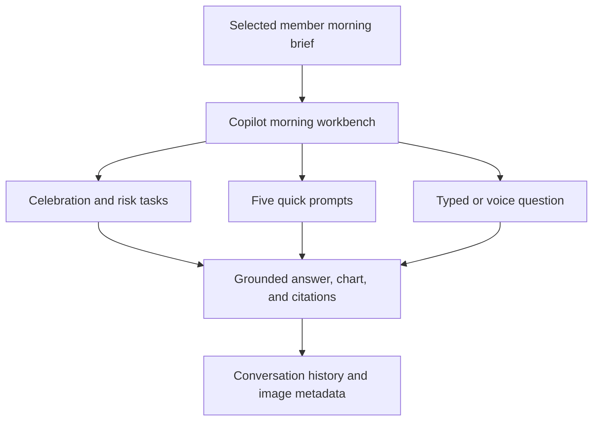
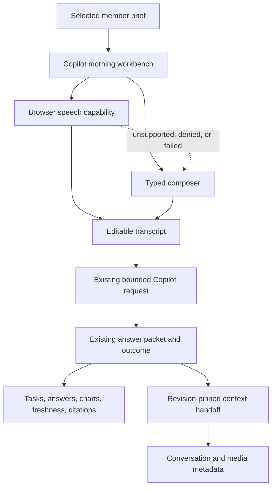
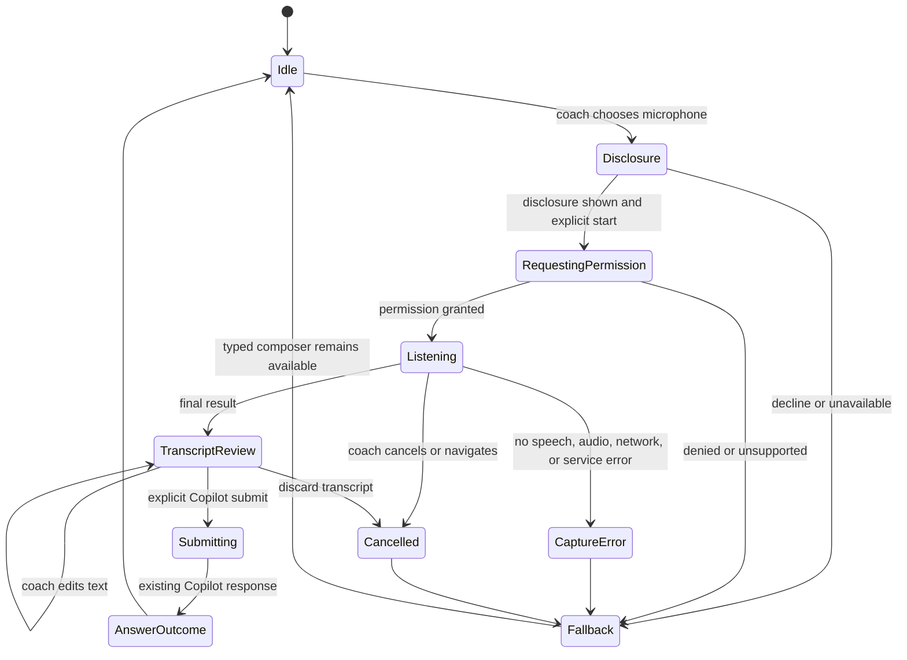

# Coach Copilot Morning Workbench - Plan

## Goal Capsule

- **Objective:** Make the Copilot screen a task-first morning workbench where a coach can work a selected member's brief, review grounded risk and progress context, and ask follow-ups through text or voice input.
- **Product authority:** ASSESSMENT.md and README.md define the take-home outcome, synthetic-data boundary, and grounding expectations. The existing Coach AI Copilot plan defines the answer and trust contract (see origin: docs/plans/2026-08-06-007-feat-coach-ai-copilot-plan.md). This plan owns the Copilot screen experience and its input modes.
- **Active scope:** The selected-member Copilot screen, morning-brief task hierarchy, quick prompts, evidence presentation, conversation and image context access, typed questions, browser dictation, follow-ups, and truthful degraded states.
- **Execution profile:** Deep cross-cutting UI work with a browser capability boundary. The plan keeps the existing Copilot request and answer contracts and adds no server audio pipeline.
- **Stop conditions:** Stop at the confirmed Product Contract, the four implementation units, and the Verification Contract. Do not add server transcription, audio persistence, spoken answers, member messaging, graph writes, image analysis, or clinical recommendations.
- **Tail ownership:** The implementation executor owns code, regression coverage, documentation alignment, review, and the repository's normal landing workflow after these plan gates pass.
- **Open blockers:** None. Browser API naming, test doubles, and final copy remain deferred implementation details.

## Product Contract

### Summary

Build a task-first Copilot morning workbench for a selected member. The coach starts with the brief, handles celebration and risk tasks, uses quick prompts to inspect trends and evidence, and asks grounded follow-ups through typed or dictated input. Typed input remains available everywhere; supported browser dictation fills an editable composer and submits through the same bounded Copilot flow; cited conversation and image evidence remains secondary and revision-pinned.

### Product Contract Preservation

The Product Contract below preserves the brainstormed problem frame, actors, requirements, flows, acceptance examples, success criteria, scope boundaries, dependencies, and stable IDs. The planning choices after this section resolve how the confirmed behavior is delivered; they do not add a second product contract.

### Problem Frame

Coaches need to assemble a member's recent workout, adherence, sleep, conversation, and risk context before acting on the morning brief. The assessment asks the dashboard to make that grounding visible without allowing the Copilot to invent member facts.

The current route already has a nested Copilot screen with quick prompts, grounded answer cards, charts, citations, pinning, retry and refresh states, and a typed composer. Its voice route currently reports that speech transport is unavailable, while conversation history is exposed through a separate member-history path. This work gives the Copilot surface one coherent morning workflow without changing the existing read-only grounding authority.

### Actors

- A1. **Coach:** Opens a selected member's morning workbench, reviews brief tasks, runs a prompt, inspects evidence, and asks a follow-up.
- A2. **Copilot:** Produces bounded, member-specific answers, charts, citations, freshness, and degraded states from authorized context.
- A3. **Member Context:** Supplies synthetic profile, workout, adherence, biomarker, conversation, and media evidence for the selected member.

### Requirements

**Morning workbench**

- R1. The Copilot screen opens with the selected member's identity and morning brief as the primary work surface rather than a blank conversation.
- R2. The morning brief presents the coach's actionable tasks, including celebrating the latest completed workout and reviewing adherence or churn risk.
- R3. Each brief task can lead the coach to the relevant grounded answer or follow-up without losing the selected member context.
- R4. The screen exposes the supported quick-prompt palette: Morning brief, Adherence, Sleep, What changed since last week?, and Churn risk.
- R5. A prompt result can present a concise answer, supporting facts or trend, an optional chart, a coach-facing next action, citations, and evidence freshness.
- R6. The screen distinguishes the coach's selected day from the latest recorded member evidence and never labels older evidence as current.

**Typed and voice input**

- R7. The coach can type a bounded member-specific question and submit it as a Copilot follow-up.
- R8. The coach can provide a question through voice input, and the resulting question uses the same grounded answer behavior as typed input.
- R9. The typed composer remains available when voice permission is denied, voice input is unavailable, or voice capture fails.
- R10. Follow-ups retain the selected member and current context until the coach explicitly refreshes the context.

**Evidence and trust**

- R11. The screen gives the coach access to revision-pinned conversation history and image attachments as supporting member context.
- R12. Image attachments may show their available synthetic asset and metadata, but the Copilot never claims to have analyzed their visual content.
- R13. Every factual answer, chart, risk signal, and source reference belongs to the same selected member and context snapshot.
- R14. Charts include an equivalent accessible text summary derived from the plotted evidence, and unsupported or insufficient evidence produces no invented trend or chart.
- R15. The screen exposes explicit unavailable, insufficient-history, stale, unsupported, invalid, cancelled, and retryable states without replacing them with fixture answers.

**Accessibility and product boundaries**

- R16. Typed and voice input expose clear labels, status feedback, and an accessible recovery path for pending, failed, or unavailable requests.
- R17. The workbench remains usable at the dashboard's supported mobile and desktop widths without changing the selected member or active Copilot context.
- R18. The screen remains read-only and synthetic: it does not send member messages, write graph data, make clinical recommendations, or treat a Copilot response as a coach decision.

### Key Decisions

- KTD1. **Make the Copilot task-first.** (session-settled: user-directed — chosen over an evidence-first explorer and conversation-first feed: the morning brief is the primary coach workflow.) Governs R1-R6.
- KTD2. **Use one grounded question flow for text and voice input.** (session-settled: user-approved — chosen over a separate voice conversation: both input modes should preserve the same member context and answer behavior.) Governs R7-R10, R16.
- KTD3. **Keep conversation and image context supporting rather than primary.** (session-settled: user-approved — chosen over a separate conversation product: the workbench should help the coach act on the brief before browsing history.) Governs R11-R12.
- KTD4. **Preserve explicit freshness and degraded states.** The screen's usefulness depends on showing when evidence is old, sparse, unavailable, or unsupported instead of smoothing those states into confident copy. Governs R6, R13-R15.

<!-- ce-section: work-relationships -->
### How This Work Fits Together

This plan owns the selected-member Copilot screen and its text and voice input behavior. The broader breakdown is the current working understanding, not a committed roadmap:

- **Existing Copilot runtime and Member Context graph:** This screen depends on their bounded answers, charts, citations, conversation evidence, and context states.
- **Selected-member morning brief and dashboard navigation:** This screen shares their selected-member context; the Copilot workbench remains nested under the selected member's brief.
- **Workout generator:** Can proceed independently of this plan. Both surfaces share the dashboard and member context but have different primary workflows.
- **Spoken answers, member messaging, graph writes, image analysis, and clinical recommendations:** Deferred to later. They are not active requirements for this screen.

The screen's information flow is:

### Key Flows

- F1. **Open the morning workbench**
  - **Trigger:** The coach selects a member from the dashboard.
  - **Actors:** A1, A2, A3
  - **Steps:** The screen identifies the member, presents the morning brief tasks, shows freshness, and makes the relevant grounded task actions available.
  - **Outcome:** The coach can start the morning workflow without first composing an open-ended question.
  - **Covered by:** R1-R6, R13-R15, R17-R18
- F2. **Run a quick prompt**
  - **Trigger:** The coach selects a quick prompt.
  - **Actors:** A1, A2, A3
  - **Steps:** The Copilot retrieves the supported member evidence, presents the answer and any supported chart, and exposes citations and the next action.
  - **Outcome:** The coach can inspect a trend or risk signal without assembling the query manually.
  - **Covered by:** R4-R6, R13-R15
- F3. **Ask a typed follow-up**
  - **Trigger:** The coach enters a member-specific question.
  - **Actors:** A1, A2, A3
  - **Steps:** The screen submits the question with the current member context, renders a grounded answer or explicit limitation, and keeps the context for a follow-up.
  - **Outcome:** The coach can continue the brief in the same workbench.
  - **Covered by:** R7, R10, R13-R16
- F4. **Ask through voice input**
  - **Trigger:** The coach chooses voice input and provides a question.
  - **Actors:** A1, A2, A3
  - **Steps:** The screen makes the resulting question available to the same Copilot flow as typed input and exposes the typed path if voice input cannot be used.
  - **Outcome:** The coach can use voice as an input convenience without creating a separate answer or context model.
  - **Covered by:** R8-R10, R16-R17
- F5. **Inspect supporting context**
  - **Trigger:** The coach wants to validate an answer or understand a member message.
  - **Actors:** A1, A2, A3
  - **Steps:** The screen exposes the cited conversation or image metadata, preserves its member and context binding, and labels image material as not analyzed.
  - **Outcome:** The coach can inspect supporting context without mistaking metadata for visual interpretation.
  - **Covered by:** R11-R14, R18

### Acceptance Examples

- AE1. **Morning brief starts the work**
  - **Covers R1-R6.**
  - **Given:** The coach opens Jordan Rivera on the selected coaching day and the latest recorded brief is from an earlier date.
  - **When:** The Copilot workbench loads.
  - **Then:** The screen shows the celebration and risk tasks, labels the evidence as latest recorded, and offers the quick-prompt palette.
- AE2. **Adherence prompt stays evidence-backed**
  - **Covers R4-R6, R13-R15.**
  - **Given:** Jordan has a supported adherence series with enough observations.
  - **When:** The coach selects Adherence.
  - **Then:** The answer shows the supported trend and accessible chart summary with citations from the same member context, or states why the chart cannot be shown.
- AE3. **Typed and voice questions share context**
  - **Covers R7-R10, R16.**
  - **Given:** The coach has an existing grounded answer for Jordan.
  - **When:** The coach asks a follow-up by typing or voice input.
  - **Then:** Both requests preserve Jordan and the current context, and voice failure leaves the typed composer usable.
- AE4. **Conversation and image evidence stay bounded**
  - **Covers R11-R14, R18.**
  - **Given:** A cited member message includes a synthetic image attachment.
  - **When:** The coach opens the supporting context.
  - **Then:** The message and available asset metadata are visible, the image is labeled as not analyzed, and no visual claim is generated from it.
- AE5. **Sparse or stale evidence remains explicit**
  - **Covers R6, R13-R16.**
  - **Given:** The requested context is stale, unavailable, or too sparse for a trend.
  - **When:** The coach runs a prompt or follow-up.
  - **Then:** The screen preserves any valid prior answer when allowed, explains the limitation, and exposes only the available retry or refresh action.
- AE6. **Unavailable member context does not become a fixture answer**
  - **Covers R13-R15, R18.**
  - **Given:** The coach selects a roster member without a canonical Member Context revision.
  - **When:** The coach opens Copilot.
  - **Then:** The screen reports unavailable context without presenting synthetic fixture content as graph-backed evidence.

### Success Criteria

- A coach can move from the selected member's brief to a celebration or risk review and then ask a grounded follow-up without leaving the member workbench.
- Typed and voice input produce equivalent grounding, freshness, citation, and degraded-state behavior.
- Every visible chart has an accessible summary and can be traced to the evidence used to plot it.
- Voice permission or availability problems do not block typed Copilot use.
- Supported seeded quick prompts continue to target the assessment's approximately five-second response budget, with slower or failed requests represented as explicit states.

### Scope Boundaries

**Included**

- The task-first Copilot morning workbench for a selected member.
- Morning brief tasks, the five quick prompts, grounded answers, charts, citations, freshness, follow-ups, conversation history, image metadata, typed input, browser dictation, and accessible degraded states.

**Deferred for later**

- Spoken Copilot responses and a separate two-way voice conversation.
- Persistent new conversation transcripts, member messaging, image analysis, graph writes, clinical recommendations, semantic/vector retrieval, and a trained churn model.

**Outside this work unit**

- Workout generation, graph-controlled exercise safety, and workout publication behavior.
- A new global dashboard navigation model or a separate member conversation product.

### Deferred to Follow-Up Work

- A server-owned transcription provider or product-owned audio capture pipeline for dependable cross-browser voice.
- Product guarantees about on-device recognition, no-upload processing, retention, or data residency.
- A broader navigation redesign beyond the existing nested member brief and voice entry.

### Dependencies / Assumptions

- The existing Copilot runtime remains the source of truth for authorized member context, evidence, charts, citations, freshness, and failure states.
- Browser-native recognition is an optional transcript producer. Before capture, the product must show a short disclosure that audio may be processed, uploaded, or retained by the browser or recognition provider; the plan makes no on-device or no-upload claim.
- Microphone access starts only after the disclosure is visible and the coach explicitly starts capture. Browser permission and secure-context failures are visible capture states.
- Unsubmitted dictated text exists only in client memory. Once submitted, it follows the existing Copilot/provider retention behavior and is not treated as disposable; this work creates no new voice-transcript or audio store. Clear unsubmitted drafts on cancel, route exit, member or revision change, sign-out, page-visibility loss, and teardown.
- Dictated text must never appear in labels, live announcements, IDs, logs, analytics, or error messages.
- All member, conversation, image, and chart data remains synthetic take-home data.
- Jordan remains the canonical seeded Member Context member; other roster members must continue to show truthful unavailable-context states.

### Outstanding Questions

**Resolve Before Planning:** None.

**Deferred to Implementation:**

- The exact browser capability detection and deterministic test-double shape.
- Final copy for listening, no-speech, permission, unsupported, and cancellation states.
- Whether the secondary supporting-context view is rendered inline or through the existing nested history projection after the shared revision handoff is in place.

### Sources / Research

- ASSESSMENT.md — coach Copilot outcome, morning workflow, quick prompts, charts, conversation and image context, synthetic-data boundary, and response-time target.
- README.md — current UI slice, connected Copilot trust boundary, quick-prompt behavior, degraded states, and explicit take-home limits.
- docs/plans/2026-08-06-007-feat-coach-ai-copilot-plan.md — existing Copilot retrieval, answer, citation, chart, churn, continuation, and UI integration contract.
- src/features/coach-dashboard/CoachDashboard.tsx — current nested routes, morning brief, Copilot screen, typed composer, answer cards, charts, citations, conversation timeline, and unavailable voice state.
- src/features/coach-dashboard/dashboard-contract.ts — dashboard adapter and Copilot capability boundary.
- src/features/coach-dashboard/state.ts — member-scoped reducer lifecycle, request identity, cancellation, route stack, and Copilot state.
- src/features/coach-dashboard/production-adapter.ts — production Copilot response decoding and fail-closed answer contract.
- src/features/coach-dashboard/conversation-adapter.ts — revision-aware conversation loading boundary.
- src/application/use-cases/retrieve-member-conversation.ts — bounded conversation and media projection.
- src/domain/contracts/copilot.ts — Copilot request, answer, chart, citation, continuation, and outcome contracts.
- tests/e2e/copilot-grounding.spec.ts — browser coverage for morning brief, quick prompts, follow-ups, chart summaries, revision continuity, retries, and truthful unavailable states.
- tests/e2e/coach-dashboard-voice.spec.ts — current unavailable voice behavior that must be replaced by capture and fallback coverage.
- tests/e2e/coach-dashboard-accessibility.spec.ts and tests/e2e/coach-dashboard-responsive.spec.ts — existing focus, live-status, Axe, reduced-motion, and viewport conventions.
- data/member-context.json — synthetic Jordan member context, brief tasks, longitudinal evidence, chat history, and image metadata.
- https://developer.mozilla.org/en-US/docs/Web/API/SpeechRecognition — limited browser availability and browser/provider-dependent recognition behavior.
- https://developer.mozilla.org/en-US/docs/Web/API/Web_Speech_API — recognition events, errors, and on-device policy boundaries.
- https://developer.mozilla.org/en-US/docs/Web/API/MediaDevices/getUserMedia — secure-context and explicit-permission requirements.
- https://webaudio.github.io/web-speech-api/ — explicit consent and visible recording-indicator expectations.

## Planning Contract

### Key Technical Decisions

- KTD5. **Use browser-native speech recognition as progressive enhancement.** (session-settled: user-approved — chosen over server transcription and universal voice support: keeps typed input universal and avoids a new audio-processing boundary.) Governs R8-R9, R16-R17.
- KTD6. **Review dictated text before submission.** (session-settled: user-approved — chosen over auto-submission: prevents unintended questions and preserves the same coach-controlled submit action as typed input.) Governs R7-R10, R16.
- KTD7. **Keep one shared capture and Copilot lifecycle.** (session-settled: user-approved — chosen over a separate voice conversation: preserves the selected member, continuation, answer packet, and existing nested-entry focus behavior.) Governs R8-R10, R16-R17.
- KTD8. **Extend existing dashboard capability, reducer, and Copilot contracts.** Keep typed and dictated questions as the existing bounded free-text input and keep answer, continuation, freshness, retry, refresh, and cancellation semantics in their current owners (see origin: docs/plans/2026-08-06-007-feat-coach-ai-copilot-plan.md). Governs R3, R5-R10, R13-R16.
- KTD9. **Bind supporting context through a server-verified handoff.** Conversation and media access must verify the signed continuation or server-issued pin/context handoff, reauthorize the coach, member, and revision, and validate the bounded evidence window before rendering material. Client-supplied member or revision claims are not authority. Governs R11-R15, R18.
- KTD10. **Make the workbench task-first without creating a second data source.** Preserve the retrieval registry's coach-brief, coach-task, and next-action semantics as typed task and action identity in the canonical CopilotAnswerPacket, validator, and production decoder before U2 renders them; do not add parallel dashboard task fields or rebuild task copy from fixture-only data. Governs R1-R6, R13-R15.

### High-Level Technical Design

The diagrams below define the component relationships and the capture lifecycle that the implementation units must preserve.

### Assumptions

- The selected browser recognition implementation may use a remote recognition service. The UI must show the processing disclosure before capture and must not claim on-device processing, no upload, or a retention period the app cannot control.
- Browser permission prompts, microphone start/stop, and recognition consent remain human-only actions. No assistant or future tool may initiate them.
- The recognition seam is injected for deterministic browser tests. Tests must not depend on a real microphone, browser speech service, or network speech provider.
- The existing answer packet remains the shared workspace for typed and dictated questions. Unsubmitted text is client-memory only; submitted text follows existing Copilot/provider retention. No separate voice transcript or audio store is created.
- The browser capability seam remains client-only. Speech, microphone, raw audio, and provider-specific error types must not cross into server or application contracts.

### Alternatives Considered

- **Server transcription with getUserMedia and MediaRecorder:** Provides more control over provider, retention, and browser coverage, but adds audio upload, provider, privacy, and operational contracts that are outside this synthetic take-home.
- **A separate voice conversation:** Would require a second answer, context, and degraded-state lifecycle and conflicts with the confirmed one-flow product decision.
- **Inline-only voice capture with no nested entry:** Simplifies navigation but strands the existing morning-brief voice entry and its focus-return behavior. The chosen shape shares the inline composer lifecycle and keeps the nested entry as capture-only.

### Sequencing

U1 establishes the browser capability and capture lifecycle. U2 composes that lifecycle into the task-first workbench and shared voice entry. U3 wires revision-pinned supporting context into the workbench. U4 hardens accessibility, responsive behavior, visual proof, and documentation boundaries after the interaction model is stable.

## Implementation Units

### U1. Add the browser speech capability and capture lifecycle

**Goal:** Add a client-only, injectable browser speech capability that produces an editable transcript or a truthful fallback state without creating a server audio boundary.

**Requirements:** R8-R10, R16-R17; F4; AE3; KTD5-KTD7.

**Dependencies:** None.

**Files:**

- src/features/coach-dashboard/speech-input.ts — create the browser capability boundary and stable capture states.
- src/features/coach-dashboard/dashboard-contract.ts — expose the dashboard-facing capability type if the shared adapter needs it.
- src/features/coach-dashboard/state.ts — retain capture lifecycle and cancellation state at the selected-member boundary.
- tests/unit/speech-input.test.ts — add deterministic capability and event-lifecycle coverage.
- tests/unit/coach-dashboard-state.test.ts — extend member, route, duplicate-request, and late-completion reducer coverage.

**Approach:**

1. Keep the recognition seam client-only, narrow, and injectable; do not allow browser speech, microphone, raw-audio, or provider-specific types into server or application contracts.
2. Show the processing disclosure before capture and require the coach's explicit start action after the disclosure is visible. Feature-detect the browser recognition constructor at that boundary and expose an unavailable state when it is absent.
3. Map permission, no-speech, audio-capture, network, service, language, and user-abort outcomes into finite stable capture states without exposing browser error text as product copy.
4. Keep interim text, finalized text, and Copilot request pending state separate so cancellation can discard capture without cancelling a completed answer.
5. Give each capture a member, route, revision, and capture identity. Stop recognition and clear unsubmitted text on cancellation, Back, member or revision change, destination change, sign-out, page-visibility loss, and component teardown; ignore late events unless every identity still matches.
6. Enforce the existing 500-character question limit using one documented Unicode length rule. Reject over-limit input without silent truncation, and retain the typed composer as the fallback.

**Patterns to follow:** The DashboardAdapter capability unions, DashboardCopilotRequest identity and abort handling, dashboardReducer member isolation, and the existing fail-closed production adapter.

**Test scenarios:**

- **Happy path**
  - A supported injected recognizer moves from idle to listening, emits interim text, emits a final transcript, and exposes the transcript for review without submitting a Copilot request.
  - A reviewed transcript submits as the existing bounded free-text question and preserves the selected member and current context.
- **Edge cases**
  - Repeated interim results replace the interim display without duplicating finalized text.
  - Transcript text at the maximum accepted length remains bounded and text beyond the limit cannot be submitted.
  - A second start while listening is ignored or reports the existing capture state without creating a second recognizer.
- **Error and failure paths**
  - Unsupported recognition, denied permission, no speech, audio capture failure, network failure, service refusal, and language failure each return to a usable typed composer with distinct recovery status.
  - Coach cancellation discards interim and finalized capture text, stops listening, and does not create a Copilot request.
- **Security and retention**
  - The recognizer cannot start before the processing disclosure and explicit start action; no audio or dictated text is written to browser storage or a new application store.
  - Late events after cancel, navigation, member or revision change, sign-out, visibility loss, or a new capture are ignored.
  - Repeated final events, interim/final ordering, Unicode boundary cases, and over-limit text remain bounded without silent truncation.
  - Raw browser errors are mapped to finite app states; dictated text never appears in live announcements, labels, request IDs, logs, analytics, or errors.
  - Submission is blocked when the captured member, route, or revision no longer matches the active Copilot scope.
- **Integration scenarios**
  - A member switch or Back action during listening ignores a late final result and leaves the new route/member without stale transcript state.
  - A finalized transcript and an equivalent typed question reach the same Copilot request adapter with identical member and context claims.

**Verification:** The capability is client-only, deterministic under test injection, never persists raw audio, and exposes every required capture state with an accessible recovery path.

### U2. Recompose the selected-member Copilot screen as the morning workbench

**Goal:** Turn the existing Copilot screen into the task-first workbench and make both inline voice input and the existing nested voice entry feed the same editable composer and Copilot lifecycle.

**Requirements:** R1-R10, R16-R17; F1-F4; AE1-AE3; KTD1, KTD2, KTD6, KTD7, KTD10.

**Dependencies:** U1.

**Files:**

- src/features/coach-dashboard/CoachDashboard.tsx — recompose the workbench, task actions, composer, and capture-only voice entry.
- src/features/coach-dashboard/dashboard.module.css — add the task-first hierarchy, input states, status treatment, and responsive layout.
- src/features/coach-dashboard/state.ts — connect the shared capture identity and focus-return behavior to the route stack.
- src/features/coach-dashboard/dashboard-contract.ts — consume canonical typed task and action identity from the CopilotAnswerPacket; do not add parallel dashboard task fields.
- src/domain/contracts/copilot.ts — add or preserve the typed morning-task projection and action identity in the canonical answer contract.
- src/agents/copilot-runtime.ts — preserve retrieval-registry task semantics when projecting coach-brief and coach-task evidence.
- src/features/coach-dashboard/production-adapter.ts — decode the typed task projection fail closed.
- tests/unit/copilot-contract.test.ts — validate task/action identity and scope invariants in the answer packet.
- tests/unit/copilot-answer-validation.test.ts — reject malformed or scope-inconsistent typed task sections.
- tests/unit/copilot-runtime.test.ts — prove registry task semantics survive runtime projection without fixture-only fallback.
- tests/unit/dashboard-runtime-adapter.test.ts — prove the dashboard consumes the typed task projection.
- tests/e2e/copilot-grounding.spec.ts — update prompt labels and cover workbench, typed, and shared-context flows.
- tests/e2e/coach-dashboard-voice.spec.ts — replace unavailable-only assertions with supported, fallback, cancellation, and route-return flows.
- tests/e2e/coach-dashboard-mobile.spec.ts — cover the morning workbench and voice entry at the mobile layout.
- tests/e2e/coach-dashboard-responsive.spec.ts — cover the supported responsive widths.
- tests/visual/coach-dashboard-desktop.spec.ts — cover the desktop workbench hierarchy and capture states.
- tests/visual/coach-dashboard-mobile.spec.ts — cover the mobile workbench hierarchy and capture states.

**Approach:**

1. Make selected member identity, selected coaching day, evidence freshness, and the typed celebration, risk, and next-action task projection the first visible Copilot workbench content.
2. Render the exact quick-prompt labels: Morning brief, Adherence, Sleep, What changed since last week?, and Churn risk.
3. Keep existing answer cards, charts, citations, pins, retry, refresh, and last-ready-answer behavior as the result surface.
4. Add a clearly labeled microphone control beside the typed composer. The control starts U1 only after the processing disclosure is visible and the coach explicitly activates capture.
5. Let the nested voice entry use the same capture-only control and return the reviewed transcript to the shared Copilot composer; Back restores the opener's focus.
6. Lift draft and capture state to the selected-member workflow while keeping route ownership explicit. Invalidate it on Back, member change, destination change, sign-out, and unmount so a late event cannot retarget another member or route.
7. Gate microphone capture and dictated submission with the same member capability used by Copilot. For unavailable members, show the truthful unavailable state and preserve typed fallback without starting capture.
8. Keep dictated text editable and require the existing explicit Copilot submit action. Replace the unavailable-only voice placeholder in this unit; voice failure never removes or disables the typed path.

**Patterns to follow:** The current MemberHeader, nested route stack, CopilotAnswerCard, CopilotOutcomeNotice, focus-return behavior, quick-prompt request dispatch, and existing mobile/desktop AXON layout conventions.

**Test scenarios:**

- **Happy path**
  - Jordan's Copilot route opens with identity, selected-day/latest-recorded freshness, celebration and risk tasks, and all five required quick prompts.
  - The Adherence prompt renders the existing grounded answer, chart or explicit chart limitation, citations, and evidence freshness.
  - A typed question submits from the workbench and a supported voice transcript reaches the same answer surface without changing member context.
  - The nested voice entry returns to Copilot with the reviewed transcript and restores focus to the entry that opened it.
- **Edge cases**
  - A pending brief or prompt disables duplicate task and prompt actions while leaving navigation and cancellation available.
  - The selected member and selected date remain visible while answers, transcripts, or degraded notices update.
  - The exact long quick-prompt label remains usable at narrow widths without horizontal overflow or clipped focus rings.
- **Error and failure paths**
  - Voice unavailable, denied, cancelled, or failed states leave the typed composer visible and announce the recovery state.
  - A model error preserves the last ready answer and exposes only the response-controlled retry action.
  - An expired continuation preserves the valid answer and exposes refresh without carrying the expired continuation into the next request.
- **Integration scenarios**
  - Switching from Jordan to another roster member while a prompt or voice capture is pending prevents the late result from updating the new member.
  - A non-canonical member opens an unavailable state without showing fixture Copilot tasks or answers.
  - An unavailable member cannot start microphone capture or submit dictated text through a capability that cannot produce a grounded answer.
  - Leaving the workbench, signing out, or unmounting during capture clears the draft and returns focus without exposing the prior transcript on the next route.
  - The workbench renders only typed task/action identity from a ready canonical answer packet; unavailable or non-ready context produces no fixture celebration or risk tasks.

**Verification:** The screen is task-first, keeps the selected-member context stable, submits typed and dictated questions through one Copilot path, and remains navigable with keyboard, mobile, and desktop input.

### U3. Wire revision-pinned supporting context into the workbench

**Goal:** Let cited conversation and image evidence open as secondary context bound to the same member, revision, evidence date, and bounded time window as the answer or pin.

**Requirements:** R11-R15, R18; F2-F3, F5; AE2, AE4-AE6; KTD3, KTD4, KTD8-KTD9.

**Dependencies:** U2.

**Files:**

- src/features/coach-dashboard/conversation-adapter.ts — preserve the server's typed conversation outcome states and revision inputs.
- src/features/coach-dashboard/dashboard-contract.ts — carry conversation request identity, revision, and bounded result states.
- src/features/coach-dashboard/state.ts — retain the conversation request identity and ignore late member or revision completions.
- src/features/coach-dashboard/production-adapter.ts — preserve the answer/continuation scope that authorizes a supporting-context handoff.
- src/domain/contracts/copilot.ts — reuse CopilotScopeEnvelope, SignedCopilotContinuation, and CopilotPin; add a typed supporting-context reference when the current pin/citation lacks an anchor.
- src/domain/contracts/member-context-queries.ts — carry the bounded window, evidence-as-of, timezone, and conversation/evidence anchor needed by the server handoff.
- src/features/coach-dashboard/CoachDashboard.tsx — add the secondary context entry and state-specific rendering.
- src/app/api/member-context/conversation/route.ts — verify the server handoff and preserve privacy-safe outcome states and bounded request parameters.
- src/application/use-cases/retrieve-member-conversation.ts — return memberId, contextRevisionId, anchor, and explicit outcome state for client validation.
- tests/unit/member-conversation.test.ts — cover revision, time-window, media allowlist, and failure-state projections.
- tests/unit/coach-dashboard-state.test.ts — cover request identity, cancellation, member isolation, and late completion.
- tests/e2e/copilot-grounding.spec.ts — cover citation-to-context handoff and refresh/reopen behavior.
- tests/e2e/coach-dashboard-accessibility.spec.ts — cover context labels, status announcements, and keyboard return.

**Approach:**

1. Derive the context request from the answer, signed continuation, or pin that the coach is inspecting instead of from the active revision alone. Add a typed supporting-context reference carrying member, revision, conversation or evidence anchor, evidence-as-of, member timezone, and bounded window. The server must verify the signed continuation or resolve the pin through a server-issued handoff, reauthorize the coach/member/revision scope, and reject guessed, mixed, foreign, expired, or revoked claims.
2. Pass a validated, bounded conversation window from the trusted answer or handoff through the existing conversation client; remove the fixed static window. Server-side code bounds the date range, cursor, and page size before retrieval.
3. Decode the unknown response into a typed result instead of casting it. The returned timeline must carry and validate memberId, contextRevisionId, and conversation evidence scope before it reaches the UI; backend/provider details remain finite client-safe error categories.
4. Preserve ready, empty, denied, unavailable, invalid, stale, and cancelled states as distinct UI outcomes with controls appropriate to each state. Clear or hide the prior timeline when the active revision changes.
5. Reuse the existing conversation timeline and synthetic media allowlist. Render media metadata and the not-analyzed boundary without visual interpretation.
6. Keep supporting context secondary to the workbench and return the coach to the answer or citation that opened it.

**Patterns to follow:** The Copilot answer scope envelope, signed continuation claims, createFetchDashboardConversationClient, retrieve-member-conversation allowlisting, and existing fail-closed response decoding.

**Test scenarios:**

- **Happy path**
  - A citation from a ready answer opens conversation content with the answer's member and context revision, not the current active revision if it has since changed.
  - A cited message with a synthetic attachment renders the allowlisted asset and metadata-only label without a visual claim.
  - The supporting-context reference preserves the cited conversation or evidence anchor, evidence-as-of date, member timezone, and bounded window through the server handoff.
- **Edge cases**
  - Reopening the same citation after a refresh uses the new active revision only when the coach explicitly refreshed the context.
  - An empty but authorized timeline remains distinct from an unavailable or denied timeline.
- **Error and failure paths**
  - Stale, invalid, denied, unavailable, and cancelled conversation outcomes each render their own truthful state and permitted recovery control.
  - A conversation request that completes after Back or member change cannot replace the active member's context.
  - Foreign, tampered, expired, revoked, or mixed handoffs fail closed without exposing member IDs, revision IDs, cursors, provider details, or timeline content.
- **Integration scenarios**
  - The answer, citation, conversation timeline, and media metadata all carry the same member and revision claims through the UI handoff.
  - A foreign member or guessed revision fails closed without disclosing another member's revision or timeline.
  - Returned data is rejected when member or revision scope does not match the verified handoff; server bounds are enforced for window, cursor, and page size.

**Verification:** The workbench can validate evidence without opening a separate conversation product, every supporting item is revision- and member-bound, and no unsupported media interpretation is rendered.

### U4. Harden trust, accessibility, responsive behavior, and documentation boundaries

**Goal:** Prove the complete morning workbench across states and widths, and align repository documentation with the new client-side dictation boundary.

**Requirements:** R5-R6, R13-R18; F1-F5; AE1-AE6; all Success Criteria; KTD4-KTD10.

**Dependencies:** U2, U3.

**Files:**

- src/features/coach-dashboard/dashboard.module.css — finalize hit targets, status visuals, overflow, safe-area, and reduced-motion behavior.
- tests/e2e/coach-dashboard-accessibility.spec.ts — add keyboard, live-region, focus, reduced-motion, microphone-label, and Axe coverage.
- tests/e2e/coach-dashboard-responsive.spec.ts — add 320px, 430px, and 1440px workbench and capture checks.
- tests/e2e/coach-dashboard-mobile.spec.ts — verify nested entry, Back, selected-member continuity, and narrow-screen interaction.
- tests/visual/coach-dashboard-desktop.spec.ts — verify brief-first desktop hierarchy and explicit degraded states.
- tests/visual/coach-dashboard-mobile.spec.ts — verify mobile hierarchy, composer, capture status, and no horizontal overflow.
- tests/unit/check-production-isolation.test.ts — prove browser speech and microphone boundaries do not enter server, agent, or persistence modules.
- README.md — distinguish client-side optional dictation from server voice transport, spoken answers, audio persistence, and delivery integration.

**Approach:**

1. Give the microphone an accessible name, keyboard activation, visible listening state, live status, cancellation action, and typed recovery path.
2. Preserve focus on Back, cancellation, retry, refresh, and context return using the existing dashboard focus conventions.
3. Verify 44px-class controls, reduced-motion behavior, safe-area spacing, chart text summaries, and no horizontal overflow at supported widths.
4. Update documentation so the take-home boundary remains truthful: browser dictation may be available, while server voice transport, spoken responses, and persistent audio remain outside scope.
5. Remove obsolete negative voice assertions after the U2 replacement coverage passes and keep documentation aligned with the final client-only boundary.

**Patterns to follow:** The existing @a11y specs, Axe checks, focus-return assertions, reduced-motion test, visual specs, and README's explicit synthetic/take-home boundary language.

**Test scenarios:**

- **Happy path**
  - Keyboard users can start and cancel dictation, review text, submit, and return focus to the originating control.
  - The workbench renders equivalent chart text summaries, citations, freshness labels, and degraded states for typed and dictated questions.
- **Edge cases**
  - The workbench remains usable at 320px, 430px, and 1440px with no clipped labels, hidden typed fallback, or horizontal overflow.
  - Reduced-motion users receive the same status and completion information without relying on animation.
- **Error and failure paths**
  - Permission denial, unsupported recognition, no speech, cancellation, model failure, stale context, and unavailable member context all have visible and announced recovery states.
  - No Axe violation is introduced across Today, brief, workbench, capture-only voice entry, and supporting-context views.
- **Integration scenarios**
  - The documented boundary and automated checks agree that no server voice transport, audio persistence, member messaging, graph write, or image analysis path was added.
  - Desktop and mobile visual snapshots show the same task-first information order and preserve selected-member context through nested navigation.

**Verification:** Focused unit, browser, accessibility, responsive, visual, type, lint, and build gates pass; README claims match the implemented boundary; no obsolete voice placeholder or test-only fixture answer remains.

## System-Wide Impact

- **Dashboard routing and focus:** The nested member route stack, Back behavior, focus restoration, and selected-member isolation are affected. The voice entry remains human-facing and capture-only.
- **Copilot request boundary:** Typed and dictated questions both use CopilotQuestionInput and the existing request identity, continuation, answer, citation, chart, freshness, retry, refresh, and cancellation contracts. The answer packet may gain typed task/action identity and supporting-context anchors; no audio path or new model tool surface is added.
- **Member Context and evidence:** Conversation loading gains an end-to-end revision handoff and preserves the existing synthetic media allowlist. The UI must not fall back to fixture tasks or answers when canonical context is unavailable.
- **Privacy and permissions:** A processing disclosure is visible before explicit microphone start. Browser permission and recording indicators remain authoritative. Unsubmitted text is client-memory only; submitted text follows existing Copilot/provider retention. The app does not claim on-device recognition, persist audio, or retain a separate voice transcript, and never places dictated text in logs, analytics, labels, IDs, announcements, or errors.
- **Context authorization:** Supporting-context requests use a server-verified signed handoff, reauthorize coach/member/revision scope, validate returned timeline scope, and fail closed for foreign, mixed, expired, revoked, or guessed claims.
- **Agent-native boundary:** The Copilot is an existing assistant surface, but this plan does not add agent tools or automate microphone permission. Future read-only agent access should reuse the same authorized context and answer packet rather than bypassing the UI contract.
- **Performance:** The morning brief and seeded quick prompts retain the existing approximately five-second target. Voice capability detection must not delay initial dashboard rendering; recognition errors remain local capture states.

## Risks & Dependencies

- **Limited speech support:** Browser-native recognition is not a universal browser capability and may use a remote recognition service. Feature detection, explicit unsupported copy, typed fallback, and no on-device claim mitigate this risk.
- **Permission and security context:** Microphone access can be denied, blocked, or unavailable outside a secure context. Start only from an explicit coach action and surface the recovery path.
- **Recognition lifecycle:** Interim results, no-speech, service disconnects, device loss, and late events can leave stale text or pending state. Use capture identity, abort/cleanup, and member/route isolation tests.
- **Privacy expectations:** Coaching conversations may be sensitive even in synthetic data. Require the pre-capture processing disclosure, keep unsubmitted text client-memory only, follow existing retention after submit, clear drafts on lifecycle boundaries, and document that browser/provider retention is outside app control.
- **Scope authorization:** Client memberId, revision, pin, or cursor values can be forged or mixed. Require a server-verified handoff, server reauthorization, returned-scope validation, bounded windows, and indistinguishable fail-closed errors.
- **Error and transcript leakage:** Recognition and backend errors can contain provider details, while transcripts are sensitive content. Map to finite safe categories and exclude dictated text from labels, announcements, identifiers, logs, analytics, and errors.
- **Input bounds:** Repeated or reordered interim/final events and Unicode text can bypass a character limit. Apply one documented 500-character rule at capture, review, and submit boundaries without silent truncation.
- **Context drift:** A citation can outlive the active revision. Bind context requests to the inspected answer or pin and expose stale/refresh behavior instead of silently reopening current data.
- **Responsive density:** Task cards, five prompts, composer controls, and status text can crowd narrow screens. Use the existing responsive and visual test widths before declaring the layout complete.
- **Documentation drift:** Existing README and older Copilot plan language describes voice transport as outside scope. Update the README boundary for this input-only addition; preserve the older plan's answer-contract authority and do not claim a server voice pipeline.

## Documentation / Operational Notes

- Update README scope language to distinguish optional browser dictation from server voice transport, spoken responses, audio retention, delivery, and member messaging.
- Document the pre-capture processing disclosure and state that submitted dictated text follows the existing Copilot/provider retention boundary; do not promise local processing, no upload, or a retention period controlled by the app.
- Do not add analytics that capture raw audio or full dictated transcripts. If later instrumentation is needed, record only aggregate capability/error categories.
- Browser tests must inject recognition events and never depend on a real microphone, permission prompt, or external speech service.
- No rollout, migration, provider credential, or persistent-data operation is required for this slice.

## Verification Contract

| Gate | Scope | Completion signal |
| --- | --- | --- |
| pnpm typecheck | All changed TypeScript, capability types, reducer state, and test doubles | No type errors; browser-only APIs remain isolated from server modules. |
| pnpm lint | Changed dashboard, adapters, tests, and documentation-adjacent code | Repository lint passes without disabling existing rules. |
| pnpm test | Copilot contracts and task projection, production decoder, speech capability, reducer, and conversation projection | Unit coverage proves request parity, typed task/action identity, identity isolation, capture states, revision binding, and fail-closed outcomes. |
| pnpm test:e2e | Morning brief, five prompts, typed follow-up, injected voice, fallback, context handoff, member changes, and degraded states | Browser flows pass with deterministic intercepted Copilot responses and injected recognition events. |
| pnpm test:a11y | Workbench, nested voice capture, context view, keyboard, focus, live status, Axe, reduced motion | No Axe violations and all required status and focus outcomes are observable. |
| pnpm test:visual | Desktop and mobile task-first hierarchy, composer, capture states, and degraded states | Approved snapshots show the same information order at supported widths. |
| pnpm build | Production bundle and isolation checks | Production build succeeds; a production-isolation check proves speech/microphone/audio types and payloads do not enter server or application modules. |
| Manual seeded acceptance | Jordan ready context, Avery unavailable context, processing disclosure, permission denial, unsupported recognition, cancellation, stale context, foreign or mixed context handoff, and image metadata | A coach can complete the morning workflow without leaving selected-member context, unsubmitted drafts clear at lifecycle boundaries, and every limitation is truthful. |

## Definition of Done

- R1-R18, F1-F5, AE1-AE6, and every Success Criterion are implemented or explicitly verified by the units and gates above.
- U1 provides a feature-detected, human-initiated, disclosure-gated, injectable browser speech capability with editable transcript, cancellation, bounded text, finite errors, lifecycle cleanup, and typed fallback. It creates no audio or voice-transcript store.
- U2 provides the task-first selected-member workbench, typed celebration/risk/next-action task identity, exact prompt labels, shared typed/voice submission, focus return, and truthful pending/error behavior.
- U3 provides server-verified, revision- and member-bound supporting context with explicit conversation states, bounded windows, validated returned scope, and metadata-only image handling.
- U4 proves accessibility, responsive behavior, visual hierarchy, documentation boundaries, and removal of obsolete voice placeholder behavior.
- Typed and dictated questions produce the same bounded Copilot request shape and preserve the same continuation, answer, citation, chart, freshness, retry, refresh, and degraded-state semantics.
- No server transcription route, audio persistence, new voice-transcript store, spoken response, member messaging, graph write, image analysis, clinical recommendation, or fixture replacement is introduced. Submitted dictated text follows the existing Copilot/provider retention boundary.
- The Verification Contract passes, including type, lint, unit, browser, accessibility, visual, build, and seeded manual acceptance gates.
- The final diff contains no abandoned speech experiment, obsolete unavailable-only voice branch, stale negative voice assertion, or temporary test instrumentation.
