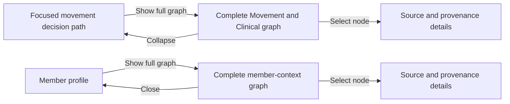
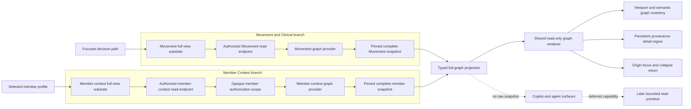
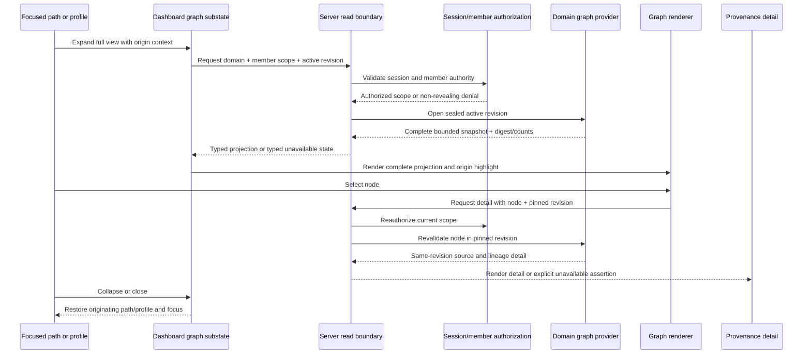
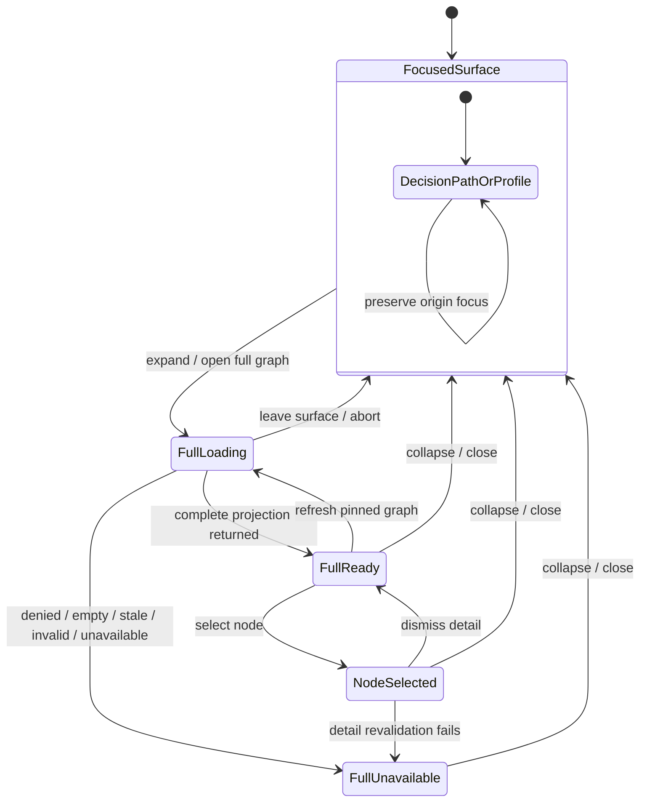

# Full Knowledge Graph Views - Plan

## Goal Capsule

- **Objective:** Let coaches optionally widen the existing focused graph explanation to inspect the complete graph for the current domain: the Movement and Clinical graph on the coach screen, and the member-context graph on each member profile.
- **Product authority:** This Product Contract governs the new full-view behavior. The existing graph-backed coach dashboard contract and the Movement and Clinical and Member Context graph plans remain authoritative for graph meaning, authorization, source data, and focused explanation behavior.
- **Execution profile:** Establish one revision-pinned, UI-safe read projection and its authorization boundary, then add a shared read-only graph interaction primitive before wiring the Movement and Clinical and member-context surfaces.
- **Stop conditions:** Stop if a full view would require mixing revisions, bypassing member authorization, inventing provenance for identity or lifecycle nodes, exposing raw snapshots to Copilot, silently truncating a complete graph, or changing the focused workflow's mutation semantics.
- **Tail ownership:** The final unit owns fixture/canonical parity, browser accessibility and responsive verification, visual regression updates, and removal of any temporary presentation-only graph assumptions after the typed projection is proven.

**Product Contract preservation:** The requirements, flows, acceptance examples, success criteria, and scope boundaries below are carried forward from the brainstorm artifact; this pass adds implementation detail without changing their meaning.

## Product Contract

### Summary

The coach experience will keep its current focused graph explanation and add an optional in-place expansion to the complete graph for the current surface. The coach screen will expose the full Movement and Clinical graph, while each member profile will expose that member's full member-context graph. Both views are read-only and let the coach inspect source and provenance details for selected nodes.

### Problem Frame

The focused graph path explains why a recommendation, exclusion, substitution, or Copilot claim exists. A coach who is curious about the underlying data currently has no equivalent way to widen that explanation and see the rest of the graph in context.

The product already has separate Movement and Clinical and member-context graph contracts with revisions, assertions, relationships, and provenance. The new capability should expose that existing graph meaning without turning the coach workflow into a graph editor or an unrelated exploration product.

### Key Decisions

- **Preserve the focused view as the default and add an in-place full-graph expansion.** (session-settled: user-directed — chosen over a sidecar and separate graph workspace: it keeps the current explanation primary while supporting curiosity.) Governs R1, R2, R10.
- **Keep the graph domains on their existing product surfaces.** (session-settled: user-directed — chosen over one combined graph: Movement and Clinical reasoning belongs in the coach screen, while member context belongs on each member profile.) Governs R3, R4, R9.
- **Make full views read-only but source/provenance inspectable.** (session-settled: user-approved — chosen over editing or exploratory graph tooling: the feature is for seeing the data without creating a second graph product.) Governs R6-R8.
- **Treat “full” as the complete active graph for the current domain, not another focused subgraph.** (session-settled: user-directed — chosen over showing only a larger path: the coach wants to see the full Movement and Clinical graph and the full member-context graph.) Governs R2-R4.

<!-- ce-section: work-relationships -->
### How This Work Fits Together

This plan owns the bounded full-graph visibility expansion. It extends the existing focused explanation surface without changing the graph domains or the coach-day workflow.

- **Focused decision explanation:** remains the default path view and continues to explain a selected recommendation, exclusion, substitution, override, or Copilot claim.
- **Movement and Clinical graph:** supplies the complete domain graph shown from the coach screen and remains separate from member-specific state.
- **Member Context graph:** supplies the complete authorized graph shown from each member profile and remains scoped to that member's active context revision.
- **Source and provenance details:** depend on the same graph assertions, revisions, and evidence records that already support trusted explanations.
- **Standalone graph exploration:** remains deferred; a later effort may revisit search, comparison, or graph-wide investigation if the bounded full view proves insufficient.

### Actors

- A1. **Coach:** Opens the optional full view, sees the complete graph for the current surface, selects nodes, reads source/provenance details, and returns to the focused explanation or member profile.
- A2. **Graph-backed dashboard:** Keeps the originating focus, renders the correct domain graph, and does not let inspection change workout, Copilot, or member state.
- A3. **Graph and provenance authorities:** Provide the authorized active graph data, node relationships, graph revision, source assertions, and provenance details for display.

### Requirements

**Focused-to-full disclosure**

- R1. The existing focused Movement and Clinical graph explanation remains available and remains the default view on the coach screen.
- R2. From a focused Movement and Clinical explanation, the coach can expand in place to the complete active Movement and Clinical graph without losing the originating selection or decision context.
- R3. The expanded coach-screen view includes the complete active Movement and Clinical graph available to the dashboard, including its modeled nodes and relationships rather than only the selected reasoning path.
- R4. Each member profile can expose the complete active member-context graph for that authorized member, including the member-context domains represented by the existing graph contract.

**Inspection and trust**

- R5. The full Movement and Clinical graph and the full member-context graph remain separate views with their existing domain ownership and member authorization boundaries.
- R6. Selecting a node in a full graph view reveals its source and provenance details from the same graph context that produced the displayed node.
- R7. Source and provenance details identify the relevant graph revision and source assertions without inventing evidence or presenting data from a different revision.
- R8. Full graph views are read-only; graph inspection cannot create, edit, delete, or otherwise mutate graph data, member context, workouts, Copilot answers, or approval state.

**Context preservation and workflow fit**

- R9. The member profile full view remains scoped to the selected member and does not combine member-context data with the Movement and Clinical graph into one graph.
- R10. The coach can collapse the full Movement and Clinical view and return to the originating focused explanation without losing the selected decision or normal coach-screen workflow state.
- R11. Opening or ignoring a full graph is optional; the normal coach review, adjustment, Copilot, and member-profile flows remain usable without it.
- R12. Full graph views preserve the dashboard's existing accessibility, responsive, and human-versus-machine interaction semantics.

### Key Flows

- F1. **Inspect the full movement graph**
  - **Trigger:** The coach is viewing a focused Movement and Clinical decision path and wants to see the broader data.
  - **Actors:** A1, A2, A3.
  - **Steps:** The coach expands the view, the complete active Movement and Clinical graph appears with the originating decision still identifiable, the coach selects a node to inspect its source/provenance details, and the coach can collapse back to the focused path.
  - **Covers:** R1-R3, R6-R8, R10-R12.
- F2. **Inspect a member's full context graph**
  - **Trigger:** The coach opens a member profile and wants to see the member-context data behind the profile.
  - **Actors:** A1, A2, A3.
  - **Steps:** The coach opens the optional full member-context view, the complete authorized graph for that member appears, the coach selects a member-context node to inspect its source/provenance details, and the coach returns to the profile without changing member state.
  - **Covers:** R4-R9, R11-R12.
- F3. **Keep inspection non-mutating**
  - **Trigger:** The coach opens, expands, selects, and closes full-graph content.
  - **Actors:** A1, A2, A3.
  - **Steps:** The dashboard reads the active authorized graph, shows source-backed details, and leaves the workout, Copilot, member context, graph data, and approval state unchanged.
  - **Covers:** R6-R8, R11.

### Conceptual Flow

The two branches share the optional read-only inspection behavior but do not merge into one graph.

### Acceptance Examples

- AE1. **Full movement graph from a focused exclusion**
  - **Covers:** R1-R3, R6-R8, R10.
  - **Given:** The coach is viewing a knee-related exclusion in the focused Movement and Clinical path.
  - **When:** The coach expands the graph and selects the clinical-rule or anatomy node.
  - **Then:** The complete active Movement and Clinical graph is visible, the originating exclusion remains identifiable, and the selected node shows its source and provenance details without changing the workout.
- AE2. **Full member-context graph on a profile**
  - **Covers:** R4-R6, R9, R11.
  - **Given:** The coach is viewing an authorized member profile with profile, injury, goal, adherence, and workout context.
  - **When:** The coach opens the full member-context graph and selects an injury or adherence node.
  - **Then:** The complete active graph for that member is shown, the node's source and provenance details appear, and no other member's data is included.
- AE3. **Collapse preserves the focused workflow**
  - **Covers:** R2, R10-R11.
  - **Given:** The coach has expanded a full Movement and Clinical graph and inspected a node.
  - **When:** The coach collapses the full view.
  - **Then:** The originating focused decision path and coach workflow state are still available, with no generated workout, approval, or Copilot state changed.
- AE4. **Inspection is read-only**
  - **Covers:** R6-R8.
  - **Given:** The coach opens either full graph and selects several nodes.
  - **When:** The coach closes the graph without taking a workflow action.
  - **Then:** Graph data, member context, workouts, Copilot answers, and approval state remain unchanged.
- AE5. **Unavailable graph does not fabricate a view**
  - **Covers:** R6-R8, R11.
  - **Given:** The relevant active graph or provenance source is unavailable.
  - **When:** The coach requests the full view or selects a node.
  - **Then:** The dashboard uses the existing unavailable or non-ready state, does not show fabricated graph data or evidence, and keeps the surrounding profile or coach workflow usable.

### Success Criteria

- A coach can open the complete active Movement and Clinical graph from the existing focused explanation without leaving the coach screen or losing the originating decision.
- A coach can open the complete authorized member-context graph from every member profile without exposing another member's context.
- Node inspection shows source and provenance details tied to the displayed graph context.
- Collapsing or closing a full graph returns the coach to the prior workflow without changing any graph, member, workout, Copilot, or approval state.
- The focused explanation remains the default and remains useful without opening the full graph.
- The new views preserve existing keyboard, responsive, reduced-motion, and non-color-only interaction expectations.

### Scope Boundaries

**In scope**

- Optional in-place expansion from the focused Movement and Clinical explanation to the complete active Movement and Clinical graph on the coach screen.
- Optional full member-context graph view on each authorized member profile.
- Node selection with source and provenance details for both graph domains.
- Read-only inspection, context preservation, active-revision consistency, and existing accessibility/responsive expectations.

#### Deferred to Follow-Up Work

- Graph editing, curation, relationship authoring, revision activation, or data mutation from the UI.
- A standalone graph workspace with graph-wide search, filtering, comparison, analytics, or cross-domain investigation.
- A combined Movement and Clinical plus member-context graph.

**Outside this product's identity**

- An unrestricted ontology browser or a general-purpose graph editor.
- Real member data, protected health information, or claims that the graph view is a clinically validated medical device.

### Dependencies and Assumptions

- The existing Movement and Clinical and member-context graph read contracts remain the source of truth for nodes, relationships, graph revisions, authorization, and provenance.
- Full views use the same structured graph facts that power focused explanations; they do not introduce a presentation-only graph dataset.
- Member-context views remain scoped to the selected member and the authorized active context revision.
- Existing synthetic fixtures and AXON interaction semantics remain the product data and interface authority.
- Full reads are lazy capabilities: the initial dashboard payload remains focused and does not include either complete snapshot.
- The canonical production path and fixture path must expose the same projection shape and explicit authority label; a fixture must never be presented as canonical provenance.
- A full projection includes every node and relationship in the bounded active snapshot. The canvas may emphasize domain nodes, but lineage/lifecycle records remain available through the graph inventory, semantic fallback, and provenance detail rather than being silently dropped.
- Active revisions are pinned when a full view opens. A later active-pointer change produces a stale/refresh state; the open view never mixes revisions.

---

## Planning Contract

### Planning Posture

- **Depth:** Deep. This work crosses graph repositories, authorization, server composition, dashboard adapters, route-local state, browser rendering, accessibility, and agent-capable data boundaries.
- **Implementation shape:** Build a typed read path first, then a shared renderer/state primitive, then integrate the two domain surfaces. Keep product-level decisions in the Product Contract and use this section for implementation decisions and traceability.
- **Done means:** The Definition of Done and Verification Contract below pass while the focused view, profile workflow, graph authorization, revision pinning, provenance, and no-mutation guarantees remain intact.

### Key Technical Decisions

- **KTD1. Use a complete, revision-pinned snapshot projection for each full view.** The server opens the active sealed Movement and Clinical or member-context snapshot, validates its revision and digest/count metadata, and projects the complete bounded node/relationship set. The UI does not compose a “full” graph from focused traversals. **(session-settled: user-directed — chosen over composing focused queries: a complete snapshot is the only implementation that preserves the meaning of “full,” stable relationships, and source lineage.)** Governs R2-R7, F1-F2, AE1-AE2, AE5.

- **KTD2. Keep the full view as route-local substate on the originating surface.** Treat the existing `DecisionPathScreen` as the focused coach-facing entry for Movement and Clinical graph inspection; the literal `Coach` destination remains its current workspace-identity screen. The full view replaces the focused path inside the same shell and retains the origin route, member, decision, focus key, and pinned revision. **(session-settled: user-directed — chosen over a separate workspace: in-place expansion preserves the current explanation and collapse/focus behavior.)** Governs R1-R2, R10-R12, F1, AE1, AE3.

- **KTD3. Keep domain projections and authorization paths separate.** Movement and Clinical uses its own graph read authority and active Movement revision. Member Context uses the selected member, an opaque authorized scope, and the active context revision. A shared UI envelope may normalize rendering fields, but it cannot merge nodes, relationships, revisions, or scope claims across domains. **(session-settled: user-directed — chosen over a combined graph: separate domain ownership keeps member isolation and graph meaning explicit.)** Governs R3-R5, R9, F1-F2, AE2.

- **KTD4. Define one typed, UI-safe projection boundary with stable identity and lineage.** The projection carries a domain discriminator, stable node and relationship IDs, kind/label, endpoint IDs, graph/context revision, authority, completeness/count metadata, origin references, and structured provenance detail data. It never carries Neo4j records, Cypher, opaque authorization claims, or a generic unbounded traversal result. The same boundary is the future extension point for an agent read primitive, but no agent tool ships in this slice. **(session-settled: user-approved — chosen over immediate Copilot/agent exposure: UI-only delivery supports curiosity without widening model data access.)** Governs R6-R8, R11-R12, F3, AE4-AE5.

- **KTD5. Pin and revalidate the revision for every inspection.** Opening a graph captures the active revision and source digest. Node-detail reads include the origin domain, member scope when applicable, pinned revision, and node ID; the server reauthorizes the scope and rejects a detail response whose revision or digest does not match the open graph. The focused decision's originating graph revision and the full view's active revision remain separate fields; a mismatch is visible and never silently reconciled. Identity or lifecycle nodes without a direct source assertion show explicit graph/revision context and “no direct assertion,” never invented evidence. Governs R5-R7, F1-F3, AE1-AE2, AE5.

- **KTD6. Make completeness observable and non-truncating.** The projection uses the existing repository bounds (Movement and Clinical: 512 nodes/4,096 edges; Member Context: 5,000 nodes/10,000 relationships) and reports total node/relationship counts with its pinned revision. The renderer never silently omits records: if a graph exceeds the visual interaction budget, it keeps the complete projection available through a semantic node/relationship inventory and provenance panel, with the canvas treated as a viewport over the same data. A partial graph is never labeled full. Governs R3-R4, R6-R7, R12, AE1-AE2, AE5.

- **KTD7. Start with React Flow behind a renderer boundary and retain a semantic fallback.** React Flow is the default browser renderer because it provides React/DOM nodes, SVG edges, viewport controls, custom node content, and read-only configuration. The adapter owns one composite keyboard interaction model rather than exposing every edge as a tab stop. Representative graphs are benchmarked before enabling visibility culling. Cytoscape.js or Sigma.js is an escalation path only if the measured graph sizes exceed the DOM/rendering budget; canvas/WebGL cannot remove the parallel accessible semantic representation. Governs R3, R6, R12, F1-F2.

- **KTD8. Use a persistent provenance panel or responsive sheet.** Selecting a node opens a dismissible, keyboard-reachable detail region that remains available while the graph is panned or zoomed. It shows authority, pinned graph/context revision, source assertion ID when present, source locator or source ID, artifact digest/source revision where available, classification, temporal precision, and lineage links; unavailable fields are labeled rather than synthesized. Graph labels and source text are rendered as escaped text, never as HTML. Governs R6-R7, R12, F1-F2, AE1-AE2.

- **KTD9. Add graph capabilities lazily and preserve truthful fixture behavior.** `DashboardAdapter` gains an optional full-graph capability rather than loading snapshots during workspace initialization. The fixture adapter can return an explicitly fixture-authority projection built from checked-in graph fixtures; if a domain has no truthful fixture snapshot, it returns a non-ready state. The connected adapter uses canonical server reads and never derives a graph from decision-lane strings or aggregate profile copy. Governs R3-R4, R7, R11, F1-F2, AE5.

- **KTD10. Keep graph inspection outside the Copilot action surface.** Full graph data is not injected into prompts, Copilot state, workout generation, approval flows, or existing agent tools. A future agent primitive must wrap the same bounded, revision-pinned, reauthorized read boundary and return cited projections rather than raw snapshots. Governs R8, R11, F3, AE4.

### High-Level Technical Design

The diagrams below are the authoritative component, lifecycle, and state relationships for this plan. They show two separate domain branches converging only at the shared read-only renderer contract.

#### Component and data flow

The Movement and Clinical and Member Context branches retain separate provider, revision, and authorization context. The typed projection is a presentation-safe boundary, not a combined graph.

#### Open, select, and close sequence

Every detail response is tied to the open projection's revision and scope. A member switch, session change, stale revision, or failed revalidation clears the old graph rather than rebinding it to new context.

#### Shared graph state lifecycle

The same state machine is used for the Movement decision path and the member profile; the domain projection, authorization context, and return destination remain distinct.

### Projection and Boundary Contract

The implementation should create a domain-neutral display contract backed by domain-specific mapping. Exact type names may follow repository naming conventions, but the following invariants are required:

- **Projection envelope:** domain (`movement-clinical` or `member-context`), scope identity sufficient for server-side revalidation, pinned graph/context revision, source artifact digest where the domain provides it, authority (`canonical` or `fixture`), status, node count, relationship count, and origin context.
- **Node record:** stable node ID, kind, label, display category, assertion ID when present, revision ID, source summary, and a detail key that can be revalidated. Identity/lifecycle nodes explicitly carry `directAssertion: none` when no direct source assertion exists.
- **Relationship record:** stable relationship ID, kind, source node ID, target node ID, revision ID, assertion/source metadata when present, and display category. Endpoint IDs must resolve inside the same projection.
- **Provenance detail:** authority, exact pinned revision, source assertion ID, source locator/source record ID or an explicit unavailable marker, source artifact digest/source revision, classification, temporal precision/value where applicable, and lineage to ingestion/seal/activation records where available.
- **Completeness:** the projection is all-or-nothing for the selected bounded revision. If canonical read-back, count, seal, or digest validation fails, return a typed non-ready result and no partial graph.
- **Authorization:** the server derives scope from the session and selected member policy. A client cannot supply an authorization token, graph revision that bypasses the active policy, or arbitrary node/edge traversal.
- **Agent boundary:** the projection is serializable for the dashboard but is not passed to Copilot prompts or existing tools. Future agent access is a separately approved, bounded wrapper around this boundary.

### System-Wide Impact

- **Dashboard UI and navigation:** `CoachDashboard.tsx` must preserve the focused decision-path default, route-stack origin, `data-focus-key` restoration, and profile destination. Full graph state is read-only inspection state and must not trigger the existing mutation cancellation or approval transitions.
- **Adapter and API surface:** `DashboardAdapter`, fixture/connected adapters, and server composition gain an optional lazy capability with separate Movement and Member Context requests. The initial workspace load remains small and existing dashboard consumers continue to work without graph capability support.
- **Application and repository boundaries:** Existing Movement and Member Context providers need a complete-snapshot projection boundary that reuses sealed revision and count/digest validation. Specialized focused query handles remain useful for existing flows and are not widened into an unrestricted generic traversal API.
- **Authorization and privacy:** Member graph reads reauthorize the selected member for the initial snapshot and each detail lookup. Denied and unknown members use non-enumerating UI states. Raw source text, lab values, message contents, authorization claims, and Cypher stay server-side unless the typed detail contract explicitly permits the value for the selected node.
- **Data integrity:** Revision IDs, assertion IDs, source locators, artifact digests, and edge endpoint IDs must survive the path from canonical snapshot to UI. A stale active pointer, mixed-revision response, or missing source assertion is a typed state, not a best-effort merge.
- **Performance and operations:** Complete snapshots are bounded by existing graph limits but can still be dense. The implementation needs representative render benchmarks, lazy fetching, no cross-scope cache reuse, stable memoized node/edge data, and an explicit semantic fallback. Browser-only rendering dependencies must stay out of server components.
- **Agent-capable surfaces:** No Copilot prompt, workout agent, review tool, or existing member-context retrieval tool changes in this feature. Verification must prove the new graph capability is not implicitly serialized into those surfaces. A later agent feature must reuse the same revision/auth/provenance contract.
- **Documentation and support:** The dashboard interaction language should identify full graph inspection as optional and read-only; source/provenance terminology should match the existing graph contracts. The plan and focused-graph docs remain the source for the boundary against a general graph explorer.

### Risks & Dependencies

- **Dense graph overwhelms the renderer.** Movement and Clinical and Member Context have materially different limits, and a full member snapshot can be much larger than the current dashboard. Mitigation: bounded complete projections, React Flow behind a renderer boundary, memoized stable records, measured representative graphs, no default visibility culling, and a complete semantic inventory fallback.
- **A visual viewport is mistaken for a truncated graph.** Mitigation: show total counts and pinned revision, keep all records in the projection/inventory, categorize lineage visibly, and fail closed if the complete bounded projection cannot be produced.
- **Cross-member data leakage.** Mitigation: derive opaque scope server-side, reauthorize every detail read, bind cache keys to session/member/revision, never trust client member IDs alone, and cover member-switch/session-expiry races in route and browser tests.
- **Revision drift creates mixed provenance.** Mitigation: pin revision and digest at open, validate every detail against it, discard stale responses, and show a refresh/reopen state when active revision changes.
- **Identity or lifecycle nodes lack direct source assertions.** Mitigation: use an explicit “no direct assertion” detail state plus revision/lineage metadata; never copy a neighboring assertion or invent a locator.
- **Fixture data is presented as canonical.** Mitigation: carry authority in the projection, build fixture projections only from checked-in graph fixtures, and return unavailable where a truthful fixture graph does not exist.
- **Graph interaction becomes a hidden editor.** Mitigation: disable dragging, connecting, reconnecting, and graph mutation actions; selection only changes local inspection state; assert no workout, Copilot, approval, or member state writes.
- **Accessibility regresses under a library default.** Mitigation: expose one composite keyboard surface, keep nodes focusable/selectable, keep edges out of the tab sequence unless a later requirement needs edge selection, retain a semantic list/inventory, use persistent detail regions, and test keyboard, screen-reader labels, reduced motion, and 320/430px layouts.
- **Old asynchronous detail wins a race.** Mitigation: key requests by domain, member, revision, and node ID; abort or ignore stale responses when selection, member, route, or session changes; clear graph state on sign-out.
- **Copilot receives raw graph data accidentally.** Mitigation: keep graph capabilities out of Copilot composition and prompt context, add boundary tests that inspect tool/context payloads, and document future agent parity as follow-up rather than silently widening the agent surface.
- **Untrusted graph labels become executable markup.** Mitigation: treat labels, message text, source locators, and notes as data; render escaped text through the semantic node/detail components; and cover markup-like values in projection, route, and browser tests.
- **New renderer dependency increases client bundle or server incompatibility.** Mitigation: isolate the browser-only renderer behind a client component, dynamically load it, preserve the semantic fallback, and evaluate Cytoscape/Sigma only against measured failures rather than adding multiple libraries up front.

---

## Alternative Approaches Considered

- **Compose the full graph from existing focused traversals.** Rejected. Focused handles intentionally return bounded explanations, do not expose complete snapshots, and would lose stable edge identity, lineage nodes, and revision completeness.
- **Build a general-purpose graph explorer with search, filtering, and comparison.** Rejected. It expands the product into an ontology browser and creates a second navigation model; the requested behavior is optional curiosity inspection in existing surfaces.
- **Open a separate graph workspace or modal.** Rejected. It conflicts with the settled in-place expansion and makes origin focus, collapse, and workflow preservation harder to guarantee.
- **Use a canvas/WebGL renderer as the first implementation.** Rejected as the default. Cytoscape.js and Sigma.js offer scale advantages, but accessibility and provenance details would require a parallel DOM layer from the beginning. React Flow provides a better fit for the current dashboard density and DOM-based interaction; escalation remains explicit if benchmarks fail.
- **Add full-graph retrieval to Copilot at the same time.** Rejected. It would widen model context, grounding, and privacy review beyond the user-facing request. The UI projection boundary is intentionally reusable later without shipping agent access now.

---

## Implementation Units

### U1. Define the full-graph projection and read boundary

- **Goal:** Establish the typed, complete, revision-pinned projection that both dashboard domains can expose without leaking storage or authorization internals.
- **Requirements:** R3-R8, R12; F1-F3; AE1, AE2, AE4, AE5; KTD1, KTD3-KTD6, KTD8, KTD10.
- **Dependencies:** Existing `MovementGraphSnapshot`, `MemberContextGraphSnapshot`, graph limits, seal validation, and provenance contracts.
- **Files:** Add `src/domain/contracts/full-graph-view.ts`. Modify `src/domain/contracts/movement-clinical-queries.ts`, `src/domain/contracts/member-context-queries.ts`, `src/application/ports/graph-repositories.ts`, `src/graph/repositories/movement-graph.ts`, `src/graph/repositories/member-context.ts`, `src/graph/repositories/neo4j-movement-graph.ts`, `src/graph/repositories/neo4j-member-context.ts`, `src/graph/cypher/movement.ts`, and `src/graph/cypher/member-context.ts`. Add or extend `tests/unit/full-graph-view-contract.test.ts`, `tests/unit/movement-graph-repository-contract.test.ts`, and `tests/unit/member-context-repository-contract.test.ts`.
- **Approach:**
  1. Define a discriminated Movement/Clinical versus Member Context display projection with stable node/relationship IDs, origin references, revision/digest/count metadata, authority, and typed not-ready states.
  2. Add a dedicated complete-read boundary that consumes the existing canonical snapshots and seal/limit validation instead of deriving records from focused lane text or summary projections.
  3. Map domain-specific source shapes into UI-safe node and relationship records while retaining domain-specific provenance detail data and explicit “no direct assertion” states.
  4. Make completeness all-or-nothing and revalidate node detail against the projection's pinned revision and digest.
- **Patterns to follow:** Extend the existing typed repository boundaries and `GraphQueryResult`/status style. Reuse canonical snapshot ordering and existing Neo4j seal/count/digest validation. Keep UI contracts independent of driver records.
- **Test scenarios:**
  1. Covers AE1 and AE2. A complete active snapshot projects every bounded node and relationship with deterministic IDs, endpoint resolution, total counts, domain, authority, and one revision; it does not return only focused traversals.
  2. A mixed-revision snapshot, failed seal/digest/count validation, invalid node endpoint, or over-limit result returns a non-ready state and no partial projection.
  3. Covers AE1 and AE2. Movement assertions expose source assertion, source revision, locator/record identity, and graph revision; member nodes expose source locator/digest/classification when available and explicit no-direct-assertion detail otherwise.
  4. Covers AE5. A node-detail lookup with a changed active pointer, wrong revision, wrong member, stale authority, or missing assertion returns a typed stale/denied/unavailable result and never substitutes a neighboring source.
  5. The contract has no representation for raw Cypher, arbitrary traversal depth, caller-authored authorization, mutation, or a combined cross-domain graph.
- **Verification:** Contract and repository tests prove the projection is complete, stable, revision-consistent, bounded, source-honest, and storage-independent.

### U2. Add authorized server reads and lazy dashboard capabilities

- **Goal:** Deliver Movement and Clinical and member-context full projections through separate authorized server reads and expose them as optional dashboard capabilities without inflating the initial load.
- **Requirements:** R3-R5, R7-R9, R11; F1-F3; AE2, AE4, AE5; KTD3-KTD5, KTD9-KTD10.
- **Dependencies:** U1; existing session verification, `createRetrieveMemberContext`, graph route composition, and fixture/connected adapter split.
- **Files:** Add `src/application/use-cases/retrieve-full-graph.ts`, `src/app/api/movement-graph/route.ts`, and `src/app/api/member-context/graph/route.ts`. Modify `src/server/workout-route-composition.ts`, `src/features/coach-dashboard/dashboard-contract.ts`, `src/features/coach-dashboard/ConnectedCoachDashboard.tsx`, `src/features/coach-dashboard/production-adapter.ts`, and `src/features/coach-dashboard/fixture-adapter.ts`. Add or extend `tests/unit/full-graph-retrieval.test.ts`, `tests/unit/full-graph-route.test.ts`, `tests/unit/dashboard-runtime-adapter.test.ts`, and `tests/integration/full-graph-routes.test.ts`.
- **Approach:**
  1. Add separate Movement and Member Context read handlers with session checks, bounded parameters, explicit no-store/private response behavior, and non-enumerating denied/empty handling.
  2. For member reads, derive the opaque authorized scope through the existing application use case and reauthorize the selected member on both snapshot and detail requests; a client member ID is an input to policy, not proof of access.
  3. Extend `DashboardAdapter` with an optional lazy graph capability whose request is keyed by domain, member, origin, and revision. Do not fetch full snapshots during initial workspace loading.
  4. Make the connected adapter use canonical server projection data. Make fixture mode use an explicit fixture-authority projection or a truthful unavailable state; never convert decision lanes or aggregate profile copy into graph provenance.
  5. Ensure response and adapter state can discard stale results when the member, origin route, session, or requested revision changes.
- **Patterns to follow:** Mirror the bounded GET/error sanitization in `src/app/api/member-context/conversation/route.ts`, the session and response discipline in `src/app/api/copilot/route.ts`, and the opaque authorization boundary in `src/application/use-cases/retrieve-member-context.ts`.
- **Test scenarios:**
  1. Covers AE1 and AE2. An authorized request returns a typed complete projection with its domain, authority, revision, digest/counts, and origin metadata; an initial dashboard load makes no graph request.
  2. A missing/expired session, unauthorized member, guessed member ID, invalid revision, or cross-domain request returns a non-enumerating failure and no graph records.
  3. Covers AE2. Switching from member A to member B while member A's request is pending cannot render A's graph under B; session sign-out clears the pending graph and detail state.
  4. Covers AE5. Provider unavailable, empty, stale, invalid, and fixture-unavailable statuses reach the dashboard as distinct internal states with truthful user-facing fallback behavior.
  5. A node-detail request reauthorizes the current scope, requires the pinned revision/digest, and does not reuse a cached response from another member or revision.
  6. Copilot and existing agent/tool composition payloads remain unchanged and contain no full-graph snapshot or raw source payload.
- **Verification:** Route, authorization, adapter, race, cache-boundary, and agent-context tests prove that full graph data is lazy, isolated, revalidated, and not silently exposed to model surfaces.

### U3. Build the shared read-only graph interaction primitive

- **Goal:** Render either domain projection as a complete, keyboard-accessible, responsive graph with provenance detail, dense-graph fallback, and state transitions that preserve the originating surface.
- **Requirements:** R6-R8, R10-R12; F1-F3; AE1, AE3-AE5; KTD2, KTD4-KTD8.
- **Dependencies:** U1 for the projection contract; U2 for capability states and server response semantics.
- **Files:** Add `src/features/coach-dashboard/full-graph-contract.ts`, `src/features/coach-dashboard/FullKnowledgeGraph.tsx`, `src/features/coach-dashboard/FullGraphProvenance.tsx`, and `src/features/coach-dashboard/full-graph-layout.ts`. Modify `src/features/coach-dashboard/state.ts` and `src/features/coach-dashboard/dashboard.module.css`. Add `tests/unit/full-graph-state.test.ts`, `tests/unit/full-graph-layout.test.ts`, and feature coverage in `tests/e2e/coach-dashboard-accessibility.spec.ts`, `tests/e2e/coach-dashboard-responsive.spec.ts`, and `tests/e2e/coach-dashboard-mobile.spec.ts`.
- **Approach:**
  1. Define graph view state for loading, ready, node-selected, detail-unavailable, stale, denied, empty, unavailable, and close/abort without altering workout, approval, Copilot, or member state. Use a graph-specific abort/ignore token rather than the existing route-stack `cancelPending` path so closing a read-only graph cannot cancel unrelated Copilot or workout work.
  2. Put React Flow behind a renderer adapter with read-only configuration: no node dragging, connecting, reconnecting, or mutation callbacks. Use stable memoized records and do not enable visibility culling until measured.
  3. Provide the minimum curiosity controls: fit/recenter, zoom in/out, pan/scroll, node selection, detail dismiss, and collapse/close. Keep edges visual and expose their relationship data through the semantic graph inventory unless edge selection becomes a separate approved requirement.
  4. Keep the complete node/relationship inventory available beside or below the viewport. Categorize lineage/lifecycle records so the primary canvas remains legible without claiming the graph is smaller than the projection.
  5. Render provenance in a persistent detail region on desktop and a responsive sheet/region on narrow screens. Manage focus into the detail region and back to the selected node or origin control; support keyboard selection, Escape dismissal, screen-reader labels, visible focus, reduced motion, and 44px interaction targets.
  6. Load browser-only rendering code on the client boundary and retain the semantic inventory if the renderer cannot initialize.
- **Patterns to follow:** Extend existing `data-focus-key`, `aria-live`, `role=region`, `routeStack`, reduced-motion, `desktopContent`, and mobile overflow patterns in `CoachDashboard.tsx` and `dashboard.module.css`. Use AXON’s “Ink is human. Signal is machine.” distinction for domain graph versus provenance metadata.
- **Test scenarios:**
  1. Covers AE3. Reducer transitions from focused → loading → ready → selected → dismissed/collapsed restore the origin route, decision/member, focus key, and selected workflow state.
  2. Covers AE4. The rendered graph exposes no mutation affordance or callback; selecting, panning, zooming, opening details, and closing produces no workout, Copilot, approval, graph, or member write.
  3. Covers AE5. Denied, empty, stale, invalid, unavailable, renderer-load failure, and detail-revalidation failure states show no partial/fabricated graph and preserve the surrounding surface.
  4. A representative projection renders every node and relationship in the semantic inventory; count labels and revision labels match the projection even when the viewport is dense.
  5. Keyboard users can reach the graph composite, select a node, enter provenance detail, dismiss it, and return focus to the selected node/origin control; edges do not create an unusable tab wall.
  6. At 320px, 430px, and 1440px the graph/detail region has no unintended horizontal page overflow, selected detail remains usable, controls meet the existing hit-target rule, and reduced motion disables nonessential transitions.
- **Verification:** Unit, accessibility, responsive, and renderer-contract tests prove the shared primitive is read-only, complete, keyboard-operable, focus-safe, and resilient to dense or unavailable input.

### U4. Integrate the full Movement and Clinical graph into the focused coach flow

- **Goal:** Add the optional full Movement and Clinical view to the existing focused decision path while preserving the path as the default and keeping the originating decision identifiable.
- **Requirements:** R1-R3, R6-R8, R10-R12; F1, F3; AE1, AE3-AE5; KTD1-KTD2, KTD5-KTD9.
- **Dependencies:** U2-U3; existing decision-path provenance and route-stack behavior.
- **Files:** Modify `src/features/coach-dashboard/CoachDashboard.tsx`, `src/features/coach-dashboard/dashboard-contract.ts`, `src/features/coach-dashboard/runtime-adapter.ts`, `src/features/coach-dashboard/ConnectedCoachDashboard.tsx`, `src/features/coach-dashboard/dashboard.module.css`, `tests/unit/coach-dashboard-state.test.ts`, and `tests/unit/dashboard-runtime-adapter.test.ts`. Add or extend `tests/e2e/coach-dashboard-full-graph.spec.ts` and `tests/visual/coach-dashboard-desktop.spec.ts`.
- **Approach:**
  1. Add an explicit full-graph disclosure action to the existing focused `DecisionPathScreen`; keep the current focused path visible by default and leave the literal `CoachScreen` identity surface unchanged.
  2. Carry the decision’s stable decision ID, source assertion IDs, contributing path IDs, evidence IDs, and graph revision into the full-view origin context. Highlight the origin through structured IDs, never by parsing lane text.
  3. Open the active Movement and Clinical projection lazily, pin its revision, and render it through U3. Keep lineage/lifecycle records available in the graph inventory/detail while the canvas emphasizes the reasoning domain.
  4. On collapse, restore the focused decision path and prior focus target without changing workout generation, approval, overrides, Copilot state, or pending unrelated work.
  5. When the active Movement revision changes or a source detail cannot be revalidated, show the stale/unavailable state and offer close/reopen behavior rather than mixing revisions.
- **Patterns to follow:** Reuse `openDecisionPath`, `captureReturnFocus`, `push-route`/`pop-route`, `pathForDecision`, `DecisionPathScreen`, and existing lane/source treatment. Preserve structured `DashboardRuntimeWorkoutProjection` provenance fields as IDs and revisions.
- **Test scenarios:**
  1. Covers AE1. Starting from a knee-related focused exclusion, expanding shows the complete Movement and Clinical projection, keeps the originating decision highlighted, and selecting the clinical-rule/anatomy node shows same-revision source/provenance detail.
  2. Focused path remains the initial/default state and remains usable when the graph capability is absent, ignored, denied, or unavailable.
  3. Covers AE3. After selecting a node and dismissing detail, collapse returns to the same focused decision and restores the triggering control focus.
  4. A focused decision whose graph revision differs from the active full-view revision keeps both revision IDs visible and does not highlight an unrelated node as the origin.
  5. A decision with missing path/source metadata renders an explicit unavailable origin state rather than guessing a node or source.
  6. Graph selection and collapse do not invoke workout generation, approval, override, Copilot, or mutation actions; pending unrelated work remains governed by its own lifecycle.
  7. Leaving the member/destination while loading or selected clears the graph and does not render a late response when the coach returns.
- **Verification:** Coach state, adapter, browser flow, accessibility, and visual tests prove the full Movement graph is optional, complete, source-backed, and reversible from the focused path.

### U5. Integrate the full member-context graph into every member profile

- **Goal:** Add the optional complete authorized member-context graph to each profile while preserving profile context and preventing cross-member or cross-domain display.
- **Requirements:** R4-R9, R11-R12; F2-F3; AE2, AE4-AE5; KTD3-KTD6, KTD8-KTD9.
- **Dependencies:** U2-U3; existing profile routing, selected-member state, and member-context authorization boundary.
- **Files:** Modify `src/features/coach-dashboard/CoachDashboard.tsx`, `src/features/coach-dashboard/dashboard-contract.ts`, `src/features/coach-dashboard/fixture-adapter.ts`, `src/features/coach-dashboard/ConnectedCoachDashboard.tsx`, and `src/features/coach-dashboard/dashboard.module.css`. Add or extend `tests/unit/coach-dashboard-state.test.ts`, `tests/unit/dashboard-fixture-adapter.test.ts`, `tests/e2e/coach-dashboard-full-graph.spec.ts`, `tests/e2e/coach-dashboard-accessibility.spec.ts`, and `tests/visual/coach-dashboard-mobile.spec.ts`.
- **Approach:**
  1. Add the full member-context action to the profile surface for every authorized member, carrying the selected member ID only as a server-policy input and retaining the profile return context.
  2. Request the active member-context projection through U2, pin `contextRevisionId` and `sourceArtifactDigest`, and render only the member-context domain through U3.
  3. Include profile, injury, goal, preference, equipment, workout, message, observation, lab, brief/task, churn, and lineage records that exist in the active snapshot; show their domain category and source/provenance detail without copying Movement graph nodes into the view.
  4. On member switch, sign-out, profile close, or authorization change, clear pending/selected graph state and ignore late responses. Preserve normal profile actions and data when the graph is closed or unavailable.
  5. Keep fixture authority visible and truthful. Do not turn the current aggregate profile model into canonical graph evidence.
- **Patterns to follow:** Reuse profile member selection, existing profile cards/history, the `createRetrieveMemberContext` authorization flow, and the dashboard’s non-enumerating empty/error states. Keep the selected member in the route/state boundary rather than in a global graph singleton.
- **Test scenarios:**
  1. Covers AE2. From each authorized member profile, opening the graph returns the complete member-context projection, selecting injury/adherence/profile nodes shows same-revision source/provenance detail, and the profile remains unchanged.
  2. A request for member A followed by a switch to member B never renders A’s nodes, relationships, source artifacts, or detail under B; a guessed or unauthorized member returns a non-enumerating state.
  3. The member projection contains no Movement and Clinical node/relationship and no combined graph control; domain labels and revision metadata remain separate.
  4. Member identity or lifecycle nodes with no direct source assertion show explicit no-direct-assertion lineage detail.
  5. Covers AE4-AE5. Empty, insufficient-history, stale, invalid, unavailable, and fixture-unavailable states leave the profile usable and show no fabricated node or evidence.
  6. Markup-like member labels, message text, source locators, and notes render as text and cannot create executable markup in the graph or detail region.
  7. Closing the graph returns focus to the profile trigger and does not change profile, workout, conversation, Copilot, approval, or member state.
- **Verification:** Profile state, adapter, authorization, browser, accessibility, responsive, and visual tests prove complete member scoping, truthful provenance, no cross-member leakage, and reversible read-only inspection.

### U6. Harden cross-surface verification and release documentation

- **Goal:** Prove the feature’s contract across canonical/fixture adapters, browser states, accessibility, density, reduced motion, and agent boundaries, then leave the implementation discoverable for future work.
- **Requirements:** R5-R12; F1-F3; AE1-AE5; KTD4, KTD6-KTD10.
- **Dependencies:** U1-U5.
- **Files:** Extend `tests/unit/full-graph-view-contract.test.ts`, `tests/unit/full-graph-retrieval.test.ts`, `tests/unit/copilot-retrieval.test.ts`, `tests/unit/copilot-route.test.ts`, `tests/unit/copilot-answer-validation.test.ts`, `tests/integration/full-graph-routes.test.ts`, `tests/e2e/coach-dashboard-full-graph.spec.ts`, `tests/e2e/coach-dashboard-accessibility.spec.ts`, `tests/e2e/coach-dashboard-responsive.spec.ts`, `tests/e2e/coach-dashboard-mobile.spec.ts`, `tests/visual/coach-dashboard-desktop.spec.ts`, and `tests/visual/coach-dashboard-mobile.spec.ts`. Modify `package.json` only if the selected browser renderer requires a dependency or verification script. Update `ui/readme.md` only for user-visible graph interaction/provenance conventions.
- **Approach:**
  1. Run adapter parity against representative Movement, Clinical, and member-context fixture/canonical projections, including count, ID, relationship, revision, authority, and source-detail equality.
  2. Exercise active-revision changes, session expiry, member switching, stale detail responses, renderer failure, dense graphs, and graph close/abort behavior.
  3. Verify no full graph payload enters Copilot prompts, existing agent tools, mutation endpoints, or approval state; document future agent access as a separate bounded read primitive.
  4. Verify the full graph remains optional and the focused/profile flows retain their existing visual and accessibility baselines at desktop, mobile, keyboard, and reduced-motion settings. Measure serialized payload, first meaningful render, node selection, detail-open, and pan/zoom responsiveness against representative Movement, Clinical, and member-context snapshots; record the chosen interaction budget with the renderer decision.
  5. Record the chosen renderer boundary, density threshold, semantic fallback rule, and provenance vocabulary in the relevant UI documentation so future changes do not reintroduce a general explorer.
- **Patterns to follow:** Use the repository’s existing unit, integration, Playwright, accessibility, visual, typecheck, lint, and build gates. Preserve unrelated dirty worktree changes and do not broaden the test fixture authority.
- **Test scenarios:**
  1. All five acceptance examples pass in both relevant fixture/canonical paths, with AE5 proving no partial/fabricated response.
  2. A graph larger than the visual interaction budget remains fully represented in the semantic inventory and count metadata; no hidden “top N” subset is labeled full.
  3. Keyboard, focus return, screen-reader labels, reduced motion, 320/430/1440px layouts, and no-horizontal-overflow checks pass for both domains.
  4. Copilot grounding, route, answer-validation, and agent-tool tests show no new full-graph context injection, raw graph serialization, authorization-claim leakage, arbitrary traversal, or approval/mutation path.
  5. Typecheck, lint, build, targeted unit/integration, browser, accessibility, and visual gates pass without touching unrelated changes.
- **Verification:** The repository gates in the Verification Contract pass, the Definition of Done is auditable, and the feature has an explicit future-agent boundary rather than accidental parity.

---

## Verification Contract

Verification is layered so a failure identifies the boundary that regressed:

1. **Static correctness:** `pnpm typecheck`, `pnpm lint`, and `pnpm build` pass with the new projection, route, adapter, client renderer, and state types.
2. **Projection and state unit gates:** `pnpm test -- tests/unit/full-graph-view-contract.test.ts tests/unit/full-graph-retrieval.test.ts tests/unit/full-graph-state.test.ts tests/unit/full-graph-layout.test.ts tests/unit/coach-dashboard-state.test.ts tests/unit/dashboard-runtime-adapter.test.ts tests/unit/dashboard-fixture-adapter.test.ts` passes, including complete-set, stable-ID, same-revision, race, no-mutation, and fixture-authority scenarios.
3. **Repository and route integration:** `pnpm test:integration -- tests/integration/full-graph-routes.test.ts` and the relevant Movement/Member Context repository integration suites pass when their canonical graph environment is available. They cover seal/count/digest validation, authorization isolation, no-store scope separation, stale revisions, and adapter parity.
4. **Browser behavior:** `pnpm test:e2e -- tests/e2e/coach-dashboard-full-graph.spec.ts tests/e2e/coach-dashboard-accessibility.spec.ts tests/e2e/coach-dashboard-responsive.spec.ts tests/e2e/coach-dashboard-mobile.spec.ts` passes for focused-to-full movement flow, profile-to-full member flow, node detail, collapse/close focus return, denied/unavailable states, member switching, 320/430/1440px layout, and reduced motion.
5. **Accessibility:** `pnpm test:a11y -- tests/e2e/coach-dashboard-full-graph.spec.ts tests/e2e/coach-dashboard-accessibility.spec.ts` passes with no new keyboard traps, missing names, focus loss, color-only meaning, or detail-region violations.
6. **Visual regression:** `pnpm test:visual -- tests/visual/coach-dashboard-desktop.spec.ts tests/visual/coach-dashboard-mobile.spec.ts` passes with focused defaults unchanged and full graph/detail states captured at desktop and mobile sizes.
7. **Agent boundary:** Existing Copilot grounding/runtime tests pass and assert that full graph snapshots are not added to model context, prompts, or existing tools. A future agent primitive is not required for this feature and must not be introduced as an implicit side effect.
8. **Repository hygiene:** The final diff contains only graph-view work and intentional documentation/test updates; pre-existing unrelated dirty files remain untouched.

---

## Definition of Done

- The focused Movement and Clinical explanation remains the default and works unchanged without opening the full view.
- The coach-facing focused decision path can expand in place to the complete active Movement and Clinical graph, preserve origin context, inspect same-revision source/provenance details, and collapse back with focus restored.
- Every authorized member profile can open its complete active member-context graph, inspect provenance, and close back to the unchanged profile without cross-member or cross-domain data.
- Full projections are complete, bounded, revision-pinned, count/digest/seal-validated, stable-ID preserving, and explicit about missing direct assertions.
- Fixture and canonical authority are distinct and truthful; unavailable, denied, empty, stale, invalid, and renderer-failure states do not fabricate graph data or evidence.
- Graph interactions are read-only: no editing, mutation, workout generation, approval, Copilot answer, member state, or graph publication changes can originate from the full view.
- The graph renderer has a semantic complete-data fallback, keyboard and screen-reader behavior, focus restoration, reduced-motion support, responsive behavior at existing mobile/desktop sizes, and no unintended horizontal overflow.
- The lazy capability does not inflate the initial dashboard payload, reuse cache data across scopes, or pass raw full graph data to Copilot or existing agent tools.
- The Verification Contract passes and the implementation documents the renderer boundary, density policy, provenance vocabulary, and future agent-read boundary.

---

## Outstanding Questions

### Resolved During Planning

- **Surface:** The full Movement and Clinical view is entered from the existing focused `DecisionPathScreen`; the literal `CoachScreen` identity surface is unchanged because it does not currently own a focused graph.
- **State shape:** Expansion is route-local substate in the originating surface, not a separate workspace or graph route. The state retains origin member/decision/focus/revision context and returns to it on collapse.
- **Completeness:** “Full” means all nodes and relationships in the bounded active snapshot. Domain and lineage categories may differ visually, but no record is silently omitted; semantic inventory and provenance detail preserve complete access.
- **Revision behavior:** The view pins the active revision at open. Active-pointer changes and detail mismatches produce stale/reopen behavior rather than mixed revisions.
- **Provenance gaps:** Nodes without direct source assertions remain selectable and show explicit no-direct-assertion plus graph/revision/lineage context.
- **Renderer direction:** React Flow is the default behind a renderer boundary, with a semantic fallback and measured escalation path to a graph-heavy renderer only if representative graphs exceed the agreed interaction budget.
- **Detail presentation:** Provenance is a persistent detail region on desktop and a responsive sheet/region on mobile, with explicit unavailable fields and focus return.

### Deferred to Implementation

- Select the exact React Flow version and final node/edge layout algorithm after checking the repository’s dependency graph and representative snapshot density.
- Set the measured visual interaction budget and whether any visibility optimization is safe after browser profiling; the complete semantic inventory remains mandatory regardless.
- Finalize the exact endpoint parameter names and projection type names while preserving the boundary invariants above.
- Decide whether the existing visual baseline needs a separate dense-graph fixture or can use the smallest complete checked-in graph that exercises lineage and detail behavior.

---

## Sources and Research

### Repository and Product Sources

- `docs/plans/2026-08-05-001-feat-graph-backed-coach-dashboard-plan.md` — existing coach-day contract, focused graph explanation behavior, and boundary against an unrestricted graph canvas.
- `docs/plans/2026-08-06-002-feat-movement-clinical-kg-plan.md` — Movement and Clinical graph vocabulary, active revisions, graph limits, source-backed safety paths, and Neo4j lifecycle.
- `docs/plans/2026-08-06-004-feat-member-context-kg-plan.md` — complete member-context domains, authorization, revision lifecycle, evidence semantics, and graph limits.
- `ui/Coach Dashboard Wireframes.dc.html` — focused path, focus halo, node/source inspection language, and the prior “focused path only” design boundary.
- `ui/readme.md` — AXON interaction principles, human/machine visual semantics, mobile-first sizing, graph controls, source citation, and reduced-motion expectations.
- `src/features/coach-dashboard/CoachDashboard.tsx` — current `DecisionPathScreen`, profile surface, `openDecisionPath`, focus capture/restoration, and literal `CoachScreen` boundary.
- `src/features/coach-dashboard/state.ts` — current routes, route stack, focus keys, cancellation behavior, and destination transitions.
- `src/features/coach-dashboard/dashboard-contract.ts` — current adapter capabilities and presentation model, including the absence of graph capability.
- `src/features/coach-dashboard/runtime-adapter.ts` — structured decision/path/source/revision data that must remain stable when linking focused context to full graph nodes.
- `src/features/coach-dashboard/fixture-adapter.ts` and `src/features/coach-dashboard/ConnectedCoachDashboard.tsx` — fixture/canonical adapter distinction and current synthetic production baseline.
- `src/domain/contracts/movement-graph.ts`, `src/domain/contracts/movement-clinical-queries.ts`, and `src/graph/repositories/neo4j-movement-graph.ts` — Movement nodes, edges, assertions, snapshots, read handles, limits, and canonical validation.
- `src/domain/contracts/member-context.ts`, `src/domain/contracts/member-context-queries.ts`, `src/application/use-cases/retrieve-member-context.ts`, and `src/graph/repositories/neo4j-member-context.ts` — member node/relationship/source semantics, opaque authorization, revision-pinned reads, and canonical snapshot validation.
- `src/domain/contracts/workout-provenance.ts` — decision, path, evidence, and graph-revision references used to connect the focused view to the full Movement graph.
- `src/app/api/member-context/conversation/route.ts` and `src/app/api/copilot/route.ts` — bounded server read, session, sanitization, and non-enumerating response patterns.
- `src/agents/tools/member-context-retrieval.ts`, `src/agents/copilot-prompt.ts`, and `src/agents/copilot-runtime.ts` — existing bounded agent context and the boundary that keeps raw graph data out of model surfaces.

### External Research

- [React Flow accessibility](https://reactflow.dev/learn/advanced-use/accessibility) and [React Flow API](https://reactflow.dev/api-reference/react-flow) — DOM/SVG graph interaction, custom nodes, viewport controls, read-only flags, and keyboard/ARIA configuration. Shaped KTD7 and U3’s composite focus model.
- [React Flow performance guidance](https://reactflow.dev/learn/advanced-use/performance) — stable node/edge data, memoization, and the trade-off around visible-element culling. Shaped KTD6, KTD7, U3, and the deferred profiling question.
- [Cytoscape.js](https://js.cytoscape.org/index.html) and [Sigma.js documentation](https://www.sigmajs.org/docs/) — canvas/WebGL and graph-heavy alternatives. Shaped the renderer escalation boundary and semantic fallback requirement rather than adding them as first-line dependencies.
- [Google Cloud lineage views](https://docs.cloud.google.com/dataplex/docs/lineage-views) — prior art for default/full graph context, selected-node detail, and provenance outside the node. Shaped KTD6 and KTD8.
- [Grafana node graph](https://grafana.com/docs/grafana-cloud/learn-and-build/visualizations/panels-visualizations/visualizations/node-graph/) — dashboard-embedded node metadata and explicit density limits. Shaped KTD6 and the risk mitigation against silently hiding nodes.
- [WAI-ARIA keyboard interface guidance](https://www.w3.org/WAI/ARIA/apg/practices/keyboard-interface/), [SVG accessibility](https://www.w3.org/TR/SVG-access/), and [WCAG 2.2](https://www.w3.org/TR/WCAG22/) — composite focus, semantic fallback, persistent detail behavior, and narrow-screen interaction constraints. Shaped KTD7-KTD8 and U3.
- [Next.js Server and Client Components](https://nextjs.org/docs/app/getting-started/server-and-client-components) — server-side authorization/projection with a client-only browser renderer. Shaped U2-U3 and the system-wide impact boundary.

External research was load-bearing: it selected the initial renderer direction, required the semantic fallback and composite focus model, and strengthened the density/provenance risks. Repository contracts remain authoritative for graph meaning, authorization, revisions, and source semantics.
