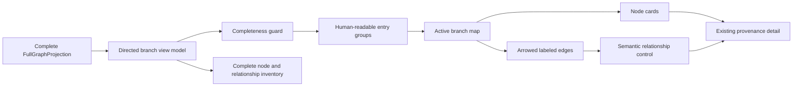
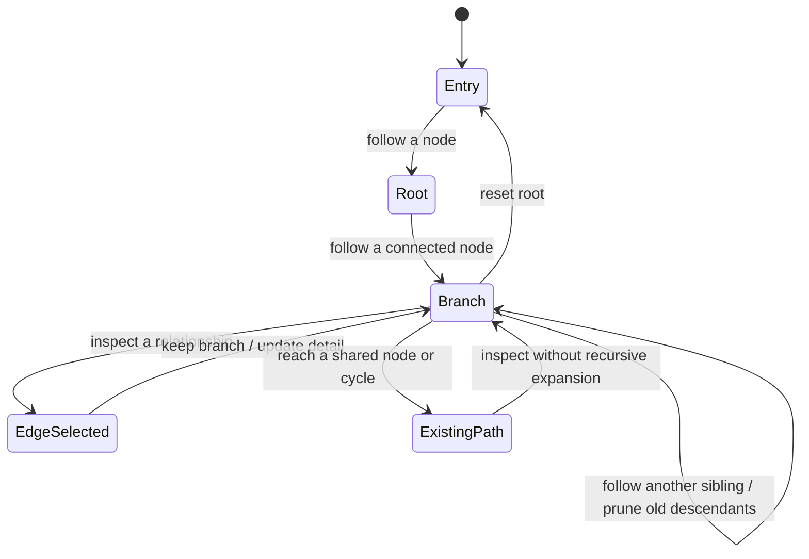

# Progressive Human-Readable Full Graph Views - Plan

## Goal Capsule

- **Objective:** Replace the current grid-and-inventory-first full graph presentation with a human-readable relationship map that lets a coach follow one branch at a time, see its labeled edges, and move between siblings without losing the complete graph.
- **Authority:** The current request defines the presentation change. `docs/plans/2026-08-07-002-feat-full-knowledge-graph-views-plan.md` remains authoritative for complete projections, domain separation, authorization, revision/provenance, read-only behavior, and focused/profile entry points.
- **Execution profile:** Standard UI refactor with a pure directed-branch view-model seam, native semantic controls, a visual edge layer, browser verification, accessibility coverage, and visual regression updates.
- **Stop conditions:** Do not change graph retrieval, projection meaning, authorization, revision pinning, provenance contracts, Copilot boundaries, member scope, or graph mutation behavior. Do not infer a universal parent/child hierarchy from category, screen position, or an arbitrary relationship direction.

---

## Product Contract

Requirement and flow identifiers in this follow-up are local to this document. References to the originating full-graph plan are qualified as `origin R#`, `origin F#`, or `origin AE#`.

### Summary

The full graph view will present a small, readable active branch with visible directional edges and labeled relationship controls. Selecting a node follows its connected branch; selecting a different sibling closes the previous sibling's descendants. All projected records remain available through a complete inventory and the existing source/provenance detail surface.

### Problem Frame

The current renderer has semantic lanes and relationship rows, but it still asks the coach to scan a large inventory and manually reconstruct topology. The screenshot's raw machine identifiers also compete with the labels a person needs to understand. A dense graph needs a visual path with edges, while the underlying Movement and Clinical and member-context graphs are not uniform trees: they contain hierarchy, evidence, constraints, lineage, publication, reverse links, shared neighbors, and cycles.

The presentation must make one relationship path easy to follow without pretending that every neighbor is a child or hiding records that are not on the active path. The graph view is still an optional, read-only inspection path inside the existing coach and member-profile surfaces.

### Actors

- A1. **Coach:** Opens the optional full graph, chooses a starting node, follows connected branches, inspects relationship/source details, and returns to the originating workflow.
- A2. **Graph explorer:** Maintains the active branch, renders directional edges, closes sibling descendants, preserves a complete inventory, and restores focus on collapse.
- A3. **Graph and provenance authorities:** Supply the authorized, revision-pinned projection and truthful source/provenance details for the selected domain.

### Requirements

**Readable relationship map**

- R1. Keep the existing focused Movement and Clinical explanation and member-profile entry points unchanged; opening the full view remains optional and in place. At entry, show a short ranked list of suggested starting nodes using humanized labels; suggestions are not automatic roots. When a member-context projection contains its member identity node, use that node as the seeded root. For Movement and Clinical, a stable focused anchor means the subject node of the focused Movement/Clinical explanation matched to the projection by stable internal key; use it only when it is already available. Otherwise require an explicit human node choice rather than selecting an arbitrary record.
- R2. Start the full view with human-readable entry points grouped by the existing semantic categories and node kinds. Node cards show a non-empty human-readable label, a humanized kind, and relationship counts; when a record has no human label, use the humanized kind plus a stable human disambiguator such as “Body region (unnamed)” rather than a blank label or raw ID. Raw machine identifiers do not appear in graph cards, edge labels, counts, tooltips, or accessible names.
- R3. Show the active branch as a directional relationship map with visible arrow edges and readable relationship labels between connected node cards. The overview must not render every dense relationship as one crossing edge lattice.
- R4. Activating a node follows that node: the current node remains connected to its ancestors, and its directly connected incoming and outgoing relationships become the next visible branch level. Incoming/reverse traversal is a presentation affordance, not a claim about domain hierarchy; reverse groups and non-hierarchical cross-links remain separately labeled so the stored source-to-target arrow direction is never lost.
- R5. When the coach follows a different sibling, descendants of the previous sibling close while the shared ancestor, selected sibling, and their connecting edges remain visible. The current node may be activated again to collapse its own descendants.

**Truthful topology and complete inspection**

- R6. Preserve each relationship's source and target direction in the visual edge and in the semantic relationship control. The UI may describe a rendered neighbor as a branch descendant, but it must not claim that all graph relationships are domain-level parent/child relationships.
- R7. Handle shared neighbors and cycles without infinite expansion or duplicate branch rendering. Mark an already-followed connection as an existing path/cross-link and keep it inspectable.
- R8. Keep every projected node and relationship available in a complete inventory; a selective active branch must never be presented as the complete dataset. The inventory supports client-side filtering by already-loaded labels, kinds, categories, and relationship kinds over the revision-pinned projection. Network-level child/descendant queries, server traversal, and cross-projection search remain deferred. Partial paged data must be labeled as loading and must not be treated as a complete branchable graph; visible counts equal loaded records, while total counts are shown only for a complete projection or authoritative metadata and otherwise say “total unavailable.”
- R9. Selecting a node or relationship opens the existing same-revision source/provenance detail surface. Every node/relationship detail region includes a collapsed but keyboard- and screen-reader-reachable technical-reference disclosure containing the assertion ID, pinned revision, source locator/record, and digest when available, with explicit unavailable copy when a value is absent. The default graph surface uses human-readable source, revision, and authority language; exact machine references never appear in cards, edge labels, counts, tooltips, accessible names, or default metadata.
- R10. Nodes with more than 12 incident relationships use relationship-kind bundles. Each bundle previews at most 12 visible neighbors per direction, exposes visible-versus-total counts, and is a group control rather than a single relationship. The complete inventory remains the path to every incident relationship.

**Workflow and interaction quality**

- R11. Movement and Clinical and member-context graphs use the same interaction primitive while retaining separate domain and member authorization boundaries. Every projection and detail response is accepted only when its context key and request generation match the current surface; the key includes member ID, domain, revision, source digest, projection identity, and operation. Closing or switching a member, domain, revision, or source artifact increments the generation, invalidates prior responses, clears stale branch and selection state, and cannot render another graph's branch.
- R12. Full graph inspection remains read-only and cannot mutate graph data, member context, workouts, Copilot answers, approval state, or revision state.
- R13. The interaction remains keyboard-operable with native controls, preserves focus on branch changes and collapse, supports reduced motion, and has no unintended horizontal overflow at the existing mobile and desktop sizes.

### Key Flows

- F1. **Orient in the full graph**
  - **Trigger:** The coach opens the optional full graph from the focused explanation or member profile.
  - **Steps:** The full projection finishes loading, the coach sees human-readable entry groups, counts, and a short ranked list of suggested starting nodes, and the coach selects a node to establish the branch root.
  - **Outcome:** The active-branch map shows the selected node and its first connected level with visible directional edges.

- F2. **Follow a relationship branch**
  - **Trigger:** A node is visible in the active branch.
  - **Steps:** The coach activates the node, the node becomes the current branch focus, direct connected nodes appear as the next level in outgoing and reverse/incoming groups, and labeled edges remain visible from the ancestor path with their stored direction intact.
  - **Outcome:** The coach can progressively move through the graph without seeing unrelated descendant subtrees.

- F3. **Switch siblings and collapse descendants**
  - **Trigger:** Two or more connected nodes share the same parent branch position.
  - **Steps:** The coach follows one sibling, expands its descendants, then follows another sibling.
  - **Outcome:** The previous sibling's descendants close, the shared ancestor remains visible, and the new branch becomes the only expanded descendant path at that level.

- F4. **Inspect an edge or node**
  - **Trigger:** The coach needs to understand what a visible relationship means or where a record came from.
  - **Steps:** The coach activates the relationship label/edge control or a node card.
  - **Outcome:** The existing detail region shows the selected entity's human-readable kind, source/provenance, and pinned graph context without changing branch state or workflow data.

- F5. **Browse beyond the active branch**
  - **Trigger:** The coach needs a record that is not currently expanded or the graph contains a dense hub/cross-link.
  - **Steps:** The coach opens the complete inventory, filters the already-loaded revision-pinned records by label, kind, category, or relationship kind, expands a category/kind or relationship group, and selects a record.
  - **Outcome:** The record becomes the current selection and can establish or replace the active branch; every projected node and relationship remains reachable and visible/total counts stay truthful.

- F6. **Return to work**
  - **Trigger:** The coach collapses the full graph, changes member, or leaves the originating route.
  - **Outcome:** The graph state is cleared or discarded as appropriate, the current context key and request generation reject late projection/detail responses from the prior surface, and the existing focused/profile workflow and focus target are restored.

### Interaction State Contract

The active branch is a progressive disclosure state, not an inferred domain hierarchy. Native buttons select/follow nodes and relationships; the visual SVG edge layer is decorative because each edge also has a semantic DOM control. The component does not implement an ARIA tree or a roving grid model.

| State | Visible content | Selection and focus behavior |
| --- | --- | --- |
| Entry | Human-readable category/kind entry groups, graph counts, a short ranked list of suggested starting nodes, and “Select a node to follow connections.” Member-context seeds the member identity when available; Movement never picks an arbitrary root. | Focus stays on the activating control until the coach chooses a root; a seeded member node is announced as the initial branch root. |
| Root selected | Root card, direct connected groups, and labeled directional edges. | Root is selected and exposes an expanded/followable state. |
| Branch followed | Ancestor path, current node, direct connected candidates in both outgoing and reverse/incoming groups, and only the active sibling descendant path. | The followed node receives the active state; ancestors stay visible; sibling descendant state is pruned. Direction and reverse traversal are stated in each relationship label. |
| Relationship selected | The selected edge/relationship is emphasized while the current branch remains unchanged. | Relationship activation updates the detail region without moving the branch root. |
| Shared neighbor or cycle | The edge remains visible with an “already in this path” or “shared connection” treatment; recursive rendering stops. A stable node gets one canonical card; later encounters become cross-link edges to that card. | The edge and endpoint remain inspectable; no duplicate descendant subtree is created, and a shared node remains visible while reachable from any active sibling path. |
| High-degree node | Relationship-kind bundles, a numeric high-degree threshold of more than 12 incident relationships, at most 12 visible neighbors per direction per bundle, and visible-versus-total counts. | Following a bundle expands one group at a time; a bundle control is not mistaken for an individual relationship; complete inventory exposes all links. |
| Inventory filtered | Client-side filtering over already-loaded labels, kinds, categories, and relationship kinds narrows the complete inventory without changing the projection or active-path ownership. | Filter text and group controls remain keyboard-operable; clearing the filter restores the full inventory. |
| Partial/loading projection | Progress copy and counts; unresolved endpoints say “Loading node details”; visible counts equal loaded records and totals say “total unavailable” unless complete or authoritative metadata exists; no branch controls are presented as complete. | Selection is cleared or disabled until the projection is complete and revision-pinned. |
| Empty/stale/denied/invalid/unavailable | Existing truthful status copy and retry/reopen behavior. | No fabricated nodes, edges, or provenance are rendered. |
| Collapse/reopen | Focused explanation/profile returns; reopening starts from the same authorized projection or a fresh request. | Collapse returns focus to the original trigger; member/revision changes clear branch state. |

### Acceptance Examples

- AE1. **Human-readable Movement graph:** Given a Movement graph with node labels such as “Lumbar region of back” and “Knee pain,” the full view shows those labels, humanized kinds, and readable relationship labels; raw node/relationship IDs are absent from the graph cards, edge labels, tooltips, counts, and accessible names, while exact references are available only in a collapsed technical-reference disclosure in the detail region.
- AE2. **Visible directional relationship:** Given an exercise connected to a body region, the graph shows a labeled arrow from the source label to the target label. Activating the edge opens relationship provenance, and activating the target follows that branch.
- AE3. **Sibling descendant collapse:** Given a root with two connected siblings, the coach follows sibling A and expands its descendant, then follows sibling B. Sibling A's descendant disappears, the root and B remain, and B's descendant can be expanded without stale A content.
- AE4. **Complete inventory remains authoritative:** Given a dense hub or a record outside the active path, the complete inventory exposes the record with human-readable labels, client-side filtering, and counts that match the full projection when complete; during partial loading, visible counts reflect loaded records and totals say “total unavailable” unless authoritative metadata exists. No record is silently omitted because it is not visible in the map.
- AE5. **Member graph remains isolated and reversible:** Given an authorized member profile, the same progressive visualization is scoped to that member only; no Movement/Clinical data is merged, and closing returns to the unchanged profile.
- AE6. **Cycles and cross-links remain safe:** Given two sibling branches that share a descendant, the shared node renders once with canonical path ownership and later encounters become cross-link edges; given a cycle, following the connection stops at the existing path marker instead of recursing forever or duplicating the node, while the relationship remains inspectable.
- AE7. **Accessible and responsive:** Given keyboard navigation, a screen reader, reduced motion, and 320/430/1440px viewports, node and relationship controls remain operable, edge meaning is available as linear text, and no unintended horizontal overflow appears.
- AE8. **Root and reset safety:** Given a member-context graph, the member identity is the only automatic seed and the entry state also offers ranked suggestions. Given a Movement graph with a stable focused anchor, that subject node is the suggested/seeded anchor; without one, the view asks the coach to choose a node. Changing domain, member, revision, or source artifact increments the context generation and clears the prior branch and detail selection before the new projection can be followed.
- AE9. **Reverse-link followability:** Given a body-region node with an incoming Movement `part-of` relationship, the coach can follow the incoming/reverse connection through a separately labeled control such as “has part · reverse of part of”; the rendered arrow still points from the stored source to the stored target.

### Scope Boundaries

**In scope**

- Replacing the current full-graph overview/focus-map interaction with a progressive active-branch relationship map in `FullGraphExplorer`.
- Humanizing node/relationship labels and removing raw machine IDs from the default graph surface, accessible names, and tooltips while preserving internal selection/provenance identity.
- Rendering directional visual edges plus semantic relationship controls, sibling descendant collapse, cycle/shared-neighbor handling, and a complete inventory fallback.
- Applying the same interaction to Movement and Clinical and member-context projections without merging domains or changing their read boundaries.
- Updating unit, browser, accessibility, responsive, visual, and AXON documentation coverage.

#### Deferred to Follow-Up Work

- Network-level child/descendant queries, server-side traversal APIs, cross-projection search, comparison, analytics, or a standalone graph workspace. Client-side filtering over the already-loaded complete inventory is in scope.
- Force-directed physics, canvas/WebGL rendering, virtualization, or a new graph library. Reconsider only after measured active-branch and complete-inventory performance shows the dependency-free renderer is insufficient.
- Graph editing, relationship authoring, curation, revision activation, or any other mutation.

**Outside this product's identity**

- A general-purpose ontology browser or unrestricted graph editor.
- Treating the visualization as a clinically validated medical visualization or exposing real protected member data.

---

## Planning Contract

### Product Contract Preservation

Product Contract revised, with no change to the originating full-graph data or workflow scope: the prior focus-map requirements are clarified into R3-R10 to add visible directional edges, progressive branch following, sibling descendant collapse, cycle safety, and the no-raw-ID presentation rule. The origin plan's complete projection, authorization, revision, provenance, read-only, and domain-separation requirements remain unchanged.

### Key Technical Decisions

- KTD1. **Use a deterministic active-branch map instead of a static all-edge canvas.** The initial expanded view offers human-readable entry groups. After a root is selected, the renderer shows the root, its direct connected level, and the ancestor path. Following a node advances the branch one level at a time; the complete inventory remains secondary. This makes the relationship itself the primary visual unit without hiding the full projection.

- KTD2. **Preserve edge direction without inventing a universal hierarchy.** The view model indexes incoming and outgoing relationships separately and renders `from → relationship → to` with arrow direction intact. The UI may call the visible continuation a branch descendant for interaction purposes, but it must not relabel `part-of`, `SENT_BY`, `SUPPORTED_BY`, lineage, or other relation kinds as a generic parent/child fact. Screen grouping and category order never define topology.

- KTD3. **Represent expansion as an active path with sibling pruning and canonical ownership.** Keep an internal path of stable node/relationship occurrence keys and the expanded branch position. Render each stable node at most once in the active map: the first encounter on the active path owns the card, while later encounters become cross-link edges to that card. When a node at a branch position is followed, remove descendant expansions belonging to its siblings, preserve the shared ancestors, and keep the new connecting edge visible; prune a card only when it is no longer reachable from the active path. Following the current node again collapses its descendants. This state is local to the explorer and does not change the projection or dashboard route state.

- KTD4. **Make human labels the only default graph language and require a secondary technical disclosure.** Node cards show the node label, a humanized node kind, and relationship counts. Relationship labels use humanized relation vocabulary such as “part of,” “has profile,” or “supported by.” Raw node IDs, relationship IDs, assertion IDs, source locators, and revision IDs are not printed in cards, edge labels, counts, accessible names, tooltips, or default metadata. Stable IDs remain in internal selection keys and callbacks; every detail region contains a collapsed, keyboard- and screen-reader-reachable technical-reference disclosure with the exact references and explicit unavailable states where needed.

- KTD5. **Render edges visually and semantically through one relationship model.** Use a deterministic DOM/SVG branch map: node cards are native buttons, the visual connector layer draws arrowed edges and labels for the active branch, and each relationship has a parallel semantic control/list entry that exposes the same human-readable endpoints and kind. SVG is never the only way to understand a relationship, and the visual layer is not interactive-only.

- KTD6. **Keep progressive behavior client-side over a complete projection.** Reuse the existing lazy, paged full-graph read and derive an explicit `isComplete` guard from `status === "ready"`, the explorer's loading state, and either an absent page or a page with both `hasMoreNodes === false` and `hasMoreRelationships === false`. Enable branch-following only after that guard passes. Visible counts represent loaded records; total counts are shown only when the projection is complete or authoritative metadata supplies them, otherwise the UI says “total unavailable.” Do not add a descendant endpoint or query the graph per click in this presentation slice. If an adapter provides partial data, show progress and preserve the non-branchable state rather than showing an incomplete graph as authoritative.

- KTD7. **Use a shared primitive for both domains.** Movement and Clinical and member-context pass the same projection-derived branch model and renderer. Domain-specific labels come from node/relationship kind metadata, while member scope, revision, authority, provenance, and read-only semantics remain owned by the existing projection and dashboard adapter boundaries.

- KTD8. **Escalate density only on evidence.** Treat more than 12 incident relationships as high degree. The active branch renders relationship-kind bundles, with at most 12 visible outgoing and 12 visible incoming neighbors per bundle, exact visible-versus-total counts, and an explicit complete-inventory path. Bundle controls expand groups; individual relationship controls carry relationship identity, endpoints, and provenance. Keep the current dependency-free client surface and native accessibility model; consider virtualization or a graph library only after measuring representative Movement/Clinical and member-context graphs.

- KTD9. **Separate branch selection from provenance reads.** Selecting a node or relationship uses the complete projection immediately for labels, branch transitions, and the default detail region. Preserve the existing inspection callback as an internal same-revision detail path only when projection detail is missing or an explicit detail refresh is requested; an inspection response must not silently replace a compatible active branch. This prevents every click from resetting the visual path while preserving the current callback identity and revision payload.

### High-Level Technical Design

The authoritative data path remains unchanged. The new seam transforms a complete projection into a branch model, then feeds both a visual map and a linear inventory/detail surface.

The branch state is a path-preserving disclosure state. A sibling switch prunes only descendant state below the shared parent; it does not remove the parent, the newly selected sibling, or the edge that explains the transition.

### System-Wide Impact

- **Projection and server:** No domain contract, repository, route, authorization, or paging change is expected. The existing complete projection remains the only data boundary.
- **Dashboard state:** `CoachDashboard` continues to own lazy reads, member/revision race protection, focused-anchor plumbing, and collapse behavior. It supplies a stable focused node key when available and invalidates projection/detail responses with a context key containing member ID, domain, revision, source digest, projection identity, and operation plus a monotonically increasing request generation. Branch state is local to `FullGraphExplorer` and must be cleared when its projection becomes stale or its surface changes.
- **Accessibility:** Native buttons, linear relationship controls, `aria-expanded`/`aria-current` where appropriate, and a persistent detail region remain the semantic source of truth; SVG connectors do not create a tab wall.
- **Design system:** Coach actions remain carbon ink; graph-produced edge/selection/provenance cues use Signal sparingly. Human copy uses sentence case and humanized relation vocabulary; machine identifiers stay out of the default UI.
- **Agent boundary:** Full graph data remains outside Copilot prompts and existing agent tools. No agent parity surface is introduced by this presentation change.

### Sequencing

1. **Slice 1 — readable inventory:** Land humanized labels and no-ID default metadata, the mandatory collapsed technical-reference disclosure, deterministic unnamed-node fallbacks, client-side inventory filtering, and truthful loaded-versus-total counts in the existing renderer/model; keep this slice independently shippable.
2. **Slice 2 — progressive topology:** Land directed outgoing and reverse/incoming followability, active-path sibling pruning, canonical shared-node ownership, cycle markers, numeric high-degree bundles, visible SVG edges, and semantic relationship controls; keep this slice independently shippable after Slice 1.
3. **Slice 3 — workflow proof:** Update Movement and member-context browser flows, focused-anchor wiring, context-generation race tests, accessibility/responsive/visual coverage, and AXON documentation; verify the existing projection and dashboard boundaries remain unchanged.

### Risks and Mitigations

- **The renderer implies a false hierarchy:** Keep edge arrows and relationship vocabulary authoritative; use “branch”/“connected” copy rather than asserting every neighbor is a domain child.
- **Raw identifiers leak through secondary UI:** Remove IDs from visible metadata, `title` attributes, accessible names, relationship labels, revision chips, and default detail rows; add DOM-level tests that assert machine IDs are not rendered in the human surface.
- **Paged endpoints are unavailable during a partial read:** Do not enable branch interaction until node and relationship counts are complete; never fall back to raw endpoint IDs when a page lacks its endpoint label.
- **Cycles and shared nodes duplicate content:** Track the active path internally, stop recursive rendering at an already-followed node, and preserve the relationship as a selectable cross-link.
- **High-degree hubs overwhelm the map:** Group by relationship kind, show bounded previews with exact totals, and keep the complete inventory available.
- **SVG connectors drift on resize:** Derive connector geometry from rendered node anchors, update on layout/resize changes, and keep semantic relationship rows as the functional fallback.
- **Sibling collapse loses context:** Preserve the shared ancestor and selected edge, prune only descendant expansion state, and test the state transition with two sibling branches and nested descendants.
- **Focus becomes disorienting:** Keep focus on the activated node/relationship after updates, announce the new branch in the existing polite status region, and return focus to the originating control on collapse.
- **Provenance is weakened by humanization:** Keep exact selection/revision/assertion values in internal callbacks and an explicit technical-reference disclosure; do not replace them with guessed labels.
- **A stale projection reopens an old path:** Key the local reset effect by domain, member ID, revision ID, source artifact digest, and projection identity; clear selection, branch, open inventory groups, and detail before accepting the new surface.
- **Every click causes a disruptive detail reload:** Prefer local projection detail for complete records; make any callback-driven detail read explicit and preserve branch state when its revision and projection identity remain compatible.
- **A deep branch becomes a mobile indent tunnel:** Keep branch levels vertically stacked with compact depth markers and test long labels at the minimum supported viewport instead of increasing left padding per depth.

### Sources and Research

- `src/features/coach-dashboard/FullGraphExplorer.tsx` — current selected-key state, semantic lanes, focus rows, inventory disclosures, provenance callback, and raw-ID presentation that this plan replaces.
- `src/features/coach-dashboard/full-graph-view-model.ts` — current deterministic grouping and incident-row seam; it currently treats relationships as undirected for focus and has no branch state.
- `src/features/coach-dashboard/full-graph-explorer.module.css` — AXON cards, Signal focus, 44px targets, mobile stacking, wrapping, and reduced-motion patterns to retain.
- `src/domain/contracts/full-graph-view.ts` — stable internal IDs, `fromId`/`toId`, categories, revisions, counts, provenance, and paged completeness metadata; no projection change is required.
- `src/domain/contracts/movement-graph.ts` — Movement relationship direction and mixed relation semantics, including child-to-parent `part-of`, evidence, clinical, variant, and lineage edges.
- `src/domain/contracts/member-context.ts` — member-context parent/child and reverse/cross-link relationship vocabulary such as `HAS_PROFILE`, `CONTAINS_MESSAGE`, `SENT_BY`, and `SUPPORTED_BY`.
- `src/features/coach-dashboard/production-adapter.ts` and `src/features/coach-dashboard/CoachDashboard.tsx` — existing progressive page accumulation, revision pinning, abort/race protection, and entity inspection behavior.
- `tests/unit/full-graph-view-model.test.ts` — current deterministic grouping, dense-hub, duplicate-label, empty, and scale coverage to extend with branch semantics.
- `tests/e2e/full-graph-views.spec.ts` — current Movement/member full-view, provenance, focus restoration, dense-hub, accessibility, and markup-safety flows to update without raw-ID assertions.
- `ui/readme.md` — AXON human-versus-Signal language, full graph inspection boundary, mobile sizing, and provenance conventions.
- `docs/plans/2026-08-07-002-feat-full-knowledge-graph-views-plan.md` — authoritative full projection, authorization, revision, domain separation, read-only, and focused/profile contract.

No new external research was required for this pass because the repository already contains the graph contracts and the prior plan's accessibility/prior-art research; local implementation patterns were sufficient to choose the active-branch approach.

## Alternative Approaches Considered

- **Keep semantic lanes plus a focus-map row list:** Rejected as the primary surface because it makes the coach reconstruct the graph from text instead of seeing the relationship path and edge direction.
- **Render the full graph with force-directed physics:** Rejected because dense hubs and mixed semantic relations remain difficult to follow, sibling collapse is unstable, and a readable linear fallback would still be required.
- **Infer a tree from categories or screen position:** Rejected because Movement and member-context relations do not share one hierarchy and `part-of` direction differs from many member-context relations.
- **Fetch descendants from a new API on every click:** Deferred because the current full read already accumulates a complete authorized projection; a new traversal boundary would expand server, authorization, caching, and stale-response scope without improving this UI slice.
- **Show machine IDs for duplicate-label disambiguation:** Rejected for the human surface. Use kind, stable ordering, and human-friendly ordinals in labels/accessibility names; keep machine identity internal and optionally available in technical provenance detail.

---

## Implementation Units

### U1. Build a directed progressive graph view model

- **Goal:** Provide pure helpers that turn a complete projection into human-readable entry groups, directed relationship rows, active-branch candidates, cycle/shared-neighbor markers, and deterministic sibling-pruning state.
- **Requirements:** R2-R11; F1-F5; AE1-AE4, AE6, AE8-AE9; KTD1-KTD4, KTD6, KTD8-KTD9.
- **Dependencies:** Existing `FullGraphProjection` completeness metadata and stable internal entity keys; no new API or projection fields.
- **Files:** Modify `src/features/coach-dashboard/full-graph-view-model.ts` and `tests/unit/full-graph-view-model.test.ts`. Remove obsolete grid-specific layout/name helpers and their assertions from `tests/unit/full-graph-explorer.test.ts` if they remain in the branch.
- **Approach:**
  1. Humanize node kinds and relationship kinds with a deterministic fallback for future values; derive duplicate-safe human labels using kind and stable display order, never raw IDs. When a node label is empty, use the humanized kind plus a stable human disambiguator such as “Body region (unnamed)” rather than a blank label or machine identifier.
  2. Index incoming and outgoing relationships separately, resolve endpoint labels without falling back to machine IDs in a user-facing string, and expose an explicit missing-endpoint state for incomplete pages.
  3. Derive an explicit completeness guard from the accumulated page metadata and loading state; expose seeded-root candidates for member identity, any existing focused Movement anchor, and a short ranked suggestion list (rank by relationship count within semantic categories) without making the model choose an arbitrary root.
  4. Derive the active branch from a root and a directed path of selected nodes/relationships; return direct outgoing and followable reverse/incoming candidates, separately labeled cross-link connections, relationship-kind bundles, counts, and stored edge direction for each branch level.
  5. Provide a pure transition that follows a candidate, preserves ancestors, prunes sibling descendant expansions, toggles the current node's descendants, and stops on already-followed nodes or cycles. Give each stable node one canonical card owner; later encounters become cross-link edges, and prune cards only when they are no longer reachable from the active path.
  6. Keep a complete, deterministically ordered node/relationship inventory model separate from the active branch so visual culling never changes coverage. Support client-side filtering over the loaded projection, expose loaded-versus-total count provenance, and mark totals unavailable when the projection is partial and no authoritative total exists.
- **Patterns to follow:** Preserve readonly projection types, stable sorting, existing `relinkFullGraphProjection` completeness behavior, and the current model-level scale tests. Keep the branch transition independent of React state so both Movement and member-context tests exercise the same semantics.
- **Test scenarios:**
  - A projection with nodes and relationships in different input orders yields identical humanized kind labels, entry-group ordering, edge ordering, and branch candidates.
  - Node and relationship display/accessibility descriptors contain labels, kinds, and human-friendly ordinals where needed, but never raw node IDs, relationship IDs, assertion IDs, locators, or revision IDs.
  - Empty labels produce a stable human fallback such as “Body region (unnamed)” and never a blank string or raw ID.
  - Outgoing and incoming relationships remain distinct and preserve `from → kind → to` direction, including Movement `part-of` and member-context `SENT_BY`/`SUPPORTED_BY` examples; reverse-follow controls state the reverse direction explicitly.
  - Following a root then one child returns the ancestor, selected edge, and direct next-level candidates; following a sibling removes only the previous sibling's descendant state.
  - Following the same node again collapses its descendants without removing the node or its incoming edge.
  - A shared neighbor or cycle is marked as already present in the active path, has one canonical card owner, and does not create duplicate recursive descendants; it remains visible while reachable from an active sibling path.
  - High-degree nodes (more than 12 incident relationships) produce relationship-kind bundles with at most 12 visible neighbors per direction, exact visible/total counts, and a complete inventory count equal to the projection count.
  - Partial page data with a missing endpoint is marked incomplete and does not fall back to displaying the endpoint's machine ID; loaded counts and unavailable totals remain explicit.
  - Member-context projections seed the member identity when present; Movement projections without a stable focused anchor require an explicit root choice.
  - Changing domain, member, revision, or source artifact digest produces a fresh selection/branch state and cannot reuse a prior member's or revision's path; projection/detail responses with an old context key or request generation are discarded.
  - Client-side filtering narrows the complete inventory by loaded label, kind, category, or relationship kind without changing projection completeness or active-path ownership.
  - Empty, isolated, invalid, and complete projections return stable non-throwing entry/branch/inventory states.
- **Verification:** Pure view-model tests prove deterministic labels, directed topology, active-path transitions, sibling pruning, cycle safety, completeness, and no-ID display descriptors without a browser.

### U2. Replace the grid/focus renderer with the progressive relationship map

- **Goal:** Give the coach a visual branch with visible labeled edges, one active descendant path at a time, and the existing provenance/detail behavior across both graph domains.
- **Requirements:** R1-R13; F1-F6; AE1-AE6, AE8-AE9; KTD1-KTD9.
- **Dependencies:** U1; existing lazy full-graph read and `GraphInspectionRequest` callback.
- **Files:** Modify `src/features/coach-dashboard/FullGraphExplorer.tsx`, `src/features/coach-dashboard/CoachDashboard.tsx`, and `src/features/coach-dashboard/full-graph-explorer.module.css`. Create `src/features/coach-dashboard/FullGraphRelationshipMap.tsx` as the focused branch-map/connector boundary. Extend `tests/e2e/full-graph-views.spec.ts`.
- **Approach:**
  1. Replace the current overview/focus-map selection model with an entry state and active-branch state; show ranked human-readable suggestions, seed the member identity when available, use an existing focused Movement anchor only when it is stable, and otherwise ask the coach to choose a root. Pass the focused anchor through an optional internal `initialNodeId` prop matched to the projection by stable key. Node activation both selects the node and follows its next-level outgoing or reverse/incoming connections, while each relationship label states its direction and cross-links remain inspectable without being mislabeled as domain children.
  2. Render the active branch as a flat vertical stack of depth levels with native node buttons and a decorative SVG connector layer containing arrowheads and humanized relationship labels. Use borders/markers rather than growing horizontal indentation so deep paths fit at 320px. Render a parallel semantic relationship control for every visible edge so topology remains available without relying on SVG geometry.
  3. Preserve ancestors and the shared parent when following a sibling, remove closed sibling descendants from the DOM, expose `aria-expanded`/`aria-current` state, announce the new branch in the polite status region, and keep focus on the activating control after updates.
  4. Replace raw-ID metadata, `title` attributes, default provenance rows, and ID-bearing accessible names with human labels, humanized kinds, relationship counts, and duplicate-safe ordinals. Keep exact machine identity only in internal callback payloads; every node/relationship detail region must include an explicitly collapsed, keyboard- and screen-reader-reachable technical-reference disclosure with assertion, revision, source, and digest references when available.
  5. Use the local projection immediately for branch selection and default detail. Invoke the existing inspection callback only when required detail is absent or an explicit technical detail action requests it; preserve its entity ID and pinned revision internally without allowing the response to reset a compatible branch. Accept projection and inspection responses only when their member/domain/revision/source/projection context key and request generation match the current surface; discard old responses.
  6. Keep the complete inventory as a secondary disclosure with client-side filtering over already-loaded labels, kinds, categories, and relationship kinds. Selecting an inventory record establishes the selected entity and branch root/path without merging Movement/Clinical and member-context data; visible counts represent loaded records and totals are unavailable unless complete or authoritative metadata supplies them.
  7. Preserve loading, empty, stale, denied, invalid, unavailable, lazy-read, pinned-revision, source/provenance, collapse, member-switch, revision-reset, and return-focus behavior. Derive the completeness guard from the projection page and `loading` state; do not render branch controls as complete while the paged projection is still accumulating.
- **Patterns to follow:** Keep the current `FullGraphExplorer` client boundary, `GraphInspectionRequest`, `data-focus-key` restoration, `EntityDetail` state surface, native disclosure controls, AXON Signal focus, and 44px hit targets. Keep all graph labels escaped text.
- **Test scenarios:**
  - Covers AE1. Opening a dense Movement graph shows readable entry groups and no raw machine IDs in visible graph text, tooltips, accessible names, or edge labels.
  - Covers AE2. Selecting a source node renders a visible directional arrow with a humanized relationship label and readable endpoint cards; selecting the edge opens the existing same-revision provenance detail.
  - Covers AE9. Selecting a reverse/incoming relationship follows the connected node through a separately labeled reverse control while the visual arrow preserves the stored source-to-target direction.
  - Covers AE3. Following sibling A then sibling B closes A's nested descendants, preserves the common ancestor and B edge, and allows B's descendants to expand.
  - Re-activating the current node collapses its descendants while leaving its selected detail and incoming edge intact.
  - Selecting a node or relationship from the complete inventory establishes the same branch/detail state as selecting it from the visual map.
  - A shared neighbor/cycle renders an existing-path marker without duplicate nodes, infinite recursion, or loss of the relationship control.
  - A high-degree lineage/publication/member hub (more than 12 incident relationships) shows relationship-kind bundles with at most 12 visible neighbors per direction and visible-versus-total counts rather than hundreds of simultaneous edges, while the complete inventory contains every incident relationship.
  - Movement and member-context fixtures use the same interaction model, but the member view contains only the selected member projection and no Movement/Clinical records.
  - Loading, partial, empty, stale, denied, invalid, and unavailable states do not expose stale branch content or fabricate endpoint labels/provenance; partial views distinguish loaded counts from unavailable totals.
  - Changing the domain, member, revision, or source artifact digest clears the branch and selected detail before the new projection becomes interactive; an inspection response for the old context key or request generation cannot restore it.
  - A node with detail already present in the complete projection can be selected and followed without a network read; the existing inspection callback still receives the stable entity ID and pinned revision for a missing-detail request.
  - The existing inspection callback receives the original entity ID and pinned revision internally even though those values are absent from the human-facing surface.
  - Technical references are present only in a collapsed detail disclosure, and a graph-derived node, relationship, provenance, status, SVG-label, or accessible-name string containing HTML, SVG, or script payload text renders as escaped text rather than interpreted markup.
  - A focused Movement explanation passes its stable subject key through `CoachDashboard` to `FullGraphExplorer`; when it is absent or cannot match the projection, the UI presents ranked suggestions and requires an explicit choice.
- **Verification:** Browser flows prove the progressive graph interaction, visible edge semantics, sibling collapse, complete inventory fallback, no-ID presentation, same-revision inspection, both domains, and preserved collapse/focus behavior.

### U3. Prove accessibility, responsive behavior, and graph-language documentation

- **Goal:** Make the progressive map robust at supported sizes and document the interaction contract so future changes do not reintroduce the grid, ID clutter, or an implied universal hierarchy.
- **Requirements:** R2, R5-R13; F2-F6; AE3-AE8; KTD3-KTD5, KTD7-KTD9.
- **Dependencies:** U1-U2.
- **Files:** Extend `tests/e2e/full-graph-views.spec.ts`, `tests/e2e/coach-dashboard-accessibility.spec.ts`, `tests/e2e/coach-dashboard-responsive.spec.ts`, `tests/e2e/coach-dashboard-mobile.spec.ts`, `tests/visual/coach-dashboard-desktop.spec.ts`, and `tests/visual/coach-dashboard-mobile.spec.ts`. Modify `ui/readme.md`.
- **Approach:**
  1. Verify native node/relationship controls, branch expansion state, focus retention, screen-reader status announcements, persistent detail, and keyboard access without introducing an ARIA tree/grid widget.
  2. Verify branch levels stack with stable depth markers and connectors remain legible at 320px, 430px, and 1440px; wrap long human labels, keep the page as the scroll owner, and avoid horizontal overflow or hover-only edge meaning.
  3. Capture expanded Movement and member-context branch states at desktop/mobile sizes while preserving focused/default dashboard baselines.
  4. Document the semantic entry → active branch → complete inventory model, the rule that raw IDs are internal, the directional-edge vocabulary, and the distinction between rendered branch descendants and domain hierarchy.
- **Patterns to follow:** Existing Playwright `@a11y`/`@visual` conventions, AXON mobile-first sizing, reduced-motion handling, and the current read-only/provenance language in `ui/readme.md`.
- **Test scenarios:**
  - Covers AE3. Keyboard activation of a node follows the branch, moves focus to the active node without losing the ancestor path, and switching siblings removes the old descendant subtree.
  - Covers AE4. A node or relationship outside the active map is reachable in the complete inventory, and inventory counts match the full projection.
  - Covers AE5, AE6, and AE8. Member switching, domain/profile close, stale response, revision changes, and cycle/shared-neighbor cases never leave another member's branch or duplicate content visible; member identity seeding and Movement root choice remain explicit.
  - Covers AE7. Keyboard, screen-reader, reduced-motion, and axe checks find no new violations; every visible edge has a linear semantic relationship control.
  - At 320px, 430px, and 1440px, branch cards, edge labels, detail fields, inventory groups, and humanized provenance remain readable with no unintended horizontal page overflow.
  - Duplicate human labels remain distinguishable with kind/ordinal language without printing machine IDs.
  - Expanded desktop and mobile snapshots show the relationship-map treatment while focused default snapshots remain stable.
- **Verification:** Targeted browser, accessibility, responsive, visual, and documentation checks prove the interaction contract is understandable, operable, and consistent across both graph domains.

---

## Verification Contract

1. **Static correctness:** `pnpm typecheck` and `pnpm lint` pass with the branch model, visual edge components, CSS-module names, and unchanged graph contracts.
2. **View-model correctness:** `pnpm test -- tests/unit/full-graph-view-model.test.ts` passes with humanized labels, unnamed-node fallbacks, directed adjacency including reverse followability, active-path transitions, canonical shared-node ownership, sibling pruning, cycle safety, complete inventory/filtering, truthful counts, and partial-data guards.
3. **Graph behavior:** `pnpm test:e2e -- tests/e2e/full-graph-views.spec.ts` passes for Movement and member-context loading, focused-anchor/suggestion root behavior, outgoing and reverse branch following, visible edge controls, sibling collapse, cycles/cross-links, local provenance and collapsed technical disclosure, no-ID presentation, stale/unavailable states, context-generation rejection, member/revision reset, and collapse/focus restoration.
4. **Accessibility and responsive behavior:** `pnpm test:a11y -- tests/e2e/full-graph-views.spec.ts tests/e2e/coach-dashboard-accessibility.spec.ts` plus the responsive/mobile suites pass with keyboard-selectable controls, linear edge semantics, collapsed disclosure reachability, markup-safe graph text, reduced motion, and no overflow.
5. **Visual regression:** `pnpm test:visual -- tests/visual/coach-dashboard-desktop.spec.ts tests/visual/coach-dashboard-mobile.spec.ts` passes with updated expanded branch-map snapshots and unchanged focused defaults.
6. **Repository safety:** No API, projection, repository, authorization, Copilot, agent, workout, approval, or mutation files change as part of this presentation-only follow-up; unrelated dirty worktree changes remain untouched.

## Definition of Done

- The square-grid/all-edge presentation is removed from the expanded full graph view.
- The full view opens with human-readable entry groups, ranked suggestions, and counts; raw machine IDs are absent from default graph cards, edges, tooltips, accessible names, and default metadata. Any technical references appear only in a collapsed, keyboard- and screen-reader-reachable secondary disclosure.
- Unnamed nodes receive stable human fallback labels, and client-side inventory filtering works over the already-loaded revision-pinned projection without changing branch ownership.
- Selecting a node establishes/follows an active branch with visible directional arrow edges and readable relationship labels.
- Following a different sibling closes the previous sibling's descendants while preserving the shared ancestor and current branch.
- Member-context seeds only its member identity when available; Movement uses a stable focused anchor when available or ranked suggestions otherwise, never chooses an arbitrary root, and any stale/domain/member/revision change clears the active branch.
- Cycles and shared neighbors are marked and inspectable without duplicate recursive rendering; each shared node has one canonical card while it remains reachable from an active path.
- Every node and relationship remains selectable in a complete inventory with client-side filtering and counts, authority, and pinned graph context represented truthfully; partial projections distinguish loaded counts from unavailable totals.
- Movement and member-context views remain separate, read-only, revision/provenance-aware, and correctly scoped.
- Exact internal IDs still reach selection/provenance callbacks; any human-facing technical references are explicit and secondary rather than graph labels.
- Complete projection detail is used locally before any callback-driven read, so following a branch does not reset the visual path.
- Projection and detail responses with a mismatched member/domain/revision/source/projection context key or request generation are discarded.
- High-degree nodes use explicit more-than-12 thresholds and at-most-12-per-direction bundle previews, while each relationship remains individually inspectable in the inventory.
- Keyboard, screen-reader, reduced-motion, 320/430/1440px responsive, and visual regression coverage passes.
- AXON styling uses carbon ink for coach actions and Signal only for graph/provenance output.
- No abandoned grid, ID-heavy, or exploratory renderer paths remain in the final diff.
- The verification contract passes and the final diff is limited to this graph-view presentation change plus its tests/documentation.

### Deferred to Implementation

- Final connector geometry, edge-label collision spacing, and exact breakpoint values should be selected after browser inspection of representative Movement/Clinical and member-context snapshots.
- If the complete projection cannot be guaranteed before branch interaction in a future adapter, the adapter must expose an explicit completeness state before any child-query or pagination redesign is considered.
