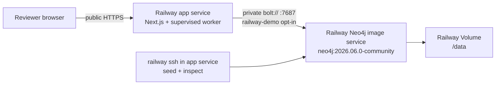
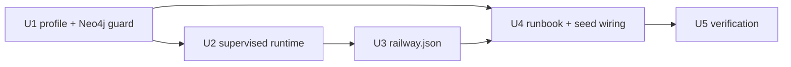

# Railway Minimum Demo Deployment - Plan

## Goal Capsule

- **Objective:** Make the existing Next.js dashboard, deterministic workout worker, and synthetic Neo4j graphs runnable as a small Railway demo.
- **Settled scope:** One public Railway app service runs Next.js and the long-lived workout worker under one supervised process. One separate Railway Docker Image service runs the pinned Neo4j Community image with a persistent `/data` volume.
- **Demo profile:** `NODE_ENV=production` plus an explicit `AXON_RUNTIME_PROFILE=railway-demo`. The profile permits deterministic mode and one narrowly scoped non-TLS Bolt connection over Railway private networking; normal production configuration remains strict.
- **Provider scope:** No model-provider key is required. The existing deterministic composer/reviewer and Copilot quick prompts remain the demo path.
- **Data scope:** Synthetic repository data only. No PHI, real coach identity, public Neo4j endpoint, HA, backups, or production auth.
- **Tail ownership:** The implementation must leave behind a documented Railway setup, a reproducible seed/reseed path, local quality gates, and a Railway smoke checklist. It does not include creating the Railway project or operating credentials.

## Product Contract

### Problem frame

The repository currently has a reliable local Docker Compose path, but Railway needs explicit service topology, a runtime entrypoint that keeps Next.js and the detached worker alive together, a persistent Neo4j service, and a safe way to connect to a single Railway-private database. The existing Neo4j client intentionally rejects every non-local plaintext URI, so merely setting development mode cannot connect to Railway's private hostname.

### Requirements

- **R1. App deployment:** Railway can build the repository with Railpack using Node 24, pnpm 11.9.0, and `pnpm build`, then start it through a checked-in Railway start command. The app honors Railway's injected `PORT`.
- **R2. Worker liveness:** The app service starts the existing `run-workout-worker.ts --poll` process beside Next.js, forwards SIGTERM/SIGINT to both children, restarts the worker for bounded transient startup failures, and exits unhealthy after repeated failure rather than silently serving a UI without a worker.
- **R3. Neo4j service:** A separate `neo4j:2026.06.0-community` image service listens on private Bolt port 7687, has a Railway volume mounted at `/data`, and is not exposed publicly.
- **R4. Connection guard:** A plaintext `bolt://<exact Railway private hostname>:7687` URI is accepted only when `NODE_ENV=production`, `AXON_RUNTIME_PROFILE=railway-demo`, `NEO4J_ALLOW_INSECURE_RAILWAY=1`, and a matching `NEO4J_PRIVATE_DOMAIN` are all present. Userinfo, paths, query strings, alternate ports, non-Railway hosts, missing flags, and ordinary production mode still require encrypted `bolt+s://` or `neo4j+s://`.
- **R5. Deterministic demo:** Deterministic worker mode is accepted in production runtime only for the exact Railway demo profile. It remains rejected in ordinary production mode. Provider mode is unchanged.
- **R6. Graph bootstrap:** Existing movement and Member Context seed commands can use explicit Railway credentials and private DNS when run inside the app service. Activation keeps the existing inspect/compare-and-swap behavior and never deletes or resets the database.
- **R7. Secrets and auth:** The current mock session contract uses one shared 32-byte value for `WORKOUT_ROUTE_SECRET` and `COPILOT_SESSION_SECRET`; `COPILOT_CONTINUATION_SECRET` is a separate 32-byte value. The runbook requires a non-synthetic Neo4j password, rejects custom public rosters and `WORKOUT_TEST_BYPASS`, and never commits or logs secret values.
- **R8. Reviewer path:** After deployment and seeding, a reviewer can open the public app, use the existing mock coach sign-in, select synthetic Jordan, run the deterministic workout flow, and use graph-backed Copilot quick prompts.
- **R9. Demo-ready gate:** HTTP liveness, worker readiness, graph connectivity, active revision verification, and one completed deterministic job are separate go/no-go checks. A 200 healthcheck alone never makes the seeded demo ready.
- **R10. Honest boundaries:** Documentation clearly labels the deployment as a demo profile with private-network plaintext Bolt, single-instance worker semantics, synthetic data, and no production readiness claim.

### Key flow

1. Create the Neo4j Docker Image service and attach `/data`.
2. Create the app service from the repository; Railway uses `railway.json` for build/start/health/restart settings.
3. Set shared/service variables, including the Neo4j service's private domain reference.
4. Deploy Neo4j first, then the app. The app runner starts Next.js and the worker; the worker retries while Neo4j finishes starting.
5. From a `railway ssh` session inside the app service, run Member Context and Movement graph seed commands. Private DNS is intentionally not used from the local machine or a build/pre-deploy container.
6. Verify HTTP liveness, worker-ready/polling logs, graph connectivity and active revision invariants, the browser flow, and persistence after a Neo4j restart without removing the volume.

### Acceptance examples

- **AE1. Fresh services:** A fresh Railway environment with the documented two services reaches an app healthcheck 200 and a running Neo4j service with `/data` mounted.
- **AE2. Guardrail:** A unit test proves that remote plaintext Neo4j is rejected by default, accepted only for the exact Railway demo profile/hostname/flag, and still rejected for a non-Railway host or ordinary production profile.
- **AE3. Worker:** Killing or failing the worker child causes the runner to retry within its bound; exhausting retries terminates the app service instead of leaving a false-positive deployment.
- **AE4. Seed:** Running the documented `railway ssh` seed commands creates or reuses the three synthetic Member Context revisions and the Movement revision; a stale activation expectation fails closed.
- **AE5. Browser:** The public app's mock sign-in, synthetic roster, deterministic workout, and quick Copilot path work without an AI provider key.
- **AE6. Persistence:** Restarting the Neo4j service without deleting the Railway volume preserves active revision pointers and graph reads.
- **AE7. Regression:** Existing local `pnpm demo` behavior remains local/Docker-based and all current quality gates continue to pass.

### Scope boundaries

**In scope**

- One Railway app service with two supervised child processes.
- One pinned Neo4j Community Docker Image service and one `/data` volume.
- A demo-only runtime profile, private-network URI allowance, seed wiring, Railway config, docs, and focused unit tests.
- Manual post-deploy seeding through Railway SSH.

**Outside this plan**

- Neo4j TLS certificate provisioning, Aura, public Bolt/TCP proxy access, clustering, HA, backups, automated migrations, or multi-region deployment.
- Separate scalable worker service, replicas greater than one, queue infrastructure, provider-backed generation, real authentication, real member data, PHI, or clinical validation.
- CI/CD workflow creation, Railway project creation, secret generation on behalf of the user, or production monitoring.

## Planning Contract

### Assumptions

- The user's “min demo” decision is authoritative: speed and a reviewable hosted demo outweigh production hardening.
- The Railway service is named `neo4j` (or the runbook will replace the namespace with the actual service name) so the app can reference `${{neo4j.RAILWAY_PRIVATE_DOMAIN}}` and copy that value into `NEO4J_PRIVATE_DOMAIN`.
- The app runs with one replica. Scaling the combined service would create duplicate queue consumers and is intentionally unsupported.
- The public demo uses the repository's exact three synthetic member IDs and default mock coach. Railway environment variables must not override the public roster.
- The Railway demo uses one shared mock-session secret for the session route, workout routes, and Copilot session authority; continuation signing remains separate.
- The current dirty worktree contains user changes. Implementation must preserve unrelated edits and patch only the deployment surfaces listed below.
- Node 24 and pnpm 11.9.0 are the deployment validation versions even though the current local shell reports Node 25.8.1.
- No institutional `docs/solutions/` corpus exists; decisions below are new repository conventions grounded in current code and official platform/database documentation.

### Key technical decisions

- **KTD1 — Separate runtime profile from `NODE_ENV`.** Keep `NODE_ENV=production` so Next.js runs its production server normally. Add `AXON_RUNTIME_PROFILE=railway-demo` as the explicit, reviewable demo exception. Deterministic mode and insecure private Bolt are allowed only through that profile plus their individual flags; normal production remains fail-closed.
- **KTD2 — Use exact direct `bolt://` for the single Community instance.** The Railway database is one server, not a routing cluster. The runbook uses an explicit `bolt://<NEO4J_PRIVATE_DOMAIN>:7687` URI; the opt-in guard requires the exact expected hostname, explicit port 7687, no URI credentials/path/query, and the exact `railway-demo` profile. Encrypted `bolt+s://`/`neo4j+s://` behavior is unchanged. The private network provides service-to-service isolation, but this is not Neo4j-native TLS.
- **KTD3 — Keep the worker in the app service for the demo.** A small Node supervisor starts the existing Next start command and existing worker poller, preserves Railway's `PORT`, tags child output, retries only the worker with bounded backoff, and shuts down both children together. It does not duplicate queue or workout logic.
- **KTD4 — Promote `tsx` to runtime dependencies.** The Railway start command executes the TypeScript supervisor and the existing worker script after deployment. `tsx` must not be available only through `devDependencies`.
- **KTD5 — Seed after deployment from inside Railway.** Do not use a pre-deploy seed command: private DNS and the Neo4j runtime volume are service-runtime concerns, and Railway pre-deploy commands do not mount service volumes. Use `railway ssh --service <app> -- ...` after both services are running.
- **KTD6 — Pin the Neo4j image tag.** Use `neo4j:2026.06.0-community` in Railway and local Compose so the demo has one reproducible Community image version rather than a moving alias.
- **KTD7 — Separate platform liveness from demo readiness.** Use the existing lightweight `GET /api/session` route as the Railway healthcheck because it proves Next.js is responding without requiring a seeded graph. Treat it as web-only liveness: the public reviewer URL is not demo-ready until the worker emits its ready/polling signal, the app can verify Neo4j, all active revision invariants pass, and one deterministic job reaches a terminal state.

### Topology

## Implementation Units

### U1. Add the explicit Railway demo profile and wire Neo4j configuration

**Purpose:** Preserve the current non-local encrypted URI guard while making the minimum Railway topology possible through two explicit, independently testable opt-ins.

**Governs:** R4–R7, R10; AE2 and AE5.

**Files to add or modify:**

- `src/server/deployment-profile.ts` — add the canonical `railway-demo` profile constant and helpers that recognize the profile and derive the insecure-private-network opt-in from the environment.
- `src/graph/neo4j/client.ts` — extend `Neo4jClientConfig` with the profile, expected-private-host, and allowance inputs; accept only direct `bolt://<expected-host>:7687` for the Railway profile. Keep local loopback defaults, synthetic-password rejection, and encrypted remote URI rules unchanged.
- `src/server/workout-worker-composition.ts` — allow deterministic mode only when `NODE_ENV=production` and the exact Railway demo profile is present; reject a profile used with a non-production `NODE_ENV` so the exception cannot become a generic development escape hatch.
- `src/server/workout-route-composition.ts` — pass the profile-scoped Neo4j allowance into the shared server infrastructure.
- `src/server/copilot/composition.ts` — pass the same profile-scoped Neo4j allowance so Copilot and workout routes use identical connection policy.
- `scripts/seed-movement-graph.ts` — pass explicit URI/user/password/database/profile values to the client.
- `scripts/seed-member-context.ts` — replace its current implicit-default client construction with the same explicit environment mapping and profile allowance.
- `scripts/run-workout-worker.ts` — emit stable non-sensitive `ready`, `polling`, restart/exit, and intentional-shutdown signals for the Railway supervisor/runbook.
- `.env.example` — document the local default as disabled and add commented Railway-demo variables without real secrets.
- `tests/unit/neo4j-client.test.ts` — add focused transport-policy cases.
- `tests/unit/workout-worker-composition.test.ts` — add profile/deterministic-mode cases.
- `tests/unit/deployment-profile.test.ts` — cover profile recognition and flag derivation.
- `tests/unit/mock-session.test.ts` and `tests/unit/copilot-route.test.ts` — cover the shared mock-session secret contract across session and Copilot boundaries.

**Implementation guidance:**

- Use `NEO4J_PRIVATE_DOMAIN` as the expected hostname and require the parsed URI hostname to match it exactly. Require a valid `*.railway.internal` private domain, explicit port 7687, `bolt:` protocol, no username/password, empty path, empty query, and empty hash. This prevents suffix confusion, alternate ports, and accidental public endpoints.
- The low-level client should receive explicit booleans/profile values rather than reading `AXON_RUNTIME_PROFILE` itself. The server and seed composition layers own environment interpretation; the graph client owns URI validation.
- A Railway profile without `NEO4J_ALLOW_INSECURE_RAILWAY=1` must still fail. A flag without the exact profile must still fail. Unknown non-empty profile, mode, or flag values must fail rather than falling through to provider/default behavior.
- Require a non-empty password of at least Neo4j's minimum length and reject the repository's local password and obvious placeholder values for the demo profile. Never put credentials in a URI or child-process command arguments.
- Use one shared mock-session secret in the demo profile: preflight must require `COPILOT_SESSION_SECRET` to equal `WORKOUT_ROUTE_SECRET`, while `COPILOT_CONTINUATION_SECRET` must be present and different. This matches the current session route and Copilot authority rather than creating two incompatible cookies.
- Reject `WORKOUT_LOCAL_COACH_ID`, `WORKOUT_LOCAL_MEMBER_IDS`, `COPILOT_LOCAL_COACH_ID`, and `COPILOT_LOCAL_MEMBER_IDS` in the public demo profile. Seed/readiness verification must assert the three checked-in synthetic member IDs and source/canonical digests.

**Test scenarios:**

1. Loopback `bolt://` and `neo4j://` continue to work with local/test defaults.
2. Remote plaintext URI fails with no opt-in, with only the profile, and with only the flag.
3. `NODE_ENV=production`, `AXON_RUNTIME_PROFILE=railway-demo`, `NEO4J_ALLOW_INSECURE_RAILWAY=1`, `NEO4J_PRIVATE_DOMAIN=neo4j.railway.internal`, and `bolt://neo4j.railway.internal:7687` create a client.
4. The same opt-in rejects a missing/wrong expected hostname, `neo4j://`, alternate ports, userinfo, paths, queries, malformed hostnames, and non-Railway hosts.
5. Encrypted remote URIs remain accepted in ordinary production without the demo flag.
6. Deterministic mode remains rejected in ordinary production and is accepted only for the Railway profile with explicit production secrets/Neo4j variables.
7. Unknown profile/mode/flag values fail closed; both seed scripts pass the Railway URI and credentials instead of silently falling back to localhost.
8. A sentinel session secret signs in through `/api/session` and is accepted by both workout and Copilot session authorities; changing only `COPILOT_SESSION_SECRET` is rejected by Railway preflight.
9. Custom roster overrides are rejected, and the accepted demo roster is exactly the three checked-in synthetic member IDs.

**Done when:** The demo exception is explicit at every composition boundary, default production tests still fail closed, and seed commands can resolve the same remote configuration as the app.

### U2. Add a supervised Railway app/worker runtime

**Purpose:** Make the existing two-process local architecture runnable as one Railway service without hiding worker failure or breaking Railway's port contract.

**Governs:** R1, R2, R5, R7, R9, R10; AE3 and AE5.

**Files to add or modify:**

- `scripts/run-railway-demo.ts` — add the Railway-specific preflight and child-process supervisor.
- `package.json` — add `railway:start`; move `tsx` from `devDependencies` to `dependencies` while preserving the existing script conventions.
- `pnpm-lock.yaml` — update the lockfile for the dependency placement.
- `tests/unit/railway-demo-supervisor.test.ts` — test preflight and lifecycle behavior with injected/fake child processes.

**Implementation guidance:**

- Preflight must require `NODE_ENV=production`, `AXON_RUNTIME_PROFILE=railway-demo`, deterministic mode, explicit Neo4j variables including the expected private domain, a 32-byte route secret shared with `COPILOT_SESSION_SECRET`, a different 32-byte continuation secret, a worker ID, and the profile flag. It must reject `WORKOUT_TEST_BYPASS=1`, custom roster overrides, placeholder passwords, and unknown mode/profile/flag values; it must never print secret values.
- Spawn Next using the existing production entrypoint (`next start`) without a hard-coded port; inherit `PORT`, `HOSTNAME`, and the full Railway environment.
- Spawn the existing `run-workout-worker.ts --poll` entrypoint rather than reimplementing queue polling. Inherit the same environment and stream child stdout/stderr with a short `[railway:web]` or `[railway:worker]` prefix.
- Treat an unexpected web exit as service failure and terminate the worker. Treat worker exits as retryable startup/runtime failures with capped exponential backoff and a finite maximum; once exhausted, terminate the web child and exit non-zero so Railway's restart policy can act.
- Install SIGTERM/SIGINT handlers once. Make shutdown idempotent, signal both children, wait for exits, and preserve the first meaningful non-zero failure code.
- Redact configured secrets, cookies, URI userinfo, prompts, and member payloads from supervisor output and error summaries. Emit stable non-sensitive `starting`, `ready`, `polling`, `restart-count`, `retry-exhausted`, and `intentional-shutdown` signals so operators can distinguish liveness from worker readiness.
- Keep the supervisor free of graph seeding. Seeding is an operator action after the services are ready.

**Test scenarios:**

1. Preflight accepts the documented Railway-demo environment and rejects missing secrets, missing explicit Neo4j credentials, non-demo runtime profile, provider-only production mode, and test bypass.
2. The web child receives `next start` and the inherited Railway `PORT`; no fixed local port is passed.
3. The worker child receives `--poll` and the same environment.
4. A worker exit schedules a bounded restart while the web child remains alive.
5. Repeated worker exits reach the configured retry limit, terminate the web child, and return failure.
6. Web exit terminates the worker; SIGTERM/SIGINT terminate both exactly once.
7. Sentinel secrets, cookies, prompts, member IDs, and URI credentials do not appear in supervisor/preflight output.
8. A valid public mock session can be shared across session, workout, Copilot, and graph route authorities; custom roster overrides fail preflight.
9. The existing local `pnpm demo` launcher is not changed to depend on Railway behavior.

**Done when:** One `pnpm railway:start` process owns both long-lived children, a worker failure cannot leave a false-positive app deployment, and Railway's injected port remains the only public listener configuration.

### U3. Check in Railway service configuration

**Purpose:** Make app build/start/readiness/restart behavior discoverable and reproducible when the repository is connected to Railway.

**Governs:** R1, R2, R9; AE1 and AE3.

**Files to add or modify:**

- `railway.json` — add the Railway config-as-code file for the repository-backed app service.
- `tests/unit/railway-config.test.ts` — parse and assert the checked-in config contract.

**Configuration contract:**

- Builder: `RAILPACK`.
- Build command: `pnpm build`.
- Start command: `pnpm railway:start`.
- Healthcheck path: `/api/session` with a bounded startup timeout.
- Restart policy: `ON_FAILURE` with a small finite retry limit.
- No pre-deploy seed command.

The file configures only the app service. The Neo4j service is created from the Docker image in Railway and receives its own volume/variables through the dashboard. The README must call out that `railway.json` does not provision the database service.

**Test scenarios:**

1. JSON parses and contains the Railpack builder, build/start commands, healthcheck, and failure restart policy.
2. The config contains no secret values, public Neo4j host, or pre-deploy database mutation.

**Done when:** Connecting the repository to a Railway app service requires no dashboard start-command guesswork, while database provisioning remains explicit and separate.

### U4. Add the Railway provisioning and seed runbook

**Purpose:** Give the user a short, safe path from a blank Railway project to a working demo and make the deployment boundary honest to reviewers.

**Governs:** R3, R6–R10; AE1, AE4, AE5, AE6, and AE7.

**Files to add or modify:**

- `docs/deployment/railway.md` — add the complete Railway setup, variable matrix, seed commands, smoke checklist, recovery notes, and demo limitations.
- `README.md` — add a prominent “Railway minimum demo” link/section next to the local fast path.
- `compose.yaml` — update only the Neo4j image tag to `neo4j:2026.06.0-community` so local and Railway use the same pinned image.
- `.env.example` — keep local defaults intact and link/demo-document the Railway-only values without secrets.

**Runbook content:**

1. Create one Railway project/environment and an app service connected to the repository. Confirm Node 24/pnpm 11.9.0 are selected from `engines`/`packageManager`.
2. Add a second service from Docker image `neo4j:2026.06.0-community`; attach a Railway Volume at `/data`; set `NEO4J_AUTH=neo4j/${{shared.NEO4J_PASSWORD}}`; do not generate a public database domain.
3. Add a shared non-synthetic `NEO4J_PASSWORD`, then configure the app service with `NEO4J_PASSWORD=${{shared.NEO4J_PASSWORD}}`, `NEO4J_USERNAME=neo4j`, `NEO4J_DATABASE=neo4j`, `NEO4J_PRIVATE_DOMAIN=${{neo4j.RAILWAY_PRIVATE_DOMAIN}}`, and `NEO4J_URI=bolt://${{NEO4J_PRIVATE_DOMAIN}}:7687` (replace `neo4j` with the actual Railway service namespace if renamed).
4. Add app variables: `NODE_ENV=production`, `AXON_RUNTIME_PROFILE=railway-demo`, `NEO4J_ALLOW_INSECURE_RAILWAY=1`, `WORKOUT_DEMO_MODE=deterministic`, `WORKOUT_WORKER_ID=worker:railway-demo`, one 32-byte `WORKOUT_ROUTE_SECRET`, `COPILOT_SESSION_SECRET=${{WORKOUT_ROUTE_SECRET}}`, and a different 32-byte `COPILOT_CONTINUATION_SECRET`. Do not set provider keys, custom roster overrides, or `WORKOUT_TEST_BYPASS`.
5. Deploy Neo4j first, wait for its service to be running, then deploy the app. Explain that Railway has no Compose `depends_on` equivalent for this two-service setup.
6. Treat `/api/session` 200 as web liveness only. From `railway ssh --service <app-service> -- ...`, first validate auth, service identity, private DNS, port, and volume; then run the seed sequence: dry-run → record active IDs → stage/validate inactive revisions → verify seal/digest/counts → explicit CAS activation → inspect/read-back. For a non-empty database, use each member's captured expected active revision rather than allowing a batch to infer a moving predecessor. Stop on the first failed member or Movement activation; never run the private-DNS seed command from an ordinary local shell and never delete the volume to resolve a stale activation.
7. Verify all three synthetic member IDs and the Movement revision are active/sealed with matching canonical digests/counts; then require worker `ready`/`polling`, one completed deterministic job, Copilot quick prompts, and no restart loop before calling the public URL demo-ready. Repeat seeds once to prove same-target idempotence.
8. Restart the Neo4j service without deleting `/data`, re-run `graph:inspect` over SSH, verify active pointers/seals/counts/read paths, then redeploy/restart the app with a synthetic queued or running job and verify lease reclaim, one terminal result, no stale-fence mutation, and preserved revision IDs.
9. For rollback, separate app rollback from graph rollback: restore the prior app deployment/config, then activate the last-known-good sealed graph revision with the current active ID as expected predecessor. Railway app rollback does not restore Neo4j state; volume loss is data loss and is outside this demo's recovery guarantee.

**Ownership and stop/go:** Railway/platform ownership covers service placement, image, volume, private exposure, secrets, restart policy, and one-replica scaling. Application ownership covers profile guards, seed environment mapping, supervisor, redaction, and signal behavior. The demo operator owns exact project/environment targeting, SSH access, captured active IDs/digests, CAS activation, evidence capture, and recovery. A wrong project/environment, missing volume, private-DNS mismatch, auth failure, unexpected roster/digest, unsealed active pointer, or worker retry exhaustion is a no-go.

**Done when:** A reviewer can follow one linked document without guessing variable names, service order, seed location, or the difference between a demo shortcut and production security.

### U5. Run local and Railway verification

**Purpose:** Prove the deployment changes did not regress the existing local path and define the minimum evidence required after the user connects Railway.

**Governs:** R1–R3 and R8–R10; AE1 and AE3–AE7.

**Files to add or modify:**

- `docs/deployment/railway.md` — include the verification contract and expected failure signals.
- No new remote CI workflow is planned; use the repository's existing gates locally.

**Local verification:** Run under Node 24 and pnpm 11.9.0 after the implementation:

- `pnpm install --frozen-lockfile`
- `pnpm lint`
- `pnpm typecheck`
- `pnpm test`
- `pnpm check:isolation`
- `pnpm build`
- With local Neo4j running: `pnpm test:integration` and the existing `pnpm demo` smoke path.

**Railway smoke evidence:**

- App deployment is healthy at `/api/session`.
- Neo4j service is running on private port 7687 with a volume mounted at `/data`.
- `railway ssh` can resolve the exact `NEO4J_PRIVATE_DOMAIN`, verify authentication/port/volume, and run `graph:inspect` and seed commands using private DNS.
- Before writes, the operator records active revision IDs; after writes, every active pointer targets a sealed revision with expected digest/counts and all three synthetic members plus Movement resolve.
- Repeating a same-target seed is idempotent; a stale expected predecessor fails closed and leaves the prior active pointer unchanged.
- The first deterministic workout reaches a terminal state and the worker logs show `ready`, `polling`, and completion without restart exhaustion.
- The app can read all three synthetic Member Context members after seeding; custom roster variables are absent.
- A Neo4j restart without volume deletion preserves revision IDs and graph reads; an app redeploy reclaims a synthetic lease without duplicate terminal mutation.
- A deliberate bad profile/URI/credential/roster setup fails with an actionable redacted log rather than silently falling back to localhost.

## Sequencing and dependencies

1. U1 establishes the security and environment contract.
2. U2 implements the runtime process boundary using that contract.
3. U3 points Railway at the app runtime and healthcheck.
4. U4 documents/provisions the two-service topology and fixes both seed entrypoints.
5. U5 runs local gates, then the user performs the Railway smoke path.

## Risks and mitigations

| Risk | Mitigation / deliberate limit |
|---|---|
| Private-network Bolt is not Neo4j TLS | No public Neo4j endpoint; require exact profile + flag + `*.railway.internal`; document TLS as the next production step. |
| Neo4j may start after the app | Deploy DB first and retry only the worker with a finite backoff; let persistent failure fail the service. |
| One service owns two processes | Supervisor owns both lifecycles; keep one replica; do not claim scalable worker semantics. |
| Volume/auth initialization surprises | Pin the image, mount `/data`, state that `NEO4J_AUTH` only initializes a fresh database, and inspect before reseeding. |
| Railway private DNS is unavailable from local/build contexts | Run seed commands through `railway ssh` after deployment; do not use pre-deploy seeding. |
| Deterministic demo exception leaks into production | Require both `AXON_RUNTIME_PROFILE=railway-demo` and `WORKOUT_DEMO_MODE=deterministic`; ordinary production tests remain fail-closed. |
| `/api/session` healthcheck is false-green | Keep it as web liveness only; require worker signal, graph invariants, one completed job, and seeded-readiness evidence before sharing the URL. |
| App rollback and graph rollback diverge | Record active revision IDs/digests before seeding; rollback code/config separately, then activate a known-good sealed graph revision with CAS. |
| Session cookie secrets diverge | Reference `COPILOT_SESSION_SECRET` to `WORKOUT_ROUTE_SECRET`; keep continuation signing separate and test the cross-route cookie path. |
| Public demo accidentally receives real data | Reject roster overrides, assert the three tracked synthetic IDs/digests, and document the public mock-auth boundary. |
| Existing user edits overlap deployment files | Preserve the dirty worktree and patch only the named deployment surfaces; review the final diff before implementation handoff. |

## Definition of done

- The plan's five units are implemented without weakening ordinary production guards.
- `pnpm railway:start` supervises Next.js and the worker and honors `PORT`.
- Railway config is checked in and contains no secrets.
- Neo4j image, `/data` volume, private URI, variables, and seed commands are documented exactly.
- Focused tests cover the URI/profile guard, deterministic profile, supervisor lifecycle, and Railway config.
- Existing local demo and quality gates pass under the pinned runtime versions.
- A Railway smoke run proves app health, graph seeding, worker completion, Copilot reads, and `/data` persistence.
- Documentation labels the demo as non-production and names TLS, auth, HA, backup, and scaling as deferred.

## Sources and research

### Repository evidence

- `package.json` — Node 24, pnpm 11.9.0, existing Next/worker scripts, and `tsx` currently in development dependencies.
- `src/graph/neo4j/client.ts` — current local-default and encrypted-remote URI guard.
- `src/server/workout-worker-composition.ts` — current deterministic-mode production rejection and environment validation.
- `scripts/run-connected-demo.ts` — reusable local child-process/shutdown pattern, intentionally not reused as the Railway launcher because it assumes Docker and localhost.
- `scripts/seed-movement-graph.ts` and `scripts/seed-member-context.ts` — existing revision-safe graph bootstrap commands; their Railway environment wiring is part of U1/U4.
- `compose.yaml` — current Neo4j image/auth/`/data` conventions.

### Railway and framework guidance

- [Railway Config as Code](https://docs.railway.com/config-as-code/reference) — `railway.json`, build/start commands, healthchecks, and restart policies.
- [Railway Build and Start Commands](https://docs.railway.com/builds/build-and-start-commands) — Railpack detection and command overrides.
- [Railway Private Networking](https://docs.railway.com/networking/private-networking) — private DNS and service-to-service networking.
- [Railway Variables](https://docs.railway.com/variables) and [Variables Reference](https://docs.railway.com/variables/reference) — service/shared/reference variables and `RAILWAY_PRIVATE_DOMAIN`.
- [Railway Docker Compose guide](https://docs.railway.com/guides/docker-compose) — Compose services/volumes/networking map to separate Railway resources.
- [Railway pre-deploy command](https://docs.railway.com/deployments/pre-deploy-command) — pre-deploy commands do not mount volumes; seed after runtime deployment instead.
- [Railway SSH](https://docs.railway.com/cli/ssh) — run commands inside a deployed service where private DNS is available.
- [Next.js self-hosting/deployment](https://nextjs.org/docs/app/guides/self-hosting) — `next start` and the injected runtime port.

### Neo4j guidance

- [Neo4j Docker introduction](https://neo4j.com/docs/operations-manual/current/docker/introduction/) — official image tags, `NEO4J_AUTH`, and `/data` persistence.
- [Neo4j ports](https://neo4j.com/docs/operations-manual/current/configuration/ports/) — Bolt port 7687, listen/advertised behavior, and plaintext default for the connector.
- [Neo4j JavaScript driver connection schemes](https://neo4j.com/docs/javascript-manual/current/connect/) — direct Bolt versus routing/TLS URI choices.
- [Official Neo4j image tags](https://hub.docker.com/_/neo4j/tags) — pinned `2026.06.0-community` image availability.

## Plan confidence

- **Depth:** Standard, with high-risk security, persistent-data, and external-platform surfaces.
- **Confidence:** High for repository fit and documented Railway mechanics; medium for the final dashboard field names and service namespace because those are project-specific Railway UI values. The demo-ready gate is intentionally stricter than Railway's HTTP health state.
- **Load-bearing research:** Railway's private DNS/runtime boundary, config-as-code fields, SSH workflow, volume behavior, and Neo4j direct-Bolt/TLS distinction materially shaped KTD1–KTD7 and the scope boundaries.
- **Execution-time unknowns:** actual Railway project/environment IDs, service namespace casing, available plan resources, deployment cold-start timing, and whether the account's SSH access is enabled. These belong in U5's smoke run, not in the design contract.
- **Confidence check result:** The security exception, process supervision, runtime dependency, database persistence, seed timing, service configuration, and operator verification paths are covered; no additional implementation unit is required before execution.
