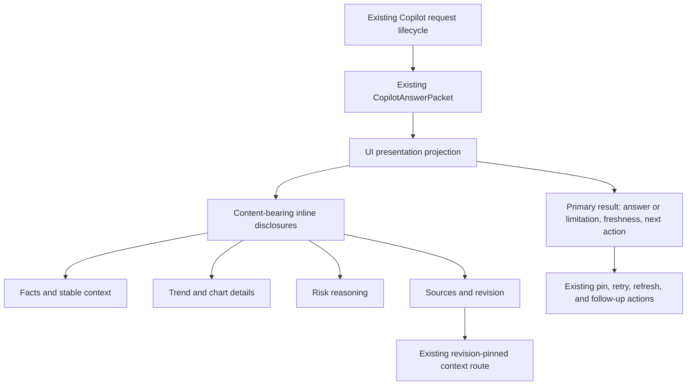
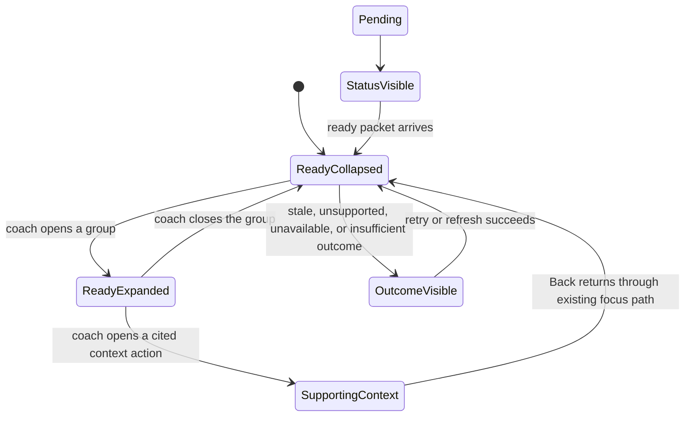

# feat: Make the Copilot page concise

## Goal Capsule

- **Objective:** Make the selected-member Copilot workbench readable at a glance by showing one primary result and the next useful action first, then revealing supporting information through inline progressive disclosure.
- **Authority:** The user request defines the readability outcome. `docs/plans/2026-08-07-002-feat-coach-copilot-morning-workbench-plan.md` remains the product baseline. The existing `CopilotAnswerPacket` remains the source of truth for facts, charts, citations, freshness, and degraded states.
- **Active scope:** The full nested Copilot route, its answer feed, answer-card hierarchy, inline disclosure behavior, human-readable presentation, and browser/accessibility/responsive/visual proof.
- **Execution profile:** Standard UI refactor over already-loaded data. No server, retrieval, model, graph, voice, or persistence work is required.
- **Stop conditions:** Do not change Copilot request or response contracts, add fetch-on-expand behavior, redesign the composer or quick prompts, or change the default Today and immutable Insight surfaces.
- **Tail ownership:** The implementation executor owns code, regression coverage, snapshot updates, cleanup, review, and the repository's normal landing workflow after these plan gates pass.
- **Open blockers:** None. Final spacing, exact sentence-case labels, and the split between one or more detail groups remain implementation details within the decisions below.

---

## Product Contract

### Summary

Make the selected-member Copilot workbench scan-first. The coach sees the member, evidence freshness, primary answer or limitation, and next action without reading a long evidence dump; facts, trends, risk reasoning, citations, and revision details remain available through labeled inline disclosures.

### Problem Frame

The current Copilot route renders every answer section, clause, churn reason, chart, citation, and revision identifier in one continuous card. Repeated fact and trend lines compete with the answer a coach needs first, and machine-shaped provenance is visible before the coach asks for it. The screenshot shows the same failure mode: a technically grounded result becomes difficult to scan because all supporting material has equal visual weight.

The presentation must reduce default density without weakening the trust contract. The coach must still be able to inspect the exact loaded evidence, see stale or unsupported outcomes, open revision-pinned supporting context, and use the existing quick-prompt and follow-up flows.

### Actors

- A1. **Coach:** Scans the selected member's Copilot result, expands supporting detail when needed, and follows existing evidence actions.
- A2. **Copilot presentation:** Projects an existing answer packet into a concise primary view and independently expandable detail groups without changing packet meaning or requesting new data.
- A3. **Member Context authority:** Supplies the already-loaded member-scoped, revision-pinned facts, charts, citations, and outcome states that the presentation must preserve.

### Requirements

#### Default scan

- R1. The full Copilot route shows the selected member, selected coaching day, evidence freshness, and the primary answer or limitation before secondary evidence detail.
- R2. The primary result shows the packet's next action when one exists, or the packet's truthful unavailable/insufficient state when no action is supported.
- R3. The route presents the newest ready answer as the primary result and keeps earlier ready answers reachable through a collapsed previous-results disclosure.

#### On-demand detail

- R4. Recent facts, stable context, trends, full chart points, churn reasoning, citations, and revision metadata stay available through labeled inline disclosures that render only when the packet contains that content.
- R5. Disclosure labels communicate what is inside and its useful count or status, instead of repeating a generic “Details” label for every group.
- R6. Expanding or closing a disclosure is a local presentation action over content already in memory; it must not issue a Copilot, conversation, or graph request.

#### Trust and continuity

- R7. Freshness, limitation, pending, stale, unsupported, unavailable, retry, refresh, and last-ready-answer behavior remain visible and truthful regardless of which detail groups are closed.
- R8. Citation controls, pin actions, chart text summaries, source dates, and revision-bound supporting-context actions remain reachable from the same answer and preserve the existing member and revision binding.

#### Accessibility and responsive behavior

- R9. Every disclosure is keyboard-operable, has native expanded/collapsed semantics, preserves visible focus, and remains understandable to assistive technology when open or closed.
- R10. The workbench remains usable at 320px, 430px, and 1440px without horizontal overflow, clipped long labels, or hidden typed recovery controls.
- R11. The presentation reuses existing AXON typography, spacing, signal/provenance language, hit-target, reduced-motion, and focus conventions rather than introducing a new visual system.

### Key Flows

- F1. **Scan the latest result**
  - **Trigger:** The coach opens a selected member's Copilot route.
  - **Actors:** A1, A2, A3
  - **Steps:** The route loads its existing answer state, displays the primary answer or limitation, and keeps freshness and the next action visible.
  - **Outcome:** The coach can understand what matters without opening supporting detail.
  - **Covered by:** R1-R3, R7, R10-R11
- F2. **Inspect supporting detail**
  - **Trigger:** The coach needs facts, a trend, risk reasoning, chart points, sources, or revision context.
  - **Actors:** A1, A2, A3
  - **Steps:** The coach opens the relevant inline disclosure, reads the already-loaded content, and closes it without changing the request state.
  - **Outcome:** The coach gets depth on demand without losing the primary result or triggering another request.
  - **Covered by:** R4-R6, R8-R9
- F3. **Trace a cited source**
  - **Trigger:** The coach opens a conversation or media citation from an expanded sources group.
  - **Actors:** A1, A2, A3
  - **Steps:** The existing revision-pinned context handoff opens, the coach inspects the supporting context, and Back returns to Copilot through the existing focus path.
  - **Outcome:** Progressive disclosure changes only presentation; evidence navigation keeps its current trust and focus behavior.
  - **Covered by:** R7-R9
- F4. **Continue with another answer**
  - **Trigger:** The coach runs a quick prompt or submits a typed follow-up.
  - **Actors:** A1, A2, A3
  - **Steps:** The existing Copilot request lifecycle runs, the new ready packet becomes the primary result, and earlier answers remain under the previous-results disclosure.
  - **Outcome:** The answer feed stays useful over multiple questions instead of becoming a stack of equally expanded cards.
  - **Covered by:** R3, R6-R8
- F5. **Handle sparse or degraded content**
  - **Trigger:** The packet has no chart, churn, citations, answer section, or ready result, or the request is pending, stale, unsupported, or unavailable.
  - **Actors:** A1, A2, A3
  - **Steps:** The presentation shows the available primary limitation/status and creates no empty disclosure controls.
  - **Outcome:** The coach sees a truthful limitation instead of a blank section, fabricated summary, or misleading “complete” result.
  - **Covered by:** R1-R2, R4-R7

### Acceptance Examples

- AE1. **Rich packet is concise by default**
  - **Covers:** R1-R5, R7-R8
  - **Given:** A ready morning-brief packet contains answer, recent facts, trend, chart, churn, citations, and revision metadata.
  - **When:** The coach opens the Copilot route.
  - **Then:** The primary answer, freshness, next action, and supported headline status are visible; secondary sections are closed behind labeled disclosures.
- AE2. **Details remain complete and local**
  - **Covers:** R4-R6, R8-R9
  - **Given:** The same ready packet is rendered with all disclosures closed.
  - **When:** The coach opens facts, trend, risk, and sources one at a time.
  - **Then:** Each group exposes its exact existing content, chart text summary, citation actions, and revision reference without creating a network request or changing the answer.
- AE3. **Previous answers do not compete with the latest answer**
  - **Covers:** R3, R6-R8
  - **Given:** The coach runs a quick prompt and then a typed follow-up.
  - **When:** The second answer is ready.
  - **Then:** The newest answer is primary, earlier answers remain available in a collapsed previous-results group, and opening that group does not re-request either answer.
- AE4. **Sparse and degraded packets stay honest**
  - **Covers:** R1-R2, R4-R7
  - **Given:** A packet is limitation-only, has insufficient history, lacks a chart or citations, or ends in stale/unavailable/unsupported status.
  - **When:** The coach opens the route.
  - **Then:** The limitation or status is visible, only content-bearing disclosures appear, and no fixture answer, empty chart, or unsupported headline is introduced.
- AE5. **Evidence navigation remains revision-pinned**
  - **Covers:** R7-R9
  - **Given:** A citation points to a conversation or metadata-only image attachment.
  - **When:** The coach expands sources, opens the citation, and returns with Back.
  - **Then:** Existing supporting context shows the same member and revision boundary, and the coach returns to a visible, meaningful Copilot focus target.
- AE6. **Disclosure works at supported sizes**
  - **Covers:** R9-R11
  - **Given:** The coach uses keyboard input, a screen reader, reduced motion, and 320px, 430px, or 1440px viewports.
  - **When:** The coach opens and closes each available disclosure.
  - **Then:** The control remains operable and visible, content wraps without horizontal overflow, and the default and expanded states retain the AXON visual language.

### Success Criteria

- The first Copilot viewport communicates the primary answer or limitation, freshness, and next action without requiring the coach to read the full evidence packet.
- Every detail currently rendered by the answer card remains reachable through a meaningful disclosure or existing evidence action.
- Disclosure interaction never triggers a Copilot, conversation, or graph request and never changes the selected member, answer, revision, or outcome state.
- The default route does not expose raw revision identifiers or repeated machine-shaped evidence lines as the primary reading surface; exact audit references remain available on demand.
- Rich, sparse, pending, stale, unsupported, unavailable, and multi-answer states remain truthful and accessible at supported widths.

### Scope Boundaries

**Included**

- The full nested Copilot route and the presentation mode used by its answer feed.
- A presentation projection over existing answer packets.
- Summary-first answer cards, latest-answer prioritization, previous-results disclosure, inline detail groups, human-readable labels, and responsive/accessibility/visual proof.

**Deferred for later**

- Persisted disclosure preferences, server-generated summaries, model-generated copy rewrites, lazy-loaded evidence, new data-fetching boundaries, and a broader redesign of the morning brief, prompt palette, composer, or voice entry.

### Deferred to Follow-Up Work

- Apply the same density pass to the Today morning-brief card and immutable Insight detail route after this focused work proves the presentation model without changing their current surface contracts.
- Add user-configurable default disclosure state or remembered expansion preferences if coaches request them.

**Outside this plan**

- New agent tools, agent access, prompt changes, model/runtime changes, graph/retrieval changes, member messaging, voice transport, image analysis, persistence, or clinical recommendation behavior.

### Dependencies / Assumptions

- The existing `CopilotAnswerPacket` remains immutable and authoritative; this plan reads its section IDs, clauses, chart, churn, citations, freshness, and continuation references without changing the contract.
- A packet may omit the `answer` section or contain only a limitation/outcome; the presentation must fall back to the first meaningful available section and never invent a summary.
- All detail content is already loaded with the ready packet. Disclosure does not fetch, prefetch, or refresh data.
- The selected member and revision remain owned by the existing dashboard state and supporting-context handoff. Local disclosure state is discarded when the answer route unmounts or the answer changes.
- The full route may reuse the shared answer-card implementation, but Today and Insight keep their current presentation unless a reusable seam can be added without changing their output.

### Sources / Research

- `docs/plans/2026-08-07-002-feat-coach-copilot-morning-workbench-plan.md` — task-first Copilot hierarchy, grounded answer contract, freshness, citations, charts, degraded states, and selected-member workflow.
- `docs/plans/2026-08-06-007-feat-coach-ai-copilot-plan.md` — immutable answer packet, deterministic facts/charts/citations, scope binding, and accessible chart summaries.
- `docs/plans/2026-08-07-003-feat-human-readable-graph-view-plan.md` — local precedent for focused readable content first and complete detail second without refetching or changing source authority.
- `src/features/coach-dashboard/CoachDashboard.tsx` — current Copilot route, answer feed, answer card, churn detail, citations, supporting-context handoff, and shared Today/Insight usage.
- `src/features/coach-dashboard/FullGraphExplorer.tsx` — native `details`/`summary` disclosure pattern and focus-preserving expand/collapse behavior.
- `src/features/coach-dashboard/dashboard.module.css` — current AXON tokens, focus-visible treatment, card hierarchy, chart styles, and 44px control conventions.
- `src/domain/contracts/copilot.ts` — current packet, section, chart, citation, churn, continuation, and outcome types.
- `tests/e2e/copilot-grounding.spec.ts` — existing grounded answer, chart, citation, follow-up, and degraded-state assertions that will need presentation-aware expectations.
- `tests/e2e/coach-dashboard-accessibility.spec.ts` and `tests/e2e/coach-dashboard-responsive.spec.ts` — existing Axe, keyboard, live-status, focus, reduced-motion, and viewport conventions.
- `tests/visual/coach-dashboard-desktop.spec.ts` and `tests/visual/coach-dashboard-mobile.spec.ts` — existing visual snapshot harnesses; selected-member Copilot states are not yet captured directly.
- `ui/readme.md` and `README.md` — assistant-reports/coach-decides language, provenance visibility, synthetic-data boundary, and Copilot trust constraints.
- `docs/solutions/` is absent. Existing plans and design guidance provide the durable local patterns for this change. No external research was needed because the repository already has direct disclosure, accessibility, and trust-boundary patterns.

## Planning Contract

### Product Contract Preservation

Direct `ce-plan` bootstrap. The existing morning-workbench plan remains unchanged as the product baseline; this plan narrows implementation to the Copilot route's presentation hierarchy and does not add product capabilities.

### Key Technical Decisions

- KTD1. **Keep the change UI-only over the existing packet.** (session-settled: user-approved — chosen over changing the response contract: the request is about readability, while the existing packet already owns grounded facts, charts, citations, and degraded states.) The presentation layer may group, order, and collapse loaded content, but it may not ask the model to rewrite facts or add a new summary authority.
- KTD2. **Use native inline disclosure over a separate panel or fetch-on-expand flow.** (session-settled: user-approved — chosen over a modal/detail panel: inline expansion keeps the coach in context and avoids a new navigation, loading, and focus lifecycle.) Use the existing `details`/`summary` pattern and keep disclosure actions local to the loaded packet.
- KTD3. **Make the newest ready answer primary and keep earlier answers collapsed.** This preserves follow-up history without making every answer compete for attention. It is safer than deleting earlier answers and clearer than rendering all answers expanded.
- KTD4. **Keep trust-critical signals visible while hiding supporting volume.** Show freshness, limitation/status, next action, and the supported headline risk state in the primary surface. Keep reasons, source distinctions, full chart points, citations, and exact revision references in labeled detail groups. This prevents progressive disclosure from turning a stale or unsupported packet into a confident-looking answer.
- KTD5. **Isolate the new hierarchy to the full Copilot workbench.** The same answer card is reused on Today and the immutable Insight route, so the renderer needs a workbench-specific presentation mode or equivalent seam. The current compact Today card and full Insight detail remain stable until a separate density pass is planned.
- KTD6. **Derive readable groups from packet semantics, not from raw text position.** Use existing answer section IDs, chart presence, churn presence, citation kinds, and outcome controls to create content-bearing groups. Do not deduplicate or paraphrase evidence in a way that removes provenance or changes a factual claim.

### High-Level Technical Design

The presentation flow preserves the current request and evidence lifecycle while adding one local projection step between the packet and the renderer.

Disclosure state is local presentation state. Opening a group never changes the packet or starts a request.

### Alternatives Considered

- **Keep the full card expanded:** Minimal implementation change, but it preserves the screenshot's equal-weight text wall and fails the readability goal.
- **Generate a shorter server/model answer:** Could improve copy quality, but would change the grounded response authority and add runtime/test scope that the user did not request.
- **Move evidence to a separate panel:** Could create more room, but adds navigation and focus complexity and weakens the coach's sense of context. Inline disclosure matches existing repository patterns.

### Sequencing

U1 defines and tests the packet-to-presentation projection. U2 uses that projection to render the workbench-specific answer hierarchy and disclosure behavior. U3 proves semantic behavior, evidence reachability, accessibility, responsive layout, and visual density.

## Implementation Units

### U1. Add the Copilot presentation projection

**Goal:** Create a pure feature-level projection that separates primary content from content-bearing disclosure groups without changing the Copilot packet or request contracts.

**Requirements:** R1-R8; F1, F2, F4, F5; AE1-AE4; KTD3, KTD4, KTD6.

**Dependencies:** None.

**Files:**

- `src/features/coach-dashboard/copilot-view-model.ts` — create the presentation projection and stable answer/disclosure grouping helpers.
- `tests/unit/copilot-view-model.test.ts` — add pure projection coverage for rich, sparse, multi-answer, and degraded packets.

**Approach:**

1. Select the newest ready answer as the primary result and retain earlier ready answers as an ordered previous-results collection.
2. Select the `answer` section as the primary copy when present, with a safe fallback to the first meaningful section or limitation content.
3. Keep the next action, freshness, and supported headline risk state in the primary projection when present.
4. Group secondary sections, chart data, churn reasons, citations, and revision references by semantic content and omit groups with no content.
5. Preserve clause IDs, evidence IDs, citation IDs, chart text summaries, outcome controls, and answer/revision bindings in the projection so the renderer can expose exact loaded content on demand.
6. Keep the projection deterministic and presentation-only. It must not paraphrase, infer, deduplicate away, or mutate packet content.

**Execution note:** Add characterization coverage for the current packet-to-surface mapping before changing the renderer so the UI refactor cannot silently drop a section or evidence action.

**Patterns to follow:** `src/features/coach-dashboard/full-graph-view-model.ts`, `src/domain/contracts/copilot.ts`, the existing `CopilotAnswerCard`, and the task-first workbench hierarchy in the morning-workbench plan.

**Test scenarios:**

- **Happy path:** A rich packet projects its answer, next action, freshness, headline risk, trend/chart, churn, citations, and revision into the intended primary and disclosure groups.
- **Happy path:** A two-answer collection selects the newest ready answer as primary and keeps earlier answers in stable chronological/result order.
- **Edge case:** A packet without an `answer` section falls back to its first meaningful section or limitation without generating new text.
- **Edge case:** Packets without charts, churn, citations, or supporting context do not create empty disclosure groups.
- **Error and failure path:** Pending, stale, unsupported, unavailable, insufficient-history, and invalid outcomes preserve their existing status and controls without producing a ready-answer projection.
- **Integration scenario:** Every citation, chart point, churn reason, and source reference in the input remains reachable in exactly one primary or disclosure projection with its original evidence and revision identity.

**Verification:** Unit tests demonstrate a deterministic, lossless presentation projection over the existing packet and prove that no request, response, or domain contract changes are required.

### U2. Render the concise Copilot workbench

**Goal:** Apply the projection to the full Copilot route so the coach sees a compact primary card, independently expandable detail groups, and an accessible previous-results path.

**Requirements:** R1-R8, R11; F1-F4; AE1-AE5; KTD1-KTD5.

**Dependencies:** U1.

**Files:**

- `src/features/coach-dashboard/CoachDashboard.tsx` — consume the presentation projection, add the workbench-specific answer hierarchy, and preserve existing actions and context handoffs.
- `src/features/coach-dashboard/dashboard.module.css` — style primary versus secondary content, disclosure summaries, risk/freshness treatments, wrapping, and focus states with existing AXON tokens.
- `tests/e2e/copilot-grounding.spec.ts` — update grounded answer assertions for collapsed secondary content, latest-answer priority, and no-request disclosure behavior.

**Approach:**

1. Keep member identity, selected day, freshness, primary answer or limitation, next action, and supported headline risk visible in the first reading layer.
2. Render earlier answers inside a collapsed previous-results disclosure instead of stacking every ready card at full density.
3. Render facts/stable context, trend/chart details, churn reasoning, and sources/revision as independent native disclosures with content-aware labels and counts/status.
4. Keep the full chart and accessible text summary together in the trend group; when the requested result is chart-led, expose its concise text summary in the primary layer while keeping point-level detail expandable.
5. Keep citation buttons, pin actions, retry, refresh, pending status, stale/unsupported/unavailable notices, and typed follow-up behavior owned by their existing flows.
6. Route-specific behavior must apply only to the full Copilot workbench. Preserve the current Today compact output and immutable Insight detail output through a presentation mode or equivalent seam.
7. Use native disclosure semantics and existing focus-visible styles. Opening or closing a group must not change the selected answer, revision, route, or request lifecycle.

**Patterns to follow:** Existing `details`/`summary` controls in `FullGraphExplorer.tsx` and the workout view, `CopilotOutcomeNotice`, `PacketChart`, source controls, existing focus return, and AXON typography/provenance conventions from `ui/readme.md`.

**Test scenarios:**

- **Happy path:** A rich morning-brief answer shows only primary answer, freshness, next action, and headline state initially; opening each content-bearing group exposes the exact existing facts, chart summary, churn detail, citations, and revision reference.
- **Happy path:** A chart-led prompt shows its concise chart summary in the primary layer and exposes the full point-level chart and text alternative in the trend disclosure.
- **Edge case:** A limitation-only or sparse packet shows its limitation/status and no empty or misleading disclosure controls.
- **Edge case:** Multiple ready answers show the newest answer first and keep previous answers collapsed without changing their answer or revision identities.
- **Error and failure path:** Pending, stale, unsupported, unavailable, invalid, and model-error outcomes retain current status, retry, refresh, and last-ready-answer behavior and do not render fabricated primary content.
- **Integration scenario:** Opening a conversation or media citation from the expanded sources group uses the existing revision-pinned handoff and returns to a meaningful Copilot focus target.
- **Integration scenario:** Toggling any disclosure leaves intercepted Copilot, conversation, and graph request counts unchanged.

**Verification:** The full Copilot route is scannable without losing evidence access, all existing actions remain available, and Today/Insight surfaces do not change as a side effect of the shared answer-card implementation.

### U3. Prove accessibility, responsive behavior, and visual density

**Goal:** Validate the new default and expanded states across keyboard, assistive technology, viewport, motion, and visual-regression paths.

**Requirements:** R4-R11; F1-F5; AE2, AE4-AE6; all Success Criteria.

**Dependencies:** U2.

**Files:**

- `tests/e2e/coach-dashboard-accessibility.spec.ts` — add default/expanded disclosure, keyboard, focus, status, chart-summary, and Axe coverage.
- `tests/e2e/coach-dashboard-responsive.spec.ts` — cover the full Copilot route at 320px, 430px, and 1440px with long labels and expanded groups.
- `tests/visual/coach-dashboard-desktop.spec.ts` — add a selected-member Copilot default and expanded-state snapshot.
- `tests/visual/coach-dashboard-mobile.spec.ts` — add selected-member Copilot default and expanded-state snapshots at the mobile layout.

**Approach:**

1. Add a deterministic browser flow that opens a selected member, enters Copilot, verifies the concise default, expands every available disclosure, and confirms the complete detail surface.
2. Exercise Enter and Space on disclosure summaries, visible focus, closed-content visibility, focus return after supporting-context Back, and accessible chart text.
3. Cover rich, sparse, multi-answer, pending, stale, unsupported, unavailable, and insufficient-history states without requiring a real provider or graph service.
4. Verify no horizontal overflow, clipped source labels, hidden typed fallback, or reduced-motion regression at supported widths.
5. Update only the snapshots affected by the new Copilot route and remove assertions that assume all churn/chart/source content is visible before expansion.

**Patterns to follow:** Existing `@a11y` Axe and focus tests, responsive overflow checks, reduced-motion assertions, intercepted Copilot packets, and visual snapshot naming in the dashboard test suite.

**Test scenarios:**

- **Happy path:** Keyboard users can open and close each disclosure, read the primary result, expand evidence, and open a citation without losing focus or context.
- **Edge case:** Long labels, source dates, revision references, and previous-result counts wrap at 320px and 430px without horizontal overflow or clipped controls.
- **Error and failure path:** All current pending and degraded outcomes remain visible and accessible when no detail groups exist or when the last ready answer is retained.
- **Integration scenario:** A citation opened from an expanded group reaches the existing revision-pinned context view and Back restores a visible Copilot target.
- **Integration scenario:** Axe reports no violations in both collapsed and fully expanded states, and reduced motion preserves status information without animation dependence.
- **Visual regression:** Desktop and mobile snapshots show a substantially shorter default reading path while preserving the expanded evidence hierarchy and AXON visual language.

**Verification:** Browser, accessibility, responsive, and visual checks prove that the default view is concise, the full evidence view is reachable, and the interaction is stable across supported devices.

## System-Wide Impact

- **Shared renderer:** `CopilotAnswerCard` is used by the full workbench, Today, and the immutable Insight route. The workbench hierarchy must be opt-in so a readability fix does not silently change those other surfaces.
- **Request and evidence lifecycle:** The change sits after the existing Copilot adapter and reducer. It does not change request identity, cancellation, continuation, selected-member state, evidence retrieval, chart creation, citation lookup, or outcome mapping.
- **Navigation and focus:** Supporting-context actions still push the existing History route. Disclosure state is ephemeral and must not become a second navigation state; existing Back focus restoration remains authoritative.
- **Performance:** All detail content is already part of the ready packet. The default surface reduces rendered visual density without adding request latency or new network calls.
- **Trust boundary:** Collapsing content must not hide freshness, limitations, unsupported evidence, or retry/refresh controls. Raw revision identifiers may move out of the primary layer, but exact audit references and citations remain available on demand.
- **Agent-native boundary:** Agent-native changes are not material for this presentation-only work. No new tools, prompts, permissions, shared workspace, or agent-accessible action is introduced; future agent access should continue to use the existing authorized packet and context boundaries.

## Risks & Dependencies

- **Trust information becomes too hidden:** Keep freshness, limitation/status, next action, and headline risk visible; verify sparse and degraded packets explicitly.
- **Content is accidentally lost during grouping:** Use a pure projection with lossless identity links and tests that enumerate every section, chart point, churn reason, citation, and revision reference.
- **Shared surfaces regress:** Add a workbench-only presentation seam and keep Today and Insight assertions in the browser suite.
- **Previous answers become inaccessible:** Keep earlier answers in an explicitly labeled collapsed collection and test answer/revision identity after expansion.
- **Native disclosure state resets during context navigation:** Preserve the existing focus target and ensure the returned Copilot surface remains understandable even when the browser resets local `details` state.
- **Responsive density moves the problem instead of solving it:** Use visual snapshots and 320/430/1440px checks for default and expanded states, not only the root dashboard.
- **Machine copy remains unreadable in details:** Use the AXON sentence-case/data-voice split and content-aware labels. Do not expose raw identifiers as default headings or accessible names.
- **No external dependency risk:** The plan uses existing React, CSS-module, AXON, native disclosure, and Playwright patterns. No package or runtime change is needed.

## Verification Contract

| Gate | Scope | Completion signal |
| --- | --- | --- |
| `pnpm typecheck` | Presentation projection, dashboard rendering, and test types | No type errors; no Copilot contract or server type changes are required. |
| `pnpm lint` | Changed feature and test files | Existing lint rules pass without suppression. |
| `pnpm test` | Presentation projection and existing Copilot/dashboard regressions | Unit coverage proves lossless grouping, sparse fallback, answer ordering, and unchanged reducer/adapter behavior. |
| `pnpm test:e2e` | Copilot scan, disclosure, follow-up, citation, sparse, and degraded flows | Browser assertions prove concise default, complete on-demand detail, no request on toggle, and existing evidence navigation. |
| `pnpm test:a11y` | Collapsed/expanded Copilot, keyboard, focus, live status, chart text, and reduced motion | No Axe violations and all disclosure/focus/status outcomes are observable. |
| `pnpm test:visual` | Selected-member Copilot at desktop and mobile default/expanded states | Snapshots show the new information hierarchy without overflow or visual-system drift. |
| `pnpm build` | Production bundle and isolation checks | Build succeeds and no server, agent, graph, voice, or persistence surface is added. |
| Manual seeded acceptance | Jordan ready packet, sparse/degraded packet, repeated follow-up, citation handoff, and narrow viewport | A coach can scan, expand, trace, and return without losing the member, answer, revision, or typed recovery path. |

## Definition of Done

- R1-R11, F1-F5, AE1-AE6, and every Success Criterion are implemented or explicitly verified by U1-U3 and the Verification Contract.
- U1 has a deterministic, lossless presentation projection with unit coverage for rich, sparse, multi-answer, and degraded packets.
- U2 renders a concise full Copilot workbench with latest-answer priority, labeled inline disclosures, preserved trust signals, unchanged request behavior, and no unintended Today/Insight change.
- U3 proves keyboard and assistive-technology behavior, focus return, no disclosure network side effects, responsive wrapping, reduced-motion behavior, and updated visual snapshots.
- No Copilot answer, citation, chart summary, churn reason, outcome, or revision reference is silently deleted; every existing detail remains available through a clear disclosure or existing action.
- No new server route, data field, model prompt, agent tool, graph query, voice transport, persistence layer, or dependency is introduced.
- Obsolete dense-rendering branches, duplicate disclosure controls, and stale test assertions are removed rather than left alongside the new hierarchy.
- The final diff contains no abandoned prototype component, dead styling, or unreferenced projection helper.
