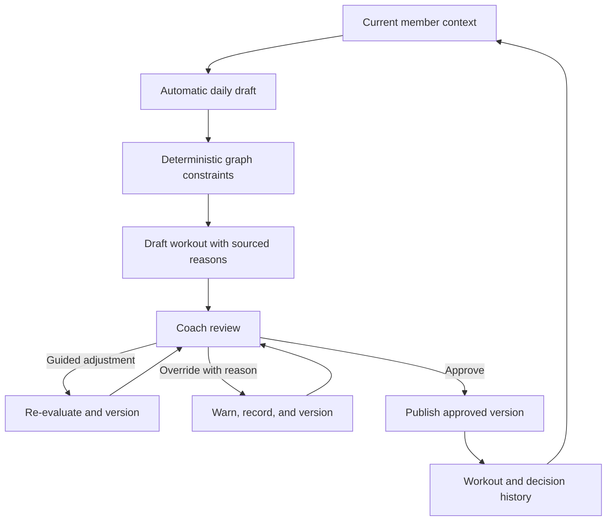

# Graph-Backed Coach Dashboard - Plan

## Goal Capsule

- **Objective:** Build a polished portfolio product that helps a coach review, adjust, explain, and approve automatically generated daily workouts while using the same member context for grounded coaching support.
- **Product authority:** The Product Contract below governs behavior and scope, with `ASSESSMENT.md` and `README.md` supplying the source brief where this plan does not explicitly revise it.
- **Open blockers:** None before implementation planning.

---

## Product Contract

### Summary

The product is a coach-facing dashboard that prepares source-backed daily workout drafts, guides review and adjustment, and requires coach approval before publication.
It combines movement and member-context knowledge graphs, a grounded Copilot, and path-focused graph visualization in one coherent coach-day experience.

### Problem Frame

Coaches must assemble goals, injuries, equipment, training history, adherence, conversations, biomarkers, and other member signals before making a useful recommendation.
That work is slow, and a language model acting alone cannot provide the deterministic safety or traceability required for trustworthy exercise selection.

The portfolio must demonstrate that the graph does real reasoning work, that the AI remains grounded in synthetic member data, and that a coach can understand and control the result.
It must also communicate technical depth without fragmenting into unrelated capability demos.

### Key Decisions

- **Optimize for an exceptional portfolio product.** (session-settled: user-directed — chosen over a production-shaped or production-ready product: polish, assessability, and technical storytelling are the primary standard.) Governs R30-R35.
- **Keep the complete brief and every named enhancement.** (session-settled: user-directed — chosen over required-only or selectively enhanced scope: the deadline constraint was removed so each capability can be developed well.) Governs R25-R35.
- **Organize the product around coach-day vertical increments.** (session-settled: user-directed — chosen over foundation-first and independent capability showcases: each increment should deliver a coherent user outcome.) Governs R1-R9, R33.
- **Generate daily drafts automatically but require coach approval.** (session-settled: user-directed — chosen over automatic publication: the coach remains accountable for what reaches the member.) Governs R1, R4, R9.
- **Permit safety overrides with a documented reason.** (session-settled: user-directed — chosen over hard-blocking every unsafe request: controlled professional judgment takes precedence over absolute prevention.) Governs R8, R17.
- **Retain every material workout version.** (session-settled: user-approved — chosen over keeping only the latest state: reviewers and coaches need to see what changed, why, and by whom.) Governs R7-R9.
- **Use graph visualization as an explanation surface.** (session-settled: user-approved — chosen over decorative or unrestricted graph browsing: the visualization should clarify active recommendation and retrieval paths.) Governs R18.

### Actors

- A1. **Coach:** Reviews member context, adjusts generated workouts, records override reasons, and approves the version sent to the member.
- A2. **Member:** Receives an approved workout personalized to their current context.
- A3. **Coach assistant:** Prepares daily drafts, resolves concepts, coordinates graph-grounded reasoning, explains results, and answers member-context questions.
- A4. **Deterministic safety layer:** Applies graph constraints independently of probabilistic language-model instructions.

### Product Increments

1. **Trusted daily draft:** Generate the daily workout with deterministic constraints, provenance, and coach approval.
2. **Guided coach control:** Add adjustment guidance, safe substitutions, documented overrides, diffs, and version history.
3. **Member-context workflow:** Add the morning brief, grounded Copilot, quick prompts, charts, history, and longitudinal reasoning.
4. **Visible reasoning:** Add path-focused graph visualization across recommendations, exclusions, substitutions, and Copilot answers.
5. **Multi-agent orchestration:** Make specialized reasoning responsibilities and their coordination visible and evaluable.
6. **Streaming:** Show useful progress and validated partial results during longer AI work.
7. **Evaluation pipeline:** Measure retrieval, resolution, safety, recommendation, provenance, and longitudinal behavior.
8. **Observability:** Connect model, agent, tool, graph, and user-visible activity in inspectable traces.
9. **Deeper clinical grounding:** Expand the justified SNOMED CT subset and its useful graph relationships.
10. **Longitudinal reasoning:** Deepen how stable preferences, recent state, and historical trends affect recommendations and answers.

### Requirements

**Daily workout workflow**

- R1. The system automatically prepares a new workout draft for the active member each day before coach review.
- R2. Each draft contains warmup, main, and cooldown sections with exercises, sets, repetitions or duration, and rest guidance sized to the requested time window.
- R3. Each draft reflects the member's goals, current injuries, equipment, preferences, recent training, recovery signals, and adherence context.
- R4. A draft cannot be published to the member until a coach explicitly approves it.
- R5. The coach receives guided adjustment controls for goals, duration, intensity, injury state, equipment, preferences, exclusions, and substitutions.
- R6. Every adjustment reruns the relevant constraints and shows the coach the resulting workout changes with updated reasons.
- R7. The system retains generated, edited, overridden, approved, and published workout versions with actor, time, and reason context.
- R8. A coach may override a graph warning only after supplying a reason, and the warning remains attached to the resulting version.
- R9. Publication sends the exact approved version and preserves its relationship to all prior drafts.

**Movement and clinical reasoning**

- R10. The movement graph represents exercises, muscles, joints or body regions, movement patterns, equipment, injuries or conditions, anatomy hierarchy, contraindications, and equivalence relationships.
- R11. Domain concepts are grounded in a meaningful subset of OPE, COPPER, SNOMED CT, SKOS, and PROV-O rather than importing those ontologies wholesale.
- R12. Free text resolves to canonical graph concepts through exact, fuzzy, and semantic fallback passes with visible confidence.
- R13. Unresolved or low-confidence concepts trigger clarification or safe degradation instead of fabricated mappings.
- R14. Injury, anatomy, equipment, explicit-exclusion, and preference decisions are enforced through graph traversal rather than prompt instructions alone.
- R15. Anatomy traversal includes relevant descendants so a constraint on a body region also applies to its modeled substructures.
- R16. When equipment or safety rules remove an exercise, the system uses graph relationships to offer suitable alternatives when available.
- R17. Every selected, excluded, substituted, or overridden exercise carries source-backed reasons and the graph path that produced the decision.
- R18. Graph visualization emphasizes the relevant subgraph for a selected recommendation, exclusion, substitution, override, or Copilot answer while preserving source and provenance labels.

**Member context and Copilot**

- R19. The member graph represents profile, goals, preferences, equipment, injuries, workout history, adherence, biomarkers, labs, conversations, images, coach tasks, and churn signals from synthetic data.
- R20. The Copilot answers member-specific questions only from retrievable member context and identifies the evidence supporting each answer.
- R21. The Copilot supports the morning brief, adherence, sleep, week-over-week change, message-pattern, and four-week comparison prompts with appropriate charts.
- R22. Coaches can inspect relevant past conversations and images while asking follow-up questions.
- R23. The morning brief connects recent accomplishments, current risks, pending coach actions, and the day's generated workout.
- R24. Longitudinal reasoning distinguishes recent state, historical trend, and stable preference when personalizing workouts or answering questions.

**Portfolio quality and system behavior**

- R25. Distinct agent responsibilities are visible for concept resolution, graph retrieval, safety reasoning, workout composition, member-context retrieval, and explanation.
- R26. Long-running AI responses stream useful progress or partial results without presenting unvalidated workout content as final.
- R27. An evaluation pipeline measures concept resolution, retrieval relevance, constraint correctness, recommendation quality, provenance completeness, and longitudinal reasoning.
- R28. Observability connects language-model calls, agent actions, tool use, graph queries, constraint outcomes, and user-visible responses into an inspectable trace.
- R29. Automated tests cover concept resolution, deterministic safety, approval gating, overrides, provenance, and the critical integrated flows.
- R30. Interactive AI responses target completion within approximately five seconds while preserving correctness and provenance.
- R31. All bundled and generated member data remains synthetic, with no real member data or protected health information.
- R32. A mock-authenticated coach can move through the member brief, generator, approval workflow, Copilot, charts, history, and graph explanations within one dashboard.
- R33. Every required capability and named enhancement ships as a separately reviewable increment that remains integrated into the coach-day narrative.
- R34. The repository documentation includes a system architecture diagram, technology rationale, AI usage, challenges, trade-offs, and a production evaluation strategy.
- R35. The repository supports one-command local operation and documents two or three example inputs with generated outputs, including injury and limited-equipment cases with their traces.

### Daily Workout Lifecycle

### Key Flows

- F1. Daily draft review
  - **Trigger:** A new coach day begins for a member.
  - **Actors:** A1, A2, A3, A4
  - **Steps:** The assistant prepares a graph-constrained draft, the coach reviews its member context and reasons, and approval publishes the selected version.
  - **Covers:** R1-R4, R9, R14, R17.
- F2. Guided workout adjustment
  - **Trigger:** The coach wants to change the draft or reports new member context.
  - **Actors:** A1, A3, A4
  - **Steps:** The coach selects or describes the change, the assistant identifies relevant controls, the safety layer re-evaluates the plan, and the dashboard shows the changed version and reasons.
  - **Covers:** R5-R7, R12-R17.
- F3. Safety override
  - **Trigger:** A coach chooses a change that still carries a graph warning.
  - **Actors:** A1, A3, A4
  - **Steps:** The dashboard explains the warning and alternatives, the coach records a reason, and the system creates a visibly overridden version for approval.
  - **Covers:** R7-R9, R17.
- F4. Morning member review
  - **Trigger:** The coach opens the member dashboard or asks a quick prompt.
  - **Actors:** A1, A3
  - **Steps:** The assistant retrieves relevant context, distinguishes current state from trend, renders evidence or charts, and connects findings to the day's coaching actions.
  - **Covers:** R19-R24, R32.
- F5. Explanation inspection
  - **Trigger:** The coach or reviewer selects a recommendation, exclusion, substitution, override, or Copilot claim.
  - **Actors:** A1, A3, A4
  - **Steps:** The dashboard reveals the supporting sources and focused graph path without requiring unrestricted graph navigation.
  - **Covers:** R17-R18, R20, R28.

### Acceptance Examples

- AE1. Automatic daily draft
  - **Covers R1-R4, R17.**
  - **Given:** Jordan has a recovering left-knee injury, home equipment constraints, goals, and recent training context.
  - **When:** The daily generation cycle runs.
  - **Then:** A complete draft appears for coach review with no publication and with source-backed reasons for each exercise.
- AE2. Anatomy-aware injury handling
  - **Covers R14-R17.**
  - **Given:** The coach reports that Jordan's left knee is bothering her.
  - **When:** The workout is generated or revised.
  - **Then:** The safety layer traverses the anatomy hierarchy, removes or down-ranks relevant stressors, and explains the affected graph paths.
- AE3. Limited-equipment substitution
  - **Covers R5-R6, R14, R16-R17.**
  - **Given:** Jordan has dumbbells and a kettlebell but no barbell.
  - **When:** A draft contains a barbell-dependent movement candidate.
  - **Then:** The candidate is removed and an equipment-valid equivalent is suggested with the substitution reason.
- AE4. Explicit exercise exclusion
  - **Covers R5-R6, R14, R17.**
  - **Given:** The coach excludes deadlifts.
  - **When:** The current or later daily workout is evaluated.
  - **Then:** Deadlifts and mapped variations do not appear unless the coach deliberately changes the exclusion.
- AE5. Ambiguous concept
  - **Covers R12-R13.**
  - **Given:** A coach phrase cannot be mapped above the required confidence.
  - **When:** Concept resolution completes.
  - **Then:** The system requests clarification or applies a safe fallback and never invents a canonical match.
- AE6. Documented override
  - **Covers R7-R9, R17.**
  - **Given:** A requested exercise retains a graph-derived safety warning.
  - **When:** The coach overrides it and supplies a reason.
  - **Then:** A new version records the warning, reason, actor, alternatives offered, and approval state before publication is possible.
- AE7. Version comparison
  - **Covers R6-R9.**
  - **Given:** A coach changes duration, equipment, or intensity more than once.
  - **When:** The coach reviews workout history.
  - **Then:** Each version shows what changed and why, and the published workout matches the approved version exactly.
- AE8. Grounded longitudinal answer
  - **Covers R19-R24.**
  - **Given:** The coach asks what changed since last week and whether Jordan may churn.
  - **When:** The Copilot answers.
  - **Then:** The answer separates current signals from trends, cites member evidence, renders an appropriate chart, and avoids unsupported conclusions.
- AE9. Focused graph explanation
  - **Covers R17-R18, R20.**
  - **Given:** The coach selects a knee-related exclusion or a Copilot claim.
  - **When:** The graph view opens.
  - **Then:** The relevant source nodes and reasoning path are emphasized without forcing the coach to interpret the full graph.

### Success Criteria

- Deterministic constraint checks pass for 100% of the injury, equipment, and explicit-exclusion evaluation scenarios unless a recorded override applies.
- At least 90% of representative workout scenarios are approvable unchanged or after one non-safety adjustment.
- A coach can understand, adjust, and approve a typical daily draft within two minutes.
- Every generated plan and grounded Copilot answer satisfies the provenance obligations in R17 and R20.
- Interactive performance meets the target in R30 without bypassing graph reasoning or validation.
- Every increment named in R33 has focused acceptance evidence and participates in at least one integrated coach-day flow.

### Scope Boundaries

**In scope**

- Both knowledge graphs, both dashboard surfaces, every required build step, and every nice-to-have named in `ASSESSMENT.md`.
- Automatic daily generation, guided coach review, approval gating, documented overrides, version history, and graph-backed explanations.
- A polished synthetic-data portfolio experience with production-quality reasoning and evaluation.

**Outside this product's identity**

- Real member data, protected health information, or claims that the portfolio is a clinically validated medical device.
- Production deployment, regulatory certification, enterprise operations, billing, or organization-wide administration.
- A standalone member application beyond receiving the approved workout.
- An unrestricted knowledge-graph editor or exhaustive ingestion of every source ontology.
- Deadline-driven feature cuts or a one-day delivery constraint.

### Dependencies and Assumptions

- `data/exercises.json` and `data/member-context.json` are the baseline product fixtures, and any added data will remain synthetic.
- Published ontology concepts may be represented through a justified local subset when full ontology ingestion or live access adds no product value.
- Probabilistic models may interpret language and compose explanations, but A4 remains authoritative for deterministic constraints.
- Charts and graph visualization derive from the same structured facts and provenance used by the assistant rather than separate presentation-only data.
- The complete scope will be delivered incrementally, with quality judged per increment rather than against a fixed calendar deadline.

### Outstanding Questions

**Resolve Before Planning**

- None.

**Deferred to Planning**

- Which application stack, graph store, model providers, and agent runtime best support the confirmed Product Contract?
- Which ontology concepts should be stored locally, fetched during ingestion, or accessed live?
- How should product increments map to implementation milestones while preserving an executable vertical slice at each boundary?
- What evaluation-set size and scoring process provide credible evidence without turning the portfolio into a research benchmark?
- Which local and hosted demonstration modes best balance one-command operation with portfolio accessibility?

### Sources and Research

- `ASSESSMENT.md` — authoritative source brief, evaluation criteria, required scenarios, ontology guidance, build steps, and named enhancements.
- `README.md` — repository-level product summary and deliverable framing.
- `data/exercises.json` — synthetic exercise catalog used by movement reasoning.
- `data/member-context.json` — synthetic Jordan Rivera context used by daily generation and Copilot flows.
